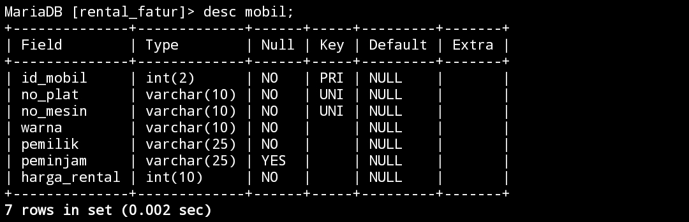
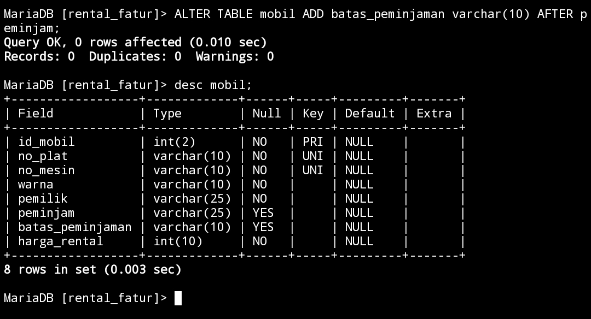
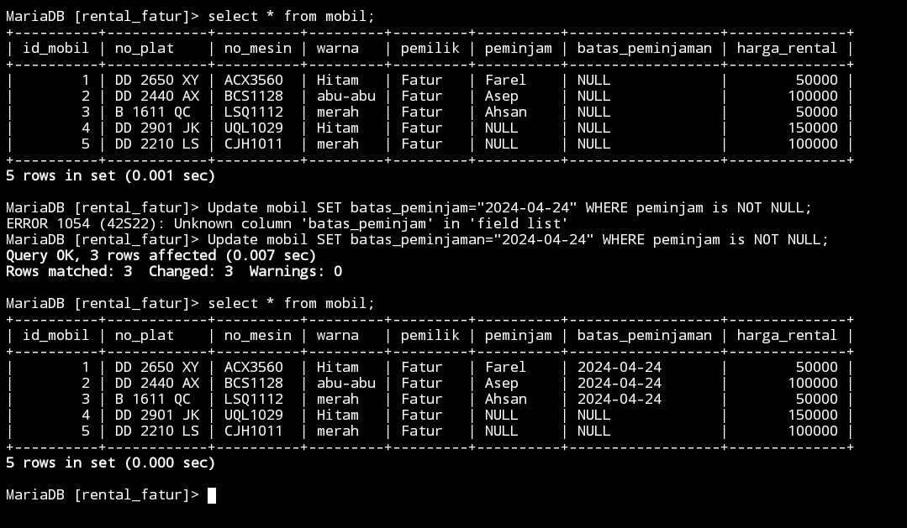
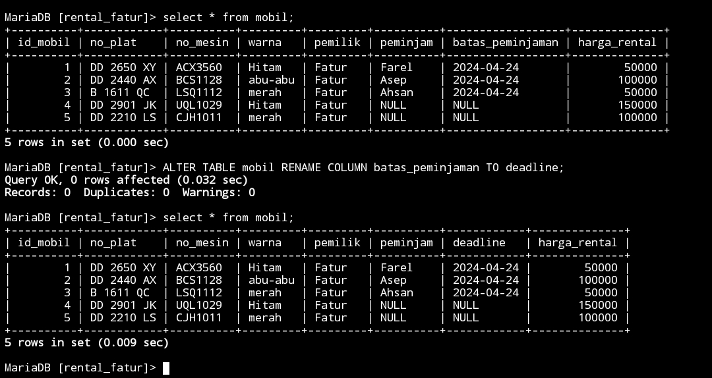
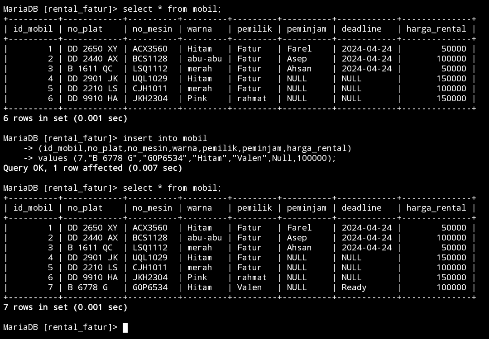
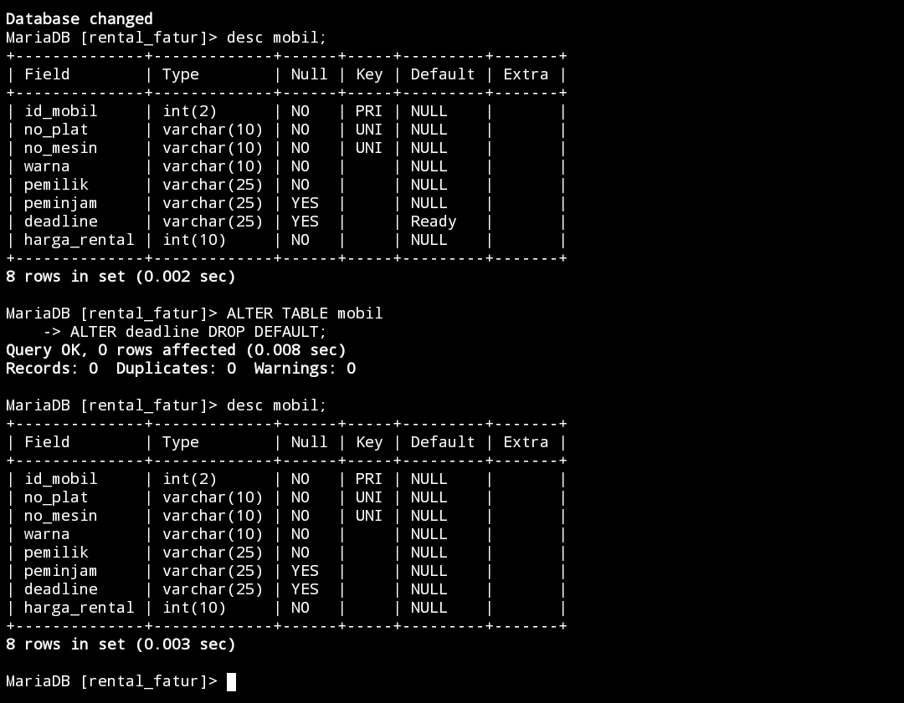
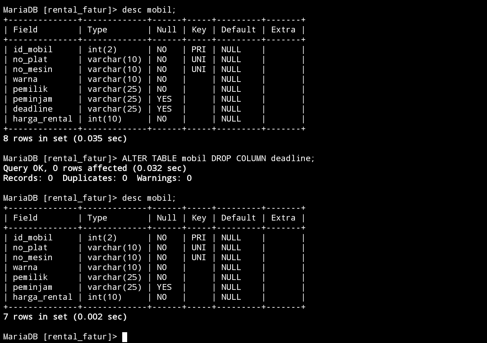
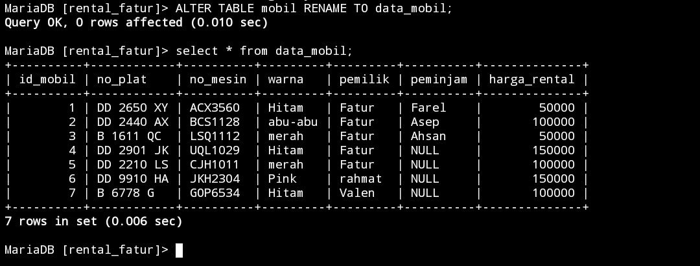

# Struktur awal Tabel



# Menambahkan kolom 

## Struktur query 
```sql
ALTER TABLE nama_tabel ADD batas_peminjaman varchar(10) AFTER nama_kolom;
```
## Contoh Query 
```sql
ALTER TABLE mobil ADD batas_peminjaman varchar(10) AFTER peminjam;
```

## Hasil 


## Analisis 

`ALTER TABEL mobil` adalah nama tabel yang ingin ditambahkan kolom baru.`ADD batas_peminjaman` adalah nama kolom baru yang ingin ditambahkan.`varchar(10)` untuk menentukan tipe data untuk kolom baru. yang menunjukkan bahwa kolom tersebut akan berisi data string dengan panjang maksimal 10 karakter.`AFTER peminjam` berarti kolom batas_peminjaman akan di tempatkan setelah kolom `peminjam`.

## Kesimpulan 
Kesimpulannya,akan mengubah struktur tabel `mobil` dengan menambahkan kolom baru bernama `batas_peminjaman`. Kolom ini akan memiliki tipe data `varchar(10)`, yang berarti dapat menyimpan data string dengan panjang maksimal 10 karakter. Kolom `batas_peminjaman` akan ditempatkan setelah kolom `peminjam` dalam urutan kolom tabel.

## Tambahan


### Query 
```sql
Update mobil SET batas_peminjaman="2024-04-24" WHERE peminjam is NOT NULL;
```

### Hasil



# Mengubah nama kolom
## Struktur query 
```sql
ALTER TABLE nama_tabel RENAME COLUMN nama_kolom TO nama_kolom_baru;
```
## Contoh Query 
```sql
ALTER TABLE mobil RENAME COLUMN batas_peminjaman TO deadline;
```

## Hasil 


## Analisis 
`ALTER TABLE mobil` Adalah nama tabelnya,`RENAME COLUMN batas_peminjaman` 
adalah nama kolom yang ingin namanya diganti,dan `TO deadline` ini adalah nama kolom yang baru yang menggantikan `batas_peminjaman` menjadi `deadline`.
## Kesimpulan 
Kesimpulannya,Dengan menjalankan query ini, Anda dapat mengganti nama kolom dari `batas_peminjaman` menjadi `deadline` dalam tabel `mobil`.


# Mengubah Tipe data kolom
## Struktur query 
```sql
ALTER TABLE nama_tabel MODIFY nama_kolom Tipe_data;
```
## Contoh Query 
```sql
ALTER TABLE mobil MODIFY deadline DATE;
```

## Hasil 


## Analisis 

`ALTER TABLE mobil` adalah nama tabelnya,`MODIFY deadline` nama kolomnya yang ingin di modif tipe datanya,`DATE` ini adalah tipe data dari kolom `deadline` yang ingin ditambahkan. 
## Kesimpulan
Kesimpulannya , kita dapat memodifikasi tipe data kolom `deadline` dalam tabel `mobil` sehingga menjadi tipe data `DATE`. 
# Menambahkan constraint
## Contoh Query 

```sql
ALTER TABLE mobil
ALTER deadline SET DEFAULT ’Ready’;
```

## Hasil


## Analisis 

Tabel yang dipakai adalah `mobil` Perintah `ALTER TABLE `digunakan untuk mengubah struktur tabel yang sudah ada.
Nama kolom yang ingin diubah yaitu `deadline`. menggunakan perintah `ALTER nama_kolom` untuk mengubah properti kolom yang sudah ada. Kolom yang akan diubah adalah `deadline`.
Set Default Value `Ready`

## Kesimpulan 
Kesimpulannya,Dengan menjalankan query ini, kita dapat mengubah properti kolom `deadline` dalam tabel `mobil` sehingga nilai defaultnya akan menjadi `Ready`.

## Tambahan
### contoh Query 
```sql
insert into mobil (id_mobil,no_plat,no_mesin,warna,pemilik,peminjam,harga_rental)
values (7,"B 6778 G","GOP6534","Hitam","Valen",Null,100000);
```

### Hasil



## referensi 
https://revou.co/panduan-teknis/sql-constraint

# Menghapus constraint
## Contoh Query 
```sql
ALTER TABLE mobil
ALTER deadline DROP DEFAULT;
```

## Hasil 



## analisis 

`ALTER TABLE mobil` nama tabel yang digunakan,`ALTER deadline` nama kolomnya, `ALTER TABLE`, kita menggunakan perintah `ALTER COLUMN` untuk mengubah properti kolom yang sudah ada. Kolom yang akan diubah adalah `deadline`.
​Menghapus Default Value
Dalam perintah `ALTER nama_kolom`, digunakan perintah `DROP DEFAULT` untuk menghapus nilai default dari kolom.nilai default yang sebelumnya ditetapkan pada kolom `deadline` akan dihapus.yang tadinya nilai default nya `ready` menjadi `NULL`.

## kesimpulan 
Kesimpulannya,Dengan menjalankan query ini, kita dapat mengubah properti kolom `deadline` dalam tabel `mobil` sehingga tidak memiliki nilai default. Artinya, jika kita memasukkan data baru ke dalam tabel `mobil` dan tidak memberikan nilai untuk kolom `deadline`,jadi `NULL` akan menjadi nilai yang digunakan.

## Referensi 
https://www.geeksforgeeks.org/sql-drop-constraint/

# Menghapus kolom
## Contoh Query 
```sql
ALTER TABLE mobil DROP COLUMN deadline;
```

## Hasil 


## analisis 
Tabel yang akan diubah adalah `mobil` Perintah `ALTER TABLE`  digunakan untuk mengubah struktur tabel yang sudah ada. `DROP COLUMN deadline`Dalam pernyataan `ALTER TABLE`, kita menggunakan perintah `DROP COLUMN` untuk menghapus kolom yang sudah ada. Kolom yang akan dihapus adalah `deadline`.
Jadi, kolom `deadline` akan dihapus dari tabel `mobil`. Data yang ada dalam kolom tersebut juga akan dihapus.

## kesimpulan 

Kesimpulannya,kita dapat mengubah struktur tabel `mobil` dengan menghapus kolom `deadline` dengan menggunakan `DROP COLUMN nama_kolomnya`. Data yang ada dalam kolom tersebut juga akan dihapus.


#  Mengubah nama tabel
## Contoh Query 

```sql
ALTER TABLE mobil RENAME TO data_mobil;
```

## Hasil 


## analisis 

Tabel yang diubah `mobil`Query ini akan mengubah nama tabel `mobil` menjadi Perintah `ALTER TABLE` digunakan untuk mengubah struktur tabel yang sudah ada.Nama baru untuk tabel `data_mobil` Dalam pernyataan `ALTER TABLE`, kita menggunakan perintah `RENAME TO` untuk mengubah nama tabel.nama tabel `mobil` akan diubah menjadi `data_mobil`.
## kesimpulan
Kesimpulannya,Dengan menjalankan query ini, Anda dapat mengubah nama tabel `mobil` menjadi `data_mobil`.

# Referensi pembahasan ALTER
https://www.techonthenet.com/mysql/tables/alter_table.php

 CREATE TABLE tabel_guru ( id_guru INT(3) NOT NULL,nama_depan VARCHAR(25) NOT NULL,nama_belakang VARCHAR(25) NULL,mapel VARCHAR (25) NOT NULL,jabatan VARCHAR(25)NULL, usia VARCHAR (25) NOT NULL,tanggal_lahir VARCHAR(25) NOT NULL);