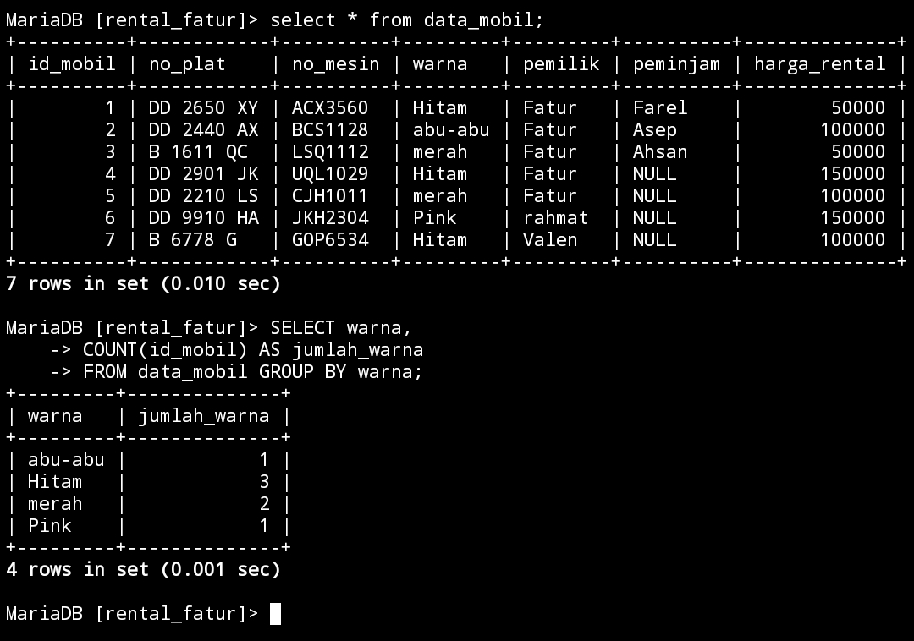
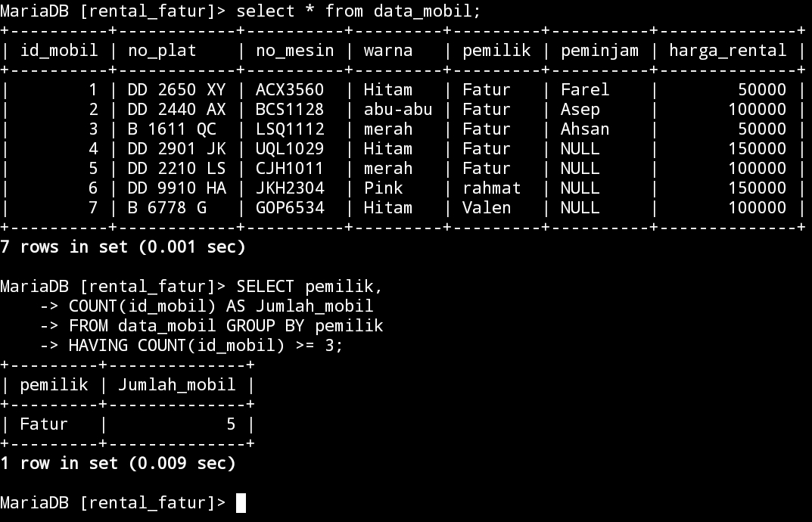
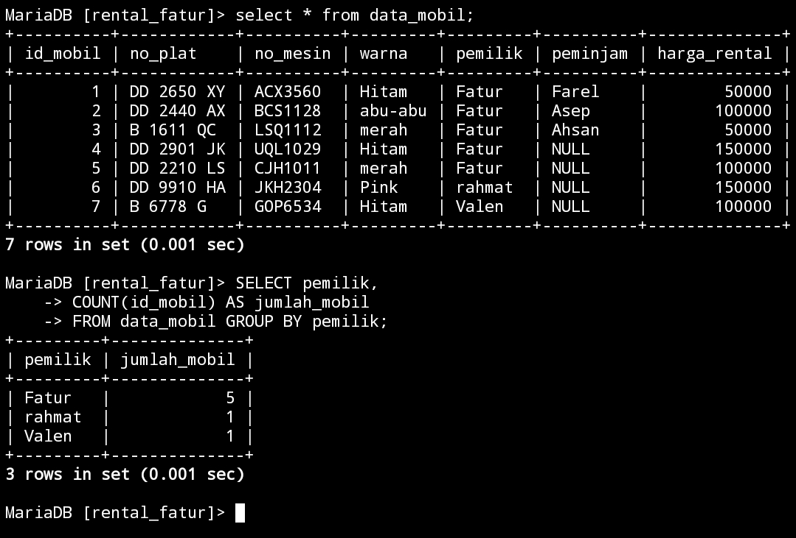
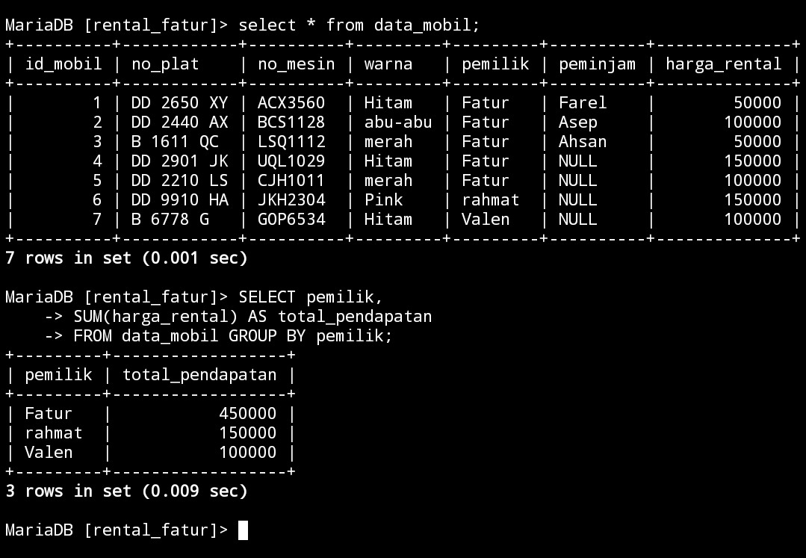
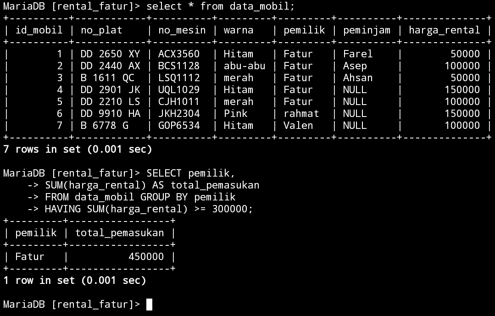
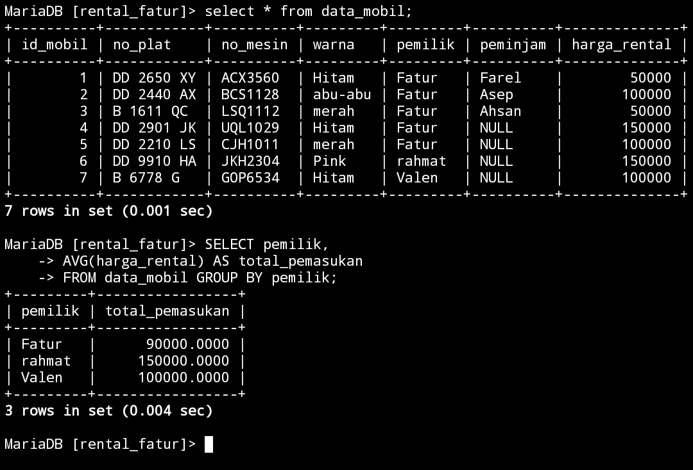
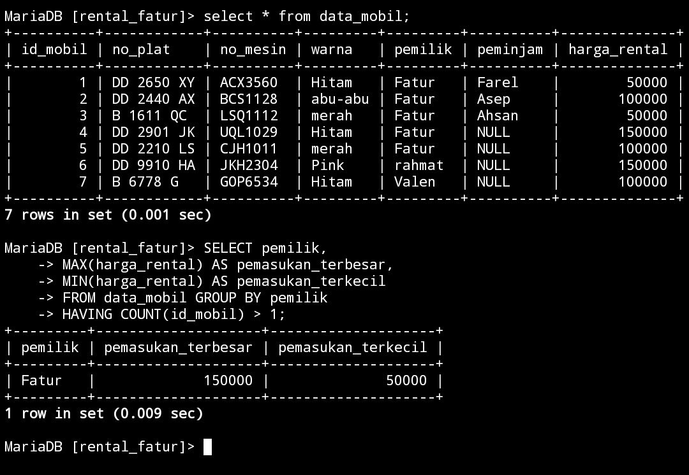

## 1.tampilkan jumlah data mobil dan kelompok kan berdasarkan warna nya sesuai dengan tabel mobil kalian.

### Struktur Query
```mysql
select data 2,COUNT(Data 1) AS nama_sementara FROM nama_tabel GROUP BY data 2;
```
### Query
```mysql
SELECT warna,
COUNT(id_mobil) AS jumlah_warna 
FROM data_mobil GROUP BY warna;
```
### Hasil



___


### Analisis 
`SELECT warna` nama kolom yang akan diambil dari tabel `mobil`.`COUNT(id_mobil) AS jumlah_warna`,`COUNT` digunakan untuk menghitung jumlah baris oleh `GROUP BY`. Di sini, `COUNT(id_mobil)` menghitung jumlah mobil untuk setiap warna,`jumlah_warna`.`FROM data_mobil` ini adalah nama tabel yang akan digunakan.`GROUP BY warna; `digunakan untuk mengelompokkan hasil query berdasarkan nilai dalam kolom warna.  semua baris yang memiliki warna yang sama akan dikelompokkan, dan`COUNT(id_mobil)` akan dihitung.
### kesimpulan 
Kesimpulannya,Query ini menghitung jumlah mobil berdasarkan warna dalam tabel `data_mobil`.


## 2.berdasarkan query ini tampilkan yang lebih BESAR dari 3 atau sama dengan 3 pemilik mobil nya

### Struktur Query
```mysql
select data 3,COUNT(id_mobil) AS nama_sementara from nama_tabel GROUP BY data 3 HAVING COUNT(data 1) >= 3;
```
### Query
```mysql
select pemilik,COUNT(id_mobil) AS jumlah_mobil from data_mobil GROUP BY pemilik HAVING COUNT(id_mobil) >= 3;
```
### Hasil

___


### Analisis 
`select pemilik` adalah nama kolomnya yang digunakan,`count(id_mobil)` digunakan untuk menghitung jumlah baris yang memiliki nilai pada kolom `id_mobil`.`AS jumlah_mobil` Alias yang memberikan untuk nama sementara pada hasil dari `count(id_mobil)` jadi hasilnya akan diberi nama `jumlah_mobil`.`from data_mobil` adalah nama tabelnya.`GROUP BY pemilik` kolom yang digunakan untuk di kelompokkan.`HAVING COUNT(id_mobil) >= 3` ,`HAVING` digunakan untuk menetapkan kondisi pada hasil pengelompokan `GROUP BY`.`(id_mobil) >= 3` Kondisi yang harus dipenuh. Hanya grup dengan jumlah `id_mobil` yang dihitung lebih besar atau sama dengan 3 yang akan ditampilkan dalam hasil akhir.
### kesimpulan 
Kesimpulannya, query SQL ini digunakan untuk menemukan pemilik yang memiliki setidaknya tiga mobil.


## 3.tampilkan smua pemilik dengan jumlah mobilnya yang memiliki atau sama dengan 3 mobil

### Struktur query 
```sql
SELECT nama_data,COUNT(nama_data) AS nama_sementara FROM nama_tabel GROUP BY nama_data;
```
### Query
```mysql
SELECT pemilik, 
COUNT(id_mobil) AS jumlah_mobil 
FROM data_mobil GROUP BY pemilik;
```
### Hasil



___


### Analisis 
`SELECT pemilik` ini adalah nama kolomnya,`count(id_mobil)`digunakan untuk menghitung jumlah baris dalam kolom `id_mobil` untuk setiap grup. Fungsi ini menghitung berapa banyak mobil yang dimiliki oleh setiap `pemilik`.`AS jumlah_mobil` memberikan nama sementara pada hasil dari `COUNT(id_mobil)`, sehingga hasilnya akan diberi nama `JUMLAH_MOBIL`.`FROM data_mobil` ini adalah nama tabelnya.`GROUP BY pemilik` digunakan untuk mengelompokkan hasil query satu atau lebih kolom `pemilik`.
### kesimpulan 
Kesimpulannya,Query ini mengelompokkan data berdasarkan pemilik mobil dan menghitung jumlah mobil yang dimiliki setiap `pemilik`.


## 4.berdasarkan query yang ada pada praktikum 5 bagian 7 tampilkan data pada table mobil dengan mengelompokkan berdasarkan pemiliknya.hitung menggunakan sum total pendapatan pemilik berdasarkan harga rental

### Struktur Query
```mysql
select data 3,SUM(data 5) AS nama_sementara from nama_tabel GROUP BY data 3;
```
### Query
```mysql
SELECT pemilik,
SUM(harga_rental) AS total_pendapatan
FROM data_mobil GROUP BY pemilik;
```
### Hasil

___


### Analisis 
`Select pemilik` ini adalah nama kolomnya,`SUM(harga_rental)` digunakan untuk menghitung total nilai dari kolom `harga_rental` untuk setiap grup `pemilik`.`AS total_pendapatan` memberikan nama sementara pada hasil dari `SUM(harga_rental)`, sehingga hasilnya akan diberi nama `total_pendapatan`.`FROM data_mobil` adalah nama tabelnya,`GROUP BY pemilik` memastikan bahwa hasil query dikelompokkan berdasarkan pemilik mobil, sehingga setiap baris hasil akan menunjukkan pemilik serta total pendapatan rental mereka.
### kesimpulan 
Kesimpulannya,Query ini memberikan informasi tentang total pendapatan rental mobil yang diperoleh oleh masing-masing pemilik mobil.


## 5. Berdasarkan praktikum 5 query no 8 tampilkan jumlah pemasukan pemilik berdasarkan harga rental kelompokkan berdasarkan pemiliknya dan seleksi yang total pemasukannya atau harga rentalnya mencapai lebih besar atau sama dengan 300k

### Struktur Query
```mysql
select data_mobil,SUM(data_mobil) AS nama_sementara from nama_tabel GROUP BY data_mobil HAVING SUM(data_mobil) >= 300000;
```
### Query
```mysql
SELECT pemilik,
SUM(harga_rental) AS total_pemasukan
FROM data_mobil GROUP BY pemilik
HAVING SUM(harga_rental) >= 300000;
```
### Hasil


___


### Analisis 
`SELECT pemilik` nama kolom yang akan di gunakan,`SUM(harga_rental)` digunakan untuk menghitung total nilai dari kolom `harga_rental` untuk setiap grup pemilik. Fungsi ini menjumlahkan pendapatan dari rental mobil untuk setiap pemilik.`AS total_pemasukan` memberikan nama sementara pada hasil dari `SUM(harga_rental)`, sehingga hasilnya akan diberi nama `total_pemasukan`.`From data_mobil` ini adalah nama tabelnya.`GROUP BY pemilik` pengelompokan Setiap nilai unik di kolom pemilik akan membentuk satu grup.`HAVING SUM(harga_rental) >= 300000` Mengelompokkan data berdasarkan kolom pemilik, sehingga setiap pemilik membentuk satu grup serta,menyertakan pemilik yang memiliki total pendapatan dari rental mobil sebesar `300,000` atau lebih.
### kesimpulan 
Kesimpulannya,Query ini digunakan untuk mencari pemilik mobil yang memiliki total pendapatan dari rental mobil sebesar 300,000 atau lebih. 


## 6. Berdasarkan praktikum 6 no 12 tampilkan rata rata pemasukan pemilik mobil kelompokkan berdasarkan pemiliknya
### Struktur Query
```mysql
select nama_data,AVG(nama_data) AS nama_sementara from nama_tabel GROUP BY nama_data;
```
### Query 
```mysql
SELECT pemilik,
AVG(harga_rental) AS total_pemasukan
FROM data_mobil GROUP BY pemilik;
```
### Hasil

___


### Analisis 
`SELECT pemilik` nama kolomnya,`AVG(harga_rental)` menghitung nilai rata-rata dari kolom harga_rental untuk setiap kolom pemilik.`AS total_pemasukan` memberikan nama sementara pada hasil dari `AVG(harga_rental)`, sehingga hasilnya akan diberi nama `rata_rata_pendapatan`.`from data_mobil` nama tabelnya,`GROUP BY pemilik` `GROUP BY` digunakan untuk mengelompokkan data berdasarkan kolom `pemilik`. Setiap nilai unik di kolom pemilik akan membentuk satu grup.
Data akan dikelompokkan berdasarkan pemilik mobil, sehingga rata-rata `harga_rental` dihitung untuk setiap `pemilik`.
### kesimpulan 
Kesimpulannya,Query ini digunakan untuk menghitung rata-rata pendapatan dari rental mobil untuk setiap pemilik.


## 7. Berdasarkan praktikum 5 no 16 tampilkan pemasukan  terbesar dan pemasukan terkecil kelompokkan berdasarkan pemiliknya dan seleksi data pemilik yg tampil atau memiliki jumlah mobil lebih besar dari 1.

### Struktur
```mysql
select nama_data,MAX(nama_data) AS nama_sementara,MIN(nama_data) AS nama_sementara from nama_tabel GROUP BY nama_data HAVING COUNT(nama_data) >= 1;
```
### Query
```mysql
SELECT pemilik, 
MAX(harga_rental) AS pemasukan_terbesar, 
MIN(harga_rental) AS pemasukan_terkecil
FROM data_mobil GROUP BY pemilik
HAVING COUNT(id_mobil) > 1;
```
### Hasil

### Analisis 
`SELECT pemilik` nama kolomnya,`max(harga_rental)` menghitung pendapatan terbesar dari rental mobil untuk setiap pemilik.`AS pemasukan_terbesar` memberikan nama sementara pada hasil dari `MAX(harga_rental)`,`MIN(harga_rental)` 
### kesimpulan 
Kesimpulannya,kita bisa melihat daftar pemilik, pemasukan terbesar,dan pemasukan terkecil.