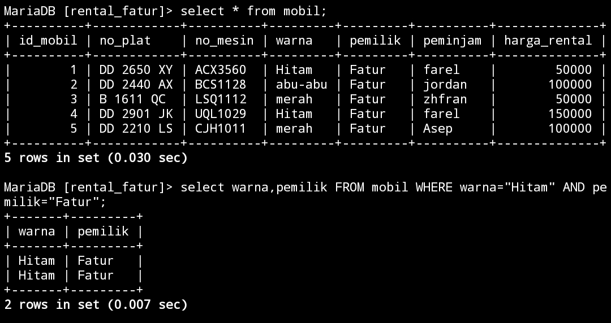
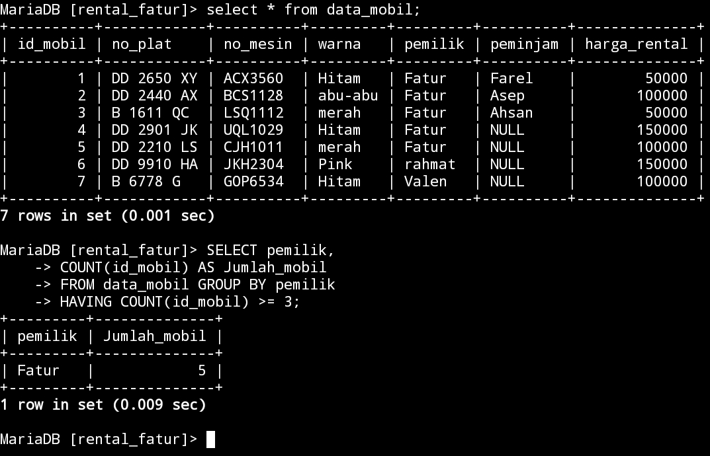
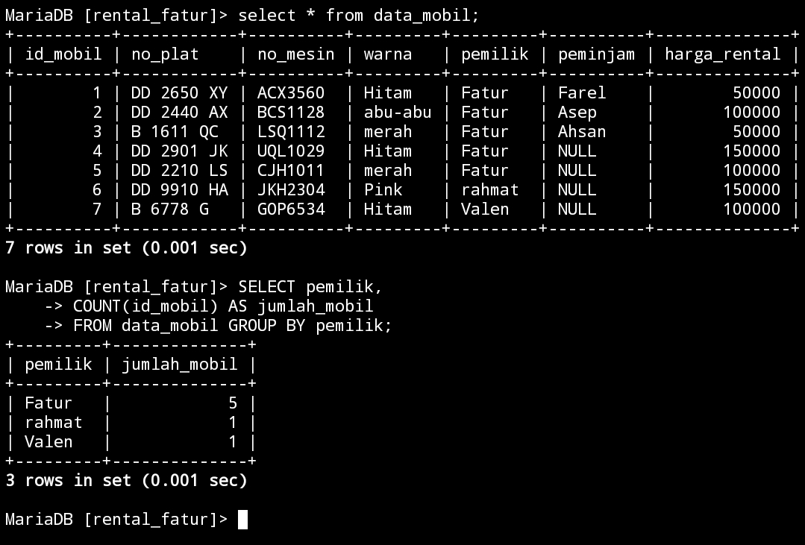
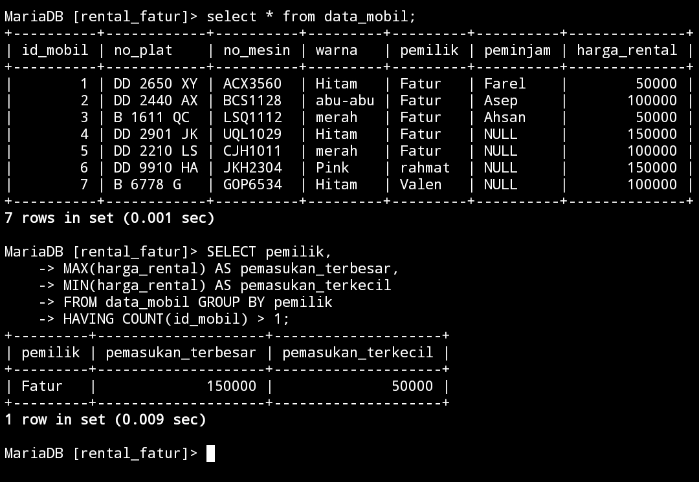

# Select Lanjutan 
## OPERATOR LOGIKA DAN PEMBANDING

### AND
#### Struktur query
```
select nama_kolom,nama_kolom FROM nama_tabel WHERE nama_warna AND nama_pemilik;
```
#### Contoh query
```sql
select warna,pemilik FROM mobil WHERE warna="Hitam" AND pemilik="Fatur";
```
#### Hasil



#### Analisis
`Select warna` bertugas untuk menampilkan warna dari mobil yang ingin di tampilkan,`from mobil` adalah nama tabel (mobil),`where warna="hitam"` berarti warna mobil yang akan di tampilkan itu warnanya hitam dan `AND` itu menampilkan seluruh mobil yang warnanya hitam dengan nama pemiliknya, walaupun beda pemilik tapi kalau warnanya sama tetap akan tampil.
#### Kesimpulan
Jadi kalo kita ingin menampilkan daftar mobil dengan warna hitam beserta nama pemiliknya, cukup menggunakan kode `AND` walaupun pemiliknya itu berbeda yang penting warnanya sama.

### OR
#### Struktur query
```sql
select data 1,data 2 from [nama_tabel] where data 1="nilai 1" OR data 2="nilai 2";
```
#### Contoh query
```sql
select warna,pemilik FROM mobil WHERE warna="Hitam" OR pemilik="Fatur";
```
#### Hasil


#### Analisis
`WHERE warna="Hitam" OR pemilik="Fatur"` akan menampilkan nama pemilik Fatur beserta semua warna mobil yang ia punya.
jadi,`OR` adalah kebalikan dari `AND` jadi kalo `AND` hanya akan menampilkan warna hitam dengan pemilik Fatur maka `OR` akan menampilkan sebaliknya dengan menampilkan seluruh warna mobil yang fatur punya.

#### Kesimpulan
Kesimpulannya `OR` itu akan menampilkan sebaliknya dari yang diminta seperti kita meminta warna hitam maka yang tampil seluruh warna mobil yang penting pemiliknya sama.


### BETWEEN
#### Struktur query
```
select * from [nama_tabel] where data 1 BETWEEN nilai 1 AND nilai 2;
```
#### Contoh query
```sql
SELECT * FROM mobil WHERE harga_rental BETWEEN 100000 AND 150000;
```
#### Hasil


#### Analisis
Tujuan dari query `BETWEEN` ini adalah untuk mengambil semua kolom (`*`) dari tabel `mobil`di mana nilai kolom `harga_rental` berada di antara `100000` dan `150000`.
#### Kesimpulan
Kesimpulannya,Dengan menggunakan `BETWEEN`, kita dapat memilih baris yang memiliki nilai di antara dua nilai tertentu.contonhya, kalo kita  ingin mengambil baris dengan `harga_rental` antara `100000` dan `150000` maka yang tampil hanya harga mobil dengan harga `100000` dan `150000`.


### NOT BETWEEN
#### Struktur query
```
select * from [nama_tabel] where data 1 NOT BETWEEN nilai 1 AND nilai 2;
```
#### Contoh query
```sql
SELECT * FROM mobil WHERE harga_rental NOT  BETWEEN 100000 AND 150000;
```
#### Hasil


#### Analisis

`Select * from mobil` adalah nama tabelnya.
`harga_rental` adalah Kolom yang diseleksi dengan menggunakan `SELECT *`.bagian `WHERE`,terdapat kondisi `harga_rental NOT BETWEEN 100000 AND 150000`.query ini akan mengambil baris-baris yang tidak memenuhi kondisi tersebut.
`NOT BETWEEN 100000 AND 150000` Kondisi ini mengecek apakah nilai `harga_rental` tidak berada di antara `100.000` dan `150.000`. 
Jadi, hasil dari query ini akan memberikan semua baris dari tabel "mobil" di mana nilai "harga_rental" tidak berada di antara `100.000` dan `150.000`.
#### Kesimpulan
Kesimpulannya `NOT BETWEEN` berfungsi untuk menampilkan nilai yang ada di bawah dari nilai yang di tampilkan.contonya kita memanggil harga yang `100000` maka yang akan tampil harga yang ada di bawah `100000` jadi yang tampil `50000`.

---
### <=
#### Struktur query
```
select * from [nama_tabel] where data 1 <= nilai 1;
```
#### Contoh query
```sql
SELECT * FROM mobil WHERE harga_rental <=50000;
```
#### Hasil


#### Analisis
 `Select * from mobil` adalah nama Tabelnya dan `WHERE harga_rental` nama kolomnya,`<= 50000` Adalah kurang atau sama dengan artinya akan menampilkan daftar harga mobil yang ada di bawah `50000` atau sama dengan `50000`,disini tidak ada yang harga mobil di bawah `50000` maka yang tampil hanya harga mobil yang berharga `50000`.
#### Kesimpulan
Jadi, kesimpulannya adalah bahwa query `<=` ini akan mengambil mobil dengan harga tepat `50000` jika tidak ada mobil dengan harga di bawah `50000` yang ada dalam tabel.

### >=
#### Struktur query
```
select * from [nama_tabel] where data 1 >= nilai 1;
```
#### Contoh query
```sql
SELECT * FROM mobil WHERE harga_rental >=50000;
```
#### Hasil


#### Analisis
`Select * from mobil` adalah nama tabel yang digunakan.`WHERE harga_rental >= 50000`  akan menampilkan baris-baris di mana nilai kolom `harga_rental` lebih besar atau sama dengan `50000`.
`>= ` adalah lebih atau sama Dengan artinya akan menampilkan harga yang lebih dari `50000` atau sama dengan `50000` maka yang akan tampil itu seluruh harga dari mobil tersebut karena harganya lebih dari `50000` dan sama dengan `50000`.
#### Kesimpulan
Kesimpulannya >= akan menampilkan nilai yang ada diatas 50000 atau sama dengan 50000.

---
### <>
#### Struktur query
```
select * from [nama_tabel] where data 1 <> nilai 1;
```
#### Contoh query
```sql
SELECT * FROM mobil WHERE harga_rental <> 50000;
```
#### Hasil


#### Analisis
Dengan menggunakan  `<>` (tidak sama dengan), query ini akan mengembalikan semua baris dari tabel "mobil" di mana nilai kolom "harga_rental" tidak sama dengan 50000,maka yang tampil hanya harga 10000 dan 15000.

#### Kesimpulan
Jadi, query `<>` ini akan mengambil semua mobil yang memiliki harga_rental yang berbeda dengan 50000. 


### !=
#### Struktur query
```
select * from [nama_tabel] where data 1 != nilai 1;
```
#### Contoh query
```sql
SELECT * FROM mobil WHERE harga_rental !=  50000;
```
#### Hasil


#### Analisis
Dengan menggunakan `!=` (tidak sama dengan), query ini akan menampilkan semua baris dari tabel "mobil" di mana nilai kolom "harga_rental" tidak sama dengan 50000.
#### Kesimpulan
Jadi `!=` Itu sama dengan `<>` memiliki fungsi yang sama dimana akan menampilkan sebuah harga mobil yang tidak sama dengan harga 50000.


## TANTANGAN Login
### Struktur query
```
select nama_kolom from nama_tabel where nama="_";
```
### Contoh query
```sql
select nama from akun where nama="fathurrahman";
```
### Hasil
 

### Analisis
`Select nama` adalah nama kolom dari tabel `akun`.Tujuan dari query ini adalah untuk mengambil kolom `nama` dari tabel  di mana nilai kolom `nama` adalah `fathurrahman`.

### Kesimpulan
Jadi, kesimpulannya query ini akan mengambil semua nilai `nama` dari akun yang dimiliki oleh `fathurrahman`.


## IN
### IN

#### Struktur Query

```
select * from nama_tabel where data IN('nilai 1','nilai 2');
```

#### Contoh Query

```sql
SELECT * FROM mobil WHERE warna IN('hitam','merah');
```

#### Hasil


#### Analisis
Dengan menggunakan `WHERE` dan operator `IN`, query ini hanya akan menampilkan semua mobil yang warnanya "merah" dan "hitam" yang tadinya ada warna "abu-abu" menjadi hanya merah dan hitam saja.

#### Kesimpulan 
Jadi, query ini akan menampilkan semua mobil yang memiliki warna 'hitam' atau 'merah'.

### IN+AND

#### Struktur Query

```
select * from nama_tabel where data IN('nilai 1','nilai 2')AND data 2=nilai 1;
```

#### Contoh Query 

```sql
select * from mobil where warna IN('Hitam','merah')
AND harga_rental=50000;
```

#### Hasil


#### Analisis
`Select * from mobil` nama tabel yang digunakan `IN('Hitam','merah')` berfungsi untuk menampilkan mobil dengan warna merah dan hitam serta dengan `harga_rental` sama dengan `50000` dengan query `AND harga_rental=50000;`

#### Kesimpulan 
Jadi, query ini akan mengambil semua mobil yang memiliki warna `Hitam` atau `merah`, dan memiliki `harga_rental` yang tepat `50000`.

### IN+OR

#### Struktur Query 
```
select * from nama_tabel where data IN('nilai 1','nilai 2')OR data 2=nilai 1;
```

#### Contoh Query 
```sql
select * from mobil where warna 
IN('abu-abu','merah','abu-abu')
OR harga_rental=50000;
```

#### Hasil


#### Analisis
`warna IN ('abu-abu', 'merah', 'putih')`: Ini mengambil semua baris yang memiliki nilai kolom `warna` yang sama dengan `abu-abu`, `merah`, atau `putih`. Operator `IN` digunakan untuk menentukan beberapa nilai yang memenuhi kondisi tersebut.
`harga_rental = 50000`: Ini akan mengambil semua baris yang memiliki nilai kolom `harga_rental` yang sama dengan `50000`. Operator `=` digunakan untuk membandingkan nilai yang sama.Kedua kondisinya digabungkan dengan operator logika `OR`, yang berarti hasil query akan mengembalikan baris-baris yang memenuhi salah satu kondisi atau keduanya.

#### Kesimpulan 
Kesimpulannya,`OR` akan mengembalikan baris-baris dari tabel `mobil` yang memenuhi salah satu dari dua kondisi.

### IN+AND+Operator 

#### Struktur Query 

```
select * from nama_tabel where nama_kolom 
IN('abu-abu','merah')
AND nama_kolom>harga;
```

#### Contoh Query 

```sql
select * from mobil where warna 
IN('abu-abu','merah')
AND harga_rental>50000;
```

#### Hasil


#### Analisis
`IN+AND+Operator` berfungsi untuk menampilkan mobil dengan warna abu-abu dan merah (`IN('abu-abu','merah')`) dengan harga yang lebih besar dari 50000 (`AND harga_rental>50000`).walaupun harganya lebih besar dari 50000 tetapi warna mobilnya beda yang dipanggil maka tidak akan tampil.

#### Kesimpulan 
Dengan menggabungkan kedua kondisi tersebut, query akan mengambil semua kolom dari tabel `mobil` di mana warna mobil adalah '`abu-abu` atau `merah`, dan harga sewa mobil lebih besar dari `50000`.

#### Contoh Query 
```sql
select * from mobil where warna 
IN('abu-abu','merah')
AND harga_rental<50000;
```

#### Hasil


#### Analisis 
`IN+AND+Operator` berfungsi untuk menampilkan mobil dengan warna abu-abu dan merah (`IN('abu-abu','merah')`) dengan harga yang kurang dari 50000 (`AND harga_rental<50000`).mengapa hasilnya tidak ada yang tampil? Karena di Tabelnya tidak ada yang harga mobilnya kurang dari 50000.
#### Kesimpulan 
Kesimpulannya sama dengan yang diatas tetapi ini akan menampilkan daftar harga yang kurang dari 50000 dari mobil yang berwarna abu-abu dan merah.


## LIKE
### Mencari awalan

#### Struktur Query

```
SELECT * FROM nama_tabel
WHERE nama_kolom LIKE 'awalan%';
```

#### Contoh Query 
```sql
SELECT * FROM mobil
WHERE peminjam LIKE 'f%';
```

#### Hasil


#### Analisis
`Select from mobil` adalah nama tabel yang kita akan cari peminjam(`WHERE peminjam`) dengan awalan huruf f(`LIKE 'f%'`) maka hasilnya adalah peminjam dengan nama farel.
#### Kesimpulan
Misalnya, jika Anda memiliki kondisi `where` `nama LIKE 'f%'`, maka akan mencocokkan semua nilai di mana kolom `nama` dimulai dengan huruf 'f'.


### Mencari akhiran 

#### Struktur Query

```
SELECT * FROM nama_tabel
WHERE nama_kolom LIKE '%akhiran';
```

#### Contoh Query
```sql
SELECT * FROM mobil
WHERE peminjam LIKE '%l';
```

#### Hasil


#### Analisis 
`Select from mobil` adalah nama tabel yang kita akan cari peminjam(`WHERE peminjam`) dengan akhiran huruf l(`LIKE '%l'`) maka hasilnya adalah peminjam dengan nama farel karena akhir namanya adalah l.


#### Kesimpulan 
Kesimpulannya kalo kita ingin mencari akhiran huruf dari peminjam mobil kita masukkan kode `LIKE '%l'`.l sebagai huruf akhiran yang akan kita cari.

### Mencari awalan & akhiran

#### Struktur Query 

```
SELECT * FROM nama_tabel
WHERE nama_kolom LIKE 'awalan%akhiran';
```

#### Contoh Query

```sql
SELECT * FROM mobil
WHERE peminjam LIKE 'f%l';
```

#### Hasil


#### Analisis 
`Mobil` adalah nama tabelnya dan `peminjam` adalah nama kolom yang akan kita cari menggunakan huruf awalan dan akhiran namanya dengan menggunakan `LIKE 'f%l'` jadi yang kita cari itu adalah awalan (`f`) dan akhiran (`l`) maka hasilnya adalah farel karena awalan dan akhirannya sesuai dengan query nya.

#### Kesimpulan 
Kesimpulannya kalo kita ingin Mencari awalan dan akhirannya kita tinggal masukkan huruf awalan dan akhirnya seperti `LIKE 'f%l'`.
### berdasarkan total karakter
#### struktur query
```
SELECT * FROM nama_tabel
WHERE nama_kolom LIKE 'n';
```

#### Contoh
```sql
SELECT * FROM mobil
WHERE peminjam LIKE 'f____';
```

#### Hasil


#### Analisis
Pernyataan `SELECT * FROM mobil` akan mengambil semua kolom (semua atribut) dari tabel 'mobil'. 
`WHERE` peminjam `LIKE 'f____'` adalah klausa WHERE yang memberikan kondisi yang harus dipenuhi oleh entri yang akan dipilih. Dalam hal ini, kita sedang mencari di mana nilai kolom `peminjam` dimulai dengan huruf '`f`' dan diikuti oleh empat karakter apa pun. 

#### kesimpulan 
Kesimpulannya,kalo kita ingin Mencari nama peminjam dengan menggunakan total karakter,gunakan LIKE `F` awalan dari namanya dan `__` adalah jumlah total karakter dari mamanya.

#### Contoh
```sql
SELECT * FROM mobil
WHERE peminjam LIKE '_____';
```

#### Hasil


#### analisis

`Select * from mobil` nama tabel yang digunakan,`WHERE peminjam` nama kolomnya Dengan menggunakan `*` dalam pernyataan `SELECT`, query ini akan mengambil semua kolom yang ada dalam tabel `mobil`.`peminjam LIKE '_____'`  Kondisi WHERE digunakan untuk memfilter baris berdasarkan nilai kolom `peminjam`.kolom `peminjam` harus memenuhi pola
Terdiri dari tepat lima karakter ditandai dengan (`____`).jadi hasilnya disini adalah `Fatur` karena memenuhi persyaratannya.

#### kesimpulan 
Kesimpulannya adalah query ini akan mengambil semua baris dari tabel `mobil` di mana nilai kolom `peminjam` terdiri dari tepat lima karakter.

### Kombinasi
#### struktur query
```
SELECT * FROM nama_tabel
WHERE nama_kolom LIKE '_%';
```

#### Contoh
```sql
SELECT * FROM mobil
WHERE peminjam LIKE '____n%';
```

#### Hasil


#### analisis
`SELECT * FROM mobil` ini adalah nama tabelnya
`WHERE peminjam LIKE ____n%`: Ini adalah klausa `WHERE` yang digunakan untuk mencari baris.kita menggunakan operator `LIKE` untuk membandingkan nilai kolom `peminjam` dengan pola tertentu.
`peminjam` Ini adalah nama kolom yang digunakan dalam kondisi pencarian.
`LIKE` Ini adalah operator yang digunakan untuk mencocokkan nilai kolom dengan pola yang diberikan.
 `____n%`: Ini adalah pola pencocokannya. Dalam pola ini, garis bawah (`_`) mewakili satu karakter tunggal, dan huruf `n` harus diikuti oleh karakter apa pun. Tanda `%` menunjukkan bahwa ada nol atau lebih karakter yang dapat mengikuti pola tersebut.

#### Kesimpulan
Kesimpulannya,query ini akan mengambil semua baris dari tabel `mobil` di mana nilai kolom `peminjam` dimulai dengan empat karakter apa pun dan diikuti oleh huruf `n`

### Not Like
#### Struktur Query 
```
SELECT * FROM nama_tabel WHERE nama_kolom NOT LIKE 'A%';
```
#### Contoh Query 
```sql
SELECT * FROM data_mobil WHERE peminjam NOT LIKE 'A%';
```
#### Hasil


#### Analisis 

`select * from data_mobil` Query ini akan mengambil semua kolom dan data dari tabel `data_mobil`.Perintah `SELECT` digunakan untuk mengambil data dari tabel.kita hanya mengambil data di mana nilai kolom `peminjam` tidak dimulai dengan huruf 'A'.kita menggunakan `NOT LIKE` untuk membalikkan kondisi, sehingga hanya data dengan nilai kolom `peminjam` yang tidak dimulai dengan huruf `A` yang akan dipilih.

#### Kesimpulan 
Kesimpulannya,akan mengambil semua data dari tabel `data_mobil` di mana nilai kolom `peminjam` tidak dimulai dengan huruf `A`.

## NULL & NOT NULL
### NULL
#### Struktur query 
```sql
select * from nama_tabel where nama_data is NOT NULL;
```
#### Contoh query
```sql
select * from mobil where peminjam is NULL;
```
#### Hasil


#### Analisis 
`Select * from mobil` adalah nama tabelnya `WHERE peminjam` nama kolomnya yang akan menampilkan nilai yang `NULL` dari kolom `peminjam` 

#### Kesimpulan 
Kesimpulannya,`NULL` itu adalah nilai tidak memiliki nilai.

### NOT NULL 
#### Struktur query 
```sql
select * from nama_tabel where nama_data is NOT NULL;
```
#### Contoh query
```sql
select * from mobil where peminjam is NOT NULL;
```
#### Hasil


#### Analisis 

`SELECT * from mobil`  Ini adalah nama tabelnya.`WHERE peminjam IS NOT NULL`
Ini adalah klausa yang digunakan untuk menyaring baris dari tabel. Di sini, itu menginstruksikan database untuk hanya mengembalikan baris di mana nilai kolom `peminjam` tidak kosong (`tidak NULL`). Artinya, hanya baris dengan data yang dipinjam yang akan dikembalikan.

#### Kesimpulan 
Kesimpulannya,  `SELECT * FROM mobil WHERE peminjam IS NOT NULL;`  digunakan untuk mengambil semua informasi tentang mobil yang sedang dipinjam dari tabel `mobil`. 

## Order BY & Limit 
### Mengurutkan dari data yang terkecil 
#### Struktur query 
```sql

```
#### Contoh query
```sql
SELECT * FROM mobil ORDER BY harga_rental ASC;
```
#### Hasil


#### Analisis 

`FROM mobil`: Ini menunjukkan bahwa tabel yang digunakan dalam query ini adalah "mobil". Anda mengambil semua data dari tabel ini.

`ORDER BY harga_rental ASC`: Ini adalah klausa ORDER BY yang digunakan untuk mengurutkan hasil query berdasarkan kolom `harga_rental` secara ascending. ASC menandakan pengurutan secara ascending (dari nilai terkecil hingga terbesar).
#### Kesimpulan 
Kesimpulannya,hasil pada tabel ini akan Mengurutkan dari data terkecil hingga terbesar.
### Mengurutkan dari data yang terbesar 
#### Struktur query 
```sql

```
#### Contoh query
```sql
SELECT * FROM mobil ORDER BY harga_rental DESC;
```
#### Hasil


#### Analisis 

`FROM mobil`: Ini menunjukkan bahwa tabel yang digunakan dalam query ini adalah "mobil". Anda mengambil semua data dari tabel ini.
`ORDER BY harga_rental DESC`: Ini adalah klausa ORDER BY yang digunakan untuk mengurutkan hasil query berdasarkan kolom `harga_rental` secara descending. `DESC` menandakan pengurutan secara descending (dari nilai terbesar hingga terkecil).

#### Kesimpulan
Kesimpulannya,Hasilnya akan menampilkan dari harga terbesar dulu hingga terkecil.
### Limit
#### contoh Query 

```sql
SELECT * FROM data_mobil WHERE warna = 'Hitam' ORDER BY harga_rental ASC LIMIT 2;
```

#### Hasil


#### analisis 

`SELECT * FROM data_mobil` adalah nama tabelnya. `WHERE warna = 'Hitam'`
Kondisi WHERE digunakan untuk mencari baris berdasarkan nilai kolom `warna`.`ORDER BY harga_rental ASC` ORDER BY digunakan untuk mengurutkan baris berdasarkan kolom `harga_rental`. Dalam hal ini, baris-baris akan diurutkan secara menaik (`ASC`) berdasarkan nilai kolom `harga_rental`.`LIMIT 2` digunakan untuk membatasi jumlah baris yang dikembalikan oleh query.jadi tampilannya yang awalnya warna `hitam` ada 3 Menjadi 2 karena menggunakan `LIMIT 2`.
#### Kesimpulan 
Kesimpulannya,`LIMIT` akan membatasi jumlah baris yang ditampilkan,dengan kondisi bahwa mobil tersebut memiliki warna `Hitam`.Baris-baris tersebut akan diurutkan berdasarkan harga rental secara menaik (`ASC`), dan hanya dua baris yang ditampilkan.

## DISTINCT

### Contoh Query 
```sql
SELECT DISTINCT(pemilik) FROM mobil;
```
### Hasil 


### Analisis 
 `SELECT DISTINCT(pemilik)`: Digunakan untuk memilih nilai dari kolom `pemilik` dalam tabel `mobil`. `DISTINCT` memastikan bahwa hanya nilai unik yang akan ditampilkan, sehingga tidak ada duplikat pada hasil.

Hasil query ini akan  menghasilkan satu kolom tunggal yang berisi nilai-nilai unik dari kolom `pemilik` dalam tabel `mobil`. Setiap nilai yang muncul dalam hasil query akan bersifat unik, tanpa adanya duplikat.
### Kesimpulan 
Kesimpulannya,akan menampilkan semua nama peminjam yang ada pada tabel mobil.

___

### contoh Query 
```sql
SELECT DISTINCT(harga_rental) FROM mobil ORDER BY harga_rental DESC;
```
### Hasil


### analisis 
 `SELECT DISTINCT(harga_rental)`: Digunakan untuk memilih nilai unik dari kolom "harga_rental" dalam tabel "mobil". Kata kunci "DISTINCT" memastikan bahwa hanya nilai unik yang akan ditampilkan, sehingga tidak ada duplikat di dalam hasil query.
`FROM mobil`: Menunjukkan bahwa tabel yang digunakan dalam query ini adalah "mobil".
`ORDER BY harga_rental DESC`: Digunakan untuk mengurutkan hasil berdasarkan nilai kolom `harga_rental`. Kata kunci `DESC` menunjukkan bahwa pengurutan dilakukan secara menurun (`descending order`), yaitu dari nilai tertinggi ke nilai terendah.
### Kesimpulan 
Kesimpulannya Hasil query ini akan menghasilkan satu kolom tunggal yang berisi nilai-nilai unik dari kolom `harga_rental` dalam tabel `mobil`, yang diurutkan secara menurun. Setiap nilai yang muncul dalam hasil query akan bersifat unik, tanpa adanya duplikat, dan diurutkan dari nilai tertinggi ke nilai terendah.

## CONCAT,CONCAT_WS,AS
### CONCAT

#### Contoh Query 
```sql
SELECT CONCAT(pemilik,warna) FROM mobil;
```
#### Hasil

#### Analisis 

`SELECT`: Digunakan untuk memilih kolom yang akan ditampilkan dalam hasil query.
`CONCAT(pemilik, warna)`: `CONCAT` digunakan untuk menggabungkan nilai dari kolom `pemilik` dan `warna` menjadi satu nilai.
`FROM mobil`: Menunjukkan bahwa tabel yang digunakan dalam query ini adalah `mobil`.
Hasil query tersebut akan menghasilkan satu kolom tunggal yang berisi nilai-nilai hasil penggabungan antara kolom `pemilik` dan `warna` dari setiap baris dalam tabel `mobil`.
#### Kesimpulan 
Kesimpulannya Pada query ini, `SELECT CONCAT(pemilik, warna) FROM mobil;`, dilakukan seleksi data dari tabel `mobil` dengan melakukan penggabungan antara kolom `pemilik` dan `warna`.
### CONCAT_WS

#### Contoh Query 
```sql
SELECT CONCAT_WS("-",no_plat,no_mesin,id_mobil) FROM mobil;

```
#### Hasil

#### Analisis 
`SELECT`: Digunakan untuk memilih kolom yang akan ditampilkan dalam hasil query.
`CONCAT_WS("-", no_plat, no_mesin, id_mobil)`: `CONCAT_WS` digunakan untuk menggabungkan nilai dari kolom `no_plat`, `no_mesin`, dan `id_mobil` dengan menggunakan pemisah `-` (`dash`) di antara setiap nilai. Hasil penggabungan tersebut akan menjadi satu nilai tunggal.
`FROM mobil`: Menunjukkan bahwa tabel yang digunakan dalam query ini adalah `mobil`.
Hasil query ini menghasilkan satu kolom yang berisi nilai-nilai hasil penggabungan antara kolom `no_plat`, `no_mesin`, dan `id_mobil` dari setiap baris dalam tabel `mobil` dengan pemisah `-` di antara setiap nilai.
#### Kesimpulan 
Kesimpulannya Pada query ini, `SELECT CONCAT_WS("-", no_plat, no_mesin, id_mobil) FROM mobil;`, dilakukan seleksi data dari tabel "mobil" dengan menggabungkan  antara kolom `no_plat`, `no_mesin`, dan `id_mobil` menggunakan pemisah `-` (`dash`).

### AS

#### Contoh Query 
```sql
SELECT
CONCAT_WS("+",pemilik,peminjam) AS
COLLAB FROM mobil
```
#### Hasil


#### Analisis 
 `SELECT`: Digunakan untuk memilih kolom yang akan ditampilkan dalam hasil query.
`CONCAT_WS("+", pemilik, peminjam) AS COLLAB`: `CONCAT_WS` digunakan untuk menggabungkan nilai dari kolom `pemilik` dan `peminjam` dengan menggunakan pemisah `+` (plus) di antara setiap nilai. Hasil penggabungan tersebut akan menjadi satu nilai . `COLLAB` diberikan pada kolom hasil penggabungan.
`FROM mobil`: Menunjukkan bahwa tabel yang digunakan dalam query ini adalah `mobil`.
Hasil query tersebut akan menghasilkan satu kolom tunggal dengan nama `COLLAB` yang berisi nilai-nilai hasil penggabungan antara kolom `pemilik` dan `peminjam` dari setiap baris dalam tabel `mobil` dengan pemisah `+` di antara setiap nilai.
#### Kesimpulan 
Pada query SQL ini, `SELECT CONCAT_WS("+", pemilik, peminjam) AS COLLAB FROM mobil;`untuk menyeleksi data dari tabel "`mobil`" dengan melakukan penggabungan antara kolom `pemilik` dan `peminjam` menggunakan pemisah `+` (`plus`) sebagai `CONCAT_WS`. Hasil penggabungan diberi alias `COLLAB` pada hasil query.
## View
### Membuat tabel virtual 

#### Contoh Query 
```sql
CREATE VIEW info_no_plat AS
SELECT id_mobil, no_plat, pemilik, peminjam
FROM data_mobil
WHERE pemilik = "Fatur";
```

#### Hasil


#### Analisis
`CREATE VIEW info_no_plat AS` Ini adalah untuk membuat sebuah view baru dengan nama `info_no_plat`.`SELECT id_mobil, no_plat, pemilik, peminjam` Ini adalah perintah untuk memilih kolom-kolom `id_mobil, no_plat, pemilik, dan peminjam` dari `tabel data_mobil`.`FROM data_mobil` Ini adalah perintah untuk menentukan bahwa data diambil dari tabel bernama `data_mobil`.`WHERE pemilik = "Fatur"` Ini untuk mengatur bahwa hanya baris-baris yang memiliki namab`Fatur` di kolom pemilik yang akan dimasukkan ke dalam view tersebut.

#### Kesimpulan 
Kesimpulannya, digunakan untuk membuat view baru dengan nama `info_no_plat`. View ini akan menampilkan data dari tabel `data_mobil`, tetapi hanya data yang memiliki nilai `Fatur` di kolom pemilik. Data yang ditampilkan pada kolom `id_mobil, no_plat, pemilik, dan peminjam`.

### Menampilkan tabel virtual 

#### Struktur query 
```sql
SELECT * FROM nama_tabel_virtual;
```
#### Contoh Query 
```sql
SELECT * FROM info_no_plat;
```

#### Hasil


#### Analisis

`Select * from info_no_plat` akan menampilkan tabel virtual yang sudah kita buat tadi dengan nama `info_no_plat`.
#### Kesimpulan 

Kesimpulannya,Dengan menjalankan query ini, kita dapat menampilkan  semua data yang ada dalam view `info_no_plat`. Data yang akan ditampilkan adalah kolom `id_mobil`, `no_plat`, `pemilik`, dan `peminjam` dari tabel `data_mobil` yang memenuhi kondisi `pemilik = "Fatur"`.

### Menghapus tabel virtual 

#### Struktur Query 

```sql
SELECT * FROM nama_tabel_virtual;
```

#### Contoh Query 

```sql
DROP VIEW info_no_plat;
```

#### Hasil


#### Analisis
menghapus view `info_no_plat` .
Perintah `DROP VIEW` digunakan untuk menghapus view yang sudah kita buat sebelumnya.Jadi, dengan menjalankan query ini, view `info_no_plat` akan dihapus.

#### Kesimpulan 
Kesimpulannya,dengan menjalankan query ini, view `info_no_plat` akan dihapus beserta isinya.

## Tantangan 
### 1. Buatkan tabel virtual dan tampilkan datanya yang mana peminjamannya itu tidak ada (NULL)

#### Contoh Query 
```sql
CREATE VIEW peminjam NULL AS SELECT id_mobil,no plat, peminjam, harga_rental FROM mobil WHERE peminjam IS NULL;
```

#### Hasil

#### analisis
`CREATE VIEW peminjam_NULL AS` adalah perintah untuk membuat sebuah view baru dengan nama `peminjam_NULL`.`SELECT id_mobil, no plat, peminjam, harga_rental
adalah perintah untuk memilih kolom-kolom  dari tabel mobil. FROM mobil nama tabelya  
`WHERE peminjam IS NULL`  adalah untuk mengatur bahwa hanya baris-baris yang memiliki nilai `NULL` di kolom peminjam yang akan dimasukkan ke dalam view 
#### Kesimpulan 
Kesimpulannya,`peminjam_NULL`. View ini akan menampilkan data dari tabel mobil dimana nilai kolom peminjam adalah `NULL`. 
### 2. update atau ganti salah satu data peminjam dari tabel mobil dengan nilai NULL, tampilkan isi data pada tabel 

#### Contoh Query 
```Sql
Update mobil SET peminjam=NULL WHERE id_mobil=3;
```

#### Hasil


### 3. Berikan Kesimpulan mengapa tabel virtual ini dibuat

Karena tabel virtual sederhana dan fleksibel jadi memungkinkan penggunanya dapat melihat data lebih dari 1 tabel tanpa harus menyimpannya.

## AGREGASI
### Sum
#### struktur query 
```
SELECT SUM(nama_kolom) AS total FROM nama_tabel
WHERE kondisi_opsional;
```
#### Contoh Query 
```sql
SELECT SUM(harga_rental) FROM mobil;
```

#### Hasil

#### Analisis 

`SELECT SUM(harga_rental)`: Ini adalah bagian dari pernyataan SELECT yang mengambil nilai total dari kolom `harga_rental`. `SUM` digunakan untuk menjumlahkan nilai-nilai dalam kolom tertentu.

`FROM mobil`: Ini menunjukkan bahwa tabel yang digunakan dalam query ini adalah `mobil`. Anda mengambil nilai dari kolom `harga_rental` di dalam tabel ini.
#### Kesimpulan 
Kesimpulannya,`SUM` ini akan menampilkan hasil penjumlahan dari seluruh penjumlahan `harga_rental` dari tabel mobil.

### Count
#### Struktur Query 
```
SELECT COUNT(*) AS jumlah FROM nama_tabel WHERE kondisi_opsional;
```
#### Contoh Query 
```sql
SELECT COUNT(pemilik) FROM mobil;
```

#### Hasil


#### Hasil


#### analisis 

`SELECT COUNT(pemilik)` adalah nama kolomnya `FROM mobil;` adalah nama tabelnya, perintah ini akan menghitung jumlah baris dalam tabel `mobil` di mana kolom `pemilik`memiliki nilai yang tidak `NULL`. Ini akan memberikan jumlah total entitas mobil yang memiliki nilai yang valid dalam kolom `pemilik`. jika tabel `mobil` berisi lima baris dan hanya tiga baris memiliki nilai yang tidak null dalam kolom `pemilik`, maka perintah ini akan hanya menampilkan nilai yang tidak `NULL`.
#### Kesimpulan 
 
Kesimpulannya, ketika kita mau menghitung jumlah peminjam yang ada di tabel mobil yang memiliki nilai yang valid (`NULL`) dan sebaliknya tidak akan menampilkan nilai yang tidak valid (`NOT NULL`)

### Min
#### Struktur Query 
```
SELECT MIN(nama_kolom) AS nilai_minimum FROM nama_tabel
WHERE kondisi_opsional;
```
#### Contoh Query 
```sql
SELECT MIN(harga_rental) AS MINIMAL FROM mobil;
```

#### Hasil

#### analisis 

`SELECT MIN(harga_rental)` ini nama kolom yang akan di tampilkan `AS MINIMAL FROM mobil;` nama tabelnya, ini akan mengambil nilai terkecil dari kolom `harga_rental` dalam tabel `mobil` dan memberikan hasilnya dengan nama kolom `MINIMAL`.disini hasilnya yang tampil adalah `5000` karena `5000` adalah nilai yang paling rendah dari nilai lainnya.
#### Kesimpulan 
Kesimpulannya,`MIN` ini akan menampilkan nilai yang paling rendah dalam sebuah kolom dari sebuah tabel.

### Max
#### Struktur Query 
```
SELECT MAX(nama_kolom) AS nilai_maksimum FROM nama tabel
WHERE kondisi_opsional;
```
#### Contoh Query 
```sql
SELECT MAX(harga_rental) AS MAXIMAL FROM mobil;
```

#### Hasil


#### analisis 
`SELECT MAX (harga_rental)` ini nama kolom yang akan di tampilkan `AS MAXIMAL FROM mobil;` nama tabelnya, ini akan mengambil nilai terkecil dari kolom `harga_rental` dalam tabel `mobil` dan memberikan hasilnya dengan nama kolom `MINIMAL`.disini hasilnya yang tampil adalah `15000` karena `15000` adalah nilai yang paling rendah dari nilai lainnya.
#### Kesimpulan 
 
Kesimpulannya,`MAX` ini akan menampilkan nilai yang paling tinggi dalam sebuah kolom dari sebuah tabel.
### AVG
#### Struktur Query 
```
SELECT AVG(nama_kolom) AS rata_rata FROM nama_tabel
WHERE kondisi_opsional;
```
#### Contoh Query 
```sql
SELECT AVG(harga_rental) AS RATA_RATA FROM mobil;
```

#### Hasil

#### analisis 

`Select AVG` (`harga_rental`) adalah nama kolom yang akan dihitung rata-rata harga rentalnya.Dengan menggunakan `AVG` kita dapat menghasilkan rata-rata harga rental mobil dari tabel `mobil`. Perintah `SELECT AVG(harga_rental)` menghitung nilai rata-rata dari kolom `harga_rental`.
Hasil dari query ini akan memberikan rata-rata harga rental mobil di tabel `mobil`.hasil dari rata-rata harga mobil adalah `90000.0000`.

#### Kesimpulan 
 
Kesimpulannya,akan menampilkan hasil dari rata-rata harga mobil pada kolom `harga_rental`.


___

# Relasi Tabel

## Data Tabel Pegawai

### Hasil


## Perubahan Struktur Tabel

### Before


### After


Perubahannya ada pada bagian `nama` yang tadinya `varchar(100)` menjadi `text`
## Perubahan Data Tabel Pegawai & Cabang

### Pegawai

#### Before


#### After

### Cabang

#### Before


#### After


## Hasil Relasi Pegawai & Cabang


## Query dan hasil 


___

# Group By & Having 
## 1.tampilkan jumlah data mobil dan kelompok kan berdasarkan warna nya sesuai dengan tabel mobil kalian.

### Struktur Query
```mysql
select data 2,COUNT(Data 1) AS nama_sementara FROM nama_tabel GROUP BY data 2;
```
### Query
```mysql
SELECT warna,
COUNT(id_mobil) AS jumlah_warna 
FROM data_mobil GROUP BY warna;
```
### Hasil

### Analisis 
`SELECT warna` nama kolom yang akan diambil dari tabel `mobil`.`COUNT(id_mobil) AS jumlah_warna`,`COUNT` digunakan untuk menghitung jumlah baris oleh `GROUP BY`. Di sini, `COUNT(id_mobil)` menghitung jumlah mobil untuk setiap warna,`jumlah_warna`.`FROM data_mobil` ini adalah nama tabel yang akan digunakan.`GROUP BY warna; `digunakan untuk mengelompokkan hasil query berdasarkan nilai dalam kolom warna.  semua baris yang memiliki warna yang sama akan dikelompokkan, dan`COUNT(id_mobil)` akan dihitung.
### kesimpulan 
Kesimpulannya,Query ini menghitung jumlah mobil berdasarkan warna dalam tabel `data_mobil`.


## 2.berdasarkan query ini tampilkan yang lebih BESAR dari 3 atau sama dengan 3 pemilik mobil nya

### Struktur Query
```mysql
select data 3,COUNT(id_mobil) AS nama_sementara from nama_tabel GROUP BY data 3 HAVING COUNT(data 1) >= 3;
```
### Query
```mysql
select pemilik,COUNT(id_mobil) AS jumlah_mobil from data_mobil GROUP BY pemilik HAVING COUNT(id_mobil) >= 3;
```
### Hasil

___


### Analisis 
`select pemilik` adalah nama kolomnya yang digunakan,`count(id_mobil)` digunakan untuk menghitung jumlah baris yang memiliki nilai pada kolom `id_mobil`.`AS jumlah_mobil` Alias yang memberikan untuk nama sementara pada hasil dari `count(id_mobil)` jadi hasilnya akan diberi nama `jumlah_mobil`.`from data_mobil` adalah nama tabelnya.`GROUP BY pemilik` kolom yang digunakan untuk di kelompokkan.`HAVING COUNT(id_mobil) >= 3` ,`HAVING` digunakan untuk menetapkan kondisi pada hasil pengelompokan `GROUP BY`.`(id_mobil) >= 3` Kondisi yang harus dipenuh. Hanya grup dengan jumlah `id_mobil` yang dihitung lebih besar atau sama dengan 3 yang akan ditampilkan dalam hasil akhir.
### kesimpulan 
Kesimpulannya, query SQL ini digunakan untuk menemukan pemilik yang memiliki setidaknya tiga mobil.

## 3.tampilkan smua pemilik dengan jumlah mobilnya yang memiliki atau sama dengan 3 mobil

### Struktur query 
```sql
SELECT nama_data,COUNT(nama_data) AS nama_sementara FROM nama_tabel GROUP BY nama_data;
```
### Query
```mysql
SELECT pemilik, 
COUNT(id_mobil) AS jumlah_mobil 
FROM data_mobil GROUP BY pemilik;
```
### Hasil



### Analisis
`SELECT pemilik` ini adalah nama kolomnya,`count(id_mobil)`digunakan untuk menghitung jumlah baris dalam kolom `id_mobil` untuk setiap grup. Fungsi ini menghitung berapa banyak mobil yang dimiliki oleh setiap `pemilik`.`AS jumlah_mobil` memberikan nama sementara pada hasil dari `COUNT(id_mobil)`, sehingga hasilnya akan diberi nama `JUMLAH_MOBIL`.`FROM data_mobil` ini adalah nama tabelnya.`GROUP BY pemilik` digunakan untuk mengelompokkan hasil query satu atau lebih kolom `pemilik`.
### kesimpulan 
Kesimpulannya,Query ini mengelompokkan data berdasarkan pemilik mobil dan menghitung jumlah mobil yang dimiliki setiap `pemilik`.


## 4.berdasarkan query yang ada pada praktikum 5 bagian 7 tampilkan data pada table mobil dengan mengelompokkan berdasarkan pemiliknya.hitung menggunakan sum total pendapatan pemilik berdasarkan harga rental

### Struktur Query
```mysql
select data 3,SUM(data 5) AS nama_sementara from nama_tabel GROUP BY data 3;
```
### Query
```mysql
SELECT pemilik,
SUM(harga_rental) AS total_pendapatan
FROM data_mobil GROUP BY pemilik;
```
### Hasil

___


### Analisis 
`Select pemilik` ini adalah nama kolomnya,`SUM(harga_rental)` digunakan untuk menghitung total nilai dari kolom `harga_rental` untuk setiap grup `pemilik`.`AS total_pendapatan` memberikan nama sementara pada hasil dari `SUM(harga_rental)`, sehingga hasilnya akan diberi nama `total_pendapatan`.`FROM data_mobil` adalah nama tabelnya,`GROUP BY pemilik` memastikan bahwa hasil query dikelompokkan berdasarkan pemilik mobil, sehingga setiap baris hasil akan menunjukkan pemilik serta total pendapatan rental mereka.
### kesimpulan 
Kesimpulannya,Query ini memberikan informasi tentang total pendapatan rental mobil yang diperoleh oleh masing-masing pemilik mobil.

## 5. Berdasarkan praktikum 5 query no 8 tampilkan jumlah pemasukan pemilik berdasarkan harga rental kelompokkan berdasarkan pemiliknya dan seleksi yang total pemasukannya atau harga rentalnya mencapai lebih besar atau sama dengan 300k

### Struktur Query
```mysql
select data_mobil,SUM(data_mobil) AS nama_sementara from nama_tabel GROUP BY data_mobil HAVING SUM(data_mobil) >= 300000;
```
### Query
```mysql
SELECT pemilik,
SUM(harga_rental) AS total_pemasukan
FROM data_mobil GROUP BY pemilik
HAVING SUM(harga_rental) >= 300000;
```
### Hasil


___


### Analisis 
`SELECT pemilik` nama kolom yang akan di gunakan,`SUM(harga_rental)` digunakan untuk menghitung total nilai dari kolom `harga_rental` untuk setiap grup pemilik. Fungsi ini menjumlahkan pendapatan dari rental mobil untuk setiap pemilik.`AS total_pemasukan` memberikan nama sementara pada hasil dari `SUM(harga_rental)`, sehingga hasilnya akan diberi nama `total_pemasukan`.`From data_mobil` ini adalah nama tabelnya.`GROUP BY pemilik` pengelompokan Setiap nilai unik di kolom pemilik akan membentuk satu grup.`HAVING SUM(harga_rental) >= 300000` Mengelompokkan data berdasarkan kolom pemilik, sehingga setiap pemilik membentuk satu grup serta,menyertakan pemilik yang memiliki total pendapatan dari rental mobil sebesar `300,000` atau lebih.
### kesimpulan 
Kesimpulannya,Query ini digunakan untuk mencari pemilik mobil yang memiliki total pendapatan dari rental mobil sebesar 300,000 atau lebih. 

## 6. Berdasarkan praktikum 6 no 12 tampilkan rata rata pemasukan pemilik mobil kelompokkan berdasarkan pemiliknya
### Struktur Query
```mysql
select nama_data,AVG(nama_data) AS nama_sementara from nama_tabel GROUP BY nama_data;
```
### Query 
```mysql
SELECT pemilik,
AVG(harga_rental) AS total_pemasukan
FROM data_mobil GROUP BY pemilik;
```
### Hasil

___


### Analisis 
`SELECT pemilik` nama kolomnya,`AVG(harga_rental)` menghitung nilai rata-rata dari kolom harga_rental untuk setiap kolom pemilik.`AS total_pemasukan` memberikan nama sementara pada hasil dari `AVG(harga_rental)`, sehingga hasilnya akan diberi nama `rata_rata_pendapatan`.`from data_mobil` nama tabelnya,`GROUP BY pemilik` `GROUP BY` digunakan untuk mengelompokkan data berdasarkan kolom `pemilik`. Setiap nilai unik di kolom pemilik akan membentuk satu grup.
Data akan dikelompokkan berdasarkan pemilik mobil, sehingga rata-rata `harga_rental` dihitung untuk setiap `pemilik`.
### kesimpulan 
Kesimpulannya,Query ini digunakan untuk menghitung rata-rata pendapatan dari rental mobil untuk setiap pemilik.


## 7. Berdasarkan praktikum 5 no 16 tampilkan pemasukan  terbesar dan pemasukan terkecil kelompokkan berdasarkan pemiliknya dan seleksi data pemilik yg tampil atau memiliki jumlah mobil lebih besar dari 1.

### Struktur
```mysql
select nama_data,MAX(nama_data) AS nama_sementara,MIN(nama_data) AS nama_sementara from nama_tabel GROUP BY nama_data HAVING COUNT(nama_data) >= 1;
```
### Query
```mysql
SELECT pemilik, 
MAX(harga_rental) AS pemasukan_terbesar, 
MIN(harga_rental) AS pemasukan_terkecil
FROM data_mobil GROUP BY pemilik
HAVING COUNT(id_mobil) > 1;
```
### Hasil

### Analisis 
`SELECT pemilik` nama kolomnya,`max(harga_rental)` menghitung pendapatan terbesar dari rental mobil untuk setiap pemilik.`AS pemasukan_terbesar` memberikan nama sementara pada hasil dari `MAX(harga_rental)`,`MIN(harga_rental)` 
### kesimpulan 
Kesimpulannya,kita bisa melihat daftar pemilik, pemasukan terbesar,dan pemasukan terkecil.