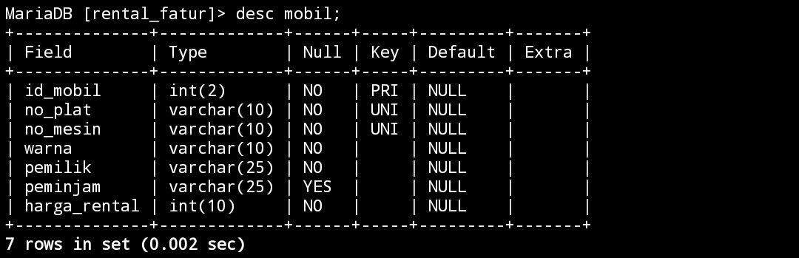

# Struktur awal Tabel



# Menambahkan kolom 
## Struktur query 
```sql
ALTER TABLE nama_tabel ADD batas_peminjaman varchar(10) AFTER nama_kolom;
```
## Contoh Query 
```sql
ALTER TABLE mobil ADD batas_peminjaman varchar(10) AFTER peminjam;
```

## Hasil 


## Analisis 


## Kesimpulan 


## Tambahan

### Query 
```sql
Update mobil SET batas_peminjaman="2024-04-24" WHERE peminjam is NOT NULL;
```

### Hasil


# Mengubah nama kolom
## Struktur query 
```sql

```
## Contoh Query 
```sql
ALTER TABLE mobil RENAME COLUMN batas_peminjaman TO deadline;
```

## Hasil 


## Analisis 
## Kesimpulan 

# Mengubah Tipe data kolom
## Struktur query 
```sql

```
## Contoh Query 
```sql
ALTER TABLE mobil MODIFY deadline DATE;
```

## Hasil 


## Analisis 


## Kesimpulan

# Menambahkan constraint
## Contoh Query 

```sql
ALTER TABLE mobil
ALTER deadline SET DEFAULT ’Ready’;
```

## Hasil


## Analisis 
## Kesimpulan 

## Tambahan
### contoh Query 
```sql
insert into mobil (id_mobil,no_plat,no_mesin,warna,pemilik,peminjam,harga_rental)
values (7,"B 6778 G","GOP6534","Hitam","Valen",Null,100000);
```

### Hasil


## referensi 
https://revou.co/panduan-teknis/sql-constraint

# Menghapus constraint
## Contoh Query 
```sql
ALTER TABLE mobil
ALTER deadline DROP DEFAULT;
```

## Hasil 


## analisis 


## kesimpulan 


## Referensi 
https://www.geeksforgeeks.org/sql-drop-constraint/

# Menghapus kolom
## Contoh Query 
```sql
ALTER TABLE mobil DROP COLUMN deadline;
```

## Hasil 


## analisis 


## kesimpulan 

#  Mengubah nama tabel
## Contoh Query 
```sql
ALTER TABLE mobil RENAME TO data_mobil;
```

## Hasil 


## analisis 
## kesimpulan 
# Referensi pembahasan ALTER
https://www.techonthenet.com/mysql/tables/alter_table.php