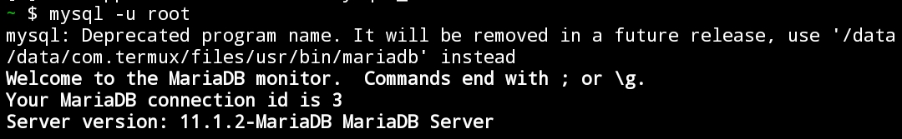
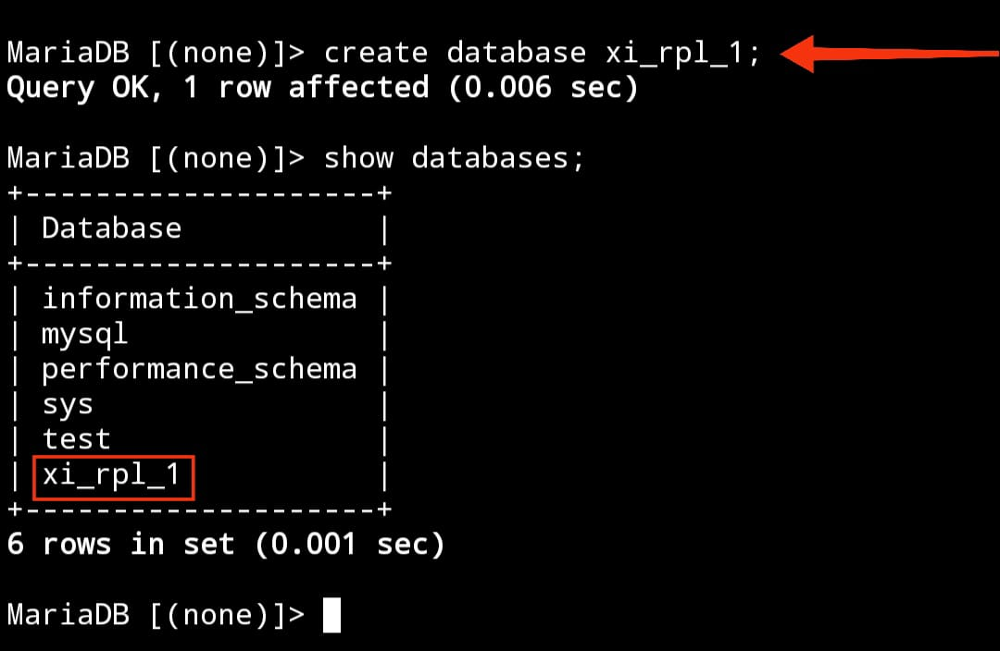
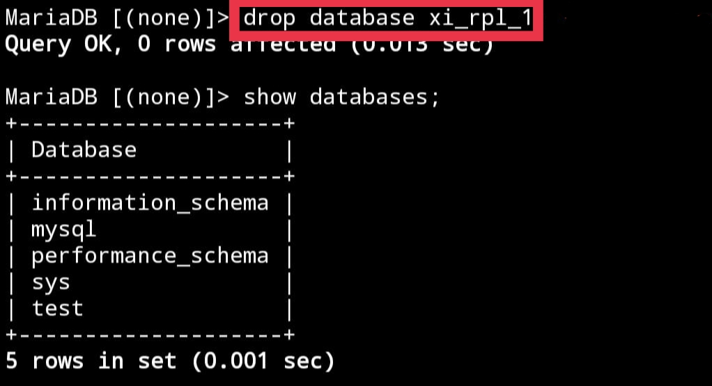
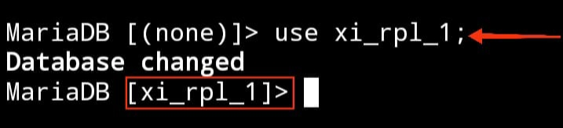
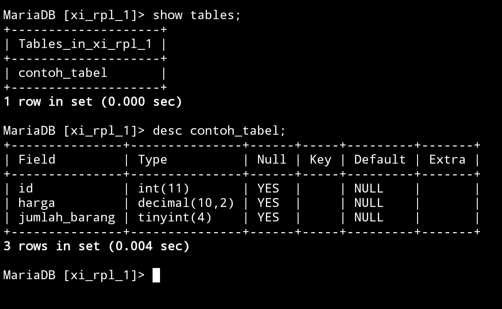
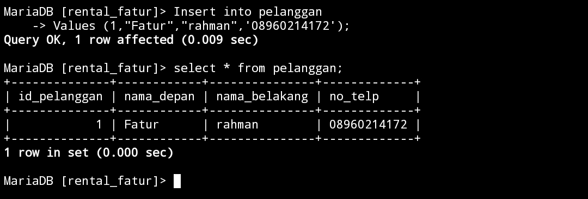
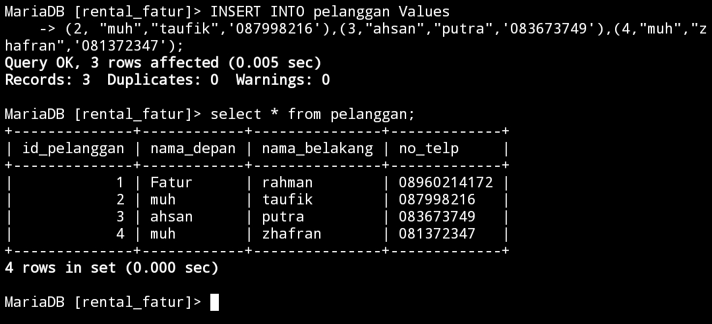
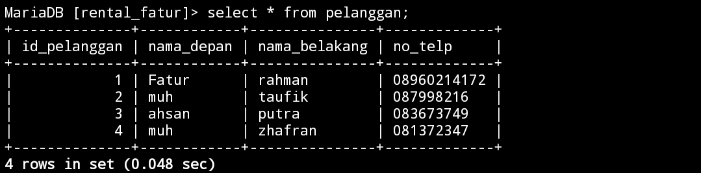
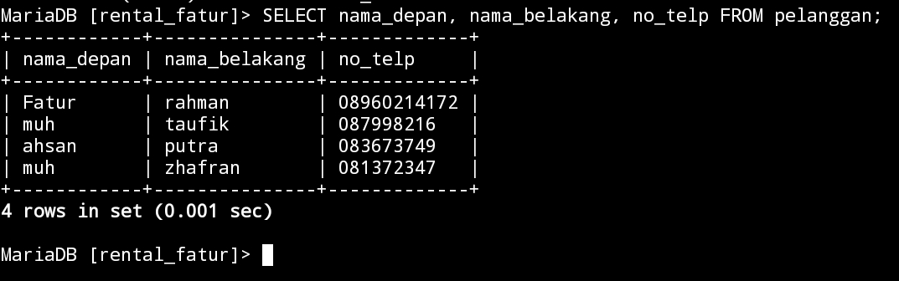
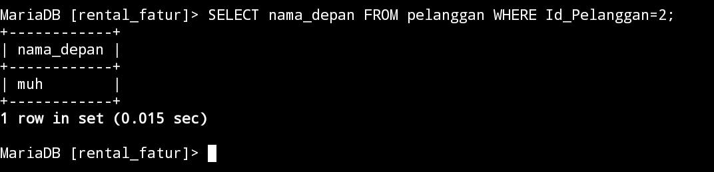

                                            Selasa-23-jan-2024


# Intalasi MySQL

# Penggunaan Awal MySQL
## Menggunakan Termux

1. Berikan akses termux ke memori internal .
==termux-setup-storage==
2. Muncul pop up untuk meminta izin akses ke memori internal.
==klik izinkan/allow acces==
3. Lakukan update dan sekaligus upgrade paket.
==pkg upgrade && upgrade -y==
4. Jika ada konfirmasi untuk melanjutkan instalasi.  Silahkan klik y dan enter.
5. Install aplikasi MariaDB.
==pkg install mariadb==
6. Memberikan akses aman ke MySQL.
==mysql_safe==
7. Hentikan proses
==Ctrl + z==
8. Masuk ke dalam admin
==mysql -u root==

## Referensi Video YouTube
https://youtu.be/ez3nx3xH-y4?si=T4saycipqfBcqL1c
___

# Penggunaan Awal MySQL

## **Query** 

**Struktur** 
```
mySQL -u root
```

**Contoh**:


## Analisis & Kesimpulan MySQL -u root

### ==MySQL==
Ini adalah perintah untuk mengakses **shell MySQL**, yaitu antarmuka command-line untuk berinteraksi dengan server **MySQL**.

### ==-U Root==
Paramater ini menentukan pengguna (user) yang akan digunakan untuk masuk ke server MySQL.Dalam hal ini **root** adalah nama pengguna yang di berikan,dan **root** adalah tingkat tertinggi dengan hak akses penuh.

### Kesimpulan
==**MySQL -u root**==memberikan akses penuh ke server MySQL dengan menggunakan **root**,yang memiliki hak akses
maksimum.penggunaan perintah ini perlu hati-hati untuk menghindari risiko keamanan.

# DataBase
## Membuat Database 
Untuk membuat database di MySQL,anda dapat menggunakan perintah **==CREATE DATABASE==** dengan nama database yang akan di buat contohnya: ==**xi_rpl_1;**==.pastikan untuk memiliki hak akses Yang sesuai,dan verifikasi pembuatan database dengan perintah **==SHOW DATABASE==**.

### **Struktur**
```
Create database nama database yang ingin dibuat;
```

### **Contoh**:
```sql
Create database xi_rpl_1;
```

### Hasil


### **Analisis**:
==Create database== digunakan untuk membuat database.Contohnya seperti create database xi_rpl_1.==xi_rpl_1== adalah nama database yang akan kita buat.

### **Kesimpulan**:
Jadi kalo kita ingin membuat sebuah database kita hanya perlu memasukkan kode ==create database== dan nama databasenya (==xi_rpl_1==).
## Menampilkan Database
Untuk menampilkan daftar database di MySQL,anda dapat menggunakan perintah **SQL** **==SHOW DATABASE==**. Perintah ini memberikan gambaran keseluruhan database yang tersedia di server **MySQL**.pastikan pengguna yang digunakan memiliki izin untuk melihat database dan gunakan perintah melalui antarmuka **command-line** atau alat manajemen database seperti **phpMyAdmin**.

### **Struktur**

```
Show databases;
```

### Contoh

```sql
Show databases;
```

### Hasil


### **Analisis**:
**==Show Databases==** Berfungsi untuk menampilkan database yang kita buat.

### **Kesimpulan**:
Jadi kesimpulannya ==Show databases== itu berguna untuk menampilkan database yang di buat.
___
## Menghapus Database 
Untuk menghapus sebuah database di SQL,anda dapat menggunakan perintah **==DROP DATABASE xi_rpl_1;==**(**Nama database yang akan di hapus**).Namun perlu diingat bahwa tindakan ini akan menghapus semua data yang ada didalam database.Pastikan anda memiliki backup data yang dibutuhkan sebelum melanjutkan.

### Struktur:

```
drop database nama_database;
```
### **Contoh**:

```sql
drop database xi_rpl_1
```



### Analisis:
fungsi dari ==drop database== adalah untuk menghapus sebuah database.xi_rpl_1 nama database yang ingin dihapus,contohnya ==drop database xi_rpl_1==.otomatis database dari xi_rpl_1 akan terhapus.Jika ingin memastikan databasenya sudah terhapus kita ketik ==show database;

### Kesimpulan:
Jadi ==drop database== itu berguna untuk menghapus database kita dengan menambahkan nama database yang ingin dihapus.
___
## Menggunakan Database
Perintah **==use==** digunakan untuk beralih atau menggunakan sebuah database tertentu di server.Perintah ini sangat berguna ketika anda bekerja dengan beberapa database di server MySQL dan ingin fokus pada satu database dalam sesi tertentu.Contohnya: **==use xi_rpl_1;==**

### Struktur:
```
use nama_databasenya;
```
### Contoh:
```sql
use xi_rpl_1;
```

### Hasil



### Analisis:
==use== itu berfungsi untuk beralih database seperti ==use xi_rpl_1== (nama database) maka akan beralih ke database xi_rpl_1.

### Kesimpulan:
Jadi,==use== itu digunakan untuk beralih database.
___


# Tipe Data
## **angka**

-  ==INT:== Untuk menyimpan nilai bilangan bulat (integer). Misalnya, INT dapat digunakan untuk menyimpan angka seperti 1, 100, -10, dan sebagainya. 

 - ==DECIMAL:==Digunakan untuk menyimpan nilai desimal presisi tinggi, cocok untuk perhitungan finansial atau keuangan.
 
 - ==FLOAT dan DOUBLE:==Digunakan untuk menyimpan nilai desimal dengan presisi floating-point. DOUBLE memiliki presisi lebih tinggi dibandingkan FLOAT.
 
 - ==TINYIN, SMALLINT,== ==MEDIUMINT==, dan ==BIGINT:==Tipe data ini menyimpan bilangan bulat dengan ukuran yang berbeda-beda.
   
### Struktur:

```

CREATE TABLE contoh_tabel (
    id INT,
    harga DECIMAL(10, 2),
    jumlah_barang TINYINT
);
```

### Contoh:




### Analisis:
Tipe data ==DECIMAL(10, 2)== menentukan angka desimal dengan presisi 10 digit dan skala 2 digit, yang berarti dapat menyimpan nilai hingga total 10 digit, dengan 2 digit di antaranya setelah koma desimal .==Tinyint== adalah tipe data yang dapat menampung nilai -128 sampai 127.

### Kesimpulan

Jadi, kesimpulannya Tipe data ==DECIMAL== itu akan menentukan bilangan desimal dan ==TINYINT== itu untuk menampung sebuah nilai yang berukuran kecil.

## teks

- ==CHAR(N)==Menyimpan string karakter tetap dengan panjang N. Contoh: ==CHAR(10)==akan menyimpan string dengan panjang tepat 10 karakter.

- ==VARCHAR(N):== Menyimpan string karakter dengan panjang variabel maksimal N. Misalnya, ==VARCHAR(255)==dapat menyimpan string hingga 255 karakter, tetapi sebenarnya hanya menyimpan panjang yang diperlukan plus beberapa overhead.

- ==TEXT:==Digunakan untuk menyimpan teks dengan panjang variabel, tanpa batasan panjang tertentu. Cocok untuk data teks yang panjangnya tidak terduga.

- ==ENUM:==Memungkinkan Anda mendefinisikan set nilai yang mungkin dan membatasi kolom hanya dapat mengambil salah satu dari nilai tersebut.

- ==SET:==Mirip dengan ENUM, namun dapat menyimpan satu atau lebih nilai dari himpunan yang telah ditentukan.

### Struktur:

```
CREATE TABLE nama_tabel (
    nama CHAR(50),
    alamat VARCHAR(100),
    catatan TEXT,
    status ENUM('Aktif', 'Non-Aktif')
);
```

### Contoh:


### Analisis
- Kolom ==nama== diubah menjadi VARCHAR(50) agar nama dapat maksimal 50 karakter
   Kolom ==alamat== juga diubah menjadi.
- VARCHAR(100) untuk memperbolehkan maksimal 100 karakter untuk alamat.
- Batasan "NOT NULL" ditambahkan ke kolom "nama" dan "alamat" untuk memastikan bahwa kolom tersebut harus memiliki nilai dan tidak boleh kosong.
- Kolom ==catatan== tetap sebagai TEKS, memungkinkan penyimpanan teks dalam jumlah lebih besar.
- ==Status== adalah tipe ENUM dengan dua kemungkinan nilai: 'Aktif' dan 'Non-Aktif'.
- Batasan "NOT NULL" juga ditambahkan ke kolom "status" untuk memastikan bahwa kolom tersebut harus memiliki nilai.

### Kesimpulan

Dalam contoh tersebut, **nama** menggunakan tipe data **char** dengan panjang tetap, `alamat` menggunakan tipe data `VARCHAR` dengan panjang variabel, `catatan` menggunakan tipe data `TEXT` untuk menyimpan teks yang mungkin panjangnya bervariasi, dan `status` menggunakan tipe data `ENUM` untuk membatasi nilai yang mungkin.
## tanggal

- ==DATE== :  Menyimpan nilai tanggal dengan format **YYYY-MM-DD**.
- ==TIME==: Menyimpan nilai waktu dengan format **HH:MM:SS**.

- ==DATETIME: ==Menggabungkan nilai tanggal dan waktu dengan format **YYYY-MM-DD HH:MM:SS**.

- ==TIMESTAMP: ==Sama seperti DATETIME, tetapi dengan kelebihan diatur secara otomatis saat data dimasukkan atau diubah.


### Struktur 

```
CREATE TABLE ContohTabel (
    tanggal DATE,
    waktu TIME,
    datetimekolom DATETIME,
    timestampkolom TIMESTAMP
);
```


### hasil


Dalam contoh ini, kolom **==tanggal==** akan menyimpan nilai tanggal, **==waktu==** menyimpan nilai waktu, ==**datetimekolom**== menyimpan kombinasi tanggal dan waktu, dan **==timestampkolom==** akan secara otomatis diatur saat data dimasukkan atau diubah.
## boolean

- ==BOOL / BOOLEAN / TINYINT(1):== Digunakan untuk menyimpan nilai boolean, yang dapat mewakili kebenaran atau kesalahan. Representasi nilai benar adalah 1, sedangkan nilai salah direpresentasikan sebagai 0. Meskipun nilai selain 0 dianggap benar, secara umum, ketiganya seringkali digunakan secara bergantian. Seringkali, ketika Anda mendeklarasikan kolom sebagai BOOL atau BOOLEAN, MySQL mengonversinya secara otomatis menjadi TINYINT(1), yang juga dapat digunakan untuk menyimpan nilai boolean dengan 0 untuk false dan 1 untuk true.

1. Menggunakan `BOOLEAN`
```sql
CREATE TABLE contohTabel (
    title VARCHAR(255),
    completed BOOLEAN
);
```

Dalam contoh diatas, kita mendefinisikan kolom `completed` sebagai tipe data `BOOLEAN`. Ini merupakan cara yang sah dan umum digunakan di MySQL. Nilai yang dapat disimpan dalam kolom ini adalah `TRUE` atau `FALSE`, atau dalam representasi angka, 1 atau 0.

2. Menggunakan `BOOL`
```sql
CREATE TABLE contohTabel (
    title VARCHAR(255),
    completed BOOL
);
```
Dalam contoh ini, kita menggunakan `BOOL` sebagai tipe data untuk kolom `completed`. Perlu dicatat bahwa MySQL secara otomatis mengonversi `BOOL` menjadi `TINYINT(1)`. Oleh karena itu, pada dasarnya, ini setara dengan contoh pertama. Namun, beberapa pengembang lebih suka menggunakan `BOOLEAN` untuk kejelasan.

3. Menggunakan `TINYINT(1)`
```sql
CREATE TABLE contohTabel (
    title VARCHAR(255),
    completed TINYINT(1)
);
```
Dalam contoh ini, kita menggunakan `TINYINT(1)` sebagai tipe data untuk kolom `completed`. Ini adalah pendekatan yang valid karena MySQL mengonversi `BOOL` menjadi `TINYINT(1)` secara otomatis. Dalam hal ini, nilai yang dapat disimpan adalah 1 untuk `TRUE` dan 0 untuk `FALSE`.
## Tipe Data Pilihan
### **ENUM** 
fungsinya untuk menggambarkan sebuah nilai terbatas atau terdefinisi.
### **SET** 
fungsinya untuk menyimpan urutan nilai yang tidak berurut.
# Tabel
## Buat Tabel

### Struktur 

```
CREATE TABLE [nama_tabel] ( 
Nama_kolom1 tipe_data(ukuran) (tipe_constrait) ,
Nama_kolom2 tipe_data(ukuran) (tipe_constrait) ,
Nama_kolom3 tipe_data(ukuran) (tipe_constrait) ,
);
```
### Contoh

```sql
CREATE TABLE pelanggan ( 
id_pelanggan int(4)PRIMARY KEY NOT NULL , nama_depan varchar(25) NOT NULL , nama_belakang varchar(25) NOT NULL , no_telp char(12)UNIQUE  
);
```

### Hasil


### Analisis

==Id pelanggan== adalah kolom bilangan bulat dengan panjang 4 digit.ditetapkan sebagai kunci utama tabel dan tidak boleh ==NULL==.

==nama depan== kolom stringnya panjang 25 karakter maksimumnya.

==nama belakang== kolom stringnya panjang 25 karakter maksimumnya.

==no telp== kolom karakter yang panjangnya 12 karakter dan memilki batas UNIQUE yang artinya setiap nilai di kolom harus unik.

### Kesimpulan 

___
## Struktur Tabel

### Struktur
```Sql
Desc [nama_tabel];
```

### Contoh
```sql
desc pelanggan;
```

### Hasil


### Analisis 
==Desc pelanggan== berguna untuk menampilkan struktur dari database yang sudah di buat dan ==pelanggan== itu adalah nama tabel yang ingin di tampilkan.
### Kesimpulan
Jadi,==desc== itu untuk menampilkan struktur database.


## Menampilkan Daftar Tabel

### Struktur 
```
Show tables;
```

### Hasil


### Analisis
==Show tables== berfungsi untuk membuka daftar tabel yang sudah kita buat.maka semua isi dari tabel akan tampil.

### Kesimpulan 
==Show tables== itu untuk membuat isi dari tabel


## QNA


>[! faq]- Perbedaan PRIMERY KEYY dan UNIQUE!
>>- `Premery` Key bertugas membedakan nilai yang ada pada tabel seperti NIS.
>>- `UNIQUE` bertugas untuk memastikan bahwa tidak ada nilai duplikat dalam kolom tersebut.contohnya seperti,no wa,dan alamat email.


>[! faq]- Mengapa Hanya Kolom Id Pelanggan yang menggunakan Constraint "PRIMARY KEY"?
> >Karena dapat memastikan integritas data dengan mencegah duplikasi dan memastikan memiliki entitas yang jelas.


>[! faq]- Mengapa pada kolom no_telp yang menggunakan tipe data CHAR bukan VARCHAR? 
> >Karena tipe data `CHAR` dapat menyimpan setiap nilai yang panjang dengan tetap.


>[! faq]- Mengapa Hanya kolom no_telp yang menggunakan constraint "UNIQUE"?
> >Karena dengan menggunakan constraint "`UNIQUE`" kita dapat memastikan bahwa setiap no telp yang dimasukkan ketabel hanya muncul sekali.


>[! faq]- Mengapa kolom no_telp tidak memakai constraint " NOT NULL", sementara kolom lainnya Menggunakan constraint tersebut?
>>No telp di anggap opsional,nomor telpon menjadi wajib saat penggunaa saat penggunaa melakukan langkah-langkah tertentu.

___ 


# Insert dan Select 

## Insert
 Query ini berfungsi untuk memasukkan nilai pada dalam tabel yang sudah di buat.

### Insert 1 Baris

**Struktur** 
```
Insert into [nama_table]
Values (data_1,data_2,data_3,data_4);
```

**Contoh**
```sql
Insert into pelanggan 
Values (1,"Fatur","rahman",'08960214172');
```

**Hasil**



**Analisis**

`insert into pelanggan` adalah tabel yang kita ingin isi dengan beberapa data contohnya data 1 itu untuk nomor urut (`1`),data 2 untuk nama depan (`Fatur`), data 3 untuk nama belakang(`Rahman`),dan data ke empat untuk no telp(`08960214172`).

**Kesimpulan** 

Kesimpulannya adalah kalo kita ingin menambahkan isi dari tabel cukup masukkan kode `insert into` serta nama tabelnya (`pelanggan`).


___


### Insert lebih 1 Baris

#### Struktur 
```
INSERT INTO(NAMA_TABLE)
Values (data_1,data_2,data_3,data_4),
(data_1,data_2,data_3,data_4),
(data_1,data_2,data_3,data_4);
```

#### Contoh
```sql
INSERT INTO pelanggan Values 
(2, "muh","taufik",'087998216'),(3,"ahsan","putra",'083673749'),(4,"muh","zhafran",'081372347');
```

#### Hasil



#### Analisis

Caranya Sama seperti insert 1 baris tetapi ini memasukkan lebih dari 1 baris data di dalam tabel.

#### Kesimpulan

Kesimpulannya kalo kita ingin menambahkan isi tabel lebih dari 1 Baris itu cukup masukkan data-datanya secara berurutan menggunakan `insert into` nama tabel (`pelanggan`).

## Select
query ini berfungsi  menampilkan hasil dari table yang telah kita input (Insert) data kedalam tabel tersebut.
### Select all table
**Select all table** berfungsi untuk menampilkan hasil  table yang telah dibuat.
#### Struktur

```mysql
SELECT * FROM [NAMA_TABLE];
```

#### Contoh
```sql
SELECT * FROM pelanggan;
```

#### Hasil



#### Analisis

`Select * from` adalah untuk membuka isi dari tabel yang sudah kita buat dengan menambahkan nama tabelnya (mobil)

#### Kesimpulan 
Kesimpulannya `select * from` berguna untuk menampilkan tabel yang sudah dibuat.

___

### Select field spesifik
Select field spesifik itu menampilkan beberapa kolom yang spesifik kita dapat menggunakan format yang sedikit berbeda dengan format all table, yaitu seperti dibawah ini 

#### Struktur 
```mysql
SELECT NAMA_KOLOM_1, NAMA_KOLOM_2, NAMA_KOLOM_N FROM PELANGGAN;
```

#### Contoh
```sql
SELECT nama_depan, nama_belakang, no_telp FROM pelanggan;
```

#### Hasil



#### Analisis
`Select` adalah kata kunci yang digunakan untuk mengambil kolom-kolom tertentu dari tabel.
`nama_depan, nama_belakang, no_telp` adalah kolom-kolom yang dipilih untuk ditampilkan dalam hasil query.`FROM pelanggan` menunjukkan bahwa data diambil dari tabel bernama 'pelanggan'. 'pelanggan' adalah nama tabel.

#### Kesimpulan 

kesimpulannya adalah query ini akan menghasilkan hasil yang terdiri dari kolom-kolom `nama_depan`, `nama_belakang`, dan `no_telp` dari tabel `pelanggan`.

___

### Select kondisi "where"

#### Struktur

```sql
SELECT Nama_Kolom FROM Nama_Table WHERE Id_Pelanggan=2; 
```

#### Contoh

```mysql
SELECT nama_depan FROM pelanggan WHERE Id_Pelanggan=2; 
```


#### Hasil 



#### Analisis

`select` adalah kata kunci yang digunakan untuk memilih kolom-kolom tertentu yang akan ditampilkan dalam hasil query.
`nama_depan` Ini adalah kolom yang dipilih untuk ditampilkan dalam hasil query.`from pelanggan` adalah nama tabelnya,dan `where id_pelanggan=2` nomor kolomnya contohnya kolom nomor 2 berarti yang dipanggil nama depan dari kolom nomor 2.

#### Kesimpulan

Jadi kesimpulannya adalah bahwa query ini akan mengambil nama depan dari pelanggan yang memiliki `Id_Pelanggan` sama dengan 2 dari tabel `pelanggan`.

# Update 

## Struktur
```sql
Mysql > UPDATE nama_tabel SET nama_kolom WHERE kondisi;
```

## Contoh
```sql
Update pelanggan SET nama_belakang="Rahman" WHERE id_pelanggan="1";
```
insert into data_mobil values(8,"DD 9980 JH","KHI2304","Orange","rahmat","Ahsan","150000");
## Hasil


## Analisis
**Update** bertugas untuk mengupdate sebuah tabel contohnya `update` (`pelanggan`) nama tabelnya,SET itu berfungsi untuk menyimpan satu atau lebih nilai dari himpunan yang telah ditentukan (`nama_belakang`) bagian kolom tabel yang ingin diubah dan (`rahman`) hasilnya ketika kita sudah mengubahnya.


## Kesimpulan
Jadi,kalo kita ingin mengubah/update tabel kita kita hanya perlu memasukkan kode `update` serta nama tabel,nama kolom tabel yang ingin kita ubah.

# Delete

## Struktur
```sql
mysql > DELETE FROM nama_tabel WHERE kondisi;
```

## Contoh
```sql
DELETE FROM pelanggan  WHERE id_pelanggan="3";
```

## Hasil


## Analisis 
`Delete` itu berfungsi untuk menghapus kolom dari tabel, (`pelanggan`)nama tabelnya,dan `WHERE id_pelanggan="3";` adalah nama kolom dari tabel, Contohnya (`id_pelanggan="3"`) adalah bagian kolom tabel yang ingin kita hapus,(`3`) berarti kolom no 3 yang kita ingin hapus.

## Kesimpulan
Untuk menghapus sebuah kolom tabel kita masukkan kode `delete` dan nama kolom tabel serta kolom ke berapa yang ingin kita hapus.

# Delete tabel
## Struktur 
```
drop table nama_table;
```

## Contoh
```sql
drop table pesanan;
```

## Hasil


## Analisis 
`Drop tabel` berfungsi untuk menghapus sebuah tabel dan (`pesanan`) nama tabelnya yang ingin kita hapus.dan untuk mengecek apakah tabelnya sudah terhapus masukkan kode `show tables`

## Kesimpulan 
Jadi,kalo kita ingin hapus tabel kita masukkan kode `drop table` serta nama tabel yang ingin di hapus.


