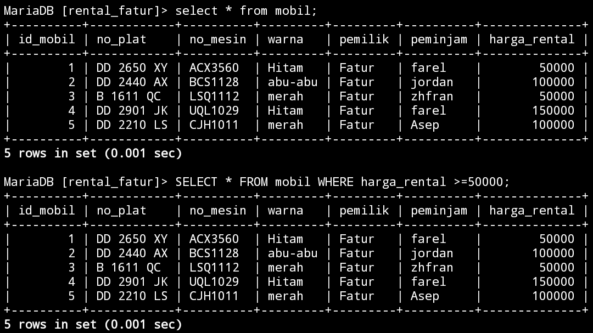
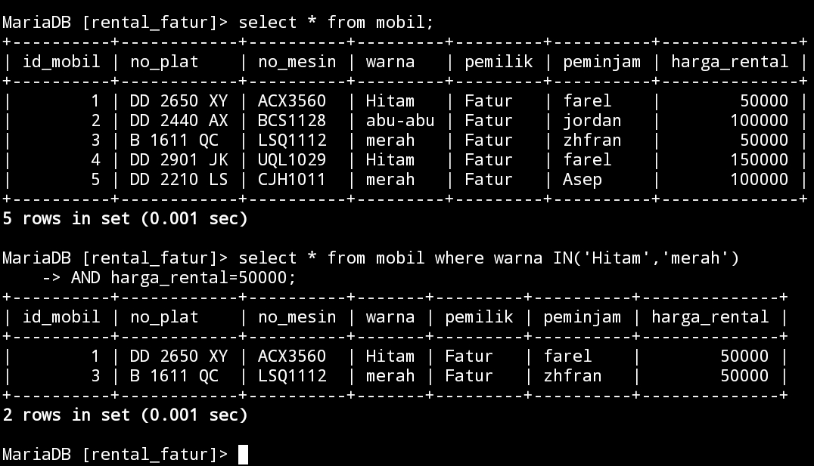

# Select Lanjutan 
## AND
### Struktur query
```
select nama_kolom,nama_kolom FROM nama_tabel WHERE nama_warna AND nama_pemilik;
```
### Contoh query
```sql
select warna,pemilik FROM mobil WHERE warna="Hitam" AND pemilik="Fatur";
```
### Hasil


### Analisis
`Select warna` bertugas untuk menampilkan warna dari mobil yang ingin di tampilkan,`from mobil` adalah nama tabel (mobil),`where warna="hitam"` berarti warna mobil yang akan di tampilkan itu warnanya hitam dan `AND` itu menampilkan seluruh mobil yang warnanya hitam dengan nama pemiliknya, walaupun beda pemilik tapi kalau warnanya sama tetap akan tampil.
### Kesimpulan
Jadi kalo kita ingin menampilkan daftar mobil dengan warna hitam beserta nama pemiliknya, cukup menggunakan kode `AND` walaupun pemiliknya itu berbeda yang penting warnanya sama.

---
## OR
### Struktur query
```sql
select data 1,data 2 from [nama_tabel] where data 1="nilai 1" OR data 2="nilai 2";
```
### Contoh query
```sql
select warna,pemilik FROM mobil WHERE warna="Hitam" OR pemilik="Fatur";
```
### Hasil


### Analisis
`WHERE warna="Hitam" OR pemilik="Fatur"` akan menampilkan nama pemilik Fatur beserta semua warna mobil yang ia punya.
jadi,`OR` adalah kebalikan dari `AND` jadi kalo `AND` hanya akan menampilkan warna hitam dengan pemilik Fatur maka `OR` akan menampilkan sebaliknya dengan menampilkan seluruh warna mobil yang fatur punya.

### Kesimpulan
Kesimpulannya `OR` itu akan menampilkan sebaliknya dari yang diminta seperti kita meminta warna hitam maka yang tampil seluruh warna mobil yang penting pemiliknya sama.

---
## BETWEEN
### Struktur query
```
select * from [nama_tabel] where data 1 BETWEEN nilai 1 AND nilai 2;
```
### Contoh query
```sql
SELECT * FROM mobil WHERE harga_rental BETWEEN 100000 AND 150000;
```
### Hasil


### Analisis
Tujuan dari query `BETWEEN` ini adalah untuk mengambil semua kolom (`*`) dari tabel `mobil`di mana nilai kolom `harga_rental` berada di antara `100000` dan `150000`.
### Kesimpulan
Kesimpulannya,Dengan menggunakan `BETWEEN`, kita dapat memilih baris yang memiliki nilai di antara dua nilai tertentu.contonhya, kalo kita  ingin mengambil baris dengan `harga_rental` antara `100000` dan `150000` maka yang tampil hanya harga mobil dengan harga `100000` dan `150000`.

---
## NOT BETWEEN
### Struktur query
```
select * from [nama_tabel] where data 1 NOT BETWEEN nilai 1 AND nilai 2;
```
### Contoh query
```sql
SELECT * FROM mobil WHERE harga_rental NOT  BETWEEN 100000 AND 150000;
```
### Hasil


### Analisis

`Select * from mobil` adalah nama tabelnya.
`harga_rental` adalah Kolom yang diseleksi dengan menggunakan `SELECT *`.bagian `WHERE`,terdapat kondisi `harga_rental NOT BETWEEN 100000 AND 150000`.query ini akan mengambil baris-baris yang tidak memenuhi kondisi tersebut.
`NOT BETWEEN 100000 AND 150000` Kondisi ini mengecek apakah nilai `harga_rental` tidak berada di antara `100.000` dan `150.000`. 
Jadi, hasil dari query ini akan memberikan semua baris dari tabel "mobil" di mana nilai "harga_rental" tidak berada di antara `100.000` dan `150.000`.
### Kesimpulan
Kesimpulannya `NOT BETWEEN` berfungsi untuk menampilkan nilai yang ada di bawah dari nilai yang di tampilkan.contonya kita memanggil harga yang `100000` maka yang akan tampil harga yang ada di bawah `100000` jadi yang tampil `50000`.

---
## <=
### Struktur query
```
select * from [nama_tabel] where data 1 <= nilai 1;
```
### Contoh query
```sql
SELECT * FROM mobil WHERE harga_rental <=50000;
```
### Hasil


### Analisis
 `Select * from mobil` adalah nama Tabelnya dan `WHERE harga_rental` nama kolomnya,`<= 50000` Adalah kurang atau sama dengan artinya akan menampilkan daftar harga mobil yang ada di bawah `50000` atau sama dengan `50000`,disini tidak ada yang harga mobil di bawah `50000` maka yang tampil hanya harga mobil yang berharga `50000`.
### Kesimpulan
Jadi, kesimpulannya adalah bahwa query `<=` ini akan mengambil mobil dengan harga tepat `50000` jika tidak ada mobil dengan harga di bawah `50000` yang ada dalam tabel.

---
## >=
### Struktur query
```
select * from [nama_tabel] where data 1 >= nilai 1;
```
### Contoh query
```sql
SELECT * FROM mobil WHERE harga_rental >=50000;
```
### Hasil


### Analisis
`>= ` adalah lebih atau sama Dengan artinya akan menampilkan harga yang lebih dari 50000 atau sama dengan 50000 maka yang akan tampil itu seluruh harga dari mobil tersebut karena harganya lebih dari 50000 dan sama dengan 50000.
### Kesimpulan
Kesimpulannya >= akan menampilkan nilai yang ada diatas 50000 atau sama dengan 50000.

---
## <>
### Struktur query
```
select * from [nama_tabel] where data 1 <> nilai 1;
```
### Contoh query
```sql
SELECT * FROM mobil WHERE harga_rental <> 50000;
```
### Hasil


### Analisis
Dengan menggunakan  `<>` (tidak sama dengan), query ini akan mengembalikan semua baris dari tabel "mobil" di mana nilai kolom "harga_rental" tidak sama dengan 50000,maka yang tampil hanya harga 10000 dan 15000.

### Kesimpulan
Jadi, query `<>` ini akan mengambil semua mobil yang memiliki harga_rental yang berbeda dengan 50000. 

---
## !=
### Struktur query
```
select * from [nama_tabel] where data 1 != nilai 1;
```
### Contoh query
```sql
SELECT * FROM mobil WHERE harga_rental !=  50000;
```
### Hasil


### Analisis
Dengan menggunakan `!=` (tidak sama dengan), query ini akan menampilkan semua baris dari tabel "mobil" di mana nilai kolom "harga_rental" tidak sama dengan 50000.
### Kesimpulan
Jadi `!=` Itu sama dengan `<>` memiliki fungsi yang sama dimana akan menampilkan sebuah harga mobil yang tidak sama dengan harga 50000.

---
## TANTANGAN LOGIN
### Struktur query
```
select pemilik from mobil where pemilik="_";
```
### Contoh query
```sql
select pemilik from mobil where pemilik="Fatur";
```
### Hasil
 

### Analisis

Tujuan dari query ini adalah untuk mengambil kolom "pemilik" dari tabel "mobil" di mana nilai kolom "pemilik" adalah "Fatur".


### Kesimpulan
Jadi, kesimpulannya query ini akan mengambil semua nilai "pemilik" dari mobil yang dimiliki oleh "Fatur".

---

## IN
### IN

#### Struktur Query

```
select * from nama_tabel where data IN('nilai 1','nilai 2');
```

#### Contoh Query

```sql
SELECT * FROM mobil WHERE warna IN('hitam','merah');
```

#### Hasil


#### Analisis
Dengan menggunakan `WHERE` dan operator `IN`, query ini hanya akan menampilkan semua mobil yang warnanya "merah" dan "hitam" yang tadinya ada warna "abu-abu" menjadi hanya merah dan hitam saja.

#### Kesimpulan 
Jadi, query ini akan menampilkan semua mobil yang memiliki warna 'hitam' atau 'merah'.

### IN+AND

#### Struktur Query

```
select * from nama_tabel where data IN('nilai 1','nilai 2')AND data 2=nilai 1;
```

#### Contoh Query 

```sql
select * from mobil where warna IN('Hitam','merah')
AND harga_rental=50000;
```

#### Hasil


#### Analisis
`IN('Hitam','merah')` berfungsi untuk menampilkan mobil dengan warna merah dan hitam serta dengan harga_rental sama dengan 50000 dengan query `AND harga_rental=50000;`

#### Kesimpulan 
Jadi, query ini akan mengambil semua mobil yang memiliki warna 'Hitam' atau 'merah', dan memiliki harga_rental yang tepat 50000.

### IN+OR

#### Struktur Query 
```
select * from nama_tabel where data IN('nilai 1','nilai 2')OR data 2=nilai 1;
```

#### Contoh Query 
```sql
select * from mobil where warna 
IN('abu-abu','merah','abu-abu')
OR harga_rental=50000;
```

#### Hasil


#### Analisis


#### Kesimpulan 


### IN+AND+Operator 

#### Struktur Query 

```
select * from nama_tabel where nama_kolom 
IN('abu-abu','merah')
AND nama_kolom>harga;
```

#### Contoh Query 

```sql
select * from mobil where warna 
IN('abu-abu','merah')
AND harga_rental>50000;
```

#### Hasil


#### Analisis
`IN+AND+Operator` berfungsi untuk menampilkan mobil dengan warna abu-abu dan merah (`IN('abu-abu','merah')`) dengan harga yang lebih besar dari 50000 (`AND harga_rental>50000`).walaupun harganya lebih besar dari 50000 tetapi warna mobilnya beda yang dipanggil maka tidak akan tampil.

#### Kesimpulan 
Dengan menggabungkan kedua kondisi tersebut, query akan mengambil semua kolom dari tabel "mobil" di mana warna mobil adalah ''abu-abu'' atau 'merah', dan harga sewa mobil lebih besar dari 50000.
#### Struktur Query 

```

```

#### Contoh Query 
```sql
select * from mobil where warna 
IN('abu-abu','merah')
AND harga_rental<50000;
```

#### Hasil


#### Analisis 
`IN+AND+Operator` berfungsi untuk menampilkan mobil dengan warna abu-abu dan merah (`IN('abu-abu','merah')`) dengan harga yang kurang dari 50000 (`AND harga_rental<50000`).mengapa hasilnya tidak ada yang tampil? Karena di Tabelnya tidak ada yang harga mobilnya kurang dari 50000.
#### Kesimpulan 
Kesimpulannya sama dengan yang diatas tetapi ini akan menampilkan daftar harga yang kurang dari 50000 dari mobil yang berwarna abu-abu dan merah.


## LIKE
### Mencari awalan

#### Struktur Query

```
SELECT * FROM nama_tabel
WHERE nama_kolom LIKE '_%';
```

#### Contoh Query 
```sql
SELECT * FROM mobil
WHERE peminjam LIKE 'f%';
```

#### Hasil


#### Analisis
`Select from mobil` adalah nama tabel yang kita akan cari peminjam(`WHERE peminjam`) dengan awalan huruf f(`LIKE 'f%'`) maka hasilnya adalah peminjam dengan nama farel.
#### Kesimpulan
Misalnya, jika Anda memiliki kondisi `where` `nama LIKE 'f%'`, maka akan mencocokkan semua nilai di mana kolom `nama` dimulai dengan huruf 'f'.


### Mencari akhiran 

#### Struktur Query

```
SELECT * FROM nama_tabel
WHERE nama_kolom LIKE '%_';
```

#### Contoh Query
```sql
SELECT * FROM mobil
WHERE peminjam LIKE '%l';
```

#### Hasil


#### Analisis 
`Select from mobil` adalah nama tabel yang kita akan cari peminjam(`WHERE peminjam`) dengan akhiran huruf l(`LIKE '%l'`) maka hasilnya adalah peminjam dengan nama farel karena akhir namanya adalah l.


#### Kesimpulan 
Kesimpulannya kalo kita ingin mencari akhiran huruf dari peminjam mobil kita masukkan kode `LIKE '%l'`.l sebagai huruf akhiran yang akan kita cari.

### Mencari awalan & akhiran

#### Struktur Query 

```
SELECT * FROM nama_tabel
WHERE nama_kolom LIKE 'awalan%akhiran';
```

#### Contoh Query

```sql
SELECT * FROM mobil
WHERE peminjam LIKE 'f%l';
```

#### Hasil


#### Analisis 
`Mobil` adalah nama tabelnya dan `peminjam` adalah nama kolom yang akan kita cari menggunakan huruf awalan dan akhiran namanya dengan menggunakan `LIKE 'f%l'` jadi yang kita cari itu adalah awalan (f) dan akhiran (l) maka hasilnya adalah farel karena awalan dan akhirannya sesuai dengan query nya.

#### Kesimpulan 
Kesimpulannya kalo kita ingin Mencari awalan dan akhirannya kita tinggal masukkan huruf awalan dan akhirnya seperti `LIKE 'f%l'`.
### berdasarkan total karakter
#### struktur query
```
SELECT * FROM mobil
WHERE peminjam LIKE 'n';
```

#### Contoh
```sql
SELECT * FROM mobil
WHERE peminjam LIKE 'f____';
```

#### Hasil


#### Analisis
Pernyataan `SELECT * FROM mobil` akan mengambil semua kolom (semua atribut) dari tabel 'mobil'. 

`WHERE` peminjam `LIKE 'f____'` adalah klausa WHERE yang memberikan kondisi yang harus dipenuhi oleh entri yang akan dipilih. Dalam hal ini, kita sedang mencari di mana nilai kolom 'peminjam' dimulai dengan huruf 'f' dan diikuti oleh empat karakter apa pun. 

#### kesimpulan 
Kesimpulannya,kalo kita ingin Mencari nama peminjam dengan menggunakan total karakter,gunakan LIKE "F" awalan dari namanya dan `__` adalah jumlah total karakter dari mamanya.

___

#### struktur query
```

```

#### Contoh
```sql
SELECT * FROM mobil
WHERE peminjam LIKE '_____';
```

#### Hasil


#### analisis


#### kesimpulan 
### Kombinasi
#### struktur query
```
SELECT * FROM mobil
WHERE peminjam LIKE '_%';
```

#### Contoh
```sql
SELECT * FROM mobil
WHERE peminjam LIKE '____n%';
```

#### Hasil


#### analisis


#### Kesimpulan

### Not Like
#### Struktur Query 
```

```
#### Contoh Query 
```sql

```
#### Hasil
#### Analisis 
#### Kesimpulan 
## NULL & NOT NULL
### NULL
#### Struktur query 
```sql

```
#### Contoh query
```sql

```
#### Hasil
#### Analisis 
#### Kesimpulan 

### NOT NULL 
#### Struktur query 
```sql

```
#### Contoh query
```sql

```
#### Hasil
#### Analisis 
#### Kesimpulan 
## Order BY & Limit 
### Mengurutkan dari data yang terkecil 
#### Struktur query 
```sql

```
#### Contoh query
```sql
SELECT * FROM mobil ORDER BY harga_rental ASC;
```
#### Hasil


#### Analisis 

`FROM mobil`: Ini menunjukkan bahwa tabel yang digunakan dalam query ini adalah "mobil". Anda mengambil semua data dari tabel ini.

`ORDER BY harga_rental ASC`: Ini adalah klausa ORDER BY yang digunakan untuk mengurutkan hasil query berdasarkan kolom "harga_rental" secara ascending. ASC menandakan pengurutan secara ascending (dari nilai terkecil hingga terbesar).
#### Kesimpulan 
Kesimpulannya,hasil pada tabel ini akan Mengurutkan dari data terkecil hingga terbesar.
### Mengurutkan dari data yang terbesar 
#### Struktur query 
```sql

```
#### Contoh query
```sql
SELECT * FROM mobil ORDER BY harga_rental DESC;
```
#### Hasil


#### Analisis 

`FROM mobil`: Ini menunjukkan bahwa tabel yang digunakan dalam query ini adalah "mobil". Anda mengambil semua data dari tabel ini.

`ORDER BY harga_rental DESC`: Ini adalah klausa ORDER BY yang digunakan untuk mengurutkan hasil query berdasarkan kolom "harga_rental" secara descending. DESC menandakan pengurutan secara descending (dari nilai terbesar hingga terkecil).

#### Kesimpulan
Kesimpulannya,Hasilnya akan menampilkan dari harga terbesar dulu hingga terkecil.
### Limit

## DISTINCT

### Contoh Query 
```sql
SELECT DISTINCT(pemilik) FROM mobil;
```
### Hasil 


### Analisis 
 `SELECT DISTINCT(pemilik)`: Digunakan untuk memilih nilai dari kolom "pemilik" dalam tabel "mobil". "DISTINCT" memastikan bahwa hanya nilai unik yang akan ditampilkan, sehingga tidak ada duplikat pada hasil.

Hasil query ini akan  menghasilkan satu kolom tunggal yang berisi nilai-nilai unik dari kolom "pemilik" dalam tabel "mobil". Setiap nilai yang muncul dalam hasil query akan bersifat unik, tanpa adanya duplikat.
### Kesimpulan 
Kesimpulannya,akan menampilkan semua nama peminjam yang ada pada tabel mobil.

___

### contoh Query 
```sql
SELECT DISTINCT(harga_rental) FROM mobil ORDER BY harga_rental DESC;
```
### Hasil


### analisis 
 `SELECT DISTINCT(harga_rental)`: Digunakan untuk memilih nilai unik dari kolom "harga_rental" dalam tabel "mobil". Kata kunci "DISTINCT" memastikan bahwa hanya nilai unik yang akan ditampilkan, sehingga tidak ada duplikat di dalam hasil query.

`FROM mobil`: Menunjukkan bahwa tabel yang digunakan dalam query ini adalah "mobil".

`ORDER BY harga_rental DESC`: Digunakan untuk mengurutkan hasil seleksi berdasarkan nilai kolom "harga_rental". Kata kunci "DESC" menunjukkan bahwa pengurutan dilakukan secara menurun (descending order), yaitu dari nilai tertinggi ke nilai terendah.
### Kesimpulan 
Kesimpulannya Hasil query ini akan menghasilkan satu kolom tunggal yang berisi nilai-nilai unik dari kolom "harga_rental" dalam tabel "mobil", yang diurutkan secara menurun. Setiap nilai yang muncul dalam hasil query akan bersifat unik, tanpa adanya duplikat, dan diurutkan dari nilai tertinggi ke nilai terendah.

## CONCAT,CONCAT_WS,AS
### CONCAT

#### Contoh Query 
```sql
SELECT CONCAT(pemilik,warna) FROM mobil;
```
#### Hasil

#### Analisis 

`SELECT`: Digunakan untuk memilih kolom yang akan ditampilkan dalam hasil query.

`CONCAT(pemilik, warna)`: Fungsi CONCAT digunakan untuk menggabungkan nilai dari kolom "pemilik" dan "warna" menjadi satu nilai.

`FROM mobil`: Menunjukkan bahwa tabel yang digunakan dalam query ini adalah "mobil".

Hasil query tersebut akan menghasilkan satu kolom tunggal yang berisi nilai-nilai hasil penggabungan antara kolom "pemilik" dan "warna" dari setiap baris dalam tabel "mobil".
#### Kesimpulan 
Kesimpulannya Pada query ini, `SELECT CONCAT(pemilik, warna) FROM mobil;`, dilakukan seleksi data dari tabel "mobil" dengan melakukan penggabungan antara kolom "pemilik" dan "warna".
### CONCAT_WS

#### Contoh Query 
```sql
SELECT CONCAT_WS("-",no_plat,no_mesin,id_mobil) FROM mobil;

```
#### Hasil

#### Analisis 
`SELECT`: Digunakan untuk memilih kolom yang akan ditampilkan dalam hasil query.

`CONCAT_WS("-", no_plat, no_mesin, id_mobil)`: Fungsi CONCAT_WS digunakan untuk menggabungkan nilai dari kolom "no_plat", "no_mesin", dan "id_mobil" dengan menggunakan pemisah "-" (dash) di antara setiap nilai. Hasil penggabungan tersebut akan menjadi satu nilai tunggal.

`FROM mobil`: Menunjukkan bahwa tabel yang digunakan dalam query ini adalah "mobil".

Hasil query ini menghasilkan satu kolom yang berisi nilai-nilai hasil penggabungan antara kolom "no_plat", "no_mesin", dan "id_mobil" dari setiap baris dalam tabel "mobil" dengan pemisah "-" di antara setiap nilai.
#### Kesimpulan 
Kesimpulannya Pada query ini, `SELECT CONCAT_WS("-", no_plat, no_mesin, id_mobil) FROM mobil;`, dilakukan seleksi data dari tabel "mobil" dengan menggabungkan  antara kolom "no_plat", "no_mesin", dan "id_mobil" menggunakan pemisah "-" (dash).

### AS

#### Contoh Query 
```sql
SELECT
CONCAT_WS("+",pemilik,peminjam) AS
COLLAB FROM mobil
```
#### Hasil


#### Analisis 
 `SELECT`: Digunakan untuk memilih kolom yang akan ditampilkan dalam hasil query.

`CONCAT_WS("+", pemilik, peminjam) AS COLLAB`: Fungsi CONCAT_WS digunakan untuk menggabungkan nilai dari kolom "pemilik" dan "peminjam" dengan menggunakan pemisah "+" (plus) di antara setiap nilai. Hasil penggabungan tersebut akan menjadi satu nilai . "COLLAB" diberikan pada kolom hasil penggabungan.

`FROM mobil`: Menunjukkan bahwa tabel yang digunakan dalam query ini adalah "mobil".

Hasil query tersebut akan menghasilkan satu kolom tunggal dengan nama "COLLAB" yang berisi nilai-nilai hasil penggabungan antara kolom "pemilik" dan "peminjam" dari setiap baris dalam tabel "mobil" dengan pemisah "+" di antara setiap nilai.
#### Kesimpulan 
Pada query SQL ini, `SELECT CONCAT_WS("+", pemilik, peminjam) AS COLLAB FROM mobil;`untuk menyeleksi data dari tabel "mobil" dengan melakukan penggabungan antara kolom "pemilik" dan "peminjam" menggunakan pemisah "+" (plus) sebagai CONCAT_WS. Hasil penggabungan diberi alias "COLLAB" pada hasil query.
## View
## Tantangan 
### 1. Buatkan tabel virtual dan tampilkan datanya yang mana peminjamannya itu tidak ada (NULL)

#### Contoh Query 
```sql
CREATE VIEW peminjam NULL AS SELECT id_mobil,no plat, peminjam, harga_rental FROM mobil WHERE peminjam IS NULL;
```

#### Hasil


### 2. update atau ganti salah satu data peminjam dari tabel mobil dengan nilai NULL, tampilkan isi data pada tabel 

#### Contoh Query 
```Sql
Update mobil SET peminjam=NULL WHERE id_mobil=3;
```

#### Hasil


### 3. Berikan Kesimpulan mengapa tabel virtual ini dibuat


## AGREGASI
### Sum
#### struktur query 
```
SELECT SUM(nama_kolom) AS total FROM nama_tabel
WHERE kondisi_opsional;
```
#### Contoh Query 
```sql
SELECT SUM(harga_rental) FROM mobil;
```

#### Hasil

#### Analisis 

`SELECT SUM(harga_rental)`: Ini adalah bagian dari pernyataan SELECT yang mengambil nilai total dari kolom `harga_rental`. `SUM` digunakan untuk menjumlahkan nilai-nilai dalam kolom tertentu.

`FROM mobil`: Ini menunjukkan bahwa tabel yang digunakan dalam query ini adalah "mobil". Anda mengambil nilai dari kolom "harga_rental" di dalam tabel ini.
#### Kesimpulan 
Kesimpulannya,`SUM` ini akan menampilkan hasil penjumlahan dari seluruh penjumlahan `harga_rental` dari tabel mobil.

### Count
#### Struktur Query 
```
SELECT COUNT(*) AS jumlah FROM nama_tabel WHERE kondisi_opsional;
```
#### Contoh Query 
```sql
SELECT COUNT(pemilik) FROM mobil;
```

#### Hasil


#### Contoh Query 
```sql
SELECT COUNT(peminjam) FROM mobil;
```

#### Hasil

#### analisis 


#### Kesimpulan 
 


### Min
#### Struktur Query 
```
SELECT MIN(nama_kolom) AS nilai_minimum FROM nama_tabel

WHERE kondisi_opsional;
```
#### Contoh Query 
```sql
SELECT MIN(harga_rental) AS MINIMAL FROM mobil;
```

#### Hasil

#### analisis 
#### Kesimpulan 

### Max
#### Struktur Query 
```
SELECT MAX(nama_kolom) AS nilai_maksimum FROM nama tabel
WHERE kondisi_opsional;
```
#### Contoh Query 
```sql
SELECT MAX(harga_rental) AS MAXIMAL FROM mobil;
```

#### Hasil


#### analisis 
#### Kesimpulan 
 

### AVG
#### Struktur Query 
```
SELECT AVG(nama_kolom) AS rata_rata FROM nama_tabel
WHERE kondisi_opsional;
```
#### Contoh Query 
```sql
SELECT AVG(harga_rental) AS RATA_RATA FROM mobil;
```

#### Hasil

#### analisis 
#### Kesimpulan 
 


