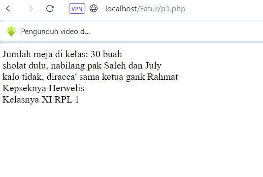
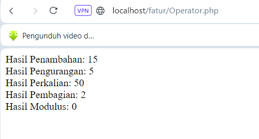
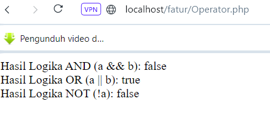
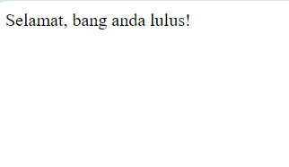

# Langkah-langkah Penggunaan APACHE (Web Server)
1. *Instalasi Apache*:
    - Unduh paket instalasi Apache dari situs web resminya atau gunakan package manager jika Anda menggunakan sistem operasi Linux. Untuk Windows, Anda dapat menggunakan installer yang disediakan.
2. *Konfigurasi Apache*:
    
    - Setelah instalasi selesai, Anda perlu melakukan beberapa konfigurasi dasar, seperti menentukan direktori root web, mengatur virtual host jika Anda memiliki beberapa situs, dan mengonfigurasi modul Apache sesuai kebutuhan.
3. *Memulai Server*:
    
    - Setelah konfigurasi selesai, Anda bisa memulai Apache. Di Linux, Anda bisa menggunakan perintah seperti sudo systemctl start apache2 untuk Debian/Ubuntu, atau sudo systemctl start httpd untuk CentOS/RHEL. Di Windows, Anda bisa memulai Apache melalui layanan "Services" atau dengan menjalankan perintah httpd -k start dari command prompt.
4. *Tes Koneksi*:
    
    - Buka browser web dan akses http://localhost atau http://127.0.0.1. Jika instalasi berhasil, Anda akan melihat halaman selamat datang dari Apache.
5. *Menyimpan File Situs Web*:
    
    - Letakkan file-file situs web Anda di direktori root web yang telah Anda konfigurasi sebelumnya. Secara default, di banyak instalasi Apache, direktori root web terletak di /var/www/html untuk Linux atau C:\xampp\htdocs untuk Windows.
6. *Mengonfigurasi Situs (Opsional)*:
    
    - Jika Anda memiliki beberapa situs web, Anda dapat menggunakan konfigurasi virtual host untuk mengonfigurasi setiap situs secara terpisah.
7. *Uji Situs Web*:
    
    - Setelah menyimpan file-file situs web Anda, coba akses situs web Anda melalui browser untuk memastikan semuanya berfungsi dengan baik.
8. *Pemantauan dan Pemeliharaan*:
    
    - Secara teratur periksa log aktivitas Apache untuk mengetahui masalah atau serangan keamanan. Pastikan untuk melakukan pemeliharaan rutin, seperti memperbarui software dan mengoptimalkan konfigurasi server.
# Apa itu web dinamis dan PHP?
## Web Dinamis 
**Web Dinamis** adalah situs yang mampu berubah dan menyesuaikan konten atau tampilannya berdasarkan interaksi pengguna atau data yang diterima. 

## PHP
**PHP**,singkatan dari (**Hypertext Preprocessor**), adalah bahasa pemrograman yang sering digunakan untuk mengembangkan aplikasi web dinamis. PHP memungkinkan pengembang untuk membuat halaman web yang dapat berinteraksi dengan pengguna, mengakses basis data, menghasilkan konten secara dinamis, dan melakukan berbagai tugas lainnya. Ini secara efektif memungkinkan pembuatan situs web yang lebih interaktif dan responsif.

# Program pertama PHP

## Program
```php
<?php

// Komentar satu baris
/* Komentar
banyak
baris
*/
//Variebel

$meja = 30;
$tk_kelas = "XI";
$ketua_kelas = "July";
$wali_kelas = "Saleh";
$ketua_gank = "Rahmat"; //Pengubahan nilai

//Konstanta

const KEPSEK = "Herwelis";
define('Kelas', 'RPL 1');

/*Kutip satu hanyak membaca STRING, variabel  dan string

 dipisahkan dengan tanda titik*/

echo 'Jumlah meja di kelas: ' .  $meja  . ' buah';
echo "<br>";

//Kutip dua bisa mebaca nilai dari sebuah variabel

echo "sholat dulu, nabilang pak $wali_kelas dan $ketua_kelas";
echo "<br>";

//Kutip satu dibaca string disini

echo "kalo tidak, diracca' sama ketua gank $ketua_gank";
echo "<br>";
echo 'Kepseknya ' .  KEPSEK;
echo "<br>";
  
//Pemnggilan konstanta

echo 'Kelasnya ' . $tk_kelas . ' '. Kelas;
```

## Hasil 

# Echo dan commentar 
## Echo 
**Echo** adalah perintah dalam PHP yang digunakan untuk menampilkan teks atau variabel ke dalam halaman web. Ini memungkinkan pengembang untuk menyisipkan konten dinamis ke dalam kode HTML. Contoh penggunaan echo
### Contoh kode
```PHP
<?
    $nama = "John";
    echo "Halo, $nama!";
?>
```

## Commentar 
**Commentar** adalah bagian dari kode yang tidak dieksekusi oleh interpreter PHP, dan digunakan untuk memberikan penjelasan atau dokumentasi tentang kode tersebut. Komentar tidak akan ditampilkan pada halaman web. Ada dua jenis komentar dalam PHP

### Contoh kode
```php
// Ini adalah komentar satu baris di PHP

/*
Ini adalah komentar
banyak baris di php
*/
```


___


# variabel,const
## Variabel 
**Variabel** dalam PHP digunakan untuk menyimpan nilai yang dapat berubah selama eksekusi skrip. Variabel dideklarasikan dengan awalan `$` diikuti dengan nama variabelnya. 

### Contoh kode 
```php
$nama = "Fathur";
$umur = 17;
```


## const

**Konstanta** dalam PHP adalah nama yang ditetapkan untuk nilai tertentu yang tidak dapat berubah selama eksekusi skrip. Konstanta didefinisikan menggunakan fungsi `define()`

### Contoh kode 
```php
define("PI", 7.16);
echo PI; // Output: 7.14
```
# Operator
## Aritmatika
### Penjelasan
Operator aritmatika dalam pemrograman PHP digunakan untuk melakukan operasi matematika pada nilai-nilai numerik. Terdapat beberapa operator aritmatika dasar yang umum digunakan, yaitu penambahan (+), pengurangan (-), perkalian (*), pembagian (/), dan modulus (%).
### Struktur
```PHP
<?php
$a = nilai_a;
$b = nilai_b;

$jumlah = $a + $b; // Pertambahan
$kurang = $a - $b; // Pengurangan
$kali = $a * $b; // Perkalian
$bagi = $a / $b; // Pembagian
$modulus = $a % $b; // Modulus (sisa pembagian)
$pangkat = $a ** $b; // Perpangkatan

echo "Pertambahan: " . $jumlah . "<br>";
echo "Pengurangan: " . $kurang . "<br>";
echo "Perkalian: " . $kali . "<br>";
echo "Pembagian: " . $bagi . "<br>";
echo "Modulus: " . $modulus . "<br>";
echo "Perpangkatan: " . $pangkat . "<br>";
?>
```
### Program
```PHP
<?php

$a = 10;

$b = 5;

// Contoh penggunaan operator aritmatika

$hasilTambah = $a + $b; // Penambahan

$hasilKurang = $a - $b; // Pengurangan

$hasilKali = $a * $b; // Perkalian

$hasilBagi = $a / $b; // Pembagian

$hasilModulus = $a % $b; // Modulus

  

// Output hasil perhitungan

echo "Hasil Penambahan: " . $hasilTambah . "<br>";

echo "Hasil Pengurangan: " . $hasilKurang . "<br>";

echo "Hasil Perkalian: " . $hasilKali . "<br>";

echo "Hasil Pembagian: " . $hasilBagi . "<br>";

echo "Hasil Modulus: " . $hasilModulus . "<br>";
```
### Hasil

### Analisis
- Inisialisasi Variabel: Variabel `$a` dan `$b` diinisialisasi dengan nilai 10 dan 5 secara berturut-turut.

- Penambahan: `$hasilTambah` = `$a + $b;` melakukan penambahan antara nilai `$a`, menghasilkan 15.
- Pengurangan: `$hasilKurang` = `$a - $b`; melakukan pengurangan antara nilai $a dan $b, menghasilkan 5.
- Perkalian: `$hasilKali` = `$a * $b`; melakukan perkalian antara nilai $a dan $b, menghasilkan 50.
- Pembagian: $hasilBagi = $a / $b; melakukan pembagian antara nilai $a dan $b, menghasilkan 2.
- Modulus: $hasilModulus = $a % $b; melakukan operasi modulus, yaitu mengambil sisa pembagian $a dengan $b, yang menghasilkan 0 karena 10 dibagi 5 tidak memiliki sisa.
- `$hasilKompleks = ($a + $b) * ($a - $b)`; melakukan operasi penjumlahan dan pengurangan terlebih dahulu, kemudian hasilnya dikalikan. Ini menghasilkan (10 + 5) * (10 - 5) = 15 * 5 = 75.
### Kesimpulan Program
operator aritmatika dasar untuk melakukan operasi matematika seperti penambahan, pengurangan, perkalian, pembagian, dan modulus.
## Perbandingan
### Penjelasan

- perbandingan dalam PHP adalah proses membandingkan dua nilai atau ekspresi untuk menentukan hubungan antara keduanya. Hasil dari perbandingan ini yang bisa jadi true jika perbandingan benar, atau false jika perbandingan salah.
### Struktur

```PHP
// 1. Deklarasi variabel

$a = 12;

$b = 8;
// 2. Fungsi untuk membandingkan dua angka

function compare($x, $y) {

// 3. Logika perbandingan

    if ($x > $y) {

        return "$x lebih besar dari $y";

    } elseif ($x < $y) {

        return "$x lebih kecil dari $y";

    } else {

        return "$x sama dengan $y";}
}
// 4. Pemanggilan fungsi dan output

echo compare($a, $b);

?>
```
### Program

```PHP
$a = 12;

$b = 8;

function compare($x, $y) {

    if ($x > $y) {

        return "$x lebih besar dari $y";

    } elseif ($x < $y) {

        return "$x lebih kecil dari $y";

    } else {

        return "$x sama dengan $y";

    }

}
echo compare($a, $b);

?>
```
### Hasil


### Analisis
- `$a` diinisialisasi dengan nilai 12.
  `$b` diinisialisasi dengan nilai 8.

- `function compare($x, $y)` Mendefinisikan fungsi bernama compare yang menerima dua parameter: `$x dan $y`.

-  `if ($x > $y)` Mengecek apakah `$x`lebih besar dari `$y`. Jika benar, mengembalikan string `$x` lebih besar dari `$y`.

- `elseif ($x < $y)` Jika kondisi pertama tidak   terpenuhi, mengecek apakah `$x` lebih kecil dari `$y`. Jika benar, mengembalikan string `$x` lebih kecil dari `$y`.

- `else` Jika kedua kondisi sebelumnya tidak terpenuhi artinya `$x` sama dengan `$y`, mengembalikan string `$x` sama dengan `$y`.

### Kesimpulan Program

Kesimpulannya, untuk membandingkan dua angka, yaitu 12 dan 8, dan kemudian menampilkan hasil perbandingan tersebut dalam bentuk kalimat. Hasil akhirnya adalah "12 lebih besar dari 8"

## Logika
### Penjelasan
Operator logika adalah simbol atau kata kunci yang digunakan dalam pemrograman untuk melakukan operasi logika seperti AND, OR, dan NOT. Operator ini digunakan untuk menggabungkan kondisi-kondisi logika dalam sebuah pernyataan atau ekspresi, yang kemudian dievaluasi menjadi nilai kebenaran (true atau false).

### Struktur
```PHP
<?php
// 1. Inisialisasi Variabel
$umur = 25;
$status = "mahasiswa";

// 2. Pernyataan Logika dan Pernyataan Pengkondisian
if ($umur >= 18 && $status == "mahasiswa") {
    // Blok kode yang akan dieksekusi jika kedua kondisi terpenuhi
    echo "Anda adalah mahasiswa dewasa.";
} elseif ($umur < 18 || $status != "mahasiswa") {
    // Blok kode yang akan dieksekusi jika salah satu dari kondisi tersebut tidak terpenuhi
    echo "Anda bukan mahasiswa dewasa.";
}

// 3. Pesan Output (Opsional)
?>
```

### Program

```PHP
<?php
// Deklarasi dan inisialisasi variabel
$a = true;
$b = false;

// Menggunakan operator logika
$hasilAND = ($a && $b); // false
$hasilOR = ($a || $b); // true
$hasilNOT = (!$a); // false

// Output hasil
echo "Hasil Logika AND (a && b): " . ($hasilAND ? 'true' : 'false') . "<br>";
echo "Hasil Logika OR (a || b): " . ($hasilOR ? 'true' : 'false') . "<br>";
echo "Hasil Logika NOT (!a): " . ($hasilNOT ? 'true' : 'false') . "<br>";
?>
```


### Hasil


### Analisis

- Variabel `$a` diinisialisasi dengan nilai true,Variabel `$b` diinisialisasi dengan nilai false.
-  `Operator && (AND)` mengembalikan true jika kedua operatornya benar (true). Dalam kasus ini, `$a` adalah true dan `$b` adalah false, sehingga hasilnya adalah false.
 - `Operator || (OR)` mengembalikan true jika salah satu dari operatornya benar (true). Karena `$a` adalah true, meskipun `$b` adalah false, hasilnya tetap true.
 - `Operator ! (NOT)` mengubah kebalikan dari nilai operatornya. Dalam kasus ini, `$a` adalah true, sehingga `$a` menghasilkan false.
 - Setiap hasil dari operasi logika ($hasilAND, $hasilOR, $hasilNOT) ditampilkan dengan menggunakan echo.
  - ` ($hasilAND ? 'true' : 'false')` digunakan untuk menampilkan true jika nilai `$hasilAND` adalah true, dan false jika tidak.
### Kesimpulan Program
Operator logika di PHP `(&&, ||, !)` digunakan untuk menggabungkan kondisi-kondisi dan mengembalikan nilai boolean (true atau false).
# Conditional Statement
## IF
### Penjelasan

`If` digunakan untuk mengevaluasi suatu kondisi dan akan menjalankannya jika kondisi tersebut benar.

### Struktur
```php
if (kondisi) {
    // Blok yang akan dieksekusi jika kondisinya benar
}
```

### Program
```PHP
<?php
$nilai = 80;
if ($nilai >= 70) {
    echo "Selamat, bang Anda lulus!";
}
?>
```

### Hasil


### Analisis
Variabel `$nilai = 80;` dideklarasikan dan diinisialisasi dengan nilai 80.
 `If`  digunakan untuk mengevaluasi kondisi `$nilai >= 70`. Jika kondisi tersebut bernilai benar ,lebih besar atau sama dengan 70,maka blok kode di dalam if  akan dieksekusi.
`echo "Selamat, bang Anda lulus!";` Jika kondisi dalam if terpenuhi, yaitu nilai `$` nilai lebih besar atau sama dengan 70, maka perintah echo `Selamat, Anda lulus!`; akan dieksekusi. Ini akan menampilkan pesan `Selamat, Anda lulus!` ke output.


### Kesimpulan Program
kesimpulannya,pesan `Selamat, Anda lulus!` akan dicetak jika nilai variabel `$nilai` benar atau melebihi nilai kulus (70). 


## IF-ELSE
### Penjelasan

`If-else`   dalam PHP digunakan untuk mengevaluasi suatu kondisi. Jika kondisi tersebut benar, blok kode di dalam if  akan dieksekusi. Jika kondisi tersebut salah, blok kode di dalam else  akan dieksekusi.
### Struktur
```php
if (kondisi) {
    // Blok kode yang akan dieksekusi jika kondisinya benar
} else {
    // Blok kode yang akan dieksekusi jika kondisinya salah
}
```
### Program
```PHP
<?php
$nilai = 60;
if ($nilai >= 70) {
    echo "Selamat,luluski!";
} else {
    echo "Maaf,belum rejekita.";
}
?>
```

### Hasil
#### Jika kondisinya terpenuhi


#### Jika kondisinya tidak terpenuhi


### Analisis

 Variabel `$nilai = 60;` dideklarasikan dan diinisialisasi dengan nilai 60.
 `If-else`  digunakan untuk mengevaluasi kondisi `$nilai >= 70`. Jika kondisi tersebut bernilai benar atau lebih besar dari 70,maka blok kode di dalam if akan dieksekusi. Jika kondisi tersebut bernilai false, blok kode di dalam else  akan dieksekusi.
 `Echo` digunakan Jika kondisi dalam if statement terpenuhi (nilai `$nilai` lebih besar atau sama dengan 70), maka perintah echo `Selamat, luluski!`; akan dieksekusi. Jika kondisi dalam `if`  tidak terpenuhi nilai `$nilai` kurang dari 70, maka perintah echo `Maaf, belum rejekita`.; akan dieksekusi. Ini akan mencetak ke output.

### Kesimpulan Program

`if-else` dalam PHP untuk mengevaluasi apakah nilai variabel `$nilai` mencapai atau melebihi batas kelulusan (`70`). Jika kondisi terpenuhi, program akan mencetak pesan `Selamat, luluski!`. Jika kondisi tidak terpenuhi, program akan mencetak pesan `Maaf, belum rejekita`, dan akan dicetak ke output.

## IF-ELSE IF-ELSE
### Penjelasan

`If-else if-else`  digunakan untuk mengevaluasi beberapa kondisi yang saling bertentangan dan memberikan pilihan berbeda tergantung pada hasil evaluasi kondisinya.


### Struktur
```php
if (kondisi1) {
    // Blok kode yang akan dieksekusi jika kondisi1 benar
} elseif (kondisi2) {
    // Blok kode yang akan dieksekusi jika kondisi2 benar
} else {
    // Blok kode yang akan dieksekusi jika kondisi1 dan kondisi2 salah
}
```
### Program
```PHP
<?php
$nilai = 86;
if ($nilai >= 90) {
    echo "Nilai A";
} elseif ($nilai >= 80) {
    echo "Nilai B";
} elseif ($nilai >= 70) {
    echo "Nilai C";
} else {
    echo "Nilai D";
}
?>
```
### Hasil


### Analisis

 `$nilai = 86;` diinisialisasi dengan nilai `86`.
`if ($nilai >= 90)` program memeriksa apakah nilai variabel `$nilai` lebih besar atau sama dengan `90`. Jika ya, maka pesan ``Nilai A`` yang tampil.
` elseif ($nilai >= 80)` Jika kondisi pertama tidak terpenuhi, maka akan memeriksa apakah nilai variabel `$nilai` lebih besar atau sama dengan `80`. Jika ya, maka pesan `Nilai B` yang tampil.
 `elseif ($nilai >= 70)` Jika kondisi kedua tidak terpenuhi, maka  akan memeriksa apakah nilai variabel `$nilai` lebih besar atau sama dengan `70`. Jika ya, maka pesan `Nilai C` yang tampil. 
 `echo "Nilai D"`  Jika semua kondisi di atas tidak terpenuhi, maka blok kode di dalam else akan dieksekusi, dan pesan `Nilai D` yang tampil. 
 
### Kesimpulan Program

variabel `$nilai` memiliki nilai `86`. Dengan menggunakan `if-else if-else` program menentukan kategori nilai berdasarkan rentang tertentu.Karena `$nila`i lebih besar dari `80`, program mencetak pesan `Nilai B`. 
## SWITCH CASE

### Penjelasan
`Switch case` dalam  PHP adalah memungkinkan eksekusi kode berbeda berdasarkan nilai dari sebuah variabel atau ekspresi.

### Struktur
```php
switch ($ekspresi) {
    case nilai1:
        // Blok kode yang akan dieksekusi jika $ekspresi sama dengan nilai1
        break;
    case nilai2:
        // Blok kode yang akan dieksekusi jika $ekspresi sama dengan nilai2
        break;
    // dan seterusnya...
    default:
        // Blok kode yang akan dieksekusi jika tidak ada case yang cocok dengan $ekspresi
        break;
}
```

### Program
```PHP
<?php
$hari = "Sabtu";

switch ($hari) {
    case "Senin":
        echo "Sekolah";
        break;
    case "Sabtu":
    case "Minggu":
        echo "libur";
        break;
    default:
        echo "Hari tidak valid";
        break;
}
?>
```

### Hasil


### Analisis

variabel `$hari` diinisialisasi dengan nilai `Sabtu`. Kemudian `switch` digunakan untuk memeriksa nilai dari variabel `$hari`. 
Di case pertama, nilai `Senin` dicek. Jika nilai `$hari` adalah `Senin`, maka akan dicetak `Sekolah` menggunakan pernyataan `echo`.
 Di case kedua, nilai `Sabtu` dicek. Jika nilai `$hari` adalah `Sabtu`, maka akan dicetak ` libur` menggunakan pernyataan `echo`. 
Di case ketiga, nilai `Minggu` dicek. Jika nilai `$hari` adalah `Minggu`, maka juga akan dicetak `libur. 
Jika nilai `$hari` tidak cocok dengan case-case sebelumnya, maka akan dieksekusi blok kode dalam bagian default. blok kode tersebut mencetak `Hari tidak valid`.

Disini yang tampil adalah Libur karena `$hari` adalah Sabtu.


### Kesimpulan Program

Kesimpulannya,  switch-case digunakan untuk memeriksa nilai variabel `$hari`. Jika nilai `$hari `adalah `Senin`, maka akan dicetak `Sekolah`. Jika nilai `$hari` adalah `Sabtu` atau `Minggu`, maka akan dicetak`libur`. Jika nilai `$hari` tidak cocok dengan case-case sebelumnya, maka akan dicetak `Hari tidak valid`. Dalam kasus ini, karena nilai `$hari `adalah `Sabtu`, maka hasil yang dicetak adalah `libur`.

# Array
## Array 1 dimensi
### Penjelasan

`array satu dimensi` adalah struktur data yang digunakan dalam pemrograman untuk menyimpan kumpulan nilai yang serupa dalam satu baris atau satu dimensi. Elemen-elemennya diindeks secara berurutan mulai dari `0` (`nol`) dan memungkinkan akses yang cepat dan efisien ke nilai-nilai tersebut.
### Struktur
```php
$namaArray = array(nilai1, nilai2, nilai3, ...)
```

### Program
```PHP
<?php
$buah = array("Apel", "Mangga", "Jeruk", "Pisang");
echo $buah[0];  // Output: Apel
echo $buah[3];  // Output: Pisang
?>
```
### Hasil


### Analisis
 `$buah` memiliki 4 elemen dengan nilai `Apel`, `Mangga`, `Jeruk`, dan `Pisang`.
  Pada baris pertama `echo $buah[0]`;, program akan menampilkan nilai elemen pertama dalam array, yaitu `Apel`.Pada baris kedua `echo $buah[3]`;, program akan menampilkan nilai elemen keempat dalam array, yaitu `Pisang`.

### Kesimpulan Program
Kesimpulannya, array bernama `$buah` dengan 4 elemen: `Apel`, `Mangga`, `Jeruk`, dan `Pisang`. Ketika kita mencetak elemen array menggunakan `[0]`, maka yang tampil adalah `Apel`, dan ketika kita menggunakan `[3]`,  maka yang akan tampil adalah `Pisang`.

## Array Asosiatif
### Penjelasan

`Array asosiatif` adalah struktur data dalam PHP yang digunakan untuk menyimpan sekumpulan nilai dengan menggunakan pasangan kunci-nilai.


### Struktur
```php
$namaArray = array(
    "kunci1" => nilai1,
    "kunci2" => nilai2,
    "kunci3" => nilai3,
    ...
);
```

### Program
```PHP
<?php
$Siswa = array(

    "nama" => "Fathur",
    "usia" => 17,
    "jurusan" => "RPL"

);
echo $Siswa["nama"];  // Output: Fathur
echo $Siswa["usia"];  // Output: 17
?>
```

### Hasil

)
### Analisis

Array asosiatif `$Siswa` memiliki tiga pasangan kunci-nilai,
Kunci `nama` memiliki nilai `Fathur`.Kunci `usia` memiliki nilai `17`.Kunci `jurusan` memiliki nilai `RPL` (Rekayasa Perangkat Lunak).`echo $Siswa["nama"];`, program mencetak nilai yang terkait dengan kunci "nama", yaitu "`Fathur`". `echo $Siswa["usia"];`, program mencetak nilai yang terkait dengan kunci "usia", yaitu `17`.
### Kesimpulan Program

Kesimpulannya, `array asosiatif `memungkinkan penyimpanan dan pengaksesan data dengan menggunakan kunci yang dapat diidentifikasi, sehingga mempermudah dalam mengelola informasi terstruktur.
## Array Multidimensi 
### Penjelasan
`Array multidimensi` digunakan untuk menyimpan data dalam bentuk matriks atau struktur data yang lebih kompleks yang memerlukan lebih dari satu dimensi.

### Struktur
```php
$namaArray = array(
    array(nilai1, nilai2, nilai3, ...),
    array(nilai4, nilai5, nilai6, ...),
    ...
);
```

### Program
```PHP
$matrix = array(
    array(1, 2, 3),
    array(4, 5, 6),
    array(7, 8, 9)
);
// Akses elemen array
echo $matrix[1][2]; // Output: 6
```

### Hasil

 
### Analisis

`Array multidimensi` `$matrix` terdiri dari tiga dimensi, yang masing-masing mewakili baris dalam matriks.
 Setiap elemen dalam array `$matrix` adalah `array` tunggal yang mewakili nilai-nilai dalam baris tersebut.
 Pada baris  `echo $matrix[1][2];`, program mencetak nilai yang terkait dengan indeks baris 1 dan indeks kolom `2`, yaitu `6`.

### Kesimpulan Program

Kesimpulannya, Array `$matrix` terdiri dari tiga dimensi, masing-masing mewakili baris dalam matriks. Setiap elemen dalam array `$matrix` adalah array tunggal yang mewakili nilai-nilai dalam baris tersebut. Dalam contoh tersebut, baris kedua memiliki nilai 6 di kolom ketiga. Oleh karena itu, ketika program mencetak `echo` `$matrix[1][2];`, hasilnya adalah 6.
# Var_dump
## Penjelasan

`Var_dump` adalah sebuah fungsi dalam PHP yang digunakan untuk menampilkan informasi rinci tentang satu atau lebih variabel, termasuk tipe data dan nilai-nilai yang terkandung di dalamnya.

## Struktur
```php
var_dump($variabel);
```

## Program
```PHP
$nama = "Fatur";
$umur = 17;
$Siswa = true;

var_dump($nama);
var_dump($umur);
var_dump($Siswa);

```


## Hasil


## Analisis

 Variabel `$nama` diberi nilai string `Fatur`. Ketika dilakukan `var_dump($nama)`, output menunjukkan tipe data string dengan panjang 5 karakter dan nilai `Fatur`.
Variabel `$umur` diberi nilai integer `17`. Ketika dilakukan `var_dump($umur)`, output menunjukkan tipe data integer dan nilai `17`.
 Variabel `$Siswa` diberi nilai `boolean` true. Ketika dilakukan `var_dump($Siswa)`, output menunjukkan tipe data `boolean` dan nilai `true`.
## Kesimpulan

kesimpulannya,`var_dump` digunakan untuk menampilkan informasi detail tentang tipe data dan nilai dari variabel atau ekspresi. Dalam contoh tersebut, kita melihat penggunaan `var_dump` untuk variabel `$nama`, `$umur`, dan `$Siswa`, yang menampilkan tipe data dan nilai dari masing-masing variabel.
  
# Looping (Perulangan)
## For
### Penjelasan

`for` dalam PHP adalah sebuah perulangan yang digunakan untuk mengeksekusi blok kode berulang kali dengan jumlah iterasi yang sudah ditentukan sebelumnya.
### Struktur
```php
for (inisialisasi; kondisi; perubahan) {
    // Pernyataan yang akan dijalankan berulang kali
}
```
### Program
```PHP
<?php
for ($i = 1; $i <= 5; $i++) {
    echo "Nomor: " . $i . "<br>";
}
?>
```
### Hasil


### Analisis
Variabel `$i` diinisialisasi dengan nilai 1.
 Pada setiap iterasi, kondisi `$i <= 5` dievaluasi. Jika kondisi bernilai true, pernyataan di dalam blok perulangan dijalankan.
 Setelah setiap iterasi, variabel `$i` ditingkatkan sebesar 1.
Perulangan berlanjut selama kondisi `$i <= 5` bernilai true.
Dalam setiap iterasi, nomor yang sesuai ditampilkan.

### Kesimpulan Program
Kesimpulannya,Setiap kali perulangan dijalankan, nilai variabel `$i` akan dinaikkan satu per satu. Pernyataan di dalam blok perulangan akan dieksekusi selama nilai `$i` masih kurang dari atau sama dengan 5. Dalam setiap iterasi, nomor yang sesuai dengan nilai `$i` akan ditampilkan.

## While 
### Penjelasan
`while` perulangan yang digunakan untuk mengeksekusi blok kode berulang kali selama kondisi yang ditentukan tetap benar (true).

### Struktur
```php
while (kondisi) {
    // Pernyataan yang akan dijalankan berulang kali
}
```
### Program
```PHP
<?php
$i = 1;
while ($i <= 5) {
    echo "Nomor: " . $i . "<br>";
    $i++;
}
?>
```
### Hasil


### Analisis
variabel `$i` dengan nilai 1 (`$i = 1;`). Ini mempersiapkan variabel untuk digunakan sebagai penghitung perulangan.
 Kondisi yang diberikan adalah `$i <= 5`, yang berarti perulangan akan terus berjalan selama nilai `$i` kurang dari atau sama dengan 5.
 Ini akan mencetak nilai variabel `$i` bersama dengan teks `Nomor`:. Setelah itu, nilai variabel `$i` ditingkatkan satu per satu menggunakan operator peningkatan `$i++`.
Setiap kali blok perulangan dieksekusi, nilai variabel `$i` akan bertambah satu (`$i++`). Ini memastikan bahwa perulangan akan berhenti setelah mencapai nilai 5, karena saat `$i` mencapai 6, kondisi `$i <= 5` akan menjadi `false`, dan perulangan akan berhenti.

### Kesimpulan Program

Kesimpulannya,perulangan `while` untuk mencetak nomor dari 1 hingga 5. Prosesnya dimulai dengan inisialisasi variabel `$i` dengan nilai 1. Selanjutnya, dilakukan perulangan dengan menggunakan `while`, yang akan terus berjalan selama nilai `$i` kurang dari atau sama dengan 5. Di setiap iterasi perulangan, nomor yang sesuai dengan nilai variabel `$i` dicetak bersama dengan teks `Nomor`:. Perulangan berlanjut dengan peningkatan nilai `$i` setiap iterasi. Ketika nilai `$i` mencapai 6, perulangan berhenti karena kondisi `$i <= 5` menjadi `false`.
## Do-while
### Penjelasan
`do-while` adalah perulangan yang mirip dengan `while`, namun memiliki perbedaan utama dalam urutan evaluasi kondisi. Dalam perulangan `do-while`, blok kode akan dieksekusi setidaknya satu kali bahkan jika kondisi awalnya salah.
### Struktur
```php
do {
    // blok kode yang akan diulangi
} while (kondisi);

```
### Program
```PHP
<?php

// Inisialisasi variabel
$i = 1;
// Melakukan perulangan setidaknya satu kali
do {
    // Menampilkan nilai $i
    echo "Nomor: $i <br>";
    // Peningkatan nilai variabel $i
    $i++;
} while ($i <= 5); // Melakukan perulangan selama nilai $i kurang dari atau sama dengan 5
?>
```
### Hasil


### Analisis
Variabel `$i` diinisialisasi dengan nilai 1. Perulangan `do-while` dimulai dengan kata kunci `do`, yang berarti blok kode di dalamnya akan dieksekusi tanpa memeriksa kondisi terlebih dahulu.Blok kode di dalam perulangan mencetak nilai `$i` dengan teks `Nomor`:, dan kemudian nilai variabel `$i` ditingkatkan satu per satu menggunakan operator peningkatan `$i++`.
 Setelah blok kode dieksekusi, kondisi `$i <= 5` diperiksa. Jika kondisi tersebut masih benar (true), perulangan akan berlanjut ke iterasi berikutnya. Jika kondisi tersebut salah (false), perulangan akan berhenti dan eksekusi program akan melanjutkan ke pernyataan selanjutnya setelah perulangan.Karena nilai `$i` akan ditingkatkan setelah setiap iterasi, perulangan akan terus berlanjut hingga nilai `$i` mencapai 6, di mana kondisi `$i <= 5` menjadi salah (false), sehingga perulangan berhenti.

### Kesimpulan Program

Kesimpulannya, perulangan `do-while` untuk mencetak nomor dari 1 hingga 5. Perulangan `do-while` memastikan bahwa blok kode dieksekusi setidaknya sekali sebelum memeriksa kondisi. Selama kondisi `$i <= 5` benar, nilai `$i` akan ditingkatkan dan perulangan akan terus berlanjut. Setelah mencapai nilai 6, perulangan berhenti karena kondisi tersebut menjadi salah.

## Foreach
### Penjelasan

`foreach` adalah sebuah perulangan khusus dalam PHP yang digunakan untuk mengulangi setiap elemen dalam sebuah array
### Struktur
```php
foreach ($array as $nilai) {
    // blok kode yang akan diulangi untuk setiap nilai dalam array
}
```
### Program
```PHP
$buah = array("Apel", "Mangga", "Jeruk", "Pisang");

foreach ($buah as $nama) {
    echo "Saya suka $nama <br>";
}
```
### Hasil


### Analisis

 Array `$buah` diinisialisasi dengan empat elemen: `Apel`, `Mangga`, `Jeruk`, dan `Pisang`.`foreach` digunakan untuk mengiterasi setiap elemen dalam array `$buah`. Variabel `$nama` digunakan sebagai variabel iterasi yang akan mewakili nilai dari setiap elemen dalam array saat perulangan berlangsung.nilai dari variabel `$nama` dicetak dengan menggunakan `echo`, bersama dengan teks "Saya suka". Setiap nilai dari array `$buah` akan dicetak dengan kalimat `Saya suka [nilai]`.
 `foreach` akan berlanjut hingga semua elemen dalam array `$buah` diiterasi. Setiap kali iterasi dilakukan, nilai dari variabel `$nama` akan berubah menjadi nilai dari elemen array yang sedang diiterasi. Hasilnya berisi kalimat `Saya suka [nilai]` untuk setiap elemen dalam array `$buah`. contohnya, `Saya suka Apel`, `Saya suka Mangga,` `Saya suka Jeruk`, dan `Saya suka Pisang`.

### Kesimpulan Program
Kesimpulannya `Foreach` akan mencetak kalimat `Saya suka [nilai]` untuk setiap nilai dalam array `$buah`, menggunakan perulangan `foreach` untuk iterasi melalui seluruh elemen array tanpa perlu memperhatikan indeksnya.

# Function

## Penjelasan 

Fungsi dalam PHP adalah blok kode yang dapat dipanggil berulang kali di dalam program untuk melakukan tugas tertentu.

## Struktur 

```PHP
<?php
// Fungsi untuk mengecek apakah sebuah bilangan adalah genap

function isEven($number) {

    return $number % 2 == 0;
}
// Menggunakan fungsi untuk mengecek beberapa bilangan

$numbers = [1, 2, 3, 4, 5, 6, 7, 8, 9, 10];
foreach ($numbers as $num) {
    if (isEven($num)) {
        echo "$num adalah bilangan genap\n";
    } else {
        echo "$num adalah bilangan ganjil\n";
    }
}
?>
```
## Program 

```PHP
<?php
function isEven($number) {
    return $number % 2 == 0;
}
$numbers = [1, 2, 3, 4, 5, 6, 7, 8, 9, 10];
foreach ($numbers as $num) {
    if (isEven($num)) {
        echo "$num adalah bilangan genap\n";
    } else {
        echo "$num adalah bilangan ganjil\n";
    }
}
?>
```

## Hasil


## Analisis 

- `function isEven($number) { ... }`
  Mendefinisikan sebuah fungsi bernama isEven yang menerima satu parameter `$number`.
  
- `return $number % 2 == 0`;
  Fungsi ini mengembalikan nilai true jika hasil pembagian `$number` dengan 2 (menggunakan operator modulus %) sama dengan 0. Jika `$number % 2 == 0` bernilai true, maka angka tersebut adalah genap. Jika false, maka angka tersebut ganjil.
  
- `$numbers = [1, 2, 3, 4, 5, 6, 7, 8, 9, 10]`
  Membuat sebuah array bernama `$numbers` yang berisi daftar angka dari 1 sampai 10.
  
- `foreach ($numbers as $num) { ... }`
  Mengiterasi setiap elemen dalam array `$numbers`. Pada setiap iterasi, elemen saat ini disimpan dalam variabel `$num`.

- `if (isEven($num)) { ... } else { ... }` `if (iseven($num)) { ... }`
  Memanggil fungsi isEven dengan parameter `$num`.Jika `isEven` `$num` mengembalikan true, maka kode dalam blok if akan dijalankan.

- `echo "$num adalah bilangan genap\n`
  Jika angka tersebut genap, cetak string `$num adalah bilangan genap\n` ke layar. Misalnya, jika `$num` adalah 2, maka akan mencetak 2 adalah bilangan genap.

- `echo "$num adalah bilangan ganjil\n`
  Jika angka tersebut ganjil, cetak string `$num adalah bilangan ganjil\n` ke layar. Misalnya, jika `$num` adalah 3, maka akan mencetak 3 adalah bilangan ganjil.
## Kesimpulan 
Kesimpulannya, Function digunakan untuk menentukan apakah sebuah angka adalah ganjil,genap atau tidak.

# PHPForm
## GET Method
### Penjelasan
GET adalah salah satu dari dua metode utama yang digunakan oleh protokol HTTP untuk mengirimkan data dari klien (browser) ke server.

### Struktur

```PHP
<!DOCTYPE html>
<html lang="en">
<head>
    <meta charset="UTF-8">
    <meta name="viewport" content="width=device-width, initial-scale=1.0">
    <title>GET Method</title>
</head>
<body>
    <h2>GetMethod</h2>
    <form action="php.php" method="get">
        <label for="name">Name:</label><br>
        <input type="text" id="name" name="name"><br>
        <label for="email">Email:</label><br>
        <input type="text" id="email" name="email"><br><br>
        <input type="submit" value="Submit">
    </form>
    <?php
    // Mengecek apakah ada data yang dikirim melalui metode GET
    if (isset($_GET['name']) && isset($_GET['email'])) {
        $name = $_GET['name'];
        $email = $_GET['email'];
        echo "<h2>Proses Data</h2>";
        echo "Name: $name <br>";
        echo "Email: $email";
    } else {
        echo "<p>Tidak ada data</p>";
    }
    ?>
</body>
</html>
```
### Program

#### Form GET
```PHP
<!DOCTYPE html>

<html lang="en">

<head>

    <title>Document</title>

</head>

<body>

    <!-- Pada atribut action, kalian tuliskan nama file php yang bertugas untuk mengelola atau menangkap data dari form tersebut. -->

    <form action="proses_get.php" method="GET">

        <input type="text" name="nama" placeholder="Masukkan nama">

        <input type="number" name="umur" placeholder="Masukkan umur"> <br>

        <button type="submit">Kirim</button>

    </form>

</body>
</html>
```

#### Proses GET

```PHP
<?php

// Key dari array-nya, sesuai dengan nama dari atribut name di setiap input-nya

$nama = $_GET["nama"];

$umur = $_GET["umur"];

?>

  

<!DOCTYPE html>

<html lang="en">

<head>

    <meta charset="UTF-8">

    <meta name="viewport" content="width=device-width, initial-scale=1.0">

    <title>Ariq Hikari Hidayat - XI RPL 2 - GET</title>

</head>

<body>

    <p>Nama anda

        <!-- Ini adalah versi singkatnya dari php echo,

             yang fungsinya untuk menampilkan data -->

        <?= $nama ?>

    </p>

    <p>Umur anda <?= $umur ?> tahun</p>

</body>

  

</html>
```

### Hasil

#### Form GET


#### Proses GET


### Analisis

1. Form GET
- `<form action="proses_get.php" method="GET">` Membuka tag form dengan atribut action mengarah ke file proses_get.php, dan metode pengiriman data menggunakan metode GET.
- ` <input type="text" name="nama" placeholder="Masukkan nama">`Membuat input teks dengan tipe text, atribut name="nama" untuk memberi nama pada input, dan placeholder="Masukkan nama" untuk memberikan teks petunjuk di dalam input.
- `type="number" name="umur" placeholder="Masukkan umur">` Membuat input angka dengan tipe number, atribut name="umur" untuk memberi nama pada input, dan placeholder="Masukkan umur" untuk memberikan teks petunjuk di dalam input.
  `<br>` Tag  untuk membuat baris baru setelah input umur.
- `type="submit">Kirim</button>` Membuat tombol submit dengan teks "Kirim", yang akan mengirimkan data form ketika diklik.

2. Proses GET
- `$_GET["nama"]` Mengambil nilai dari parameter nama yang dikirim melalui metode GET dan menyimpannya dalam variabel $nama.
- `$_GET["umur"]` Mengambil nilai dari parameter umur yang dikirim melalui metode GET dan menyimpannya dalam variabel $umur.
- `<p>Nama anda`:Membuka paragraf yang menampilkan teks "Nama anda".
  `<?= $nama ?>`:Menampilkan nilai variabel $nama menggunakan shorthand PHP untuk echo. Shorthand ini adalah cara singkat untuk menampilkan output dari variabel PHP dalam HTML.
- `<p>Umur anda <?= $umur ?> tahun</p>`: Membuka dan menutup paragraf yang menampilkan teks "Umur anda", diikuti oleh nilai variabel $umur dan teks "tahun". Menggunakan shorthand PHP untuk echo untuk menampilkan nilai variabel $umur.

### Kesimpulan Program
Kesimpulannya,Program ini menunjukkan cara sederhana untuk mengirim data dari formulir HTML ke server menggunakan metode GET dan kemudian menampilkan data tersebut kembali kepada pengguna.

## POST Method
### Penjelasan

POST method adalah cara yang lebih aman dan cocok untuk mengirim data sensitif atau operasi yang mengubah data di server.
### Struktur
```PHP
<!DOCTYPE html>
<html lang="en">
<head>
    <meta charset="UTF-8">
    <meta name="viewport" content="width=device-width, initial-scale=1.0">
    <title>POST Method</title>
</head>
<body>
    <h2>PHP Form POST</h2>
    <form action="Php.php" method="post">
        <label for="name">Name:</label><br>
        <input type="text" id="name" name="name"><br>
        <label for="email">Email:</label><br>
        <input type="text" id="email" name="email"><br><br>
        <input type="submit" value="Submit">
    </form>
    <?php
    // Mengecek apakah ada data yang dikirim melalui metode POST
    if ($_SERVER["REQUEST_METHOD"] == "POST") {
        if (!empty($_POST['name']) && !empty($_POST['email'])) {
            $name = $_POST['name'];
            $email = $_POST['email'];
            echo "<h2>Processed Data</h2>";
            echo "Name: $name <br>";
            echo "Email: $email";
        } else {
            echo "<p>Please fill in all fields</p>";
        }
    }
    ?>
</body>
</html>
```
### Program
#### Form POST
```PHP
<!DOCTYPE html>

<html lang="en">
<head>

    <title>Document</title>

</head>

  

<body>

    <!-- Pada atribut action, kalian tuliskan nama file php yang bertugas untuk mengelola atau menangkap data dari form tersebut. -->

    <form action="proses_post.php" method="POST">

        <input type="text" name="nama_lengkap" placeholder="Masukkan nama">

        <input type="number" name="umur" placeholder="Masukkan umur">

        <input type="password" name="password" placeholder="Masukkan password"><br>

        <button type="submit">Kirim</button>

    </form>

</body>

</html>
```


#### Proses POST
```PHP
<?php

// Key dari array-nya, sesuai dengan nama dari atribut name di setiap input-nya

//$nama = $_POST["nama"];

$umur = $_POST["umur"];

  

var_dump($_POST);
?>

<!DOCTYPE html>

<html lang="en">

  

<head>

    <title> XI RPL 1 - POST</title>

</head>

  

<body>

    <p>Nama anda <?= $_POST["nama_lengkap"] ?></p>

    <p>Umur anda <?= $umur ?> tahun</p>

    <p>Password anda aman!</p>

</body>

  

</html>
```
### Hasil
#### Form POST

#### Proses POST

### Analisis

1. Form POST
- `<form action="proses_post.php" method="POST">` Membuka tag form dengan atribut action mengarah ke file proses_post.php, dan metode pengiriman data menggunakan metode POST.
- `type="text" name="nama_lengkap" placeholder="Masukkan nama">` Membuat input teks dengan tipe text, atribut name="nama_lengkap" untuk memberi nama pada input, dan placeholder="Masukkan nama" untuk memberikan teks petunjuk di dalam input.
-  `<input type="number" name="umur" placeholder="Masukkan umur">`` Membuat input angka dengan tipe number, atribut name="umur" untuk memberi nama pada input, dan placeholder="Masukkan umur" untuk memberikan teks petunjuk di dalam input.
- `<input type="password" name="password" placeholder="Masukkan password">` Membuat input password dengan tipe password, atribut name="password" untuk memberi nama pada input, dan placeholder="Masukkan password" untuk memberikan teks petunjuk di dalam input. Tipe password memastikan bahwa teks yang diketik tidak terlihat oleh orang lain.
- `<button type="submit">Kirim</button>` Membuat tombol submit dengan teks "Kirim", yang akan mengirimkan data form ketika diklik.

2. Proses POST
- Mengambil nilai dari parameter umur yang dikirim melalui metode POST dan menyimpannya dalam variabel `$umur`.
- ` var_dump($_POST);` digunakan untuk mencetak semua data yang dikirim melalui POST dalam bentuk array. Ini membantu dalam debugging untuk melihat data apa yang dikirimkan oleh form.
- `<p>Nama anda <?= $_POST["nama_lengkap"] ?></p>`Membuka paragraf yang menampilkan teks "Nama anda", diikuti oleh nilai variabel `$_POST["nama_lengkap"]` yang diambil dari data yang dikirimkan melalui form.
- `<p>Umur anda <?= $umur ?> tahun</p>` Membuka paragraf yang menampilkan teks "Umur anda", diikuti oleh nilai variabel $umur yang diambil dari data yang dikirimkan melalui form.
- `<p>Password anda aman!</p>` Menampilkan pesan bahwa password aman. Password tidak ditampilkan di halaman untuk menjaga rahasia.
### Kesimpulan Program

Kesimpulannya,sebuah formulir yang mengirimkan data ke proses_post.php menggunakan metode POST. Formulir ini berisi tiga input: satu untuk nama lengkap, satu untuk umur, dan satu untuk kata sandi. Setelah pengguna mengisi formulir dan menekan tombol "Kirim", data dikirim ke server secara aman menggunakan metode POST, dan skrip PHP pada proses_post.php