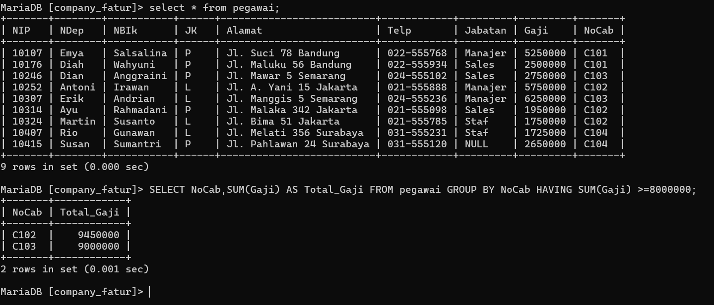
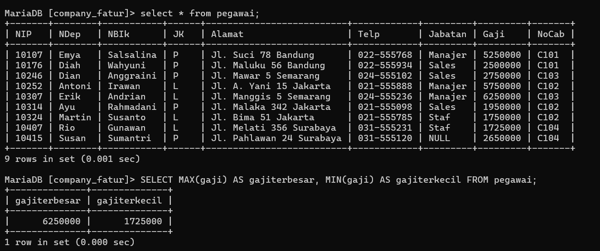
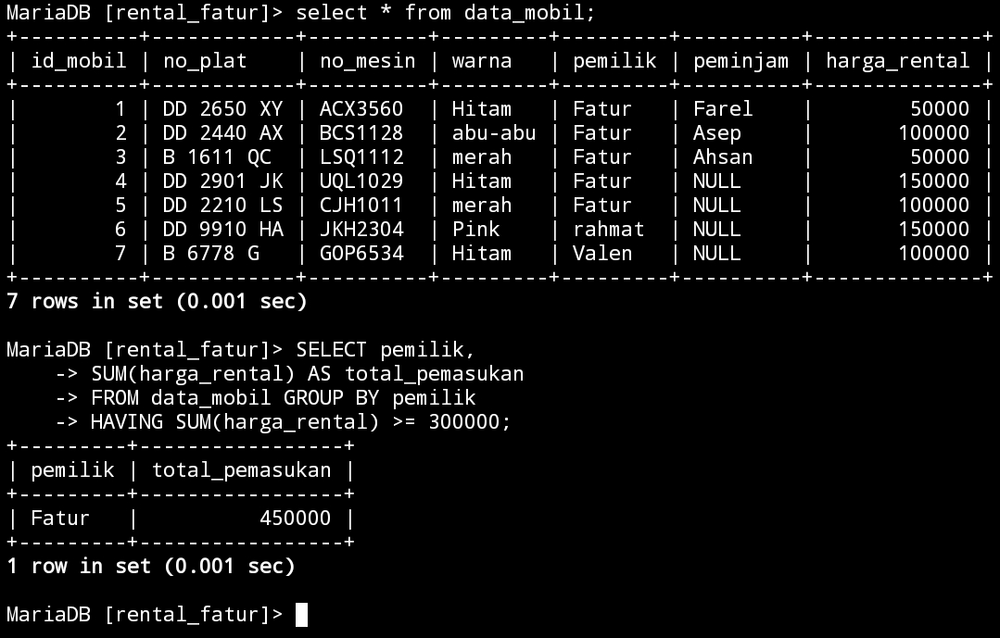

# Tabel Pegawai 


# Struktur tabel pegawai


# 1

## Query

```MySQL

select count(NIP) AS jumlahpegawai, count(Jabatan) AS jumlahjabatan FROM pegawai;

```

## Hasil


## Analisis 

- `SELECT` : Untuk memilih kolom apa saja yang ingin dipilih (untuk dihitung)
- `COUNT(NIP)` : Untuk menghitung jumlah barisan data yang mempunyai isi data dari kolom yang dipilih. `NIP` adalah nama kolom yang dipilih untuk dihitung 
- `AS` : Untuk mengubah nama dari suatu kolom untuk sementara 
- "JumlahPegawai" : merupakan nama ubahan dari perintah AS yang digunakan merupakan nama sementara dari perintah `COUNT(NIP)`
- `COUNT(jabatan)` : untuk menghitung jumlah barisan data yang mempunyai isi data dari kolom yang dipilih `jabatan` adalah nama kolom yang dipilih untuk dihitung
- `AS` : Untuk mengubah nama dari suatu kolom untuk sementara 
- "JumlahJabatan" : merupakan nama sementara dari perintah `COUNT(jabatan)`
- `FROM` "pegawai2" : merupakan dari tabel mana datanya yang digunakan "pegawai2" adalah nama tabel yang datanya ingin digunakan
- Hasilnya : karena ada 9 barisan data, yang ingin dihitung adalah kolom `NIP`, jumlah dari kolom `NIP` (isi datanya) ada 9, ditampilkan sebagai "JumlahPegawai". Kolom "jabatan" juga dihitung, akan tetapi ada satu data yang berisi `NULL`(kosong) oleh karena itu hanya ada 8 data ditampilkan sebagai "JumlahJabatan"


# 2
## Contoh query

```mysql
select COUNT(NIP) AS jumlahpegawai
 from pegawai
 where NoCab = 'C102';
```

## Hasil


## Analisis 

 - `Select` = untuk memilih kolom mana saja yang ingin dipilih untuk dihitung.
 - `COUNT(NIP)` = untuk menghitung jumlah barisan data  yang mempunyai data dari kolom yang dipilih.Nip adalah nama kolom yang dipilih untuk dihitung.
 - `AS` = untuk mengubah nama dari suatu kolom sementara.
 - `JumlahPegawai` = nama sementara yang dipilih untuk kolom `COUNT(NIP)`
 - `FROM Pegawai` = dari tabel mana datanya akan digunakan.Pegawai adalah nama tabel yang dipilih untuk digunakan.
 - `WHERE` = merupakan kondisi yang harus dipenuhi agar datanya dapat dihitung dengan query `COUNT(NIP)`.
 - `(Nocab = 'C102')`= adalah kondisi dari where yang harus dipenuhi, jadi hanya barisan data yang memiliki `C102` di kolom "Nocab" yang bisa dihitung.
 - Hasilnya = di 9 barisan data yang ada pada tabel pegawai, kita ingin menghitung jumlah barisan data yang memiliki nilai 'C102' pada kolom "Nocab"nya dengan menggunakan COUNT. Jadi yang muncul adalah 3 barisan data. Kita juga ingin mengubah nama dari kolom hasil perintah COUNT secara sementara dengan perintah AS namanya adalah JumlahPegawai.
 
# 3
## Contoh query

```mysql
SELECT Nocab, COUNT(NIP) AS Jumlah_pegawai
     from pegawai
     GROUP BY NoCab;
```

## Hasil


## Analisis 

- `SELECT` = untuk memilih kolom mana saja yang ingin dihitung atau ditampilkan.
- `Nocab` = merupakan nama kolom yang ingin ditampilkan.
- `COUNT(NIP)` = untuk menghitung jumlah barisan data yang mempunyai isi data dari kolom yang dipilih.Nip adalah nama kolom yang ingin dipilih untuk dihitung.
- `AS` = untuk mengubah nama dari suatu kolom untuk sementara.
- `Jumlah Pegawai` = merupakan nama sementara dari kolom hasil COUNT(NIP).
- `From Pegawai` = dari tabel mana yang data kodomnya ingin digunakan.Pegawai adalah nama tabel yang dipilih untuk digunakan.
- `GROUP BY` = untuk mengelompokkan data berdasarkan nilai data yang telah ditentuka Pada kolom yang dipilih.
- `Nocab` = nama kolom Yang dipilih untuk datanya dikelompokkan.
- `Hasilnya` = Berdasarkan 9 barisan data, masing-masing nilai dalam kolom Nocab dikelompokkan berdasarkan nilainya sendiri. Jadi Nocab clol bersama Nocab yang nilai nya sama Yaitu clol. Jadi Nocab Yang memiliki C101 ada 2, C102 ada 3, C103 ada 2, C104 ada 2. Total semuanya 9, sesuai densan Jumlah barisan data Yand ada. Adapun nama dari kolom hasil Yaitu Jumlah-Pegawai dari Perintah AS.
# 4
## Contoh query 

```mysql
SELECT Nocab, COUNT(NIP) AS Jumlah_pegawai FROM pegawai GROUP BY NoCab HAVING COUNT(NIP) >= 3;
```

## Hasil


## Analisis 

- `SELECT` = untuk memilih kolom mana saja yang ingin dihitung atau ditampilkan.
- `Nocab` = merupakan nama kolom yang ingin ditampilkan.
- `COUNT (NIP)` = untuk menghitung Jumlah barisan data yang mempunyai isi data dari kolom Yang dipilih.NIP adalah nama kolom Yang dipilih untuk dihitung.
- `AS` = untuk mengubah nama dari suatu kolom untuk sementara.
- `Jumlah_Pegawai` = nama sementara dati kolom hasil COUNT (NIP).
- `From Pegawai` = untuk memilih dari tabel mana Yang data kolomnya ingin digunakan.Pegawai adalah nama tabel Xang dipilih untuk digunakan.
- `GROUP BY` = untuk menjelompokkan data berdasarkan nilai data Yang telah ditentukan Pada kolom Yang dipilih.
- `Nocab` = nama kolom Yang dipilih untuk dikelompokkan datanya.
- `HAVING` = untuk menentukan kondisi (Yang harus dipenuti) oleh suatu kelompok data agar bisa ditampilkan.
- `(COUNT (NIP) >= 3)` = merupakan kondisi Yand harus dipenuhi oleh suatu kelompor data. Jadi hanya kelompok data Yang hasil hitungannya lebih atau Sama dengan 3.
- Hasilnya seperti sebelumnya, ada 9 barisan data dibagi sesuai Nocab nya masing- -masing. Namun Yand ingin ditampilkan adalah hasil hitungan yang lebih dari atau sama dengan 3. Yaitu Nocab C102 Yang ada 3. Yand Jain c101 ada 2, c103 ada 2, C104 ada 2.

# 5
## Query
```sql
Select SUM(Gaji) AS Total_Gaji
FROM pegawai;
```

## Hasil


## Analisis

- `SELECT` = Untuk memilih kolom mana saja yang dipilih untuk dijumlahkan. 
- `SUM(Gaji)` = Untuk menghitung jumlah data (khusus angka) pada kolom yang harus dipilh. Gaji merupakan nama kolom yang dipilih untuk dihitung jumlah isi datanya. 
- `AS` = Untuk mengganti nama dari kolom hasil SUM(Gaji) untuk sementara. 
- `Total_Gaji` = Merupakan nama sementara dari perintah AS. 
- `FROM pegawai` = Untuk memilih dari table mana yang kolom datanya akan digunakan. Pegawai adalah nama dari table yang dipilih. 
- Hasilnya = kolom Gaji yang isi datanya berupa angka-angka, semuanya dijumlahkan menjadi satu seperti ditotalkan (sama seperti matematika pada umumnya). Dan hasilnya adalah 30575000. Adapun nama kolom dari hasil jumlah tersebut diubah dari SUM(Gaji) menjadi Total_Gaji.

# 6
## Query

```sql
Select SUM(Gaji) AS Gaji_Manager FROM pegawai WHERE 
Jabatan = 'Manager';
```

## Hasil


## Analisis

- `Select` = untuk memiliki kolom mana saja yang dipilih untuk digunakan.
- `SUM`= untuk menghitung jumlah isi data (khusus angka) pada kolom yang dipilih. gaji yang dipilih untuk dijumlahkan isi datanya.
- `AS` = mengganti nama dari kolom hasil SUM(Gaji) secara sementara.
- `Gaji_Manajer`= mengubah nama sementara dari perintah AS.
- `FROM pegawai`= untuk memilih dari tabel mana yang kolom datanya akan digunakan pegawai adalah nama dari tabel yang dipilih.
- `WHERE` = kondisi yang harus dipenuhi oleh suatu kolom agar datanya bisa dijumlah
- `(Jabatan="Manajer")` = merupakan kondisi dari WHERE. hanya barisan data yang kolom Gaji-nya bisa dijumlahkan.
- Hasilnya = barisan data yang kolom jumlahnya berisi manager akan dijumlah kolom Gaji-nya menjadi 17.250.000. jadi hanya beberapa kolom saja yang dijumlah.
# 7
## Query
```sql
Select NoCab, SUM(Gaji) TotalGaji
  ->FROM pegawai
  ->GROUP BY NoCab;
```
## Hasil


## Analisis

- `SELECT` = untuk memilih kolom mana saja yang dipilih untuk ditampilkan atau dijumlahkan.
- `SUM(Gaji)`= untuk menghitung jumlah data (khusus angka) pada kolom yang dipilih. Gaji adalah nama kolom yang dipilih untuk dijumlahkan isi datanya.
- `AS`= untuk mengganti nama dari kolom hasil SUM(Gaji) untuk sementara.
 - `TOTALGaji`= merupakan nama sementara dari perintah AS.
- `FROM pegawai`= untuk memilih dari tabel mana yang data kolomnya akan digunakan. pegawai adalah nama tabel yang dipilh.
- `GROUP BY`= untuk mengelompokkan data berdasarkan nilai data yang telah ditentukan pada kolo yang dipilih.
- `NoCab`= nama kolom yang datanya dipilih untuk dikelompokkan.
- Hasilnya= jadi berdasarkan kolom NoCab, barisan data yang kolom NoCab-nya berisi C102 maka kolom gaji dari barisan data itu digunakan bersama barisan data yang meiliki NoCab C101 juga. maka kolom gaji dijumlahkan sesuai dengan kolom NOCab masing-masing, mulai dari C101 memiliki 2 kolom gaji yang bisa dijumlahkan. sama denfan C103 dand C104. adapun C102 memiliki 3 kolom Gaji yanf dapat dijumlahkan. TotalGaji merupakan hasil perintah dari AS untuk mengubah nama kolom gasil dari SUM(Gaji).
# 8
## Query
```mysql
SELECT noCab, SUM(Gaji) AS Total_Gaji from pegawai GROUP BY noCab HAVING SUM(Gaji) >= 8000000;
```
## Hasil


## Analisis
- `select` = untuk memilih kolom mana saja yang dipilih untuk di tampilkan atau di jumlah.
- `noCab` = nama kolom yang dipilih untuk ditampilkan.
- `SUM(Gaji)` = untuk menghitung jumlah data (Khusus Angka) pada kolom yang dipilih.``Gaji`` adalah nama kolom yang dipilih untuk dijumlahkan isi datanya.
- `AS` = untuk mengganti nama dari SUM(Gaji) untuk sementara.
- `Total Gaji` = adalah nama sementara dari perintah ``AS``.
- `From Pegawai` = untuk memilih dari tabel mana yang data kolomnya akan di gunakan, ``Pegawai`` Adalah Nama Tabel Yang akan di pilih.
- `GROUP BY` = untuk mengelompokkan data berdasarkan nilai data Yang telah ditentukan Pada kolom yang dipilih.
- `Nocab` = nama kolom Yang dipilih untuk datanya dikelompokkan.
- `Having` = kondisi yang harus dipenuhi oleh suatu kelompok data agar bisa ditampilkan. 
- `(Sum (Gaji) >= 800000)` = kondisi dari HAVING, Hasil dari Penjumlahan Gai yang hanya bisa ditampilkan adalah Hasil yang lebih dari atau sama dengan 8000000.
- Hasilnya = Sama seperti sebelumnya, tetapi Nocab Yang memenuhi kondisi tersebut hanyalah C102 dan C103 karena hasil Jumlah kolom Gaji nya lebih dari atau sama dengan 8000000. Adapun hasil kolom Sum(Gaji) diganti Jadi Total-Gaji.


# 9
## Query

```mysql
SELECT AVG(Gaji) AS rata_rata from pegawai;
```
## Hasil


## Analisis
- `Select` = untuk memilih kolom mana data Yang dipilih untuk ditampilkan.
- `AVG (Gaji)`= untuk menghitung rata-rata dari data yang ada Pada kolom Yang dipilih. Gaji adalah nama kolom Yang dipilih untuk dihitung rata-ratanya.
- `AS` = untuk mengganti nama dari kolom hasil AVG (Gaji) untuk sementara.
- `Rata-rata` =nama sementara dari Perintah AS.
- `From Pegawai` = untuk memilih dari tabel mana Yang data kolomnya ingin digunakan
- `Pegawai` = adalah nama dari tabel yang dipilih.
- `Hasilnya` = 3397222.2222 merupakan hasil rata-rata dari semua 9 barisan data Pada kolom Gaji. Adapun nama kolom hasil dari AVG (Gaji) Yaitu Rata-rata


# 10
## Query
```Mysql
SELECT AVG(Gaji) AS GajiRataMgr FROM pegawai WHERE Jabatan = 'Manager';
```
## Hasil

## Analisis
==SELECT== = untuk memilih kolom mana saja yang dipilih untuk ditampilkan.
==AVG (Gaji)== = untuk menghitung rata-rata dari data yang ada pada kolom Yang dipilih. Gaji adalah nama kolom Yang dipilih untuk dihitung rata-ratanya.
==AS== = untuk mengganti nama dari kolom hasil AVG (Gaji) untuk sementara.
==GajiRataManager== = nama sementara dari Perintah AS.
==FROM pegawai== = untuk memilih dari tabel mana Yang data kolomnya ingin Pegawai adalah nama dari tabel Yang diingin digunakan.
==WHERE== = Kondisi yang harus dipenuhi oleh suatu kolom agar datanya bisa dihitung rata-ratanya
==(Jabatan = 'Manajer')== = kondisi dari WHERE. Barisan data yang kolom Jabatannya Manajer akan dihitung rata-rata kolom Gaji nya.
==Hasilnya== = 5750000.0000 merupakan hasil hitung rata-rata dari barisan data yang memiliki manajer di kolom Jabatan nya,dari situ kolom Gajinya di hitung.


# 11
## Query 
```mysql
SELECT nocab, AVG(gaji) AS ratagaji FROM pegawai GROUP BY nocab;
```
## Hasil


## Analisis 
- `SELECT` untuk memilih kolom mana saja yang dipilih untuk ditampilkan/dihitung.
- `nocab` kolom yang dipilih untuk ditampilkan.
- `AVG(gaji)` untuk menghitung rata-rata dari data yang ada pada kolom yang dipilih. `gaji` adalah nama kolom yang dipilih untuk dihitung rata-ratanya.
- `AS` untuk mengganti nama dari kolom hasil `AVG(gaji)` untuk sementara.
- `RataGaji` adalah nama sementara dari perintah `AS`.
- `FROM pegawai` untuk memilih dari tabel mana yang data kolomnya ingin digunakan. Pegawai adalah nama dari tabel yang dipilih.
- `GROUP BY` untuk mengelompokkan data berdasarkan nilai data yang telah ditentukan pada kolom yang dipilih.
- `nocab` nama kolom yang dipilih untuk datanya dikelompokkan.
- hasilnya hampir sama seperti no.7 masing-masing kolom nocab dihitung rata-ratanya. Sesuai dengan isi nocab,jadi yang `C101` dihitung dengan `C101` yang lainnya juga (yang sama) adapun ratagaji merupakan nama sementara dari kolom hasil `AVG(gaji)`.


# 12
## Query 
```mysql
SELECT nocab, AVG(gaji) AS Ratagaji FROM pegawai GROUP BY nocab HAVING nocab = 'C101' OR nocab = 'C102';
```
## Hasil


## Analisis 
- `SELECT` untuk memilih kolom mana saja yang dipilih untuk ditampilkan/dihitung.
- `nocab` kolom yang dipilih untuk ditampilkan.
- `AVG(gaji)` untuk menghitung rata-rata dari data yang ada pada kolom yang dipilih. `gaji` adalah nama kolom yang dipilih untuk dihitung rata-ratanya.
- `AS` untuk mengganti nama dari kolom hasil `AVG(gaji)` untuk sementara.
- `RataGaji` adalah nama sementara dari perintah `AS`.
- `FROM pegawai` untuk memilih dari tabel mana yang data kolomnya ingin digunakan. Pegawai adalah nama dari tabel yang dipilih.
- `GROUP BY` untuk mengelompokkan data berdasarkan nilai data yang telah ditentukan pada kolom yang dipilih.
- `nocab` nama kolom yang dipilih untuk datanya dikelompokkan.
- `HAVING` kondisi yang harus dipenuhi oleh suatu kelompok data.
- `nocab = 'C101' OR nocab = 'C102'` merupakan kondisi dari HAVING. Jadi kolom nocab yang memiliki C101 atau C102 yang hanya akan ditampilkan OR adalah kondisi yang hanya salah satu datanya yang harus dipenuhi.


# 13
## Query 
```mysql
SELECT MAX(gaji) AS gajiterbesar, MIN(gaji) AS gajiterkecil FROM pegawai;
```
## Hasil


## Analisis 
- `SELECT` untuk memilih kolom mana saja yang dipilih untuk ditampilkan/dihitung.
- `MAX(gaji)` untuk menampilkan nilai maksimum atau terbesar/tertinggi dari suatu data dalam kolom yang dipilih. Gaji adalah nama kolom yang dipilih.
- `AS gajiterbesar` untuk mengganti nama dari kolom hasil MAX(gaji) menjadi nama sementaranya yaitu gajiterbesar.
- `MIN(gaji)` untuk menampilkan nilai minimum atau terkecil/terendah dari suatu data dalam kolom yang dipilih. gaji adalah nama kolom yang dipilih.
- `AS gajiterkecil` untuk mengganti nama dari kolom hasil MIN(gaji) menjadi gajiterkecil untuk sementara.
- `FROM pegawai` untuk memilih dari tabel mana yang data kolomnya ingin digunakan. Pegawai adalah nama dari tabel yang dipilih.
- `hasilnya` jadi dari 9 nilai yang ada di kolom gaji,gaji maksimumnya adalah `6250000` dan namanya diubah menjadi gajiterbesar, bagi minimunnya adalah `1725000` dan namanya diubah menjadi gajiterkecil.


# 14
## Query
```sql
SELECT MAX(Gaji) AS GajiTerbesar, MIN(Gaji) AS GajiTerkecil
FROM pegawai
WHERE Jabatan = "Manajer";
```
## Hasil

## Analisis
- `SELECT`= Untuk memilih kolom nama mana saja yang dipilih untuk ditampilkan l.
- `MAX(Gaji)`= Untuk menampilkan nilai terbesar dari suatu data dalam kolom yang dipilih. Gaji  adalah nama kolom yang dipilih.
- `AS GajiTerbesar`= Untuk Menganti nama dari kolom hasil `MAX(Gaji)` menjadi `GajiTerbesar` untuk sementara.
- `MIN(Gaji)`= Untuk menampilkan nilai terkecil dari suatu data dalam kolom yang dipilih. Gaji adalah nama kolom yang dipilih.
- `AS GajiTerkecil`= Untuk Menganti nama dari kolom hasil `MIN(Gaji)` menjadi `GajiTerkecil` untuk sementara.
- `FROM pegawai`= Untuk memilih dari tabel mana yang data kolomnya ingin ditampilkan.
- `WHERE`= Kondisi yang harus dipenuhi oleh suatu kolom data agar bisa ditampilkan.
- `(Jabatan = "Manajer")`= Kondisi dari `WHERE` yang harus dipenuhi. Barisan data yang kolom jabatannya berisi manajer akan ditampilkan kolom Gajinya.
- **Hasilnya** = Jabatan Manajer yang memiliki nilai maksimum adalah 6250000 kolom hasil `MAX`nya diubah jadi `GajiTerbesar`.  
  Sedangkan nilai minimumnya adalah 5250000 kolom hasil `MIN`nya diubah jadi `GajiTerkecil`

# 15
## Query
```sql
SELECT NoCab, MAX(Gaji) AS GajiTerbesar, MIN(Gaji) AS GajiTerkecil FROM pegawai
GROUP BY NoCab;
```
## Hasil

## Analisis
- `SELECT`= Untuk memilih kolom nama mana saja yang dipilih untuk ditampilkan.
- `NoCab`= Nama kolom yang ingin ditampilkan.
- `MAX(Gaji)`= Untuk menampilkan nilai terbesar dari suatu data dalam kolom yang dipilih. Gaji  adalah nama kolom yang dipilih.
- `AS GajiTerbesar`= Untuk Menganti nama dari kolom hasil `MAX(Gaji)` menjadi `GajiTerbesar` untuk sementara.
- `MIN(Gaji)`= Untuk menampilkan nilai terkecil dari suatu data dalam kolom yang dipilih. Gaji adalah nama kolom yang dipilih.
- `AS GajiTerkecil`= Untuk Menganti nama dari kolom hasil `MIN(Gaji)` menjadi `GajiTerkecil` untuk sementara.
- `FROM pegawai`= Untuk memilih dari tabel mana yang data kolomnya ingin ditampilkan.
- `GROUP BY`= Untuk mengelompokkan data berdasarkan nilai data yang telah ditentukan pada kolom yang dipilih.
- `NoCab`= Nama kolom yang ingin dikelompokkan.
- **Hasilnya** = Masing-masing `NoCab` dicari nilai maksimum dan minimumnya. Mulai dari C101,C102,,C103,C104 dan nama hasil kolomnya diubah menjadi `GajiTerbesar` dan `GajiTerkecil`.


# 16
## Query
```sql
SELECT NoCab, MAX(Gaji) AS GajiTerbesar, MIN(Gaji) AS GajiTerkecil FROM pegawai GROUP BY NoCab HAVING COUNT(NIP) >= 3;
```
## Hasil

## Analisis
- `SELECT`= Untuk memilih kolom nama mana saja yang dipilih untuk ditampilkan.
- `NoCab`= Nama kolom yang ingin ditampilkan.
- `MAX(Gaji)`= Untuk menampilkan nilai terbesar dari suatu data dalam kolom yang dipilih. Gaji  adalah nama kolom yang dipilih.
- `AS GajiTerbesar`= Untuk Menganti nama dari kolom hasil `MAX(Gaji)` menjadi `GajiTerbesar` untuk sementara.
- `MIN(Gaji)`= Untuk menampilkan nilai terkecil dari suatu data dalam kolom yang dipilih. Gaji adalah nama kolom yang dipilih.
- `AS GajiTerkecil`= Untuk Menganti nama dari kolom hasil `MIN(Gaji)` menjadi `GajiTerkecil` untuk sementara.
- `FROM pegawai`= Untuk memilih dari tabel mana yang data kolomnya ingin ditampilkan.
- `GROUP BY`= Untuk mengelompokkan data berdasarkan nilai data yang telah ditentukan pada kolom yang dipilih.
- `NoCab`= Nama kolom yang ingin dikelompokkan.
- `HAVING`= Kondisi yang harus dipenuhi oleh suatu kelompok data.
- `(COUNT(NIP) >= 3`= Kondisi dari `HAVING` hanya hasil hitung kolom `NIP` yang lebih dari atau sama dengan 3 yang muncul.
- **Hasilnya** = Seperti no.4, yang mempunyai hasil hitung lebih dari atau sama dengan 3 adalah `NoCab C102`. Jadi hanya itu yang dicari nilai maksimum dan minimumnya pada kolom `Gaji`.

 
# 17
### Program

```MySql
Select COUNT(NIP) AS JumlahPegawai,SUM(Gaji) AS totalGaji AVG (Gaji) AS RataGaji, Max(Gaji), AS GajiMaks, MIN(Gaji), AS GajiMin  From pegawai; 
``` 


### Hasil


### Penjelasan
- `Select`= untuk memilih kolom mana saja yang dipilih untuk di tampilkan. 
- `COUNT(NIP)` = untuk menghitung jumlah barisan data yang ada pada kolom yang dipilih. 
- `AS JumlahPegawai`= untuk mengganti nama kolom hasil `COUNT(NIP)` menjadi Jumlah `Pegawai`. 
- `SUM(Gaji)`= untuk Menjumlah data yang ada pada kolom yang dipilih. `Gaji` adalah kolom yang dipilih. 
- `AS TotalGaji`= untuk mengganti nama kolom hasil `sum(gaji)` menjadi total `Gaji`. 
- `AVG(Gaji)`= untuk menghitung rata-ratanya suatu data dalam kolom yang dipilih. `Gaji` adalah nama kolom yang dipilih untuk dihitung. 
- `AS RataGaji`= untuk mengganti nama kolom hasil `AVG(Gaji)` menjadi `RataGaji`. 
- `MAX(Gaji)`= untuk menampilkan nilai terbesar dari suatu data dalam kolom yang dipilih `Gaji` adalah nama kolom yang dipilih. 
- `AS Gajimaks`= untuk menampilkan nama dari kolom hasil `MAX(Gaji)` menjadi `Gajimaks` untuk sementara. 
- `MIN(Gaji)`= untuk menampilkan nilai terkecil dari suatu kolom yang dipilih Gaji nama kolom yang dipilih. 
- `AS Gaji min`= untuk mengganti nama dari kolom hasil `min(gaji)` menjadi Gajimin untuk sementara. 
- `From Pegawai`= untuk memilih tabel mana yang dipilih untuk ditampilkan pegawai adalah nama tabel yang dipilih. 
- Hasil Dihitung berapa `NIP`, dijumlahkan semua data pada kolom `Gaji`, Dihitung Rata-Rata dari kolom `Gaji`, Ditampilkan Nilai terbesar pada kolom `Gaji`, dan nilai terkecil dalam kolom `Gaji`. 

# 18
### Program

```Mysql
Select COUNT(NIP) AS JumlahPegawai,SUM(Gaji) AS totalGaji,AVG (Gaji) AS RataGaji, Max(Gaji) AS GajiMaks, MIN(Gaji) AS GajiMin From pegawai WHERE Jabatan = 'Staf' OR Jabatan = 'Sales'
GROUP BY NoCab HAVING SUM(Gaji) <= 2600000;
```


### Hasil


### Penjelasan

- `Select`= untuk memilih kolom mana saja yang ingin digunakan. 
- `COUNT(NIP)`= untuk menghitung barisan data yang ada pada kolom yang dipilih. 
- `AS JumlahPegawai`= untuk mengganti nama dari kolom hasil `COUNT(NIP)` menjadi jumlah pegawai untuk sementara
- `SUM(Gaji) `= untuk Menjumlah data yang ada pada kolom yang dipilih. Gaji adalah nama kolom yang dipilih
- `AS TotalGaji`= untuk mengganti nama dari kolom hasil `Sum(Gaji)` menjadi `totalGaji` untuk sementara. 
- `AVG(Gaji) `= untuk menghitung Rata-Rata dari kolom yang di pilih. Gaji adalah nama kolom yang di pilih. 
-  `AS Rata_gaji`=  untuk  mengganti nama dari kolom `AVG(Gaji)` menjadi `ratagaji` untuk sementara.  
- `MAX(Gaji)`=  untuk menampilkan nilai terbesar dari suatu data dalam kolom yang dipilih. Gaji adalah nama kolom yang dipilih. 
- `AS Gajimaks`= untuk mengganti nama dari kolom `Max(Gaji)`menjadi `Gajimaks` sementara. 
- `MIN(Gaji)`= untuk menampilkan nilai minimum dari suatu data dalam kolom yang dipilih. Gaji adalah nama kolom yang dipilih. 
- `AS Gajimin`= untuk mengganti nama dari kolom `Min(Gaji)` menjadi `Gajimin` untuk sementara
- `From pegawai`= untuk memilih dari tabel mana yang datanya ingin digunakan Pegawai adalah nama tabel yang dipilih. 
- `Where`= kondisi yang harus dipenuhi oleh suatu kolom 
- `(jabatan = staf OR jabatan = sales)`= Kondisi dari `where`. 
- jadi hanya jabatan staf atau jabatan sales,  hanya salah satunya saja yang harus dipenuhi agar bisa tampil. OR (hanya salah satu kondisi yang harus dipenuhi)
- `GRUP BY`= untuk mengelompokkan data sesuai dengan kolom yang ingin di pilih 
- `Nocab`= nama kolom yang di pilih untuk dikelompokkan
- `HAVING`= kondisi yang harus dipenuhi oleh suatu kelompok data agar bisa di tampilkan
- `(Sum(Gaji)) <= 2.600.000)`= kondisi dari `Having`, hanya data yang hasil jumlah gajinya kurang dari atau sama dengan `2600000` yang bisa tampil
- `Hasilnya`= ada 2 barisan data yang memenuhi kondisi `<= 2600000` Adapun kondisi where yang juga dipenuhi oleh barisan data tersebut. Masing-masing namanya diubah sesuai Perintah `AS`. 


# Tantangan 7 Nomor 
## 1.tampilkan jumlah data mobil dan kelompok kan berdasarkan warna nya sesuai dengan tabel mobil kalian.

### Struktur Query
```mysql
select data 2,COUNT(Data 1) AS nama_sementara FROM nama_tabel GROUP BY data 2;
```
### Query
```mysql
SELECT warna,
COUNT(id_mobil) AS jumlah_warna 
FROM data_mobil GROUP BY warna;
```
### Hasil


___


### Analisis 
`SELECT warna` nama kolom yang akan diambil dari tabel `mobil`.`COUNT(id_mobil) AS jumlah_warna`,`COUNT` digunakan untuk menghitung jumlah baris oleh `GROUP BY`. Di sini, `COUNT(id_mobil)` menghitung jumlah mobil untuk setiap warna,`jumlah_warna`.`FROM data_mobil` ini adalah nama tabel yang akan digunakan.`GROUP BY warna; `digunakan untuk mengelompokkan hasil query berdasarkan nilai dalam kolom warna.  semua baris yang memiliki warna yang sama akan dikelompokkan, dan`COUNT(id_mobil)` akan dihitung.
### kesimpulan 
Kesimpulannya,Query ini menghitung jumlah mobil berdasarkan warna dalam tabel `data_mobil`.


## 2.berdasarkan query ini tampilkan yang lebih BESAR dari 3 atau sama dengan 3 pemilik mobil nya

### Struktur Query
```mysql
select data 3,COUNT(id_mobil) AS nama_sementara from nama_tabel GROUP BY data 3 HAVING COUNT(data 1) >= 3;
```
### Query
```mysql
select pemilik,COUNT(id_mobil) AS jumlah_mobil from data_mobil GROUP BY pemilik HAVING COUNT(id_mobil) >= 3;
```
### Hasil

___


### Analisis 
`select pemilik` adalah nama kolomnya yang digunakan,`count(id_mobil)` digunakan untuk menghitung jumlah baris yang memiliki nilai pada kolom `id_mobil`.`AS jumlah_mobil` Alias yang memberikan untuk nama sementara pada hasil dari `count(id_mobil)` jadi hasilnya akan diberi nama `jumlah_mobil`.`from data_mobil` adalah nama tabelnya.`GROUP BY pemilik` kolom yang digunakan untuk di kelompokkan.`HAVING COUNT(id_mobil) >= 3` ,`HAVING` digunakan untuk menetapkan kondisi pada hasil pengelompokan `GROUP BY`.`(id_mobil) >= 3` Kondisi yang harus dipenuh. Hanya grup dengan jumlah `id_mobil` yang dihitung lebih besar atau sama dengan 3 yang akan ditampilkan dalam hasil akhir.
### kesimpulan 
Kesimpulannya, query SQL ini digunakan untuk menemukan pemilik yang memiliki setidaknya tiga mobil.


## 3.tampilkan smua pemilik dengan jumlah mobilnya yang memiliki atau sama dengan 3 mobil

### Struktur query 
```sql
SELECT nama_data,COUNT(nama_data) AS nama_sementara FROM nama_tabel GROUP BY nama_data;
```
### Query
```mysql
SELECT pemilik, 
COUNT(id_mobil) AS jumlah_mobil 
FROM data_mobil GROUP BY pemilik;
```
### Hasil


___


### Analisis 
`SELECT pemilik` ini adalah nama kolomnya,`count(id_mobil)`digunakan untuk menghitung jumlah baris dalam kolom `id_mobil` untuk setiap grup. Fungsi ini menghitung berapa banyak mobil yang dimiliki oleh setiap `pemilik`.`AS jumlah_mobil` memberikan nama sementara pada hasil dari `COUNT(id_mobil)`, sehingga hasilnya akan diberi nama `JUMLAH_MOBIL`.`FROM data_mobil` ini adalah nama tabelnya.`GROUP BY pemilik` digunakan untuk mengelompokkan hasil query satu atau lebih kolom `pemilik`.
### kesimpulan 
Kesimpulannya,Query ini mengelompokkan data berdasarkan pemilik mobil dan menghitung jumlah mobil yang dimiliki setiap `pemilik`.


## 4.berdasarkan query yang ada pada praktikum 5 bagian 7 tampilkan data pada table mobil dengan mengelompokkan berdasarkan pemiliknya.hitung menggunakan sum total pendapatan pemilik berdasarkan harga rental

### Struktur Query
```mysql
select data 3,SUM(data 5) AS nama_sementara from nama_tabel GROUP BY data 3;
```
### Query
```mysql
SELECT pemilik,
SUM(harga_rental) AS total_pendapatan
FROM data_mobil GROUP BY pemilik;
```
### Hasil

___


### Analisis 
`Select pemilik` ini adalah nama kolomnya,`SUM(harga_rental)` digunakan untuk menghitung total nilai dari kolom `harga_rental` untuk setiap grup `pemilik`.`AS total_pendapatan` memberikan nama sementara pada hasil dari `SUM(harga_rental)`, sehingga hasilnya akan diberi nama `total_pendapatan`.`FROM data_mobil` adalah nama tabelnya,`GROUP BY pemilik` memastikan bahwa hasil query dikelompokkan berdasarkan pemilik mobil, sehingga setiap baris hasil akan menunjukkan pemilik serta total pendapatan rental mereka.
### kesimpulan 
Kesimpulannya,Query ini memberikan informasi tentang total pendapatan rental mobil yang diperoleh oleh masing-masing pemilik mobil.


## 5. Berdasarkan praktikum 5 query no 8 tampilkan jumlah pemasukan pemilik berdasarkan harga rental kelompokkan berdasarkan pemiliknya dan seleksi yang total pemasukannya atau harga rentalnya mencapai lebih besar atau sama dengan 300k

### Struktur Query
```mysql
select data_mobil,SUM(data_mobil) AS nama_sementara from nama_tabel GROUP BY data_mobil HAVING SUM(data_mobil) >= 300000;
```
### Query
```mysql
SELECT pemilik,
SUM(harga_rental) AS total_pemasukan
FROM data_mobil GROUP BY pemilik
HAVING SUM(harga_rental) >= 300000;
```
### Hasil


___


### Analisis 
`SELECT pemilik` nama kolom yang akan di gunakan,`SUM(harga_rental)` digunakan untuk menghitung total nilai dari kolom `harga_rental` untuk setiap grup pemilik. Fungsi ini menjumlahkan pendapatan dari rental mobil untuk setiap pemilik.`AS total_pemasukan` memberikan nama sementara pada hasil dari `SUM(harga_rental)`, sehingga hasilnya akan diberi nama `total_pemasukan`.`From data_mobil` ini adalah nama tabelnya.`GROUP BY pemilik` pengelompokan Setiap nilai unik di kolom pemilik akan membentuk satu grup.`HAVING SUM(harga_rental) >= 300000` Mengelompokkan data berdasarkan kolom pemilik, sehingga setiap pemilik membentuk satu grup serta,menyertakan pemilik yang memiliki total pendapatan dari rental mobil sebesar `300,000` atau lebih.
### kesimpulan 
Kesimpulannya,Query ini digunakan untuk mencari pemilik mobil yang memiliki total pendapatan dari rental mobil sebesar 300,000 atau lebih. 


## 6. Berdasarkan praktikum 6 no 12 tampilkan rata rata pemasukan pemilik mobil kelompokkan berdasarkan pemiliknya
### Struktur Query
```mysql
select nama_data,AVG(nama_data) AS nama_sementara from nama_tabel GROUP BY nama_data;
```
### Query 
```mysql
SELECT pemilik,
AVG(harga_rental) AS total_pemasukan
FROM data_mobil GROUP BY pemilik;
```
### Hasil

___


### Analisis 
`SELECT pemilik` nama kolomnya,`AVG(harga_rental)` menghitung nilai rata-rata dari kolom harga_rental untuk setiap kolom pemilik.`AS total_pemasukan` memberikan nama sementara pada hasil dari `AVG(harga_rental)`, sehingga hasilnya akan diberi nama `rata_rata_pendapatan`.`from data_mobil` nama tabelnya,`GROUP BY pemilik` `GROUP BY` digunakan untuk mengelompokkan data berdasarkan kolom `pemilik`. Setiap nilai unik di kolom pemilik akan membentuk satu grup.
Data akan dikelompokkan berdasarkan pemilik mobil, sehingga rata-rata `harga_rental` dihitung untuk setiap `pemilik`.
### kesimpulan 
Kesimpulannya,Query ini digunakan untuk menghitung rata-rata pendapatan dari rental mobil untuk setiap pemilik.


## 7. Berdasarkan praktikum 5 no 16 tampilkan pemasukan  terbesar dan pemasukan terkecil kelompokkan berdasarkan pemiliknya dan seleksi data pemilik yg tampil atau memiliki jumlah mobil lebih besar dari 1.

### Struktur
```mysql
select nama_data,MAX(nama_data) AS nama_sementara,MIN(nama_data) AS nama_sementara from nama_tabel GROUP BY nama_data HAVING COUNT(nama_data) >= 1;
```
### Query
```mysql
SELECT pemilik, 
MAX(harga_rental) AS pemasukan_terbesar, 
MIN(harga_rental) AS pemasukan_terkecil
FROM data_mobil GROUP BY pemilik
HAVING COUNT(id_mobil) > 1;
```
### Hasil

### Analisis 
`SELECT pemilik` nama kolomnya,`max(harga_rental)` menghitung pendapatan terbesar dari rental mobil untuk setiap pemilik.`AS pemasukan_terbesar` memberikan nama sementara pada hasil dari `MAX(harga_rental)`,`MIN(harga_rental)` 
### kesimpulan 