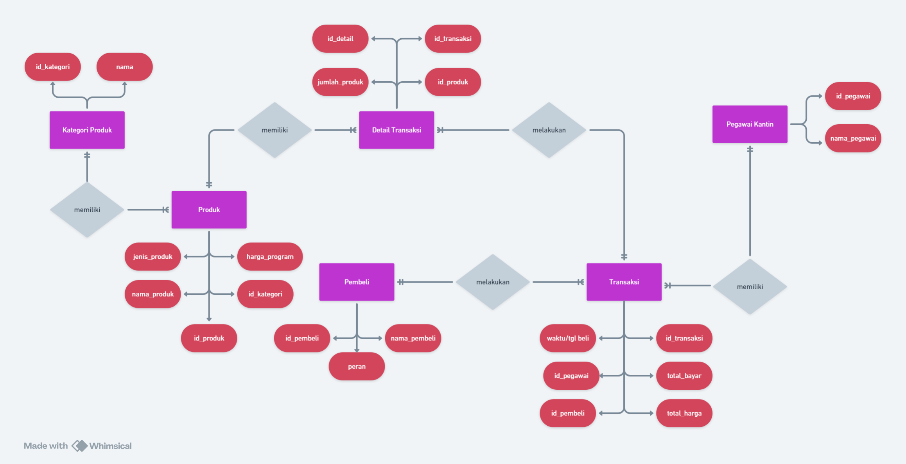
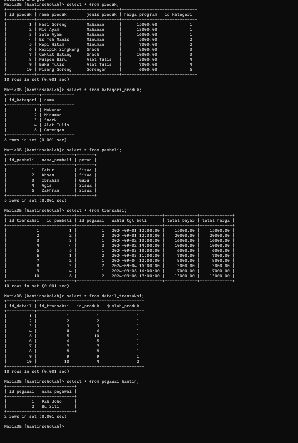
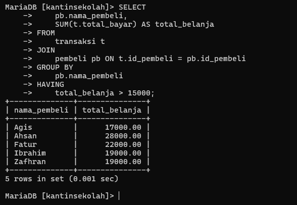
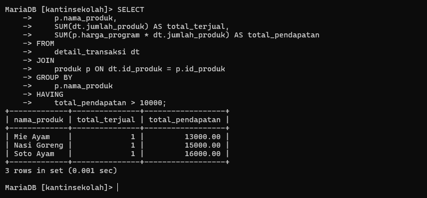

# Tabel Keaktifan

|  Nama   | Keaktifan |                                      Keterangan                                       |
| :-----: | :-------: | :-----------------------------------------------------------------------------------: |
|  Ahsan  |     3     |                      mencari dan mengerjakan relasi antar tabel                       |
|  Agis   |     3     |                                   Mencari Analisis                                    |
| Zhafran |     3     |                                   mencari analisis                                    |
|  Fatur  |     3     | mencari 2 contoh query relasi, group by, dan having secara bersamaan dalam satu query |


# Soal
1. Setiap kelompok merancang database di MySQL dari hasil perencanaan ERD-nya masing-masing. Di dalam database tersebut wajib menjadikan tabel berelasi, dengan menambah foreign key.
2. Selanjutnya tampilkan datanya secara kontekstual dengan menggunakan query relasi, group by, dan having secara bersamaan *dalam satu query*. Buatlah minimal sebanyak 2 contoh.
3. Sertakan pula penjelasan dan analisis kalian pada soal nomor 1 dan 2.


# ERD



## Penjelasan ERD

1. **Kategori Produk - Produk**
    
    - **Relasi**: Memiliki
    - **Tipe**: One-to-Many (1:N)
    - **Deskripsi**: Satu kategori produk dapat memiliki banyak produk, tetapi satu produk hanya dimiliki oleh satu kategori.
2. **Produk - Detail Transaksi**
    
    - **Relasi**: Dimiliki Oleh
    - **Tipe**: One-to-Many (1:N)
    - **Deskripsi**: Satu produk dapat muncul di banyak detail transaksi, tetapi satu detail transaksi hanya merujuk ke satu produk.
3. **Pembeli - Transaksi**
    
    - **Relasi**: Melakukan
    - **Tipe**: One-to-Many (1:N)
    - **Deskripsi**: Satu pembeli dapat melakukan banyak transaksi, tetapi satu transaksi hanya dilakukan oleh satu pembeli.
4. **Transaksi - Detail Transaksi**
    
    - **Relasi**: Memiliki
    - **Tipe**: One-to-Many (1:N)
    - **Deskripsi**: Satu transaksi dapat memiliki banyak detail transaksi, tetapi satu detail transaksi hanya dimiliki oleh satu transaksi.
5. **Kantin Sekolah - Pegawai**
    
    - **Relasi**: Memiliki
    - **Tipe**: One-to-Many (1:N)
    - **Deskripsi**: Satu kantin sekolah dapat memiliki banyak pegawai, tetapi satu pegawai hanya bekerja di satu kantin.


----

# Relasi DataBase


## Penjelasan 
- **kategori_produk**
    
    - **PK**: `id_kategori`
    - Relasi: Digunakan untuk mengelompokkan jenis produk berdasarkan kategori.


- **produk**
    
    - **PK**: `id_produk`
    - **FK**: `id_kategori` (mengacu ke tabel `kategori_produk`)
    - Relasi: Menyimpan data tentang produk yang dijual di kantin.


- **detail_transaksi**
    
    - **PK**: `id_detail`
    - **FK**: `id_transaksi` (mengacu ke tabel `transaksi`), `id_produk` (mengacu ke tabel `produk`)
    - Relasi: Menyimpan informasi detail setiap transaksi, seperti produk dan jumlahnya.


- **pegawai_kantin**
    
    - **PK**: `id_pegawai`
    - Relasi: Menyimpan data pegawai yang bertugas di kantin.


- **pembeli**
    
    - **PK**: `id_pembeli`
    - Relasi: Menyimpan data pembeli produk.


- **transaksi**
    
    - **PK**: `id_transaksi`
    - **FK**: `id_pembeli` (mengacu ke tabel `pembeli`), `id_pegawai` (mengacu ke tabel `pegawai_kantin`)
    - Relasi: Menyimpan informasi transaksi yang dilakukan.

---
## Data Semua Tabel




## Query Setiap Tabel
### Tabel Detail_Transaksi
```sql
CREATE TABLE `detail_transaksi` (
  `id_detail` int(11) NOT NULL,
  `id_transaksi` int(11) DEFAULT NULL,
  `id_produk` int(11) DEFAULT NULL,
  `jumlah_produk` int(11) DEFAULT NULLx
) ENGINE=InnoDB DEFAULT CHARSET=utf8mb4 COLLATE=utf8mb4_general_ci;
```

### Tabel kategori_produk
```sql
CREATE TABLE `kategori_produk` (
  `id_kategori` int(11) NOT NULL,
  `nama` varchar(100) NOT NULL
) ENGINE=InnoDB DEFAULT CHARSET=utf8mb4 COLLATE=utf8mb4_general_ci;
```

### Tabel Produk
```sql
CREATE TABLE `produk` (
  `id_produk` int(11) NOT NULL,
  `nama_produk` varchar(100) NOT NULL,
  `jenis_produk` enum('Makanan','Minuman','Snack','Alat Tulis','Gorengan') DEFAULT NULL,
  `harga_program` decimal(10,2) DEFAULT NULL,
  `id_kategori` int(11) DEFAULT NULL
) ENGINE=InnoDB DEFAULT CHARSET=utf8mb4 COLLATE=utf8mb4_general_ci;
```

### Tabel Pembeli
```sql
CREATE TABLE `pembeli` (
  `id_pembeli` int(11) NOT NULL,
  `nama_pembeli` varchar(100) NOT NULL,
  `peran` enum('Guru','Siswa') DEFAULT NULL
) ENGINE=InnoDB DEFAULT CHARSET=utf8mb4 COLLATE=utf8mb4_general_ci;
```


### Tabel Pegawai_kantin
```sql
CREATE TABLE `pegawai_kantin` (
  `id_pegawai` int(11) NOT NULL,
  `nama_pegawai` varchar(100) NOT NULL
) ENGINE=InnoDB DEFAULT CHARSET=utf8mb4 COLLATE=utf8mb4_general_ci;
```

### Tabel Transaksi
```sql
CREATE TABLE `transaksi` (
  `id_transaksi` int(11) NOT NULL,
  `id_pembeli` int(11) DEFAULT NULL,
  `id_pegawai` int(11) DEFAULT NULL,
  `waktu_tgl_beli` datetime DEFAULT NULL,
  `total_bayar` decimal(10,2) DEFAULT NULL,
  `total_harga` decimal(10,2) DEFAULT NULL
) ENGINE=InnoDB DEFAULT CHARSET=utf8mb4 COLLATE=utf8mb4_general_ci;
```


---
# 2 Contoh dengan menggunakan query relasi, group by, dan having secara bersamaan dalam satu query
## Soal 1
### Kode Program
```mysql
SELECT 
    pb.nama_pembeli,
    SUM(t.total_bayar) AS total_belanja
FROM 
    transaksi t
JOIN 
    pembeli pb ON t.id_pembeli = pb.id_pembeli
GROUP BY 
    pb.nama_pembeli
HAVING 
    total_belanja > 15000;
```
### Hasil Program

### Analisis
**Tujuan Query**: Mengetahui total transaksi yang dilakukan setiap pembeli, di mana total belanja mereka lebih dari Rp15.000.

**Cara Relasi**:

- Tabel `transaksi` direlasikan dengan tabel `pembeli` berdasarkan kolom `id_pembeli`.

**Cara Agregasi**:

- Menggunakan fungsi `SUM()` untuk menghitung total belanja per pembeli.
- `GROUP BY` digunakan untuk mengelompokkan data berdasarkan nama pembeli.
- `HAVING` digunakan untuk memfilter pembeli dengan total belanja lebih dari Rp15.000.
## Soal 2
### Kode Program
```sql
SELECT
p.nama_produk,
SUM(dt.jumlah_produk) AS total_terjual,
SUM(p.harga_program * dt.jumlah_produk) AS total_pendapatan
FROM
detail_transaksi dt
JOIN
produk p ON dt.id_produk = p.id_produk
GROUP BY
p.nama_produk
HAVING
total_pendapatan > 10000;

```
### Hasil Program

### Analisis

**Tujuan Query**: Mengetahui total jumlah produk yang terjual dan total pendapatan dari masing-masing produk yang sudah dibeli oleh pembeli.

**Cara Relasi**:

- Tabel `detail_transaksi` direlasikan dengan tabel `produk` berdasarkan kolom `id_produk`.

**Cara Agregasi**:

- Menggunakan fungsi `SUM()` untuk menghitung total pendapatan dan total produk terjual.
- `GROUP BY` digunakan untuk mengelompokkan data berdasarkan nama produk.
- `HAVING` digunakan untuk memfilter produk yang pendapatannya lebih dari Rp10.000.
