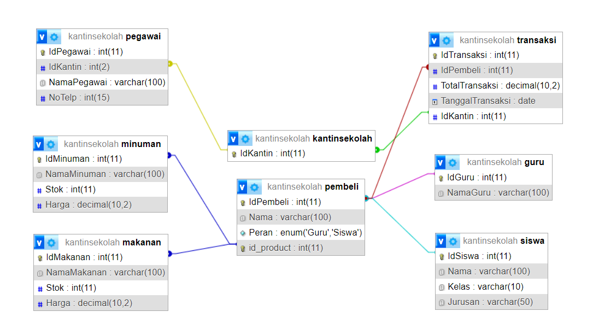
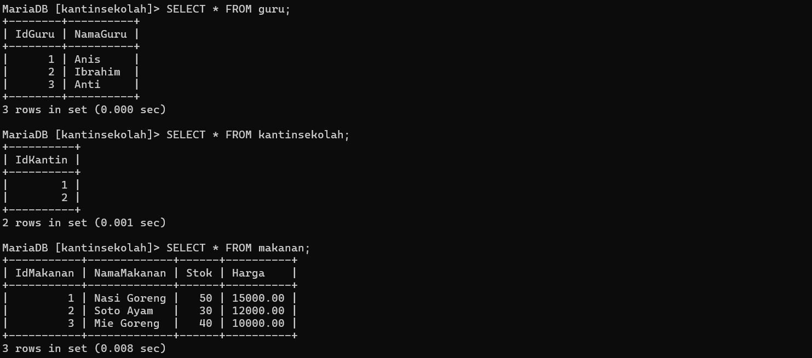
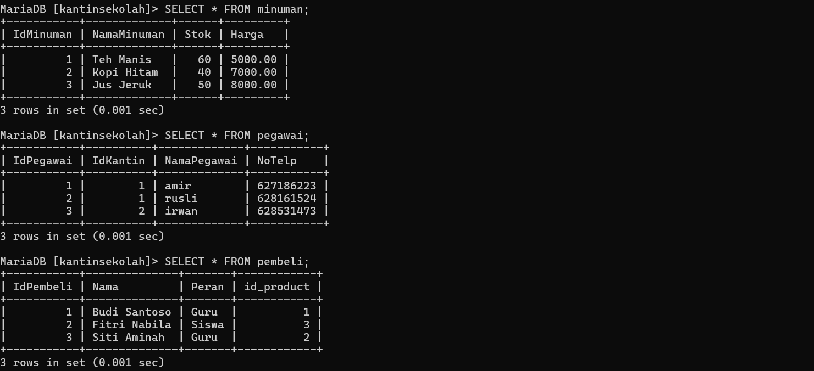
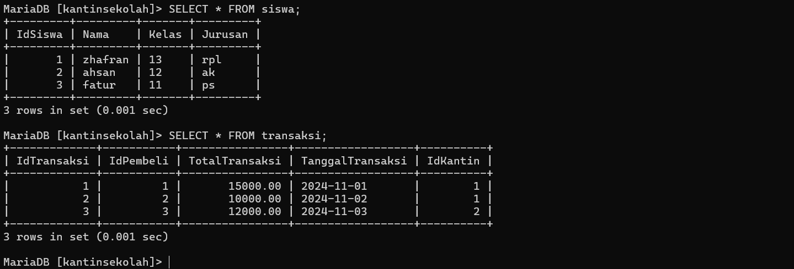
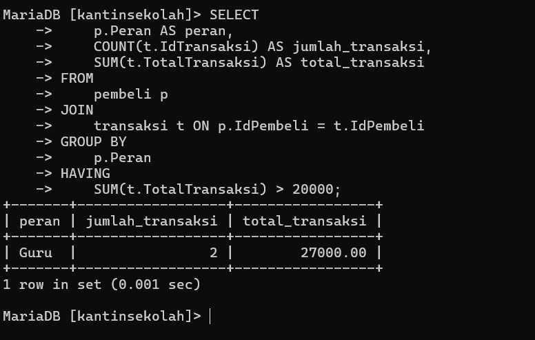
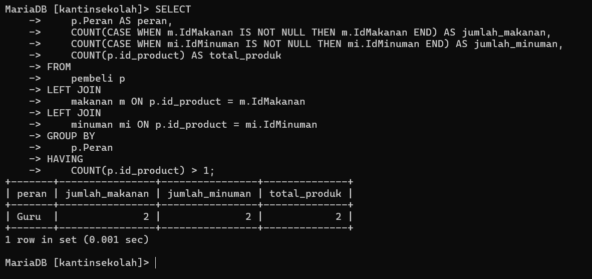

|  Nama   | Keaktifan |                                      Keterangan                                       |
| :-----: | :-------: | :-----------------------------------------------------------------------------------: |
|  Ahsan  |     3     |                      mencari dan mengerjakan relasi antar tabel                       |
|  Agis   |     3     |                                   Mencari Analisis                                    |
| Zhafran |     3     |                                   mencari analisis                                    |
|  Fatur  |     3     | mencari 2 contoh query relasi, group by, dan having secara bersamaan dalam satu query |


# Relasi DataBase


---
# Data Semua Tabel




---
# 2 Contoh dengan menggunakan query relasi, group by, dan having secara bersamaan dalam satu query
## Soal 1
### Kode Program
```mysql
SELECT 
    p.Peran AS peran,
    COUNT(t.IdTransaksi) AS jumlah_transaksi,
    SUM(t.TotalTransaksi) AS total_transaksi
FROM 
    pembeli p
JOIN 
    transaksi t ON p.IdPembeli = t.IdPembeli
GROUP BY 
    p.Peran
HAVING 
    SUM(t.TotalTransaksi) > 20000;

```
### Hasil Program

### Analisis
1. **Tujuan Query:** Query ini bertujuan untuk menghitung jumlah transaksi dan total nominal transaksi berdasarkan peran pembeli (Guru atau Siswa). Data hanya ditampilkan jika total nominal transaksi untuk setiap peran lebih besar dari Rp 20,000.
    
2. **Bagian-bagian Query:**
    
    - **SELECT:**
        - `p.Peran`: Menampilkan peran pembeli (Guru atau Siswa).
        - `COUNT(t.IdTransaksi)`: Menghitung jumlah transaksi per peran.
        - `SUM(t.TotalTransaksi)`: Menjumlahkan nominal total transaksi per peran.
    - **FROM dan JOIN:**
        - Menghubungkan tabel `pembeli` dengan `transaksi` menggunakan relasi `IdPembeli`.
    - **GROUP BY:**
        - Data dikelompokkan berdasarkan kolom `Peran` (Guru atau Siswa).
    - **HAVING:**
        - Menyaring data sehingga hanya peran dengan total transaksi lebih dari Rp 20,000 yang ditampilkan.
3. **Logika Kerja:**
    
    - Query pertama-tama menggabungkan data dari tabel `pembeli` dan `transaksi`.
    - Data yang tergabung dikelompokkan berdasarkan peran pembeli.
    - Total transaksi dihitung untuk masing-masing kelompok peran, kemudian disaring menggunakan klausa `HAVING`.
### Kesimpulan
Kita dapat mengetahui **jumlah transaksi** dan **total nominal transaksi** yang dilakukan oleh pembeli berdasarkan perannya (Guru atau Siswa).
## Soal 2
### Kode Program
```sql
SELECT 
    p.Peran AS peran,
    COUNT(CASE WHEN m.IdMakanan IS NOT NULL THEN m.IdMakanan END) AS jumlah_makanan,
    COUNT(CASE WHEN mi.IdMinuman IS NOT NULL THEN mi.IdMinuman END) AS jumlah_minuman,
    COUNT(p.id_product) AS total_produk
FROM 
    pembeli p
LEFT JOIN 
    makanan m ON p.id_product = m.IdMakanan
LEFT JOIN 
    minuman mi ON p.id_product = mi.IdMinuman
GROUP BY 
    p.Peran
HAVING 
    COUNT(p.id_product) > 1;
```
### Hasil Program

### Analisis
1. **Tujuan Query:** Query ini menganalisis jumlah makanan, minuman, dan total produk yang dibeli oleh pembeli berdasarkan perannya (Guru atau Siswa). Data hanya ditampilkan jika total produk yang dibeli untuk masing-masing peran lebih dari 1.
    
2. **Bagian-bagian Query:**
    
    - **SELECT:**
        - `p.Peran`: Menampilkan peran pembeli (Guru atau Siswa).
        - `COUNT(CASE WHEN m.IdMakanan IS NOT NULL THEN m.IdMakanan END)`:
            - Menghitung jumlah makanan yang dibeli oleh pembeli dengan peran tertentu. Hanya menghitung jika pembeli membeli produk dari kategori `makanan`.
        - `COUNT(CASE WHEN mi.IdMinuman IS NOT NULL THEN mi.IdMinuman END)`:
            - Menghitung jumlah minuman yang dibeli oleh pembeli dengan peran tertentu. Hanya menghitung jika pembeli membeli produk dari kategori `minuman`.
        - `COUNT(p.id_product)`:
            - Menghitung total produk yang dibeli oleh pembeli dengan peran tertentu, baik itu makanan maupun minuman.
    - **FROM dan JOIN:**
        - Menggunakan tabel `pembeli` sebagai tabel utama.
        - `LEFT JOIN` tabel `makanan` dan `minuman` berdasarkan kolom `id_product`, untuk menghubungkan pembelian dengan kategori produk.
    - **GROUP BY:**
        - Data dikelompokkan berdasarkan `Peran`.
    - **HAVING:**
        - Menyaring kelompok data yang memiliki total produk lebih dari 1.
### Kesimpulan
Query ini menghitung jumlah makanan, minuman, dan total produk yang dibeli oleh pembeli berdasarkan peran mereka (Guru atau Siswa), tetapi hanya untuk pembeli yang membeli lebih dari satu produk. Hasilnya memberikan wawasan tentang preferensi produk makanan dan minuman di antara pembeli, serta dapat membantu dalam perencanaan stok

---
