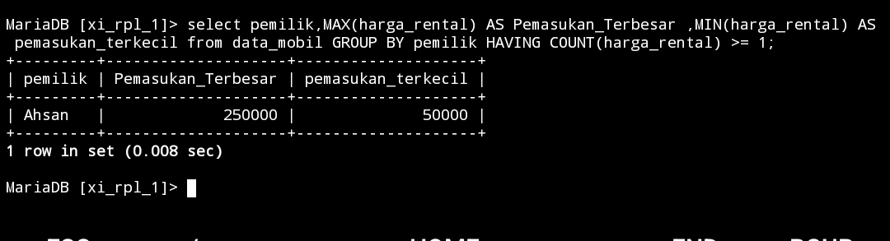

## 1.tampilkan jumlah data mobil dan kelompok kan berdasarkan warna nya sesuai dengan tabel mobil kalian.

### Struktur Query
```mysql
select data 2,COUNT(Data 1) AS nama_sementara FROM nama_tabel GROUP BY data 2;
```
### Query
```mysql
select warna,COUNT(id_mobil) AS Jumlah_Data_Mobil FROM data_mobil GROUP BY warna;
```
### Hasil

### Analisis
- `SELECT warna, COUNT(id_mobil) AS Jumlah_Data_Mobil`: Menginstruksikan database untuk memilih kolom `warna` dan menghitung jumlah `id_mobil` untuk setiap kelompok warna, dengan hasil perhitungan diberi alias `Jumlah_Data_Mobil`.
- `FROM data_mobil`: Menentukan tabel `data_mobil` sebagai sumber data untuk query ini.
- `GROUP BY warna`: Mengelompokkan baris dalam tabel berdasarkan nilai dalam kolom `warna`. Untuk setiap kelompok (setiap warna), fungsi `COUNT(id_mobil)` menghitung jumlah baris dalam kelompok tersebut.
### Kesimpulan 
Query ini digunakan untuk mendapatkan jumlah mobil berdasarkan warna dari tabel `data_mobil`. Dengan mengelompokkan data berdasarkan kolom `warna` dan menggunakan fungsi agregat `COUNT(id_mobil)`, kita dapat mengetahui berapa banyak mobil dari setiap warna yang ada dalam tabel tersebut. Hasilnya disajikan dengan dua kolom: `warna` dan `Jumlah_Data_Mobil`.
___
## 2.berdasarkan query ini tampilkan yang lebih BESAR dari 3 atau sama dengan 3 pemilik mobil nya

### Struktur Query
```mysql
select data 3,COUNT(id_mobil) AS nama_sementara from nama_tabel GROUP BY data 3 HAVING COUNT(data 1) >= 3;
```
### Query
```mysql
select pemilik,COUNT(id_mobil) AS jumlah_mobil from data_mobil GROUP BY pemilik HAVING COUNT(id_mobil) >= 3;
```
### Hasil

### Analisis
- `SELECT pemilik, COUNT(id_mobil) AS jumlah_mobil` : Menginstruksikan database untuk memilih kolom `pemilik` dan menghitung jumlah `id_mobil` untuk setiap kelompok pemilik, dengan hasil perhitungan diberi alias `jumlah_mobil`.
- `FROM data_mobil`: Menentukan tabel `data_mobil` sebagai sumber data untuk query ini.
- `GROUP BY pemilik`: Mengelompokkan baris dalam tabel berdasarkan nilai dalam kolom `pemilik`. Untuk setiap kelompok (setiap pemilik), fungsi `COUNT(id_mobil)` menghitung jumlah baris dalam kelompok tersebut.
- `HAVING COUNT(id_mobil) >= 3`: Menyaring hasil sehingga hanya kelompok yang memiliki `COUNT(id_mobil)` sama dengan atau lebih besar dari 3 yang disertakan dalam hasil akhir.
### Kesimpulan
Query ini digunakan untuk mendapatkan daftar pemilik yang memiliki setidaknya 3 mobil. Dengan mengelompokkan data berdasarkan kolom `pemilik` dan menggunakan fungsi agregat `COUNT(id_mobil)`, kita dapat mengetahui jumlah mobil yang dimiliki oleh setiap pemilik. Klausa `HAVING` memastikan bahwa hanya pemilik dengan 3 atau lebih mobil yang disertakan dalam hasil.
___
## 3.tampilkan smua pemilik dengan jumlah mobilnya yang memiliki atau sama dengan 3 mobil
###  Struktur Query
```mysql
SELECT nama_data,COUNT(nama_data) AS nama_sementara FROM nama_tabel GROUP BY nama_data;
```
### Query
```mysql
SELECT pemilik, 
COUNT(id_mobil) AS jumlah_mobil 
FROM mobil GROUP BY pemilik;
```
### Hasil

### Analisis
`SELECT pemilik, COUNT(id_mobil) AS jumlah_mobil`: Menginstruksikan database untuk memilih kolom `pemilik` dan menghitung jumlah `id_mobil` untuk setiap kelompok `pemilik`, dengan hasil perhitungan diberi alias `jumlah_mobil`.
`FROM mobil`: Menentukan tabel `mobil` sebagai sumber data untuk query ini.
`GROUP BY pemilik`: Mengelompokkan baris dalam tabel berdasarkan nilai dalam kolom `pemilik`. Untuk setiap kelompok (setiap pemilik), fungsi `COUNT(id_mobil)` menghitung jumlah baris dalam kelompok tersebut.
### Kesimpulan
Query ini digunakan untuk mendapatkan jumlah mobil yang dimiliki oleh setiap pemilik. Dengan mengelompokkan data berdasarkan kolom `pemilik` dan menggunakan fungsi agregat `COUNT(id_mobil),` kita dapat mengetahui jumlah mobil yang dimiliki oleh setiap pemilik. Hasilnya disajikan dengan dua kolom: `pemilik` dan `jumlah_mobil`.
___
## 4.berdasarkan query yang ada pada praktikum 5 bagian 7 tampilkan data pada table mobil dengan mengelompokkan berdasarkan pemiliknya.hitung menggunakan sum total pendapatan pemilik berdasarkan harga rental

### Struktur Query
```mysql
select data 3,SUM(data 5) AS nama_sementara from nama_tabel GROUP BY data 3;
```
### Query
```mysql
select pemilik,SUM(harga_rental) AS jumlah_pendapatan from data_mobil GROUP BY pemilik;
```
### Hasil

### Analisis
- `SELECT pemilik, SUM(harga_rental) AS jumlah_pendapatan`: Menginstruksikan database untuk memilih kolom `pemilik` dan menjumlahkan nilai `harga_rental` untuk setiap kelompok pemilik, dengan hasil perhitungan diberi alias jumlah_pendapatan.
- `FROM data_mobil`: Menentukan tabel `data_mobil` sebagai sumber data untuk query ini.
- `GROUP BY pemilik`: Mengelompokkan baris dalam tabel berdasarkan nilai dalam kolom `pemilik`. Untuk setiap kelompok (setiap pemilik), fungsi `SUM(harga_rental)` menjumlahkan nilai `harga_rental` dalam kelompok tersebut.
### Kesimpulan
Query ini digunakan untuk mendapatkan jumlah total pendapatan dari `harga_rental` untuk setiap pemilik mobil. Dengan mengelompokkan data berdasarkan kolom `pemilik` dan menggunakan fungsi agregat `SUM(harga_rental)`, kita dapat mengetahui total pendapatan rental yang diperoleh oleh masing-masing pemilik. Hasilnya disajikan dalam dua kolom: `pemilik` dan `jumlah_pendapatan`.
___
## 5. Berdasarkan praktikum 5 query no 8 tampilkan jumlah pemasukan pemilik berdasarkan harga rental kelompokkan berdasarkan pemiliknya dan seleksi yang total pemasukannya atau harga rentalnya mencapai lebih besar atau sama dengan 300k

### Struktur Query
```mysql
select data_mobil,SUM(data_mobil) AS nama_sementara from nama_tabel GROUP BY data_mobil HAVING SUM(data_mobil) >= 300000;
```
### Query
```mysql
select pemilik,SUM(harga_rental) AS jumlah_pemasukan from data_mobil GROUP BY pemilik HAVING SUM(harga_rental) >= 300000;
```
### Hasil

### Analisis
- `SELECT pemilik, SUM(harga_rental) AS jumlah_pemasukan`: Menginstruksikan database untuk memilih kolom `pemilik` dan menjumlahkan nilai `harga_rental` untuk setiap kelompok pemilik, dengan hasil perhitungan diberi alias `jumlah_pemasukan`.
- `FROM data_mobil`: Menentukan tabel `data_mobil` sebagai sumber data untuk query ini.
- `GROUP BY pemilik`: Mengelompokkan baris dalam tabel berdasarkan nilai dalam kolom `pemilik`. Untuk setiap kelompok (setiap pemilik), fungsi `SUM(harga_rental)` menjumlahkan nilai `harga_rental` dalam kelompok tersebut.
- `HAVING SUM(harga_rental) >= 300000`: Menyaring hasil sehingga hanya kelompok yang memiliki jumlah total `harga_rental` lebih besar atau sama dengan 300000 yang disertakan dalam hasil akhir.
### Kesimpulan
Query ini digunakan untuk mendapatkan pemilik mobil yang memiliki jumlah total pendapatan dari `harga_rental` sebesar atau lebih dari 300000. Dengan mengelompokkan data berdasarkan kolom `pemilik` dan menggunakan fungsi agregat `SUM(harga_rental)`, kita dapat mengetahui total pendapatan rental yang diperoleh oleh masing-masing pemilik dan menyaring hanya yang memenuhi syarat tertentu (>= 300000). Hasilnya disajikan dalam dua kolom: `pemilik` dan `jumlah_pemasukan`.
___
## 6. Berdasarkan praktikum 6 no 12 tampilkan rata rata pemasukan pemilik mobil kelompokkan berdasarkan pemiliknya
### Struktur Query
```mysql
select nama_data,AVG(nama_data) AS nama_sementara from nama_tabel GROUP BY nama_data;
```
### Query 
```mysql
select pemilik,AVG(harga_rental) AS rata_pemasukam from data_mobil GROUP BY pemilik;
```
### Hasil

### Analisis
- `SELECT pemilik, AVG(harga_rental) AS rata_pemasukan`: Instruksi untuk memilih kolom `pemilik` dan menghitung rata-rata `harga_rental` untuk setiap kelompok `pemilik`, dengan hasil perhitungan diberi alias `rata_pemasukan`. 
- `FROM data_mobil`: Menentukan tabel `data_mobil` sebagai sumber data untuk query ini.
- `GROUP BY pemilik`: Mengelompokkan baris dalam tabel berdasarkan nilai unik dalam kolom `pemilik`. Fungsi `AVG(harga_rental`) diterapkan pada setiap kelompok untuk menghitung rata-rata `harga_rental` dalam kelompok tersebut.
### Kesimpulan
Query ini digunakan untuk menghitung rata-rata pendapatan (`harga_rental`) untuk setiap pemilik mobil (`pemilik`) berdasarkan data yang tersimpan dalam tabel `data_mobil`. Dengan mengelompokkan data berdasarkan kolom `pemilik` dan menggunakan fungsi agregat `AVG(harga_rental)`, kita dapat mengetahui rata-rata pendapatan rental yang diperoleh oleh setiap pemilik mobil. Hasilnya disajikan dalam dua kolom: `pemilik` dan `rata_pemasukan`.
___
## 7. Berdasarkan praktikum 5 no 16 tampilkan pemasukan  terbesar dan pemasukan terkecil kelompokkan berdasarkan pemiliknya dan seleksi data pemilik yg tampil atau memiliki jumlah mobil lebih besar dari 1.

### Struktur
```mysql
select nama_data,MAX(nama_data) AS nama_sementara,MIN(nama_data) AS nama_sementara from nama_tabel GROUP BY nama_data HAVING COUNT(nama_data) >= 1;
```
### Query
```mysql
select pemilik,MAX(harga_rental) AS Pemasukan_Terbesar ,MIN(harga_rental) AS pemasukan_terkecil from data_mobil GROUP BY pemilik HAVING COUNT(harga_rental) >= 1;
```
### Hasil

### Analisis

 - `SELECT`: Memilih kolom untuk ditampilkan dalam hasil query.
 - `pemilik`: Kolom yang menunjukkan pemilik dari mobil.
 - `MAX(harga_rental) AS Pemasukan_Terbesar`: Menggunakan fungsi agregat `MAX` untuk menemukan nilai terbesar dari kolom `harga_rental` dalam setiap grup `pemilik`. Hasilnya diberi alias `Pemasukan_Terbesar`.
 - `MIN(harga_rental) AS Pemasukan_Terkecil`: Menggunakan fungsi agregat `MIN` untuk menemukan nilai terkecil dari kolom `harga_rental` dalam setiap grup `pemilik`. Hasilnya diberi alias `Pemasukan_Terkecil`.
- `FROM data_mobil`: Menentukan tabel `data_mobil` sebagai sumber data untuk query.
- `GROUP BY pemilik`: Mengelompokkan hasil query berdasarkan kolom `pemilik`. Setiap pemilik akan menjadi satu grup terpisah.
- `HAVING`: Filter yang digunakan setelah pengelompokan (`GROUP BY`).
-  `COUNT(harga_rental) >= 1`: Menggunakan fungsi agregat `COUNT` untuk menghitung jumlah entri `harga_rental` dalam setiap grup `pemilik` dan hanya menyertakan grup yang memiliki setidaknya satu entri `harga_rental`.
### Kesimpulan
Query ini bertujuan untuk menampilkan setiap pemilik mobil, bersama dengan nilai tertinggi (`Pemasukan_Terbesar`) dan terendah (`Pemasukan_Terkecil`) dari harga rental mobil mereka, hanya jika mereka memiliki setidaknya satu harga rental yang tercatat.