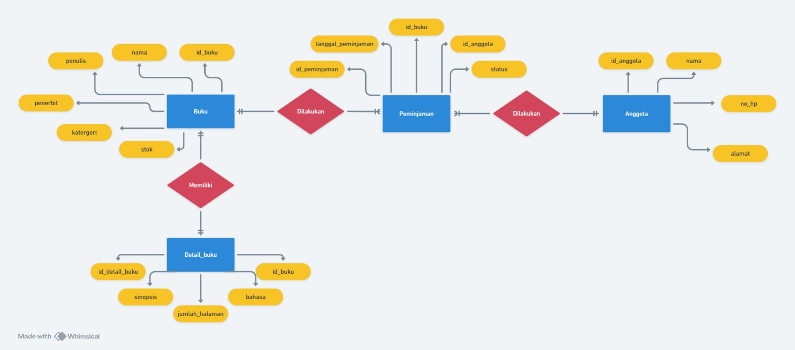

# Penjelasan Relasi
## 1-1 one to one
Satu baris data pada tabel A berkaitan dengan satu baris data pada tabel B

## 1-N one to many
Satu baris data pada tabel A berkaitan dengan banyak baris data pada tabel B

## N-N many to many
Satu baris data pada tabel A berkaitan dengan banyak baris data pada tabel B, begitupun sebaliknya bahwa satu baris data pada tabel B berkaitan dengan banyak baris data pada tabel A

# ERD

# Table

# Deskripsi relasi
## 1. **Relasi "Memiliki" antara Buku dan Detail_buku**

- **Relasi:** Satu entitas _Buku_ bisa "Memiliki" banyak entitas _Detail_buku_.
- **Penjelasan Relasi:** Buku sering kali membutuhkan informasi tambahan yang tidak ada dalam data dasar seperti nama, penulis, atau penerbit. Detail spesifik seperti jumlah halaman, sinopsis, atau bahasa buku tersebut bisa berubah tergantung edisi atau versi buku. Oleh karena itu, informasi ini disimpan dalam entitas _Detail_buku_.
- **Alasan Relasi:** Agar data lebih modular dan fleksibel. Dengan relasi ini, _Buku_ cukup memiliki satu ID yang bisa digunakan untuk menghubungkan berbagai detail tanpa mengulang data di tempat yang sama.

## 2. **Relasi "Dilakukan" antara Buku dan Peminjaman**

- **Relasi:** Satu _Buku_ bisa terlibat dalam banyak _Peminjaman_.
- **Penjelasan Relasi:** Buku dalam perpustakaan sering dipinjam oleh banyak orang, sehingga penting untuk mencatat setiap kali sebuah buku dipinjam. Dengan membuat relasi ini, kita dapat melacak setiap buku yang pernah dipinjam, kapan dipinjam, dan statusnya.
- **Alasan Relasi:** Untuk mengelola riwayat peminjaman setiap buku. Sistem ini memungkinkan perpustakaan melacak siapa yang sedang meminjam buku atau apakah buku tersebut sudah dikembalikan.

## 3. **Relasi "Dilakukan" antara Anggota dan Peminjaman**

- **Relasi:** Satu _Anggota_ bisa memiliki banyak _Peminjaman_.
- **Penjelasan Relasi:** Setiap anggota perpustakaan dapat meminjam beberapa buku, dan transaksi peminjaman perlu dicatat secara individu untuk melacak riwayat peminjaman setiap anggota.
- **Alasan Relasi:** Ini memungkinkan sistem melacak setiap transaksi peminjaman yang dilakukan oleh anggota. Jika ada buku yang belum dikembalikan atau terlambat, informasi ini bisa dihubungkan langsung ke anggota terkait.

## 4. **Relasi Tidak Langsung antara Buku dan Anggota melalui Peminjaman**

- **Relasi:** _Buku_ dan _Anggota_ terhubung melalui entitas _Peminjaman_.
- **Penjelasan Relasi:** Anggota meminjam buku melalui sebuah transaksi peminjaman yang tercatat di _Peminjaman_. Dengan kata lain, hubungan antara buku dan anggota terjadi melalui tindakan peminjaman.
- **Alasan Relasi:** Ini membantu memisahkan informasi peminjaman dari detail anggota atau buku. Peminjaman bisa diatur sebagai transaksi independen, sehingga jika sebuah buku dipinjam berkali-kali atau oleh anggota yang berbeda, riwayat tersebut tercatat dengan baik tanpa mengubah data anggota atau buku.