# Tabel Keaktifan

| No  | Nama    | Skor | Ket                                                 |
| --- | ------- | ---- | --------------------------------------------------- |
| 1   | Fatur   | 3    | Mengerjakan Program                                 |
| 2   | Ahsan   | 3    | Mengerjakan Program                                 |
| 3   | Zhafran | 3    | Mencari Penjelasan Fitur Pegawai dan Pembeli        |
| 4   | Agis    | 3    | Membantu dalam program dan Mencari penjelasan Fitur |
# 1.Deskripsi fitur: menjelaskan gambaran umum dari masing-masing fitur dari aplikasi yang dibuat

## Halaman Login
### Tampilan
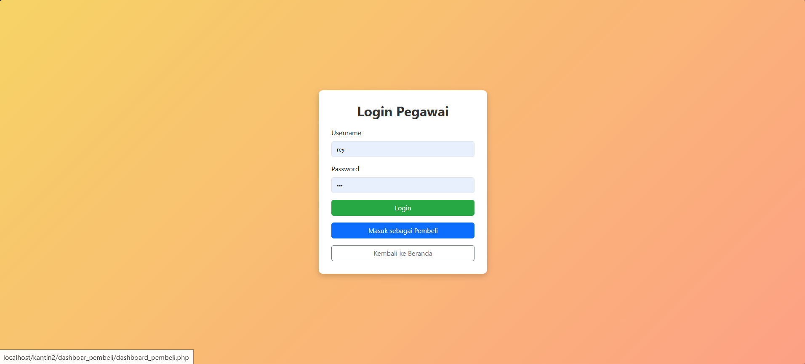
### Penjelasan 
**Input Username & Password:** Pengguna harus memasukkan username dan password untuk masuk.  
**Tombol Hijau (Login):** Untuk login sebagai pegawai.  
**Tombol Biru (Masuk sebagai Pembeli):** Opsi untuk masuk sebagai pembeli.  
 **Tombol Abu-abu (Kembali ke Beranda):** Untuk kembali ke halaman utama.
## Halaman Produk
### Tampilan
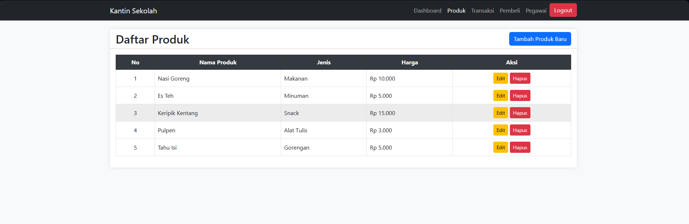
### Penjelasan
**Navigasi di atas** : Berisi menu seperti _Dashboard, Produk, Transaksi, Pembeli, Pegawai_, dan tombol _Logout_ berwarna merah.  

 **Tabel Produk**  Berisi informasi:
- **No** → Nomor urut produk
- **Nama Produk** → Nama barang yang dijual
- **Jenis** → Kategori barang (_Makanan, Minuman, Snack, dll._)
- **Harga** → Harga dalam Rupiah
- **Aksi** → Tombol _Edit_ (kuning) untuk mengubah data & _Hapus_ (merah) untuk menghapus produk

 **Tombol "Tambah Produk Baru"** : Warna biru untuk menambahkan produk baru ke daftar.
## Halaman Transaksi
### Tampilan
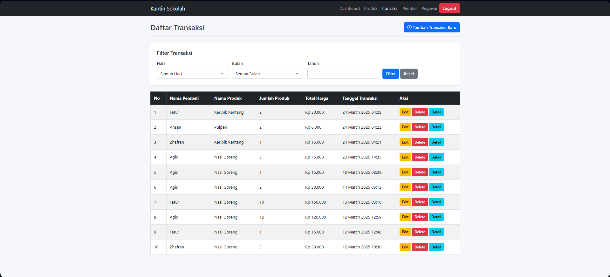
### Penjelasan

**Filter Transaksi** :
- **Hari, Bulan, Tahun** : Memungkinkan pengguna menyaring data transaksi sesuai periode tertentu.
- **Tombol Filter & Reset** : Untuk menyaring atau mengembalikan data ke kondisi awal.  

**Tabel Transaksi** :
- **No** : Nomor urut transaksi.
- **Nama Pembeli** : Nama orang yang melakukan transaksi.
- **Nama Produk** : Produk yang dibeli.
- **Jumlah Produk** : Banyaknya produk yang dibeli.
- **Total Harga** : Harga keseluruhan dalam transaksi.
- **Tanggal Transaksi** : Waktu transaksi dilakukan.
- **Aksi** :
    - _Edit_ (kuning) : Mengedit data transaksi.
        
    - _Delete_ (merah) : Menghapus transaksi.
        
    - _Detail_ (biru) : Melihat detail transaksi.  

 **Tombol "Tambah Transaksi Baru"** : Untuk menambahkan transaksi baru.

## Halaman Pembeli

### Tampilan

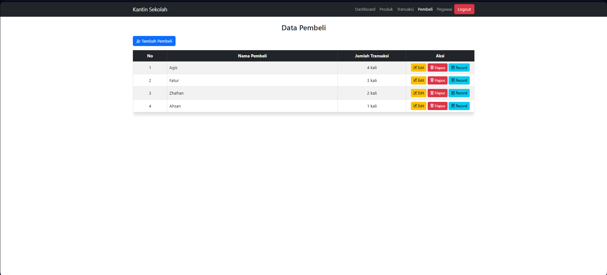

### Penjelasan

 **Tombol "Tambah Pembeli"** : Untuk menambahkan pembeli baru.  
 
 **Tabel Data Pembeli** : 
- **No** 
- **Nama Pembeli** 
- **Jumlah Transaksi**
- **Aksi** 
    - _Edit_ (kuning) → Mengedit data pembeli.
    - _Hapus_ (merah) → Menghapus data pembeli.
    - _Record_ (biru) → Melihat riwayat transaksi pembeli.

## Halaman Pegawai

### Tampilan
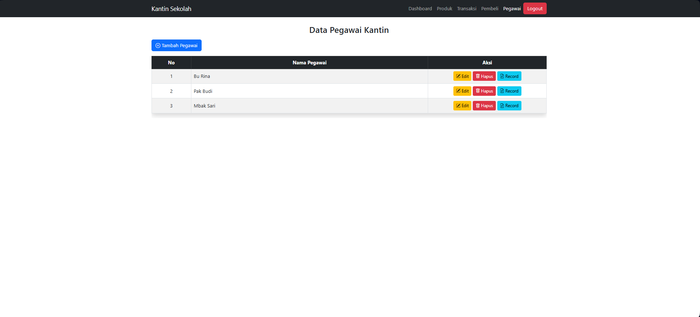
### Penjelasan

**Tombol "Tambah Pegawai"** : Untuk menambahkan pegawai baru.  

 **Tabel Data Pegawai** : Berisi:
- **No**
- **Nama Pegawai** 
- **Aksi** 
    - _Edit_ (kuning) → Mengedit data pegawai.
    - _Hapus_ (merah) → Menghapus data pegawai.
    - _Record_ (biru) → Melihat riwayat transaksi pegawai.


# 2.Database: gambar database dan penjelasan dari masing-masing tabel yang digunakan dalam aplikasi

## Database
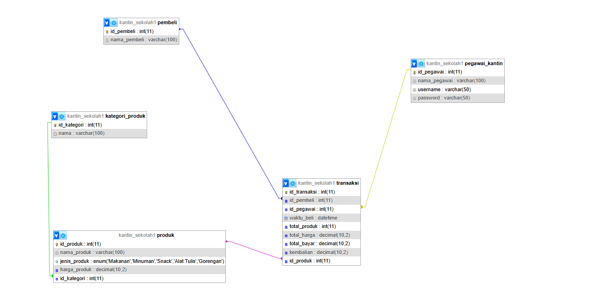
## Penjelasan

### **1. Tabel `pembeli`**

 Menyimpan data pembeli yang melakukan transaksi di kantin.

- `id_pembeli` (int) → ID unik pembeli (Primary Key).
- `nama_pembeli` (varchar) → Nama pembeli.    

 **Relasi**:  
- Terhubung ke tabel **transaksi** melalui `id_pembeli`.


### **2. Tabel `pegawai_kantin`**

 Menyimpan data pegawai kantin.

- `id_pegawai` (int) → ID unik pegawai (Primary Key).
- `nama_pegawai` (varchar) → Nama pegawai.
- `username` (varchar) → Nama pengguna untuk login.
- `password` (varchar) → Kata sandi untuk login.

 **Relasi**:  
 -  Terhubung ke tabel **transaksi** melalui `id_pegawai`.


### **3. Tabel `kategori_produk`**

 Menyimpan data kategori produk yang dijual di kantin.

- `id_kategori` (int) → ID unik kategori (Primary Key).
- `nama` (varchar) → Nama kategori produk.

 **Relasi**:  
-  Terhubung ke tabel **produk** melalui `id_kategori`.


### **4. Tabel `produk`**

 Menyimpan data produk yang dijual di kantin.

- `id_produk` (int) → ID unik produk (Primary Key).
- `nama_produk` (varchar) → Nama produk.
- `jenis_produk` (enum) → Jenis produk, bisa berupa:  

     - `Makanan`  
     - `Minuman`  
     - `Snack`  
     - `Alat Tulis`  
     - `Gorengan`
    
- `harga_produk` (decimal) → Harga produk.
- `id_kategori` (int) → Kategori produk (Foreign Key dari `kategori_produk`).

 **Relasi**:  
-  Terhubung ke tabel **kategori_produk** melalui `id_kategori`.  
-  Terhubung ke tabel **transaksi** melalui `id_produk`.


### **5. Tabel `transaksi`**

 Menyimpan data transaksi yang terjadi di kantin.

- `id_transaksi` (int) → ID unik transaksi (Primary Key).
- `id_pembeli` (int) → ID pembeli (Foreign Key dari `pembeli`).
- `id_pegawai` (int) → ID pegawai (Foreign Key dari `pegawai_kantin`).
- `waktu_beli` (datetime) → Waktu transaksi.
- `total_produk` (int) → Jumlah produk yang dibeli.
- `total_harga` (decimal) → Total harga dari produk yang dibeli.
- `total_bayar` (decimal) → Jumlah uang yang dibayarkan pembeli.
- `kembalian` (decimal) → Uang kembalian jika ada.
- `id_produk` (int) → ID produk yang dibeli (Foreign Key dari `produk`).

 **Relasi**:  
-  Terhubung ke tabel **pembeli** melalui `id_pembeli`.  
-  Terhubung ke tabel **pegawai_kantin** melalui `id_pegawai`.  
-  Terhubung ke tabel **produk** melalui `id_produk`.
# Fitur
## Produk 
### Tampilan Produk
#### **1. Rincian Fitur**

##### **a. Tampilan Fitur**
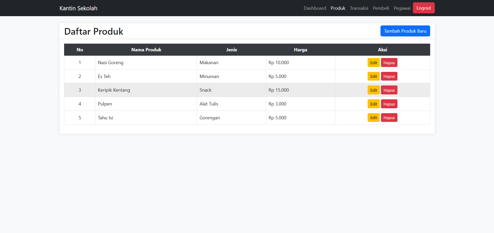
Fitur ini menampilkan daftar produk di kantin sekolah dengan opsi untuk menambah, mengedit, dan menghapus produk.

###### **Kode**
```php
<?php

include 'koneksi.php';

  

$result = $conn->query("SELECT * FROM produk");

?>

<!DOCTYPE html>

<html lang="id">

<head>

    <meta charset="UTF-8">

    <meta name="viewport" content="width=device-width, initial-scale=1.0">

    <title>Produk - Kantin Sekolah</title>

    <link rel="stylesheet" href="https://cdn.jsdelivr.net/npm/bootstrap@5.3.0/dist/css/bootstrap.min.css">

    <style>

        body {

            background-color: #f8f9fa;

        }

        .table th {

            background-color: #343a40 !important;

            color: white;

            text-align: center;

        }

        .table td {

            vertical-align: middle;

        }

        .btn {

            transition: 0.3s ease-in-out;

        }

        .btn:hover {

            opacity: 0.8;

        }

        .card {

            box-shadow: 0 0 10px rgba(0, 0, 0, 0.1);

            border: none;

        }

    </style>

</head>

<body>

    <nav class="navbar navbar-expand-lg navbar-dark bg-dark">

        <div class="container">

            <a class="navbar-brand" href="#">Kantin Sekolah</a>

            <button class="navbar-toggler" type="button" data-bs-toggle="collapse" data-bs-target="#navbarNav">

                <span class="navbar-toggler-icon"></span>

            </button>

            <div class="collapse navbar-collapse" id="navbarNav">

                <ul class="navbar-nav ms-auto">

                    <li class="nav-item"><a class="nav-link" href="dashboard.php">Dashboard</a></li>

                    <li class="nav-item"><a class="nav-link active" href="produk.php">Produk</a></li>

                    <li class="nav-item"><a class="nav-link" href="transaksi.php">Transaksi</a></li>

                    <li class="nav-item"><a class="nav-link" href="pembeli.php">Pembeli</a></li>

                    <li class="nav-item"><a class="nav-link" href="pegawai.php">Pegawai</a></li>

                    <li class="nav-item"><a class="btn btn-danger" href="login.php">Logout</a></li>

                </ul>

            </div>

        </div>

    </nav>

  

    <div class="container mt-4">

        <div class="card">

            <div class="card-header bg-white">

                <div class="d-flex justify-content-between align-items-center">

                    <h2 class="mb-0">Daftar Produk</h2>

                    <a href="tambah_produk.php" class="btn btn-primary">

                        <i class="bi bi-plus-circle"></i> Tambah Produk Baru

                    </a>

                </div>

            </div>

            <div class="card-body">

                <div class="table-responsive">

                    <table class="table table-bordered table-hover">

                        <thead class="table-dark">

                            <tr>

                                <th>No</th>

                                <th>Nama Produk</th>

                                <th>Jenis</th>

                                <th>Harga</th>

                                <th>Aksi</th>

                            </tr>

                        </thead>

                        <tbody>

                            <?php

                            $no = 1;

                            while ($row = $result->fetch_assoc()) {

                                echo "<tr>

                                    <td class='text-center'>{$no}</td>

                                    <td>{$row['nama_produk']}</td>

                                    <td>{$row['jenis_produk']}</td>

                                    <td>Rp " . number_format($row['harga_produk'], 0, ',', '.') . "</td>

                                    <td class='text-center'>

                                        <a href='edit_produk.php?id={$row['id_produk']}' class='btn btn-warning btn-sm'>Edit</a>

                                        <a href='hapus_produk.php?id={$row['id_produk']}' class='btn btn-danger btn-sm' onclick='return confirm(\"Yakin ingin menghapus?\")'>Hapus</a>

                                    </td>

                                </tr>";

                                $no++;

                            }

                            ?>

                        </tbody>

                    </table>

                </div>

            </div>

        </div>

    </div>

  

    <script src="https://cdn.jsdelivr.net/npm/bootstrap@5.3.0/dist/js/bootstrap.bundle.min.js"></script>

    <script src="https://cdn.jsdelivr.net/npm/bootstrap-icons@1.11.0/font/bootstrap-icons.css"></script>

</body>

</html>
```

---

##### **b. Kode Program Front-End**

###### **1. Struktur HTML & Bootstrap**

```html
<!DOCTYPE html>
<html lang="id">
<head>
    <meta charset="UTF-8">
    <meta name="viewport" content="width=device-width, initial-scale=1.0">
    <title>Produk - Kantin Sekolah</title>
    <link rel="stylesheet" href="https://cdn.jsdelivr.net/npm/bootstrap@5.3.0/dist/css/bootstrap.min.css">
```

 **Penjelasan**:

- Menentukan tipe dokumen HTML.
- `meta charset="UTF-8"` → Mendukung karakter Unicode.
- `meta name="viewport"` → Responsif di perangkat mobile.
- Menggunakan **Bootstrap 5.3** untuk tampilan yang lebih menarik.

---

###### **2. Navbar (Navigasi)**

```html
<nav class="navbar navbar-expand-lg navbar-dark bg-dark">
    <div class="container">
        <a class="navbar-brand" href="#">Kantin Sekolah</a>
        <button class="navbar-toggler" type="button" data-bs-toggle="collapse" data-bs-target="#navbarNav">
            <span class="navbar-toggler-icon"></span>
        </button>
        <div class="collapse navbar-collapse" id="navbarNav">
            <ul class="navbar-nav ms-auto">
                <li class="nav-item"><a class="nav-link" href="dashboard.php">Dashboard</a></li>
                <li class="nav-item"><a class="nav-link active" href="produk.php">Produk</a></li>
                <li class="nav-item"><a class="nav-link" href="transaksi.php">Transaksi</a></li>
                <li class="nav-item"><a class="nav-link" href="pembeli.php">Pembeli</a></li>
                <li class="nav-item"><a class="nav-link" href="pegawai.php">Pegawai</a></li>
                <li class="nav-item"><a class="btn btn-danger" href="login.php">Logout</a></li>
            </ul>
        </div>
    </div>
</nav>
```

 **Penjelasan**:

- Membuat navbar dengan **Bootstrap**.
- Menggunakan kelas **navbar-expand-lg** agar menu bisa menyusut di layar kecil.
- Menggunakan **ms-auto** agar menu berada di kanan.
- **Produk** diberikan class `"active"` untuk menunjukkan halaman aktif.
- **Logout** dibuat dalam bentuk tombol merah dengan class `btn-danger`.

---

###### **3. Tabel Daftar Produk**

```html
<table class="table table-bordered table-hover">
    <thead class="table-dark">
        <tr>
            <th>No</th>
            <th>Nama Produk</th>
            <th>Jenis</th>
            <th>Harga</th>
            <th>Aksi</th>
        </tr>
    </thead>
    <tbody>
        <?php
        $no = 1;
        while ($row = $result->fetch_assoc()) {
            echo "<tr>
                <td class='text-center'>{$no}</td>
                <td>{$row['nama_produk']}</td>
                <td>{$row['jenis_produk']}</td>
                <td>Rp " . number_format($row['harga_produk'], 0, ',', '.') . "</td>
                <td class='text-center'>
                    <a href='edit_produk.php?id={$row['id_produk']}' class='btn btn-warning btn-sm'>Edit</a>
                    <a href='hapus_produk.php?id={$row['id_produk']}' class='btn btn-danger btn-sm' onclick='return confirm(\"Yakin ingin menghapus?\")'>Hapus</a>
                </td>
            </tr>";
            $no++;
        }
        ?>
    </tbody>
</table>
```

 **Penjelasan**:

- **Tabel** menggunakan `table-bordered` agar ada garis, `table-hover` agar interaktif.
- `thead class="table-dark"` untuk header berwarna hitam.
- **Loop PHP** untuk mengambil data dari database dan menampilkan dalam tabel.
- `number_format($row['harga_produk'], 0, ',', '.')` → Format harga menjadi format rupiah.
- **Tombol Edit** mengarah ke `edit_produk.php?id=...`.
- **Tombol Hapus** memiliki konfirmasi sebelum menghapus data.

---

###### **4 Tombol Tambah Produk**

```html
<a href="tambah_produk.php" class="btn btn-primary">
    <i class="bi bi-plus-circle"></i> Tambah Produk Baru
</a>
```

 **Penjelasan**:

- Tombol **Tambah Produk Baru** dengan warna biru.
- Ikon menggunakan **Bootstrap Icons** (`bi bi-plus-circle`).

---

###### **5. Script & Bootstrap Icons**

```html
<script src="https://cdn.jsdelivr.net/npm/bootstrap@5.3.0/dist/js/bootstrap.bundle.min.js"></script>
<script src="https://cdn.jsdelivr.net/npm/bootstrap-icons@1.11.0/font/bootstrap-icons.css"></script>
```

 **Penjelasan**:

- **Bootstrap JS** → Agar fitur seperti navbar collapse dapat berfungsi.
- **Bootstrap Icons** → Untuk ikon pada tombol tambah produk.

##### **c. Kode Program Back-End**

###### 1. **Mengambil Data dari Database**
```php
$result = $conn->query("SELECT * FROM produk");
```

- Perintah ini mengambil semua data dari tabel `produk` dalam database.
    
- `query("SELECT * FROM produk")` akan mengembalikan objek hasil (`$result`) yang berisi semua baris data dari tabel `produk`.
###### 2. **Menampilkan Data dalam Bentuk Tabel**
```php
while ($row = $result->fetch_assoc()) {
    echo "<tr>
        <td class='text-center'>{$no}</td>
        <td>{$row['nama_produk']}</td>
        <td>{$row['jenis_produk']}</td>
        <td>Rp " . number_format($row['harga_produk'], 0, ',', '.') . "</td>
        <td class='text-center'>
            <a href='edit_produk.php?id={$row['id_produk']}' class='btn btn-warning btn-sm'>Edit</a>
            <a href='hapus_produk.php?id={$row['id_produk']}' class='btn btn-danger btn-sm' onclick='return confirm(\"Yakin ingin menghapus?\")'>Hapus</a>
        </td>
    </tr>";
    $no++;
}
```
- **`while ($row = $result->fetch_assoc())`**

    - Mengambil satu per satu baris data dalam bentuk array asosiatif.
    - Menggunakan `fetch_assoc()` untuk mendapatkan data dalam format `['nama_kolom' => nilai]`.
	        
- **Menampilkan data dalam tabel**
    
    - `{$row['nama_produk']}`: Menampilkan nama produk.
    - `{$row['jenis_produk']}`: Menampilkan jenis produk.
    - `Rp " . number_format($row['harga_produk'], 0, ',', '.') . "`: Menampilkan harga produk dalam format mata uang Indonesia.
        
- **Tombol Edit dan Hapus**
    
    - `edit_produk.php?id={$row['id_produk']}`: Mengarahkan ke halaman edit dengan membawa `id_produk` sebagai parameter.
    - `hapus_produk.php?id={$row['id_produk']}`: Menghapus produk dengan `id_produk` tertentu (akan dikonfirmasi terlebih dahulu).
##### **d. Analisis**

###### **1. Penjelasan Kode Program**

Kode program ini adalah halaman yang menampilkan daftar produk dalam sistem kantin sekolah berbasis web. Program ini berfungsi untuk mengambil data dari database dan menampilkannya dalam bentuk tabel. Selain itu, terdapat fitur untuk menambah, mengedit, dan menghapus produk.

Pada bagian awal, program melakukan koneksi ke database menggunakan file `koneksi.php`. Setelah itu, data produk diambil dari database menggunakan perintah SQL `SELECT * FROM produk`, yang kemudian disimpan dalam variabel `$result`.

Tampilan halaman dibuat menggunakan **HTML dan Bootstrap 5.3**, dengan navbar yang berisi menu **Dashboard, Produk, Transaksi, Pembeli, Pegawai, dan Logout**.

Bagian utama halaman ini adalah sebuah **tabel** yang menampilkan daftar produk. Setiap baris tabel berisi **nomor, nama produk, jenis produk, harga**, serta tombol aksi untuk **mengedit dan menghapus** produk.

Ketika pengguna mengklik tombol **Edit**, mereka akan diarahkan ke halaman `edit_produk.php` untuk mengubah data produk yang dipilih. Jika pengguna mengklik tombol **Hapus**, program akan meminta konfirmasi sebelum menghapus produk dari database melalui halaman `hapus_produk.php`.

---

###### **2. Database yang Digunakan**

Program ini menggunakan **database MySQL**. Berdasarkan kode program, data produk disimpan dalam tabel `produk`, yang kemungkinan memiliki struktur berikut:

- `id_produk` (INT, Primary Key, Auto Increment) – sebagai ID unik untuk setiap produk.
- `nama_produk` (VARCHAR) – menyimpan nama produk.
- `jenis_produk` (VARCHAR) – menyimpan jenis atau kategori produk.
- `harga_produk` (INT) – menyimpan harga produk dalam bentuk angka.

Setiap kali halaman ini diakses, sistem mengambil semua data dari tabel `produk` dan menampilkannya dalam tabel HTML.

---

###### **3. Peran Fitur dalam Mengelola Database**

Program ini memiliki beberapa fitur utama dalam mengelola data produk dalam database, antara lain:

1. **Menampilkan Data Produk**
    
    - Mengambil semua data produk dari database dan menampilkannya dalam tabel HTML.
    - Memformat harga produk agar lebih mudah dibaca oleh pengguna.
2. **Menambah Produk Baru**
    
    - Terdapat tombol **Tambah Produk Baru** yang mengarah ke halaman `tambah_produk.php`.
    - Halaman tersebut berisi form untuk memasukkan data produk baru ke dalam database.
3. **Mengedit Produk**
    
    - Setiap produk memiliki tombol **Edit**, yang mengarah ke halaman `edit_produk.php?id=ID_PRODUK`.
    - Di halaman tersebut, pengguna dapat mengubah data produk yang sudah ada.
4. **Menghapus Produk**
    
    - Terdapat tombol **Hapus** untuk setiap produk.
    - Sebelum menghapus, sistem menampilkan pesan konfirmasi agar pengguna tidak menghapus data secara tidak sengaja.
    - Jika pengguna mengonfirmasi penghapusan, data akan dihapus dari database melalui halaman `hapus_produk.php?id=ID_PRODUK`.

Dengan fitur-fitur ini, sistem kantin sekolah dapat dengan mudah mengelola daftar produk, termasuk menambah, mengubah, dan menghapus data sesuai kebutuhan.
#### **2. Relasi**
##### **1. Tujuan Relasi dalam Program**

Program ini bertujuan untuk mengelola data produk di kantin sekolah, termasuk menampilkan daftar produk, menambahkan produk baru, mengedit produk yang sudah ada, dan menghapus produk. Relasi dalam program digunakan untuk menghubungkan data produk dengan basis data MySQL, memungkinkan pengguna untuk mengakses, memodifikasi, dan mengelola informasi produk secara dinamis.

##### **2. Analisis Relasi dalam Program**

Relasi utama dalam program ini terdapat antara halaman PHP dan database MySQL melalui perintah SQL (`SELECT`, `INSERT`, `UPDATE`, `DELETE`). Beberapa relasi yang dapat diidentifikasi dalam program ini meliputi:

- **Relasi antara produk dan tabel database**:  
    Program ini mengambil data produk dari tabel `produk` dalam database dan menampilkannya dalam bentuk tabel HTML.
- **Relasi antara halaman PHP**:
    - `produk.php` menampilkan daftar produk.
    - `tambah_produk.php` digunakan untuk menambahkan produk baru.
    - `edit_produk.php` digunakan untuk memperbarui data produk berdasarkan `id_produk`.
    - `hapus_produk.php` digunakan untuk menghapus produk berdasarkan `id_produk`.
- **Relasi antara tombol aksi dan operasi database**:
    - Tombol "Edit" mengarah ke `edit_produk.php?id=ID_PRODUK`, yang mengambil data produk berdasarkan ID dan memungkinkan pengeditan.
    - Tombol "Hapus" mengarah ke `hapus_produk.php?id=ID_PRODUK`, yang menghapus produk dengan ID tertentu setelah konfirmasi pengguna.

##### **3. Cara Kerja Relasi dalam Fitur Program**

- **Menampilkan Data Produk**:
    
    1. `produk.php` menjalankan kueri `SELECT * FROM produk` untuk mengambil semua data produk dari database.
    2. Data yang diambil ditampilkan dalam tabel HTML menggunakan perulangan `while`.
    3. Setiap produk memiliki opsi "Edit" dan "Hapus" yang terkait dengan `id_produk`.
- **Menambah Produk**:
    
    1. Pengguna mengklik tombol "Tambah Produk Baru", yang mengarahkan ke `tambah_produk.php`.
    2. Setelah mengisi formulir, data dikirim melalui `POST` ke database menggunakan kueri `INSERT INTO produk`.
    3. Jika berhasil, data produk baru ditambahkan dan ditampilkan di `produk.php`.
- **Mengedit Produk**:
    
    1. Pengguna mengklik tombol "Edit", yang mengarah ke `edit_produk.php?id=ID_PRODUK`.
    2. Program mengambil data produk berdasarkan `id_produk` menggunakan kueri `SELECT`.
    3. Pengguna dapat mengubah data dan menyimpannya melalui kueri `UPDATE produk SET ... WHERE id_produk = ID_PRODUK`.
- **Menghapus Produk**:
    
    1. Pengguna mengklik tombol "Hapus", yang memicu konfirmasi JavaScript.
    2. Jika dikonfirmasi, halaman `hapus_produk.php` dijalankan dengan parameter `id_produk`.
    3. Program menjalankan kueri `DELETE FROM produk WHERE id_produk = ID_PRODUK` untuk menghapus produk dari database.

### Tambah Produk
#### **1.Rincian Fitur**

##### **a Tampilan Fitur**
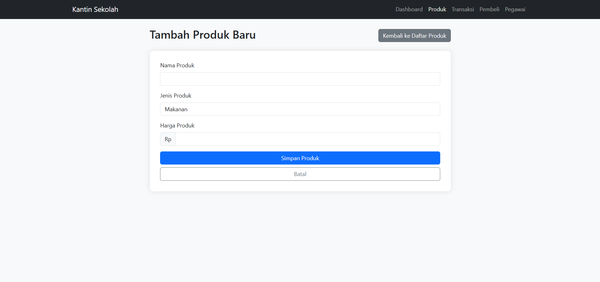

###### **Kode**
```php
<?php

include 'koneksi.php';

  

if ($_SERVER["REQUEST_METHOD"] == "POST") {

    $nama_produk = $_POST['nama_produk'];

    $jenis_produk = $_POST['jenis_produk'];

    $harga_produk = $_POST['harga_produk'];

  

    $query = "INSERT INTO produk (nama_produk, jenis_produk, harga_produk) VALUES ('$nama_produk', '$jenis_produk', '$harga_produk')";

    $conn->query($query);

  

    header("Location: produk.php");

    exit;

}

  

// Mengambil daftar jenis produk yang sudah ada

$kategori_result = $conn->query("SELECT DISTINCT jenis_produk FROM produk");

?>

  

<!DOCTYPE html>

<html lang="id">

<head>

    <meta charset="UTF-8">

    <meta name="viewport" content="width=device-width, initial-scale=1.0">

    <title>Tambah Produk - Kantin Sekolah</title>

    <link rel="stylesheet" href="https://cdn.jsdelivr.net/npm/bootstrap@5.3.0/dist/css/bootstrap.min.css">

    <style>

        body {

            background-color: #f8f9fa;

        }

        .form-container {

            background: white;

            padding: 30px;

            border-radius: 10px;

            box-shadow: 0 0 15px rgba(0, 0, 0, 0.1);

            margin-top: 20px;

        }

        .btn {

            transition: 0.3s ease-in-out;

        }

        .btn:hover {

            opacity: 0.8;

        }

    </style>

</head>

<body>

    <nav class="navbar navbar-expand-lg navbar-dark bg-dark">

        <div class="container">

            <a class="navbar-brand" href="#">Kantin Sekolah</a>

            <button class="navbar-toggler" type="button" data-bs-toggle="collapse" data-bs-target="#navbarNav">

                <span class="navbar-toggler-icon"></span>

            </button>

            <div class="collapse navbar-collapse" id="navbarNav">

                <ul class="navbar-nav ms-auto">

                    <li class="nav-item"><a class="nav-link" href="dashboard.php">Dashboard</a></li>

                    <li class="nav-item"><a class="nav-link active" href="produk.php">Produk</a></li>

                    <li class="nav-item"><a class="nav-link" href="transaksi.php">Transaksi</a></li>

                    <li class="nav-item"><a class="nav-link" href="pembeli.php">Pembeli</a></li>

                    <li class="nav-item"><a class="nav-link" href="pegawai.php">Pegawai</a></li>

                </ul>

            </div>

        </div>

    </nav>

  

    <div class="container mt-4">

        <div class="row justify-content-center">

            <div class="col-md-8">

                <div class="d-flex justify-content-between align-items-center mb-3">

                    <h2>Tambah Produk Baru</h2>

                    <a href="produk.php" class="btn btn-secondary">Kembali ke Daftar Produk</a>

                </div>

                <div class="form-container">

                    <form method="POST">

                        <div class="mb-3">

                            <label class="form-label">Nama Produk</label>

                            <input type="text" name="nama_produk" class="form-control" required>

                        </div>

                        <div class="mb-3">

                            <label class="form-label">Jenis Produk</label>

                            <select name="jenis_produk" class="form-control" required>

                                <?php while ($kategori = $kategori_result->fetch_assoc()) { ?>

                                    <option value="<?= $kategori['jenis_produk']; ?>"><?= $kategori['jenis_produk']; ?></option>

                                <?php } ?>

                                <option value="Lainnya">Lainnya</option>

                            </select>

                        </div>

                        <div class="mb-3" id="jenis_baru_container" style="display: none;">

                            <label class="form-label">Jenis Produk Baru</label>

                            <input type="text" id="jenis_produk_baru" class="form-control">

                        </div>

                        <div class="mb-3">

                            <label class="form-label">Harga Produk</label>

                            <div class="input-group">

                                <span class="input-group-text">Rp</span>

                                <input type="number" name="harga_produk" class="form-control" required>

                            </div>

                        </div>

                        <div class="d-grid gap-2">

                            <button type="submit" class="btn btn-primary">Simpan Produk</button>

                            <a href="produk.php" class="btn btn-outline-secondary">Batal</a>

                        </div>

                    </form>

                </div>

            </div>

        </div>

    </div>

  

    <script src="https://cdn.jsdelivr.net/npm/bootstrap@5.3.0/dist/js/bootstrap.bundle.min.js"></script>

    <script>

        // Script untuk menampilkan input jenis produk baru jika "Lainnya" dipilih

        document.querySelector('select[name="jenis_produk"]').addEventListener('change', function() {

            const jenisBaru = document.getElementById('jenis_baru_container');

            if (this.value === 'Lainnya') {

                jenisBaru.style.display = 'block';

                document.getElementById('jenis_produk_baru').setAttribute('name', 'jenis_produk');

                this.removeAttribute('name');

            } else {

                jenisBaru.style.display = 'none';

                document.getElementById('jenis_produk_baru').removeAttribute('name');

                this.setAttribute('name', 'jenis_produk');

            }

        });

    </script>

</body>

</html>
```
##### **b. Kode Program Front-End**

###### **1. Struktur Dasar (HTML & Bootstrap)**

Kode ini menggunakan **HTML5** dengan Bootstrap untuk tata letak dan gaya.

```html
<!DOCTYPE html>
<html lang="id">
<head>
    <meta charset="UTF-8">
    <meta name="viewport" content="width=device-width, initial-scale=1.0">
    <title>Tambah Produk - Kantin Sekolah</title>
    <link rel="stylesheet" href="https://cdn.jsdelivr.net/npm/bootstrap@5.3.0/dist/css/bootstrap.min.css">
</head>
<body>
```

**Penjelasan:**

- Menggunakan **Bootstrap 5.3** untuk tampilan responsif.
- **`meta charset="UTF-8"`** untuk mendukung karakter Indonesia.
- **`meta name="viewport"`** memastikan tampilan responsif di berbagai perangkat.

---

###### **2. Navigasi (Navbar)**

Kode berikut membuat menu navigasi:

```html
<nav class="navbar navbar-expand-lg navbar-dark bg-dark">
    <div class="container">
        <a class="navbar-brand" href="#">Kantin Sekolah</a>
        <button class="navbar-toggler" type="button" data-bs-toggle="collapse" data-bs-target="#navbarNav">
            <span class="navbar-toggler-icon"></span>
        </button>
        <div class="collapse navbar-collapse" id="navbarNav">
            <ul class="navbar-nav ms-auto">
                <li class="nav-item"><a class="nav-link" href="dashboard.php">Dashboard</a></li>
                <li class="nav-item"><a class="nav-link active" href="produk.php">Produk</a></li>
                <li class="nav-item"><a class="nav-link" href="transaksi.php">Transaksi</a></li>
                <li class="nav-item"><a class="nav-link" href="pembeli.php">Pembeli</a></li>
                <li class="nav-item"><a class="nav-link" href="pegawai.php">Pegawai</a></li>
            </ul>
        </div>
    </div>
</nav>
```

**Penjelasan:**

- **`navbar navbar-expand-lg navbar-dark bg-dark`**: Navbar Bootstrap dengan tema gelap.
- **Menu responsif** dengan tombol hamburger saat layar kecil.
- **Menyoroti menu aktif** dengan **`active`** di `<a>` produk.

---

###### **3. Form Tambah Produk**

Form ini memungkinkan pengguna menambahkan produk ke dalam sistem.

```html
<div class="form-container">
    <form method="POST">
        <div class="mb-3">
            <label class="form-label">Nama Produk</label>
            <input type="text" name="nama_produk" class="form-control" required>
        </div>
        <div class="mb-3">
            <label class="form-label">Jenis Produk</label>
            <select name="jenis_produk" class="form-control" required>
                <?php while ($kategori = $kategori_result->fetch_assoc()) { ?>
                    <option value="<?= $kategori['jenis_produk']; ?>"><?= $kategori['jenis_produk']; ?></option>
                <?php } ?>
                <option value="Lainnya">Lainnya</option>
            </select>
        </div>
        <div class="mb-3" id="jenis_baru_container" style="display: none;">
            <label class="form-label">Jenis Produk Baru</label>
            <input type="text" id="jenis_produk_baru" class="form-control">
        </div>
        <div class="mb-3">
            <label class="form-label">Harga Produk</label>
            <div class="input-group">
                <span class="input-group-text">Rp</span>
                <input type="number" name="harga_produk" class="form-control" required>
            </div>
        </div>
        <div class="d-grid gap-2">
            <button type="submit" class="btn btn-primary">Simpan Produk</button>
            <a href="produk.php" class="btn btn-outline-secondary">Batal</a>
        </div>
    </form>
</div>
```

**Penjelasan:**

- **Nama Produk**: Input teks wajib (**`required`**).
- **Jenis Produk**: Dropdown mengambil data dari database (`produk`).
- **Jenis Produk Baru**: Ditampilkan jika pengguna memilih "Lainnya".
- **Harga Produk**: Input angka dengan **prefix "Rp"** menggunakan Bootstrap **input-group**.
- **Tombol Simpan** (`btn-primary`) dan Batal (`btn-outline-secondary`).

##### **c. Kode Program Back-End**

###### 1. **Pengecekan Metode Request**
```php
if ($_SERVER["REQUEST_METHOD"] == "POST") {
```
- Kode ini mengecek apakah request yang dikirim oleh form menggunakan metode `POST`.
###### 2. **Mengambil Data dari Form**
```php
$nama_produk = $_POST['nama_produk'];
$jenis_produk = $_POST['jenis_produk'];
$harga_produk = $_POST['harga_produk'];
```
- Data yang dikirim dari form diambil dan disimpan ke dalam variabel PHP.
###### 3. **Menyimpan Data ke Database**
```php
$query = "INSERT INTO produk (nama_produk, jenis_produk, harga_produk) VALUES ('$nama_produk', '$jenis_produk', '$harga_produk')";
$conn->query($query);
```
- SQL query digunakan untuk memasukkan data ke dalam tabel `produk`.
###### 4. **Redirect ke Halaman Produk**
```php
header("Location: produk.php");
exit;
```
- Setelah data disimpan, pengguna diarahkan kembali ke halaman `produk.php`.
###### 5. **Mengambil Daftar Jenis Produk**
```php
$kategori_result = $conn->query("SELECT DISTINCT jenis_produk FROM produk");
```
- Query ini digunakan untuk mengambil daftar jenis produk yang sudah ada dalam database.

##### **d. Analisis**

###### **1. Penjelasan Kode Program**

Program ini adalah sebuah halaman web berbasis PHP yang memungkinkan pengguna untuk menambahkan produk ke dalam sistem kantin sekolah. Program ini menggunakan koneksi ke database MySQL untuk menyimpan data produk yang ditambahkan oleh pengguna.

Proses utama dalam kode ini adalah:

- **Memproses Form Input:**  
    Jika pengguna mengisi form dan mengirimkan data melalui metode POST, maka program akan mengambil nilai dari input form, yaitu `nama_produk`, `jenis_produk`, dan `harga_produk`.
- **Menjalankan Query SQL untuk Menyimpan Data:**  
    Program akan menjalankan perintah `INSERT INTO produk (...) VALUES (...)` untuk memasukkan data produk ke dalam tabel `produk`.
- **Mengalihkan Halaman:**  
    Setelah data berhasil ditambahkan, pengguna akan diarahkan kembali ke halaman `produk.php`.
- **Menampilkan Form Input:**  
    Pengguna dapat mengisi informasi produk melalui form yang tersedia, dengan pilihan untuk memilih jenis produk yang sudah ada atau menambahkan jenis produk baru.
- **Menampilkan Navbar dan UI:**  
    Program menggunakan Bootstrap untuk memberikan tampilan antarmuka yang responsif dan menarik.

---

###### **2. Database yang Digunakan**

Program ini menggunakan database MySQL, dengan tabel `produk` yang menyimpan informasi tentang produk kantin. Struktur tabel `produk` kemungkinan terdiri dari kolom berikut:

- `id_produk` (Primary Key) – ID unik untuk setiap produk
- `nama_produk` – Nama produk yang akan dijual
- `jenis_produk` – Kategori atau jenis produk (contoh: Makanan, Minuman)
- `harga_produk` – Harga produk dalam satuan Rupiah

Program mengambil data dari tabel `produk` untuk menampilkan daftar jenis produk yang sudah ada, sehingga pengguna dapat memilihnya saat menambahkan produk baru.

---

###### **3. Peran Fitur dalam Mengelola Database**

- **Menambah Data Produk:**  
    Pengguna dapat memasukkan informasi produk baru, dan data ini akan disimpan ke dalam database.
- **Memastikan Data Tersimpan dengan Benar:**  
    Dengan menggunakan input form yang terstruktur, program memastikan bahwa data produk yang dimasukkan lengkap dan valid.
- **Mempermudah Pengguna dalam Memilih Jenis Produk:**  
    Program menampilkan daftar `jenis_produk` yang sudah ada dalam bentuk dropdown. Jika pengguna ingin menambahkan jenis baru, tersedia opsi "Lainnya", yang akan menampilkan input tambahan untuk memasukkan jenis produk baru.
- **Menggunakan Redirect agar User Experience Lebih Baik:**  
    Setelah produk ditambahkan, pengguna akan diarahkan kembali ke halaman `produk.php`, yang mungkin berisi daftar produk yang sudah ditambahkan.

Dengan fitur-fitur ini, sistem dapat mengelola produk kantin sekolah secara lebih efisien, memastikan data tersimpan dengan baik, serta memberikan pengalaman pengguna yang lebih nyaman dan terstruktur.
#### **2. Relasi**

##### **1. Tujuan Relasi dalam Program**

Relasi dalam program ini bertujuan untuk menghubungkan tabel `produk` dalam database dengan fitur yang memungkinkan pengguna menambahkan produk baru. Relasi tersebut juga digunakan untuk mengambil daftar jenis produk yang sudah ada, sehingga dapat menghindari duplikasi data dan memberikan pengalaman pengguna yang lebih baik.

##### **2. Analisis Relasi dalam Program**

Relasi utama dalam program ini berkaitan dengan operasi **INSERT** ke tabel `produk` serta pengambilan data dari database (`SELECT DISTINCT jenis_produk FROM produk`). Berikut adalah hubungan utama yang terjadi:

- **Hubungan antara Form Input dan Database**
    - Data yang dimasukkan dalam form (nama produk, jenis produk, dan harga produk) akan dikirim melalui metode **POST** ke skrip PHP.
    - Data ini kemudian disimpan ke dalam tabel `produk` melalui perintah **INSERT INTO produk**.
- **Hubungan antara Dropdown Jenis Produk dan Database**
    - Saat halaman dimuat, program menjalankan **SELECT DISTINCT jenis_produk FROM produk** untuk mengambil daftar jenis produk yang unik.
    - Hasilnya ditampilkan dalam elemen `<select>` agar pengguna dapat memilih jenis produk yang sudah ada, sehingga menghindari duplikasi.
    - Jika pengguna memilih "Lainnya," form menyediakan input tambahan untuk memasukkan jenis produk baru.

##### **3. Cara Kerja Relasi dalam Fitur Program**

Berikut adalah cara kerja relasi dalam fitur tambah produk:

1. **Pengambilan Data Jenis Produk dari Database**
    
    - Saat halaman dimuat, query `SELECT DISTINCT jenis_produk FROM produk` dijalankan.
    - Hasilnya digunakan untuk mengisi dropdown pada form input.
2. **Pemilihan Jenis Produk**
    
    - Jika pengguna memilih jenis produk yang sudah ada, nilai tersebut akan digunakan dalam proses penyimpanan data.
    - Jika pengguna memilih "Lainnya," program akan menampilkan input tambahan agar pengguna bisa memasukkan jenis produk baru.
3. **Pengiriman dan Penyimpanan Data ke Database**
    
    - Saat pengguna mengisi form dan menekan tombol **Simpan Produk**, data dikirim melalui metode **POST**.
    - Skrip PHP menangani data ini dan menjalankan query **INSERT INTO produk (nama_produk, jenis_produk, harga_produk)** untuk menyimpan informasi ke database.
    - Setelah data berhasil disimpan, pengguna diarahkan kembali ke halaman `produk.php` untuk melihat daftar produk yang telah diperbarui.

Dengan relasi ini, program memastikan bahwa data tetap konsisten, menghindari redundansi dalam jenis produk, dan memberikan fleksibilitas kepada pengguna dalam menambahkan produk baru.

### Edit Produk

#### **1. Rincian Fitur**

##### **a. Screenshoot Fitur**
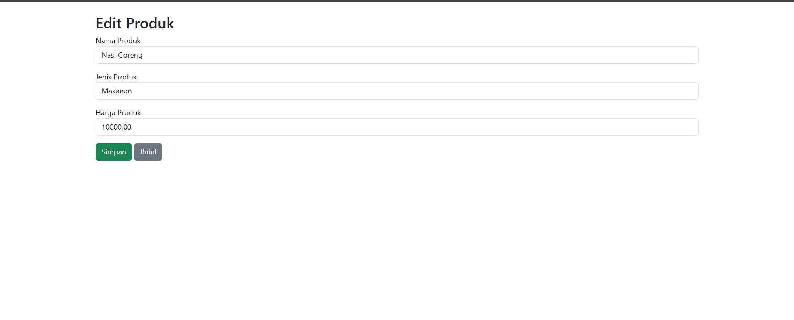

###### **Kode**
```php
<?php

include 'koneksi.php';

  

$id = $_GET['id'];

$result = $conn->query("SELECT * FROM produk WHERE id_produk = $id");

$data = $result->fetch_assoc();

  

if ($_SERVER["REQUEST_METHOD"] == "POST") {

    $nama_produk = $_POST['nama_produk'];

    $jenis_produk = $_POST['jenis_produk'];

    $harga_produk = $_POST['harga_produk'];

  

    $query = "UPDATE produk SET nama_produk='$nama_produk', jenis_produk='$jenis_produk', harga_produk='$harga_produk' WHERE id_produk=$id";

    $conn->query($query);

  

    header("Location: produk.php");

    exit;

}

  

$kategori_result = $conn->query("SELECT DISTINCT jenis_produk FROM produk");

?>

  

<!DOCTYPE html>

<html lang="id">

<head>

    <meta charset="UTF-8">

    <meta name="viewport" content="width=device-width, initial-scale=1.0">

    <title>Edit Produk</title>

    <link rel="stylesheet" href="https://cdn.jsdelivr.net/npm/bootstrap@5.3.0/dist/css/bootstrap.min.css">

</head>

<body>

    <div class="container mt-4">

        <h2>Edit Produk</h2>

        <form method="POST">

            <div class="mb-3">

                <label>Nama Produk</label>

                <input type="text" name="nama_produk" class="form-control" value="<?= $data['nama_produk']; ?>" required>

            </div>

            <div class="mb-3">

                <label>Jenis Produk</label>

                <select name="jenis_produk" class="form-control" required>

                    <?php while ($kategori = $kategori_result->fetch_assoc()) { ?>

                        <option value="<?= $kategori['jenis_produk']; ?>" <?= ($kategori['jenis_produk'] == $data['jenis_produk']) ? 'selected' : ''; ?>>

                            <?= $kategori['jenis_produk']; ?>

                        </option>

                    <?php } ?>

                </select>

            </div>

            <div class="mb-3">

                <label>Harga Produk</label>

                <input type="number" name="harga_produk" class="form-control" value="<?= $data['harga_produk']; ?>" required>

            </div>

            <button type="submit" class="btn btn-success">Simpan</button>

            <a href="produk.php" class="btn btn-secondary">Batal</a>

        </form>

    </div>

</body>

</html>
```
---

##### **b. Kode Program Front-End**

###### **1. Struktur Dasar HTML dan Bootstrap**

```html
<!DOCTYPE html>
<html lang="id">
<head>
    <meta charset="UTF-8">
    <meta name="viewport" content="width=device-width, initial-scale=1.0">
    <title>Edit Produk</title>
    <link rel="stylesheet" href="https://cdn.jsdelivr.net/npm/bootstrap@5.3.0/dist/css/bootstrap.min.css">
</head>
<body>
```

**Penjelasan:**

- **`<!DOCTYPE html>`** → Menentukan bahwa dokumen ini adalah HTML5.
- **`<html lang="id">`** → Menyatakan bahasa halaman sebagai Bahasa Indonesia.
- **`<meta charset="UTF-8">`** → Mengatur encoding karakter agar mendukung teks berbahasa Indonesia.
- **`<meta name="viewport" content="width=device-width, initial-scale=1.0">`** → Agar tampilan responsif di perangkat mobile.
- **Bootstrap** digunakan dengan **CDN** untuk tampilan yang lebih modern.

###### **2. Formulir Edit Produk**

```html
        <form method="POST">
```

**Penjelasan:**

- **`<form method="POST">`** → Formulir mengirimkan data melalui metode **POST** agar data tidak terlihat di URL.

---

###### **3. Input Nama Produk**

```html
            <div class="mb-3">
                <label>Nama Produk</label>
                <input type="text" name="nama_produk" class="form-control" value="<?= htmlspecialchars($data['nama_produk']); ?>" required>
            </div>
```

**Penjelasan:**

- **`<div class="mb-3">`** → Menambahkan **margin bawah (mb-3)** untuk memberi jarak antar elemen.
- **`<label>`** → Label untuk input.
- **`<input type="text" name="nama_produk" class="form-control" ...>`** → Input teks dengan styling Bootstrap.
- **`value="<?= htmlspecialchars($data['nama_produk']); ?>"`** → Mengisi nilai awal dari database dan mencegah **XSS (Cross-Site Scripting)**.
- **`required`** → Memastikan input tidak boleh kosong.

---

###### **4. Dropdown Jenis Produk**

```html
            <div class="mb-3">
                <label>Jenis Produk</label>
                <select name="jenis_produk" class="form-control" required>
                    <?php while ($kategori = $kategori_result->fetch_assoc()) { ?>
                        <option value="<?= htmlspecialchars($kategori['jenis_produk']); ?>" <?= ($kategori['jenis_produk'] == $data['jenis_produk']) ? 'selected' : ''; ?>>
                            <?= htmlspecialchars($kategori['jenis_produk']); ?>
                        </option>
                    <?php } ?>
                </select>
            </div>
```

**Penjelasan:**

- **Dropdown** digunakan untuk memilih jenis produk.
- **Looping PHP (`while`)** menampilkan semua jenis produk yang ada di database.
- **`selected`** digunakan untuk menandai opsi yang sedang dipilih.

---

###### **5. Input Harga Produk**

```html
            <div class="mb-3">
                <label>Harga Produk</label>
                <input type="number" name="harga_produk" class="form-control" value="<?= htmlspecialchars($data['harga_produk']); ?>" required>
            </div>
```

**Penjelasan:**

- **`<input type="number">`** → Hanya menerima angka untuk harga.
- **`value="<?= htmlspecialchars($data['harga_produk']); ?>"`** → Mengisi nilai awal harga dari database.
- **`required`** → Wajib diisi sebelum formulir dikirim.

---

###### *67. Tombol Simpan dan Batal**

```html
            <button type="submit" class="btn btn-success">Simpan</button>
            <a href="produk.php" class="btn btn-secondary">Batal</a>
        </form>
    </div>
</body>
</html>
```

**Penjelasan:**

- **`<button type="submit">`** → Mengirim data ke server.
- **`class="btn btn-success"`** → Menggunakan tombol Bootstrap warna hijau.
- **`<a href="produk.php" class="btn btn-secondary">Batal</a>`** → Kembali ke halaman produk jika batal.

##### **c. Kode Program Back-End**

###### **1. Validasi dan Pengambilan Data Produk**

```php
if (!isset($_GET['id']) || !is_numeric($_GET['id'])) {
    header("Location: produk.php");
    exit;
}

$id = $conn->real_escape_string($_GET['id']);
$result = $conn->query("SELECT * FROM produk WHERE id_produk = '$id'");

if ($result->num_rows == 0) {
    header("Location: produk.php");
    exit;
}

$data = $result->fetch_assoc();
```

 **Penjelasan:**  
 **Memastikan `id` valid**

- **Mengecek apakah `id` ada di URL** (`isset($_GET['id'])`).
- **Harus berupa angka** (`is_numeric($_GET['id'])`) untuk mencegah SQL Injection.
- Jika tidak valid, pengguna **dialihkan ke `produk.php`**.

 **Mengambil data produk**

- Menggunakan **query `SELECT * FROM produk WHERE id_produk = '$id'`** untuk mendapatkan data.
- Jika produk tidak ditemukan, **pengguna dikembalikan ke `produk.php`**.
- Data produk **disimpan ke variabel `$data`** untuk ditampilkan dalam form.

---

###### **2. Proses Update Data Produk**

```php
if ($_SERVER["REQUEST_METHOD"] == "POST") {
    $nama_produk = $conn->real_escape_string($_POST['nama_produk']);
    $jenis_produk = $conn->real_escape_string($_POST['jenis_produk']);
    $harga_produk = (int) $_POST['harga_produk'];

    if ($harga_produk <= 0) {
        echo "Harga produk harus lebih dari 0!";
    } else {
        $query = "UPDATE produk SET 
                    nama_produk = '$nama_produk', 
                    jenis_produk = '$jenis_produk', 
                    harga_produk = '$harga_produk' 
                  WHERE id_produk = '$id'";

        if ($conn->query($query)) {
            header("Location: produk.php");
            exit;
        } else {
            echo "Gagal memperbarui data: " . $conn->error;
        }
    }
}
```

 **Penjelasan:**  
 **Validasi Data Form**

- Menggunakan **`real_escape_string()`** untuk **mencegah SQL Injection**.
- Harga produk dikonversi menjadi **integer (`(int)`)** agar tidak menerima karakter aneh.
- Jika harga produk **kurang dari atau sama dengan nol**, sistem **menampilkan pesan error**.

**Proses Update Data**

- Jika valid, **query `UPDATE produk` dijalankan** untuk menyimpan perubahan.
- Jika sukses, pengguna **dialihkan ke `produk.php`**.
- Jika gagal, sistem **menampilkan pesan error MySQL**.

---

###### **3. Mengambil Data Kategori Produk**

```php
$kategori_result = $conn->query("SELECT DISTINCT jenis_produk FROM produk");
```

 **Penjelasan:**  
**Mengambil semua kategori produk yang unik** dengan `DISTINCT jenis_produk`.  
 Digunakan dalam dropdown form untuk memilih kategori yang sudah ada.

##### **d. Analisis**

###### **1. Penjelasan Kode Program**

Program ini merupakan halaman untuk mengedit data produk dalam sistem kantin berbasis web menggunakan PHP dan MySQL. Halaman ini memungkinkan pengguna untuk memperbarui informasi produk yang telah tersimpan di database.

- Program memuat file koneksi database untuk menghubungkan PHP dengan MySQL.
- Data produk yang akan diedit diambil berdasarkan ID yang dikirim melalui URL.
- Setelah data diperoleh, sistem menampilkan formulir yang telah terisi dengan data produk yang ada.
- Jika pengguna mengubah dan mengirim data melalui formulir, sistem akan memperbarui informasi produk dalam database.
- Setelah pembaruan selesai, pengguna akan diarahkan kembali ke halaman daftar produk.

###### **2. Database yang Digunakan**

Program ini menggunakan database MySQL yang menyimpan data produk dalam sebuah tabel bernama **`produk`**. Tabel ini memiliki beberapa kolom utama, yaitu:

- **id_produk** → ID unik untuk setiap produk.
- **nama_produk** → Nama produk yang dijual di kantin.
- **jenis_produk** → Kategori atau jenis produk, misalnya makanan atau minuman.
- **harga_produk** → Harga jual dari produk tersebut.

Selain itu, dalam program terdapat query untuk mengambil data jenis produk yang berbeda dari database. Hal ini memungkinkan pengguna memilih kategori produk yang sudah tersedia saat melakukan pembaruan data.

###### **3. Peran Fitur dalam Mengelola Database**

Program ini memiliki beberapa fitur utama dalam pengelolaan data produk:

1. **Menampilkan Data Produk yang Akan Diedit**
    
    - Program mengambil data produk berdasarkan ID dan menampilkannya dalam formulir untuk diedit.
2. **Memungkinkan Pengguna Mengubah Data Produk**
    
    - Formulir yang disediakan memungkinkan pengguna untuk memperbarui nama produk, jenis produk, dan harga produk.
3. **Menyimpan Perubahan ke Database**
    
    - Setelah formulir dikirim, sistem akan memperbarui data dalam database menggunakan perintah `UPDATE`.
4. **Mengarahkan Pengguna Setelah Perubahan Disimpan**
    
    - Setelah proses edit selesai, pengguna akan dialihkan kembali ke halaman daftar produk untuk melihat perubahan yang telah dilakukan.

Secara keseluruhan, program ini berperan dalam mempermudah pengelolaan produk di kantin dengan memungkinkan pengguna untuk mengubah informasi produk yang tersimpan di database.
#### **2. Relasi**

##### **1. Tujuan Relasi dalam Program**

Relasi dalam program ini bertujuan untuk mengelola data produk dalam sistem kantin sekolah. Relasi utama dalam program ini melibatkan tabel **`produk`**, yang menyimpan informasi tentang setiap produk yang dijual, termasuk **ID Produk, Nama Produk, Jenis Produk, dan Harga Produk**. Tujuan utama dari relasi ini adalah:

- Memungkinkan pengguna untuk **mengedit informasi produk** berdasarkan ID yang diberikan.
- Menyediakan daftar **kategori produk (jenis produk)** berdasarkan data yang sudah ada dalam database.
- Menjaga **konsistensi data**, sehingga setiap produk yang diperbarui tetap memiliki jenis produk yang valid.

---

##### **2. Analisis Relasi dalam Program**

Relasi yang digunakan dalam program ini adalah **relasi antara produk dan jenis produk**, yang bisa dianggap sebagai **relasi implisit satu-ke-banyak**. Artinya, satu jenis produk dapat memiliki banyak produk yang termasuk dalam kategori tersebut.

Dalam program ini, relasi dapat dianalisis sebagai berikut:

- **Relasi dengan Database:**
    
    - Program mengambil **data produk berdasarkan ID** yang diterima dari URL (`$_GET['id']`), kemudian mencocokkannya dengan **`produk`** dalam database menggunakan query **SELECT**.
    - Saat pengguna menyimpan perubahan, program melakukan **UPDATE** pada tabel `produk`, mengubah nilai `nama_produk`, `jenis_produk`, dan `harga_produk`.
- **Relasi dengan Jenis Produk:**
    
    - Untuk memastikan bahwa pengguna hanya dapat memilih jenis produk yang valid, program mengambil daftar jenis produk yang tersedia dari tabel `produk`.
    - Program menggunakan query **SELECT DISTINCT jenis_produk FROM produk** untuk mendapatkan daftar jenis produk yang unik.
    - Data ini kemudian digunakan untuk mengisi opsi dalam elemen **`<select>`**, sehingga pengguna hanya bisa memilih jenis produk yang ada dalam sistem.

---

##### **3. Cara Kerja Relasi dalam Fitur Program**

1. **Mengambil Data Produk yang Akan Diedit**
    
    - Program menerima ID produk dari URL (`id_produk` tertentu).
    - Data produk yang sesuai diambil dari database untuk ditampilkan dalam form edit.
2. **Menampilkan Data dalam Form Edit**
    
    - Nama produk, jenis produk, dan harga produk yang sudah ada akan otomatis diisi dalam form.
    - Untuk jenis produk, program mengambil daftar jenis produk yang ada dalam database dan menampilkan opsi pilihan dalam dropdown.
3. **Memproses Perubahan yang Dilakukan Pengguna**
    
    - Setelah pengguna mengubah data dan menekan tombol "Simpan", sistem akan mengambil data input dari form.
    - Program kemudian menjalankan query **UPDATE** untuk memperbarui data dalam database berdasarkan ID produk.
4. **Mengembalikan Pengguna ke Halaman Produk**
    
    - Setelah perubahan berhasil disimpan, pengguna dialihkan kembali ke halaman **produk.php**, sehingga mereka bisa melihat daftar produk yang sudah diperbarui.


## Transaksi
### Tampilan Transaksi
#### **1. Rincian Fitur**
##### **a. Menampilkan Edit Pembeli**
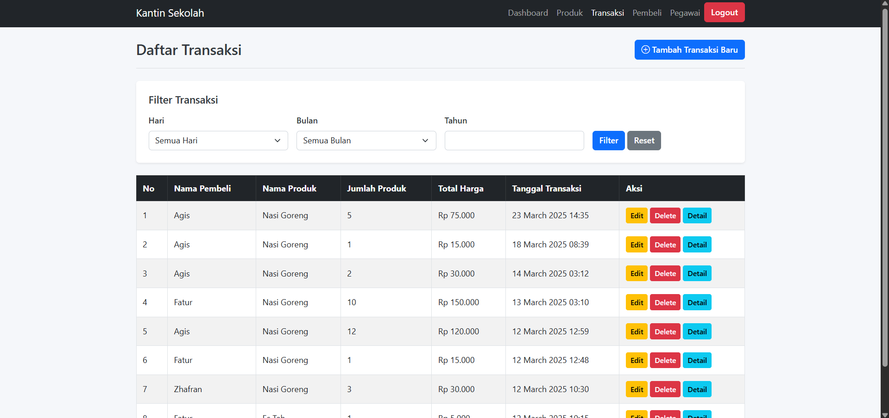
###### **Kode**
```php
<?php

// Koneksi ke database

session_start();

include('koneksi.php');

// Inisialisasi filter

$filter_day = isset($_GET['day']) ? $_GET['day'] : '';

$filter_month = isset($_GET['month']) ? $_GET['month'] : ''; // Tambahkan filter bulan

$filter_year = isset($_GET['year']) ? $_GET['year'] : '';

  

// Buat query dasar untuk transaksi

$query = "SELECT t.id_transaksi, b.nama_pembeli, p.nama_produk, pg.nama_pegawai,

          t.total_produk, t.total_harga, t.waktu_beli

          FROM transaksi t

          JOIN pembeli b ON t.id_pembeli = b.id_pembeli

          JOIN produk p ON t.id_produk = p.id_produk

          JOIN pegawai_kantin pg ON t.id_pegawai = pg.id_pegawai

          WHERE t.id_produk IS NOT NULL";

  

// Tambahkan filter berdasarkan hari dalam seminggu

if ($filter_day) {

    // DAYNAME returns the name of the weekday (Monday, Tuesday, etc.)

    // DAYOFWEEK returns numeric day of week (1 = Sunday, 2 = Monday, ..., 7 = Saturday)

    switch ($filter_day) {

        case 'Monday':

            $query .= " AND DAYOFWEEK(waktu_beli) = 2";

            break;

        case 'Tuesday':

            $query .= " AND DAYOFWEEK(waktu_beli) = 3";

            break;

        case 'Wednesday':

            $query .= " AND DAYOFWEEK(waktu_beli) = 4";

            break;

        case 'Thursday':

            $query .= " AND DAYOFWEEK(waktu_beli) = 5";

            break;

        case 'Friday':

            $query .= " AND DAYOFWEEK(waktu_beli) = 6";

            break;

        case 'Saturday':

            $query .= " AND DAYOFWEEK(waktu_beli) = 7";

            break;

        case 'Sunday':

            $query .= " AND DAYOFWEEK(waktu_beli) = 1";

            break;

    }

}

  

// Filter berdasarkan bulan

if ($filter_month) {

    $query .= " AND MONTH(waktu_beli) = '$filter_month'";

}

  

// Filter berdasarkan tahun

if ($filter_year) {

    $query .= " AND YEAR(waktu_beli) = '$filter_year'";

}

  

// Tambahkan order by

$query .= " ORDER BY t.waktu_beli DESC";

  

// Eksekusi query

$transaksi_result = $conn->query($query);

  

// Hitung total transaksi dan total pendapatan untuk filter yang dipilih

$total_query = str_replace("SELECT t.id_transaksi, b.nama_pembeli, p.nama_produk, pg.nama_pegawai,

          t.total_produk, t.total_harga, t.waktu_beli", "SELECT COUNT(*) as total_transaksi, SUM(t.total_harga) as total_pendapatan", $query);

$totals = $conn->query($total_query)->fetch_assoc();

?>

  

<!DOCTYPE html>

<html lang="id">

<head>

    <meta charset="UTF-8">

    <title>Transaksi - Kantin Sekolah</title>

    <link rel="stylesheet" href="https://cdn.jsdelivr.net/npm/bootstrap@5.3.0/dist/css/bootstrap.min.css">

    <style>

        /* Main Styling for Kantin Sekolah App */

:root {

  --primary-color: #0d6efd;

  --primary-dark: #0a58ca;

  --secondary-color: #f4f7fc;

  --success-color: #28a745;

  --warning-color: #ffc107;

  --danger-color: #dc3545;

  --info-color: #0dcaf0;

  --light-gray: #f8f9fa;

  --dark-gray: #343a40;

  --text-color: #212529;

  --border-radius: 0.375rem;

  --box-shadow: 0 0.125rem 0.25rem rgba(0, 0, 0, 0.075);

  --transition: all 0.2s ease-in-out;

}

  

body {

  font-family: system-ui, -apple-system, "Segoe UI", Roboto, "Helvetica Neue", Arial, sans-serif;

  background-color: #f5f7fa;

  color: var(--text-color);

  line-height: 1.5;

}

  

/* Container Styling */

.container {

  max-width: 1200px;

  padding: 0 1rem;

}

  

/* Card Styling */

.card {

  border: none;

  border-radius: var(--border-radius);

  box-shadow: var(--box-shadow);

  transition: var(--transition);

}

  

.card:hover {

  box-shadow: 0 0.5rem 1rem rgba(0, 0, 0, 0.15);

}

  

.card-body {

  padding: 1.5rem;

}

  

.card-title {

  margin-bottom: 1rem;

  font-weight: 600;

  color: var(--dark-gray);

}

  

/* Table Styling */

.table {

  width: 100%;

  margin-bottom: 1rem;

  vertical-align: middle;

  border-color: #dee2e6;

}

  

.table-striped tbody tr:nth-of-type(odd) {

  background-color: rgba(0, 0, 0, 0.02);

}

  

.table-bordered {

  border: 1px solid #dee2e6;

}

  

.table th, .table td {

  padding: 0.75rem;

  vertical-align: middle;

}

  

.table-dark {

  background-color: var(--dark-gray);

  color: white;

}

  

/* Alert Styling */

.alert {

  border: none;

  border-radius: var(--border-radius);

  padding: 1rem;

  margin-bottom: 1rem;

}

  

.alert-info {

  background-color: rgba(13, 202, 240, 0.15);

  color: #055160;

  border-left: 4px solid var(--info-color);

}

  

/* Form Styling */

.form-label {

  font-weight: 500;

  margin-bottom: 0.5rem;

  color: var(--dark-gray);

}

  

.form-control, .form-select {

  border-radius: var(--border-radius);

  padding: 0.375rem 0.75rem;

  border: 1px solid #ced4da;

  transition: var(--transition);

}

  

.form-control:focus, .form-select:focus {

  box-shadow: 0 0 0 0.25rem rgba(13, 110, 253, 0.25);

  border-color: var(--primary-color);

}

  

.form-control-static {

  background-color: var(--secondary-color);

  padding: 0.375rem 0.75rem;

  border-radius: var(--border-radius);

  font-weight: 500;

  color: var(--dark-gray);

}

  

/* Button Styling */

.btn {

  border-radius: var(--border-radius);

  padding: 0.375rem 0.75rem;

  font-weight: 500;

  transition: var(--transition);

}

  

.btn-primary {

  background-color: var(--primary-color);

  border-color: var(--primary-color);

}

  

.btn-primary:hover {

  background-color: var(--primary-dark);

  border-color: var(--primary-dark);

  transform: translateY(-1px);

}

  

.btn-secondary {

  background-color: #6c757d;

  border-color: #6c757d;

}

  

.btn-secondary:hover {

  background-color: #5c636a;

  border-color: #565e64;

  transform: translateY(-1px);

}

  

.btn-info {

  background-color: var(--info-color);

  border-color: var(--info-color);

  color: #000;

}

  

.btn-info:hover {

  background-color: #31d2f2;

  border-color: #25cff2;

  transform: translateY(-1px);

}

  

.btn-warning {

  background-color: var(--warning-color);

  border-color: var(--warning-color);

  color: #000;

}

  

.btn-warning:hover {

  background-color: #ffca2c;

  border-color: #ffc720;

  transform: translateY(-1px);

}

  

.btn-danger {

  background-color: var(--danger-color);

  border-color: var(--danger-color);

}

  

.btn-danger:hover {

  background-color: #bb2d3b;

  border-color: #b02a37;

  transform: translateY(-1px);

}

  

.btn-sm {

  padding: 0.25rem 0.5rem;

  font-size: 0.875rem;

  border-radius: 0.25rem;

}

  

/* Header Styling */

.d-flex.justify-content-between.align-items-center {

  margin-bottom: 1.5rem;

  padding-bottom: 1rem;

  border-bottom: 1px solid rgba(0, 0, 0, 0.1);

}

  

.d-flex h3 {

  font-weight: 600;

  color: var(--dark-gray);

  margin-bottom: 0;

}

  

/* Filter Form */

.row.g-3 {

  margin-bottom: 0;

}

  

/* Custom Price Display */

#total_harga_display, #kembalian_display {

  background-color: var(--light-gray);

  border-left: 4px solid var(--primary-color);

  margin-bottom: 0;

}

  

/* Responsive Styles */

@media (max-width: 992px) {

  .d-flex.justify-content-between.align-items-center {

    flex-direction: column;

    align-items: flex-start !important;

  }

  .d-flex h3 {

    margin-bottom: 1rem;

  }

  .row.g-3 > div {

    margin-bottom: 1rem;

  }

}

  

@media (max-width: 768px) {

  .table thead {

    display: none;

  }

  .table, .table tbody, .table tr, .table td {

    display: block;

    width: 100%;

  }

  .table tr {

    margin-bottom: 1rem;

    border: 1px solid #dee2e6;

    border-radius: var(--border-radius);

    overflow: hidden;

  }

  .table td {

    position: relative;

    padding-left: 50%;

    text-align: right;

    border-bottom: 1px solid #dee2e6;

  }

  .table td:before {

    content: attr(data-label);

    position: absolute;

    left: 0.75rem;

    width: 45%;

    padding-right: 0.75rem;

    text-align: left;

    font-weight: 600;

  }

  .table td:last-child {

    border-bottom: 0;

  }

  .table-bordered td {

    border: none;

    border-bottom: 1px solid #dee2e6;

  }

}

  

@media (max-width: 576px) {

  .card-body {

    padding: 1rem;

  }

  .btn {

    padding: 0.25rem 0.5rem;

  }

  .alert {

    padding: 0.75rem;

  }

}

  

/* Custom Script for Mobile Table Data Labels */

document.addEventListener('DOMContentLoaded', function() {

  if (window.innerWidth <= 768) {

    const tableHeaderCells = document.querySelectorAll('table thead th');

    const tableBodyRows = document.querySelectorAll('table tbody tr');

    tableBodyRows.forEach(row => {

      const cells = row.querySelectorAll('td');

      cells.forEach((cell, index) => {

        if (tableHeaderCells[index]) {

          cell.setAttribute('data-label', tableHeaderCells[index].textContent);

        }

      });

    });

  }

});

  

/* Highlighting for Form Fields */

.form-control:focus, .form-select:focus {

  animation: highlight 2s;

}

  

@keyframes highlight {

  0% { box-shadow: 0 0 0 0.25rem rgba(13, 110, 253, 0.25); }

  70% { box-shadow: 0 0 0 0.25rem rgba(13, 110, 253, 0.25); }

  100% { box-shadow: 0 0 0 0.25rem rgba(13, 110, 253, 0); }

}

  

/* Responsive Button Adjustments */

@media (max-width: 576px) {

  td .btn {

    display: inline-block;

    margin-bottom: 0.25rem;

    width: 100%;

  }

}

    </style>

</head>

<body>

    <nav class="navbar navbar-expand-lg navbar-dark bg-dark">

        <div class="container">

            <a class="navbar-brand" href="#">Kantin Sekolah</a>

            <div class="collapse navbar-collapse">

                <ul class="navbar-nav ms-auto">

                    <li class="nav-item"><a class="nav-link" href="dashboard.php">Dashboard</a></li>

                    <li class="nav-item"><a class="nav-link" href="produk.php">Produk</a></li>

                    <li class="nav-item"><a class="nav-link active" href="transaksi.php">Transaksi</a></li>

                    <li class="nav-item"><a class="nav-link" href="pembeli.php">Pembeli</a></li>

                    <li class="nav-item"><a class="nav-link" href="pegawai.php">Pegawai</a></li>

                    <li class="nav-item"><a class="btn btn-danger" href="login.php">Logout</a></li>

                </ul>

            </div>

        </div>

    </nav>

  

    <div class="container mt-4">

        <div class="d-flex justify-content-between align-items-center mb-4">

            <h3>Daftar Transaksi</h3>

            <a href="tambah_transaksi.php" class="btn btn-primary">

                <i class="bi bi-plus-circle"></i> Tambah Transaksi Baru

            </a>

        </div>

        <!-- Filter Form -->

        <div class="card mb-4">

            <div class="card-body">

                <h5 class="card-title">Filter Transaksi</h5>

                <form method="GET" class="row g-3">

                    <div class="col-md-3">

                        <label class="form-label">Hari</label>

                        <select name="day" class="form-select">

                            <option value="">Semua Hari</option>

                            <option value="Monday" <?= $filter_day == 'Monday' ? 'selected' : '' ?>>Senin</option>

                            <option value="Tuesday" <?= $filter_day == 'Tuesday' ? 'selected' : '' ?>>Selasa</option>

                            <option value="Wednesday" <?= $filter_day == 'Wednesday' ? 'selected' : '' ?>>Rabu</option>

                            <option value="Thursday" <?= $filter_day == 'Thursday' ? 'selected' : '' ?>>Kamis</option>

                            <option value="Friday" <?= $filter_day == 'Friday' ? 'selected' : '' ?>>Jumat</option>

                            <option value="Saturday" <?= $filter_day == 'Saturday' ? 'selected' : '' ?>>Sabtu</option>

                            <option value="Sunday" <?= $filter_day == 'Sunday' ? 'selected' : '' ?>>Minggu</option>

                        </select>

                    </div>

                    <div class="col-md-3">

                        <label class="form-label">Bulan</label>

                        <select name="month" class="form-select">

                            <option value="">Semua Bulan</option>

                            <option value="1" <?= $filter_month == '1' ? 'selected' : '' ?>>Januari</option>

                            <option value="2" <?= $filter_month == '2' ? 'selected' : '' ?>>Februari</option>

                            <option value="3" <?= $filter_month == '3' ? 'selected' : '' ?>>Maret</option>

                            <option value="4" <?= $filter_month == '4' ? 'selected' : '' ?>>April</option>

                            <option value="5" <?= $filter_month == '5' ? 'selected' : '' ?>>Mei</option>

                            <option value="6" <?= $filter_month == '6' ? 'selected' : '' ?>>Juni</option>

                            <option value="7" <?= $filter_month == '7' ? 'selected' : '' ?>>Juli</option>

                            <option value="8" <?= $filter_month == '8' ? 'selected' : '' ?>>Agustus</option>

                            <option value="9" <?= $filter_month == '9' ? 'selected' : '' ?>>September</option>

                            <option value="10" <?= $filter_month == '10' ? 'selected' : '' ?>>Oktober</option>

                            <option value="11" <?= $filter_month == '11' ? 'selected' : '' ?>>November</option>

                            <option value="12" <?= $filter_month == '12' ? 'selected' : '' ?>>Desember</option>

                        </select>

                    </div>

                    <div class="col-md-3">

                        <label class="form-label">Tahun</label>

                        <input type="number" name="year" class="form-control" value="<?= $filter_year ?>">

                    </div>

                    <div class="col-md-3 d-flex align-items-end">

                        <div>

                            <button type="submit" class="btn btn-primary">Filter</button>

                            <a href="transaksi.php" class="btn btn-secondary">Reset</a>

                        </div>

                    </div>

                </form>

            </div>

        </div>

        <!-- Ringkasan Transaksi -->

        <?php if ($filter_day || $filter_month || $filter_year): ?>

        <div class="alert alert-info">

            <h5>Ringkasan Transaksi</h5>

            <p>

                Total Transaksi: <strong><?= $totals['total_transaksi'] ?></strong><br>

                Total Pendapatan: <strong>Rp <?= number_format($totals['total_pendapatan'], 0, ',', '.') ?></strong>

            </p>

        </div>

        <?php endif; ?>

  

        <table class="table table-striped table-bordered">

            <thead class="table-dark">

                <tr>

                    <th>No</th>

                    <th>Nama Pembeli</th>

                    <th>Nama Produk</th>

                    <th>Jumlah Produk</th>

                    <th>Total Harga</th>

                    <th>Tanggal Transaksi</th>

                    <th>Aksi</th>

                </tr>

            </thead>

            <tbody>

                <?php

                $no = 1;

                if ($transaksi_result->num_rows > 0) {

                    while ($row = $transaksi_result->fetch_assoc()) {

                ?>

                    <tr>

                        <td><?= $no++; ?></td>

                        <td><?= $row['nama_pembeli']; ?></td>

                        <td><?= $row['nama_produk']; ?></td>

                        <td><?= $row['total_produk']; ?></td>

                        <td>Rp <?= number_format($row['total_harga'], 0, ',', '.'); ?></td>

                        <td><?= date('d F Y H:i', strtotime($row['waktu_beli'])); ?></td>

                        <td>

                            <a href="edit_transaksi.php?id=<?= $row['id_transaksi']; ?>" class="btn btn-warning btn-sm">Edit</a>

                            <a href="delete_transaksi.php?id=<?= $row['id_transaksi']; ?>" class="btn btn-danger btn-sm">Delete</a>

                            <a href="detail.php?id=<?= $row['id_transaksi']; ?>" class="btn btn-info btn-sm">Detail</a>

                        </td>

                    </tr>

                <?php

                    }

                } else {

                ?>

                    <tr>

                        <td colspan="7" class="text-center">Tidak ada data transaksi</td>

                    </tr>

                <?php

                }

                ?>

            </tbody>

        </table>

    </div>

  

    <script src="https://cdn.jsdelivr.net/npm/bootstrap@5.3.0/dist/js/bootstrap.bundle.min.js"></script>

    <link rel="stylesheet" href="https://cdn.jsdelivr.net/npm/bootstrap-icons@1.10.0/font/bootstrap-icons.css">

</body>

</html>
```
##### **b. Kode Program Front-End**

###### **1. Form Filter Data**

```html
<form method="GET" class="mb-3">
    <label for="day">Pilih Hari:</label>
    <select name="day" id="day">
        <option value="">Semua</option>
        <option value="Monday">Senin</option>
        <option value="Tuesday">Selasa</option>
        <option value="Wednesday">Rabu</option>
        <option value="Thursday">Kamis</option>
        <option value="Friday">Jumat</option>
        <option value="Saturday">Sabtu</option>
        <option value="Sunday">Minggu</option>
    </select>

    <label for="month">Pilih Bulan:</label>
    <select name="month" id="month">
        <option value="">Semua</option>
        <?php for ($i = 1; $i <= 12; $i++) : ?>
            <option value="<?= $i; ?>"><?= date("F", mktime(0, 0, 0, $i, 1)); ?></option>
        <?php endfor; ?>
    </select>

    <label for="year">Pilih Tahun:</label>
    <input type="number" name="year" id="year" min="2000" max="<?= date('Y'); ?>">

    <button type="submit">Filter</button>
</form>
```

**Penjelasan**:

- Form ini memungkinkan pengguna memilih filter **hari**, **bulan**, dan **tahun**.
- `select` digunakan untuk memilih hari dan bulan.
- `date("F", mktime(0, 0, 0, $i, 1))` → Mengonversi angka bulan menjadi nama bulan (Januari, Februari, dll.).
- Input **tahun** menggunakan `type="number"` untuk batasan input.

---

###### **2. Tabel Data Transaksi**

```html
<table border="1">
    <thead>
        <tr>
            <th>No</th>
            <th>Nama Pembeli</th>
            <th>Nama Produk</th>
            <th>Nama Pegawai</th>
            <th>Total Produk</th>
            <th>Total Harga</th>
            <th>Waktu Beli</th>
        </tr>
    </thead>
    <tbody>
        <?php
        $result = mysqli_query($conn, $query);
        $no = 1;
        while ($row = mysqli_fetch_assoc($result)) :
        ?>
            <tr>
                <td><?= $no++; ?></td>
                <td><?= $row['nama_pembeli']; ?></td>
                <td><?= $row['nama_produk']; ?></td>
                <td><?= $row['nama_pegawai']; ?></td>
                <td><?= $row['total_produk']; ?></td>
                <td><?= number_format($row['total_harga'], 0, ',', '.'); ?></td>
                <td><?= date('d-m-Y H:i', strtotime($row['waktu_beli'])); ?></td>
            </tr>
        <?php endwhile; ?>
    </tbody>
</table>
```

 **Penjelasan**:

- Menampilkan data transaksi dalam tabel.
- Menggunakan `while` untuk menampilkan setiap baris hasil query.
- `number_format($row['total_harga'], 0, ',', '.')` → Format angka total harga agar lebih rapi (contoh: **10.000**).
- `date('d-m-Y H:i', strtotime($row['waktu_beli']))` → Mengubah format waktu dari database ke **dd-mm-yyyy hh:mm**.

---
###### **3. Navbar dan Tombol Navigasi**

```html
<nav class="navbar navbar-expand-lg navbar-dark bg-dark">
    <div class="container">
        <a class="navbar-brand" href="#">Kantin Sekolah</a>
        <div class="collapse navbar-collapse">
            <ul class="navbar-nav ms-auto">
                <li class="nav-item"><a class="nav-link" href="dashboard.php">Dashboard</a></li>
                <li class="nav-item"><a class="nav-link" href="produk.php">Produk</a></li>
                <li class="nav-item"><a class="nav-link active" href="transaksi.php">Transaksi</a></li>
                <li class="nav-item"><a class="nav-link" href="pembeli.php">Pembeli</a></li>
                <li class="nav-item"><a class="nav-link" href="pegawai.php">Pegawai</a></li>
                <li class="nav-item"><a class="btn btn-danger" href="login.php">Logout</a></li>
            </ul>
        </div>
    </div>
</nav>
```

- Navbar berisi menu navigasi untuk mengakses berbagai halaman sistem kantin sekolah.


##### **c.  Kode Program Back-End**

###### **1. Mengambil Data Filter (Hari, Bulan, Tahun)**

```php
$filter_day = isset($_GET['day']) ? $_GET['day'] : '';
$filter_month = isset($_GET['month']) ? $_GET['month'] : '';
$filter_year = isset($_GET['year']) ? $_GET['year'] : '';
```

- Mengecek apakah parameter **day, month, year** dikirim melalui URL (GET method).
- Jika ada, maka nilainya digunakan untuk memfilter transaksi.

---

###### **2. Membuat Query untuk Mengambil Data Transaksi**

```php
$query = "SELECT t.id_transaksi, b.nama_pembeli, p.nama_produk, pg.nama_pegawai, 
          t.total_produk, t.total_harga, t.waktu_beli
          FROM transaksi t 
          JOIN pembeli b ON t.id_pembeli = b.id_pembeli
          JOIN produk p ON t.id_produk = p.id_produk
          JOIN pegawai_kantin pg ON t.id_pegawai = pg.id_pegawai
          WHERE t.id_produk IS NOT NULL";
```

- Mengambil data transaksi dengan **JOIN** ke tabel:
    - `pembeli` untuk mendapatkan `nama_pembeli`
    - `produk` untuk mendapatkan `nama_produk`
    - `pegawai_kantin` untuk mendapatkan `nama_pegawai`
- Kondisi `WHERE t.id_produk IS NOT NULL` digunakan untuk memastikan bahwa transaksi memiliki produk.

---

###### **3. Menambahkan Filter Berdasarkan Hari**

```php
if ($filter_day) {
    switch ($filter_day) {
        case 'Monday': $query .= " AND DAYOFWEEK(waktu_beli) = 2"; break;
        case 'Tuesday': $query .= " AND DAYOFWEEK(waktu_beli) = 3"; break;
        case 'Wednesday': $query .= " AND DAYOFWEEK(waktu_beli) = 4"; break;
        case 'Thursday': $query .= " AND DAYOFWEEK(waktu_beli) = 5"; break;
        case 'Friday': $query .= " AND DAYOFWEEK(waktu_beli) = 6"; break;
        case 'Saturday': $query .= " AND DAYOFWEEK(waktu_beli) = 7"; break;
        case 'Sunday': $query .= " AND DAYOFWEEK(waktu_beli) = 1"; break;
    }
}
```

- `DAYOFWEEK(waktu_beli) = X` digunakan untuk memfilter transaksi berdasarkan hari dalam seminggu.
    - 1 = Minggu, 2 = Senin, 3 = Selasa, dst.

---

###### **4. Menambahkan Filter Berdasarkan Bulan dan Tahun**

```php
if ($filter_month) {
    $query .= " AND MONTH(waktu_beli) = '$filter_month'";
}

if ($filter_year) {
    $query .= " AND YEAR(waktu_beli) = '$filter_year'";
}
```

- `MONTH(waktu_beli) = '$filter_month'` untuk memfilter berdasarkan bulan.
- `YEAR(waktu_beli) = '$filter_year'` untuk memfilter berdasarkan tahun.

---

###### **5. Menyusun Query Akhir dan Mengeksekusinya**

```php
$query .= " ORDER BY t.waktu_beli DESC";
$transaksi_result = $conn->query($query);
```

- **`ORDER BY t.waktu_beli DESC`** → Mengurutkan transaksi dari yang terbaru ke yang paling lama.
- **`$conn->query($query);`** → Mengeksekusi query untuk mendapatkan hasil transaksi.

---

###### **6. Menghitung Total Transaksi dan Pendapatan**

```php
$total_query = str_replace("SELECT t.id_transaksi, b.nama_pembeli, p.nama_produk, pg.nama_pegawai, 
          t.total_produk, t.total_harga, t.waktu_beli", 
          "SELECT COUNT(*) as total_transaksi, SUM(t.total_harga) as total_pendapatan", 
          $query);

$totals = $conn->query($total_query)->fetch_assoc();
```

- Menghitung **jumlah transaksi** (`COUNT(*)`) dan **total pendapatan** (`SUM(t.total_harga)`) berdasarkan filter yang dipilih.
- Menggunakan `str_replace()` untuk mengganti bagian `SELECT` tanpa menulis ulang seluruh query.

##### **d. Analisis**

###### 1. **Penjelasan Kode Program**

Program ini merupakan bagian dari sistem informasi kantin sekolah berbasis web yang dikelola menggunakan PHP dan MySQL. Fungsinya adalah untuk menampilkan data transaksi, menerapkan filter pencarian, serta menghitung total transaksi dan pendapatan.

- **Koneksi ke Database**  
    Program menggunakan `session_start();` untuk mengelola sesi pengguna dan menghubungkan database melalui `include('koneksi.php');`.
- **Pengambilan Data**  
    Data transaksi diambil dari beberapa tabel dengan `JOIN` untuk menggabungkan informasi pembeli, produk, dan pegawai kantin.
- **Filter Data**  
    Pengguna dapat memfilter transaksi berdasarkan hari, bulan, atau tahun. Filter ini diterapkan menggunakan `$_GET` yang diteruskan dalam query SQL.
- **Perhitungan Total Transaksi dan Pendapatan**  
    Program menghitung jumlah transaksi dan total pendapatan menggunakan fungsi agregat SQL seperti `COUNT(*)` dan `SUM()`.
- **Tampilan Data dalam Bentuk Tabel**  
    Data transaksi ditampilkan dalam tabel HTML yang menampilkan informasi seperti nama pembeli, produk yang dibeli, jumlah, harga, dan waktu transaksi.

###### 2. **Struktur Database yang Digunakan**

Database yang digunakan berbasis MySQL dengan beberapa tabel utama yang saling berelasi:

- **Tabel `transaksi`**  
    Berisi informasi transaksi, termasuk `id_transaksi`, `id_pembeli`, `id_produk`, `id_pegawai`, `jumlah`, `total_harga`, dan `waktu_beli`.
- **Tabel `pembeli`**  
    Berisi data pembeli dengan `id_pembeli`, `nama_pembeli`, dan informasi lainnya.
- **Tabel `produk`**  
    Menyimpan daftar produk dengan `id_produk`, `nama_produk`, dan `harga`.
- **Tabel `pegawai_kantin`**  
    Berisi informasi pegawai yang menangani transaksi dengan `id_pegawai`, `nama_pegawai`, dan peran mereka.

###### 3. **Peran Fitur dalam Mengelola Database**

Fitur yang ada dalam program memiliki fungsi sebagai berikut:

- **Menampilkan Daftar Transaksi**  
    Fitur utama yang mengambil data dari tabel `transaksi` dan menampilkannya dengan informasi terkait dari tabel lainnya.
- **Filter Data Transaksi**  
    Memungkinkan pengguna untuk menyaring transaksi berdasarkan waktu, membantu dalam analisis penjualan harian, bulanan, atau tahunan.
- **Menghitung Total Transaksi dan Pendapatan**  
    Memberikan ringkasan jumlah transaksi yang terjadi serta total pendapatan yang dihasilkan dalam periode tertentu.
- **Navigasi ke Halaman Lain**  
    Memudahkan pengguna berpindah ke halaman lain seperti daftar produk, pembeli, pegawai, dan logout.

Dengan kombinasi fitur ini, sistem dapat membantu pengelola kantin dalam memantau transaksi, mengevaluasi penjualan, dan mengoptimalkan manajemen keuangan kantin sekolah.
#### **2. Relasi**

##### **1. Tujuan Relasi**

Relasi dalam program ini bertujuan untuk menghubungkan berbagai entitas dalam sistem kantin sekolah sehingga data dapat terorganisir dengan baik dan memudahkan proses transaksi. Dengan adanya relasi antar tabel, sistem dapat:

- Menyimpan transaksi yang berkaitan dengan pembeli dan pegawai kantin.
- Mempermudah pengelolaan produk yang dibeli dalam setiap transaksi.
- Menyediakan fitur pencarian dan penyaringan data transaksi berdasarkan tanggal atau kriteria lainnya.

##### **2. Analisis Relasi dalam Program**

Dalam sistem ini, terdapat beberapa relasi utama antara tabel-tabel yang berperan dalam manajemen transaksi:

- **Relasi antara Tabel Transaksi dan Pembeli**  
    Setiap transaksi memiliki hubungan dengan seorang pembeli. Relasi ini memungkinkan sistem untuk mengetahui siapa yang melakukan transaksi dan menampilkan riwayat pembelian dari masing-masing pembeli.
- **Relasi antara Tabel Transaksi dan Pegawai Kantin**  
    Setiap transaksi juga berkaitan dengan pegawai kantin yang melayani atau memproses transaksi. Relasi ini membantu dalam mencatat siapa yang bertanggung jawab atas setiap transaksi.
- **Relasi antara Tabel Transaksi dan Produk**  
    Setiap transaksi dapat mencakup beberapa produk. Oleh karena itu, biasanya ada tabel perantara yang menghubungkan transaksi dengan produk, seperti tabel detail transaksi. Relasi ini membantu dalam pencatatan jumlah dan jenis produk yang dibeli dalam satu transaksi.
- **Relasi antara Tabel Transaksi dan Waktu (Tanggal, Bulan, Tahun)**  
    Untuk fitur filter transaksi berdasarkan waktu, setiap transaksi memiliki kolom tanggal yang memungkinkan penyaringan berdasarkan hari, bulan, atau tahun.

##### **3. Cara Kerja Relasi dalam Fitur Program**

Relasi dalam program ini bekerja melalui query database yang menghubungkan beberapa tabel untuk mendapatkan informasi yang diperlukan. Berikut cara kerja relasi dalam fitur program:

- **Penyaringan Transaksi berdasarkan Waktu**  
    Saat pengguna memilih filter berdasarkan hari, bulan, atau tahun, program akan mengambil data dari tabel transaksi dan menerapkan kondisi pada kolom tanggal transaksi.
- **Menampilkan Data Transaksi dengan Informasi Pembeli dan Pegawai**  
    Program akan melakukan join antara tabel transaksi, pembeli, dan pegawai kantin untuk menampilkan data transaksi lengkap, termasuk nama pembeli dan pegawai yang melayani.
- **Menampilkan Produk yang Dibeli dalam Setiap Transaksi**  
    Program mengambil data dari tabel transaksi dan menghubungkannya dengan tabel detail transaksi serta tabel produk. Dengan demikian, sistem dapat menampilkan daftar produk yang dibeli beserta harga dan jumlahnya.
- **Pencatatan dan Pengolahan Data di Database**  
    Saat transaksi baru dibuat, sistem akan menyimpan data ke tabel transaksi dan tabel detail transaksi untuk memastikan hubungan antara transaksi, pembeli, pegawai, dan produk tetap konsisten.

Dengan sistem relasi ini, program dapat bekerja secara efisien dalam mengelola transaksi, memastikan akurasi data, dan mempermudah analisis penjualan kantin.
#### **3. Agregasi**
##### **Tujuan dari Agregasi**

Agregasi dalam halaman transaksi kantin sekolah bertujuan untuk menganalisis dan menyajikan ringkasan data transaksi berdasarkan berbagai kriteria seperti hari, bulan, dan tahun. Dengan adanya agregasi ini, pengguna dapat:

1. **Melihat Total Pendapatan**
    - Mengetahui total uang yang masuk dari transaksi dalam periode tertentu.
2. **Menganalisis Performa Penjualan**
    - Membandingkan jumlah transaksi dalam berbagai periode untuk memahami tren penjualan.
3. **Mempermudah Pengelolaan Keuangan**
    - Memastikan setiap transaksi tercatat dengan benar dan mengetahui apakah ada pembayaran yang belum dilakukan.
4. **Mendukung Keputusan Operasional**
    - Dengan informasi yang lebih ringkas dan terstruktur, pengelola kantin dapat mengambil keputusan berdasarkan data, seperti kapan waktu transaksi paling ramai.

---

##### **Analisis Query Agregasi yang Digunakan**

```php
SELECT 
    DATE(tanggal_transaksi) AS tanggal,
    COUNT(id_transaksi) AS jumlah_transaksi,
    SUM(total_harga) AS total_pendapatan
FROM transaksi
WHERE tanggal_transaksi BETWEEN '2024-03-01' AND '2024-03-24'
GROUP BY DATE(tanggal_transaksi)
ORDER BY tanggal_transaksi DESC;

```
Dalam fitur ini, SQL query agregasi digunakan untuk mengambil data transaksi dari database dengan filter tertentu. Query yang digunakan kemungkinan besar mencakup:

1. **Menghitung Total Pendapatan**
    - Query menggunakan fungsi **SUM()** untuk menghitung total harga dari transaksi yang sesuai dengan filter tanggal yang dipilih.
2. **Menghitung Jumlah Transaksi**
    - Fungsi **COUNT()** digunakan untuk menghitung jumlah transaksi dalam suatu periode.
3. **Mengelompokkan Data Berdasarkan Periode**
    - Fungsi **GROUP BY** digunakan untuk mengelompokkan transaksi berdasarkan hari, bulan, atau tahun.
4. **Penyaringan Data**
    - Menggunakan **WHERE** untuk menampilkan transaksi berdasarkan parameter pencarian, seperti tanggal yang dipilih pengguna.

Contoh analisis query yang digunakan:

- Jika pengguna ingin melihat total pendapatan hari ini, query akan memfilter data berdasarkan tanggal sekarang dan menjumlahkan total harga transaksi.
- Jika pengguna ingin melihat transaksi bulan ini, query akan mengelompokkan data berdasarkan bulan dan menampilkan hasil agregasi.

---

##### **Cara Kerja Fitur terhadap Agregasi**

1. **Pengguna Memilih Filter**
    
    - Pengguna memilih filter pencarian berdasarkan hari, bulan, atau tahun dari form input.
    - Form ini mengirimkan data ke halaman melalui metode GET atau POST.
2. **Query Dijalankan di Database**
    
    - Berdasarkan input pengguna, sistem akan menjalankan query yang mengambil data transaksi dari database dan melakukan agregasi sesuai dengan filter yang dipilih.
3. **Menampilkan Hasil di Tabel**
    
    - Data hasil agregasi akan ditampilkan dalam tabel, termasuk jumlah transaksi dan total pendapatan dalam periode yang dipilih.
4. **Interaksi dengan Pengguna**
    
    - Jika pengguna ingin melihat transaksi dalam periode berbeda, mereka cukup memilih filter lain, dan sistem akan menampilkan data baru berdasarkan query yang dijalankan.

---


### Tambah Transaksi
#### **1. Rincian Fitur**
##### **a. Menampilkan Edit Pembeli**
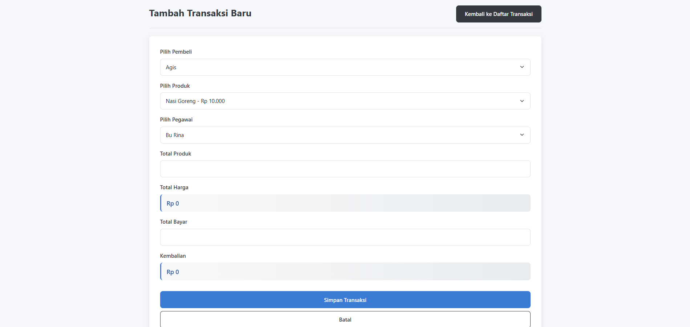
###### **Kode**
```php
<?php

// Koneksi ke database

include('koneksi.php');

// Handler untuk request AJAX total harga

if (isset($_GET['action']) && $_GET['action'] == 'get_total') {

    $id_produk = $_GET['id_produk'];

    $total_produk = $_GET['total_produk'];

    // Gunakan SQL agregasi untuk menghitung total harga

    $query = "SELECT SUM(harga_produk * $total_produk) AS total_harga

              FROM produk WHERE id_produk = '$id_produk'";

    $result = $conn->query($query);

    $data = $result->fetch_assoc();

    // Kirim response sebagai JSON

    header('Content-Type: application/json');

    echo json_encode($data);

    exit;

}

  

// Handler untuk request AJAX kembalian

if (isset($_GET['action']) && $_GET['action'] == 'get_kembalian') {

    $id_produk = $_GET['id_produk'];

    $total_produk = $_GET['total_produk'];

    $total_bayar = $_GET['total_bayar'];

    // Gunakan SQL agregasi untuk menghitung kembalian

    $query = "SELECT ($total_bayar - SUM(harga_produk * $total_produk)) AS kembalian

              FROM produk WHERE id_produk = '$id_produk'";

    $result = $conn->query($query);

    $data = $result->fetch_assoc();

    // Kirim response sebagai JSON

    header('Content-Type: application/json');

    echo json_encode($data);

    exit;

}

  

// Ambil data produk, pembeli, dan pegawai

$produk_result = $conn->query("SELECT * FROM produk");

$pembeli_result = $conn->query("SELECT * FROM pembeli");

$pegawai_result = $conn->query("SELECT * FROM pegawai_kantin");

  

// Tambah transaksi

if ($_SERVER["REQUEST_METHOD"] == "POST") {

    $id_pembeli = $_POST['id_pembeli'];

    $id_produk = $_POST['id_produk'];

    $id_pegawai = $_POST['id_pegawai'];

    $total_produk = $_POST['total_produk'];

    $total_bayar = $_POST['total_bayar'];

    // Ambil waktu saat ini

    $waktu_beli = date('Y-m-d H:i:s');

  

    // Gunakan SQL untuk mengambil harga dan menghitung total secara agregasi

    $total_query = $conn->query("SELECT SUM(harga_produk * $total_produk) AS total_harga

                               FROM produk WHERE id_produk = '$id_produk'");

    $total_result = $total_query->fetch_assoc();

    $total_harga = $total_result['total_harga'];

    // Hitung kembalian dengan agregasi

    $kembalian_query = $conn->query("SELECT ($total_bayar - SUM(harga_produk * $total_produk)) AS kembalian

                                   FROM produk WHERE id_produk = '$id_produk'");

    $kembalian_result = $kembalian_query->fetch_assoc();

    $kembalian = $kembalian_result['kembalian'];

  

    // Masukkan transaksi ke database dengan waktu_beli

    $query = "INSERT INTO transaksi (id_pembeli, id_produk, id_pegawai, waktu_beli, total_produk, total_harga, total_bayar, kembalian)

              VALUES ('$id_pembeli', '$id_produk', '$id_pegawai', '$waktu_beli', '$total_produk', '$total_harga', '$total_bayar', '$kembalian')";

  

    if ($conn->query($query) === TRUE) {

        header("Location: transaksi.php");

        exit;

    } else {

        echo "Error: " . $conn->error;

    }

}

?>

  

<!DOCTYPE html>

<html lang="id">

<head>

    <meta charset="UTF-8">

    <title>Tambah Transaksi - Kantin Sekolah</title>

    <link rel="stylesheet" href="https://cdn.jsdelivr.net/npm/bootstrap@5.3.0/dist/css/bootstrap.min.css">

    <script>

        function updateTotal() {

            const produkSelect = document.getElementById("id_produk");

            const idProduk = produkSelect.value;

            const totalProduk = document.getElementById("total_produk").value;

            if (totalProduk > 0) {

                // Gunakan fetch API untuk mendapatkan total harga melalui agregasi dari server

                fetch(`tambah_transaksi.php?action=get_total&id_produk=${idProduk}&total_produk=${totalProduk}`)

                    .then(response => response.json())

                    .then(data => {

                        document.getElementById("total_harga").value = data.total_harga;

                        document.getElementById("total_harga_display").innerText = "Rp " +

                            parseInt(data.total_harga).toLocaleString('id-ID');

                        hitungKembalian();

                    });

            }

        }

  

        function hitungKembalian() {

            const totalProduk = document.getElementById("total_produk").value;

            const idProduk = document.getElementById("id_produk").value;

            const totalBayar = document.getElementById("total_bayar").value;

            if (totalProduk > 0 && totalBayar > 0) {

                // Gunakan fetch API untuk mendapatkan kembalian melalui agregasi dari server

                fetch(`tambah_transaksi.php?action=get_kembalian&id_produk=${idProduk}&total_produk=${totalProduk}&total_bayar=${totalBayar}`)

                    .then(response => response.json())

                    .then(data => {

                        document.getElementById("kembalian").value = data.kembalian;

                        document.getElementById("kembalian_display").innerText = "Rp " +

                            parseInt(data.kembalian).toLocaleString('id-ID');

                    });

            }

        }

    </script>

    <style>

        /* Main Styling for Kantin Sekolah App */

:root {

  --primary-color: #3a7bd5;

  --primary-dark: #2b5da0;

  --secondary-color: #f4f7fc;

  --success-color: #28a745;

  --warning-color: #ffc107;

  --danger-color: #dc3545;

  --light-gray: #f8f9fa;

  --dark-gray: #343a40;

  --text-color: #212529;

  --border-radius: 0.5rem;

  --box-shadow: 0 4px 12px rgba(0, 0, 0, 0.1);

  --transition: all 0.3s ease;

}

  

body {

  font-family: 'Poppins', -apple-system, BlinkMacSystemFont, 'Segoe UI', Roboto, Oxygen, Ubuntu, Cantarell, sans-serif;

  background-color: #f5f7fa;

  color: var(--text-color);

  line-height: 1.6;

}

  

/* Navbar Styling - Keeping it close to original */

.navbar {

  padding: 0.5rem 1rem;

  background-color: #343a40 !important;

}

  

.navbar-brand {

  font-weight: 600;

  color: white !important;

}

  

.navbar-dark .navbar-nav .nav-link {

  color: rgba(255, 255, 255, 0.85);

  padding: 0.5rem 1rem;

  transition: color 0.15s ease-in-out;

}

  

.navbar-dark .navbar-nav .nav-link:hover {

  color: white;

}

  

/* Container Styling */

.container {

  max-width: 1200px;

  padding: 0 1.5rem;

}

  

/* Card Styling */

.card {

  border: none;

  border-radius: var(--border-radius);

  box-shadow: var(--box-shadow);

  transition: var(--transition);

  background-color: white;

}

  

.card:hover {

  box-shadow: 0 8px 24px rgba(0, 0, 0, 0.15);

}

  

/* Form Styling */

.form-label {

  font-weight: 600;

  margin-bottom: 0.5rem;

  color: var(--dark-gray);

}

  

.form-control {

  border-radius: var(--border-radius);

  padding: 0.75rem 1rem;

  border: 1px solid #dee2e6;

  transition: var(--transition);

}

  

.form-control:focus {

  box-shadow: 0 0 0 0.2rem rgba(58, 123, 213, 0.25);

  border-color: var(--primary-color);

}

  

.form-control-static {

  background-color: var(--secondary-color);

  padding: 0.75rem 1rem;

  border-radius: var(--border-radius);

  font-weight: 600;

  color: var(--primary-dark);

}

  

select.form-control {

  cursor: pointer;

  background-image: url("data:image/svg+xml,%3Csvg xmlns='http://www.w3.org/2000/svg' width='16' height='16' viewBox='0 0 16 16'%3E%3Cpath fill='none' stroke='%23343a40' stroke-linecap='round' stroke-linejoin='round' stroke-width='2' d='M2 5l6 6 6-6'/%3E%3C/svg%3E");

  background-repeat: no-repeat;

  background-position: right 1rem center;

  background-size: 16px 12px;

  -webkit-appearance: none;

  -moz-appearance: none;

  appearance: none;

}

  

/* Button Styling */

.btn {

  padding: 0.75rem 1.5rem;

  font-weight: 600;

  border-radius: var(--border-radius);

  transition: var(--transition);

}

  

.btn-primary {

  background-color: var(--primary-color);

  border-color: var(--primary-color);

}

  

.btn-primary:hover {

  background-color: var(--primary-dark);

  border-color: var(--primary-dark);

  transform: translateY(-2px);

}

  

.btn-secondary {

  background-color: var(--dark-gray);

  border-color: var(--dark-gray);

}

  

.btn-secondary:hover {

  background-color: #23272b;

  border-color: #23272b;

  transform: translateY(-2px);

}

  

.btn-outline-secondary {

  color: var(--dark-gray);

  border-color: var(--dark-gray);

}

  

.btn-outline-secondary:hover {

  background-color: var(--dark-gray);

  color: white;

  transform: translateY(-2px);

}

  

/* Page Header */

.d-flex.justify-content-between.align-items-center {

  margin-bottom: 2rem;

  padding-bottom: 1rem;

  border-bottom: 1px solid rgba(0, 0, 0, 0.08);

}

  

.d-flex h3 {

  font-weight: 700;

  color: var(--dark-gray);

  font-size: 1.75rem;

}

  

/* Responsive Styles */

@media (max-width: 992px) {

  .d-flex.justify-content-between.align-items-center {

    flex-direction: column;

    align-items: flex-start !important;

  }

  .d-flex h3 {

    margin-bottom: 1rem;

  }

}

  

@media (max-width: 768px) {

  .container {

    padding: 0 1rem;

  }

  .card {

    padding: 1.5rem !important;

  }

  .btn {

    padding: 0.6rem 1.2rem;

  }

}

  

@media (max-width: 576px) {

  .d-flex h3 {

    font-size: 1.5rem;

  }

  .form-control, .form-control-static {

    padding: 0.6rem 0.8rem;

  }

}

  

/* Custom Styling for Price Display */

#total_harga_display, #kembalian_display {

  font-size: 1.1rem;

  background: linear-gradient(to right, #f8f9fa, #e9ecef);

  border-left: 4px solid var(--primary-color);

}

  

/* Highlight positive kembalian */

#kembalian_display.positive {

  border-left: 4px solid var(--success-color);

}

  

/* Highlight negative kembalian */

#kembalian_display.negative {

  border-left: 4px solid var(--danger-color);

}

  

/* Additional JS to add positive/negative classes */

document.addEventListener('DOMContentLoaded', function() {

  const kembalianDisplay = document.getElementById('kembalian_display');

  const kembalianInput = document.getElementById('kembalian');

  // Monitor for changes to kembalian value

  if (kembalianInput && kembalianDisplay) {

    const observer = new MutationObserver(function() {

      const value = parseInt(kembalianInput.value) || 0;

      // Remove existing classes

      kembalianDisplay.classList.remove('positive', 'negative');

      // Add appropriate class

      if (value > 0) {

        kembalianDisplay.classList.add('positive');

      } else if (value < 0) {

        kembalianDisplay.classList.add('negative');

      }

    });

    observer.observe(kembalianInput, { attributes: true });

  }

});

  

/* Form Section Styling */

.mb-3 {

  margin-bottom: 1.5rem !important;

}

  

/* Field Animation */

.form-control:focus {

  animation: pulse 1s;

}

  

@keyframes pulse {

  0% { box-shadow: 0 0 0 0 rgba(58, 123, 213, 0.4); }

  70% { box-shadow: 0 0 0 5px rgba(58, 123, 213, 0); }

  100% { box-shadow: 0 0 0 0 rgba(58, 123, 213, 0); }

}

  

/* Add spacing to buttons */

.d-grid.gap-2 {

  margin-top: 2rem;

}

  

/* Styles for form sections */

form {

  padding: 0.5rem;

}

    </style>

</head>

<body>

  

    <div class="container mt-4">

        <div class="d-flex justify-content-between align-items-center mb-4">

            <h3>Tambah Transaksi Baru</h3>

            <a href="transaksi.php" class="btn btn-secondary">Kembali ke Daftar Transaksi</a>

        </div>

        <div class="card p-4 mb-5">

            <form method="POST">

                <div class="mb-3">

                    <label class="form-label">Pilih Pembeli</label>

                    <select name="id_pembeli" class="form-control" required>

                        <?php while ($pembeli = $pembeli_result->fetch_assoc()) { ?>

                            <option value="<?= $pembeli['id_pembeli']; ?>"><?= $pembeli['nama_pembeli']; ?></option>

                        <?php } ?>

                    </select>

                </div>

                <div class="mb-3">

                    <label class="form-label">Pilih Produk</label>

                    <select name="id_produk" id="id_produk" class="form-control" required onchange="updateTotal()">

                        <?php while ($produk = $produk_result->fetch_assoc()) { ?>

                            <option value="<?= $produk['id_produk']; ?>" data-harga="<?= $produk['harga_produk']; ?>">

                                <?= $produk['nama_produk']; ?> - Rp <?= number_format($produk['harga_produk'], 0, ',', '.'); ?>

                            </option>

                        <?php } ?>

                    </select>

                </div>

                <div class="mb-3">

                    <label class="form-label">Pilih Pegawai</label>

                    <select name="id_pegawai" class="form-control" required>

                        <?php while ($pegawai = $pegawai_result->fetch_assoc()) { ?>

                            <option value="<?= $pegawai['id_pegawai']; ?>"><?= $pegawai['nama_pegawai']; ?></option>

                        <?php } ?>

                    </select>

                </div>

                <div class="mb-3">

                    <label class="form-label">Total Produk</label>

                    <input type="number" name="total_produk" id="total_produk" class="form-control" required min="1" oninput="updateTotal()">

                </div>

                <div class="mb-3">

                    <label class="form-label">Total Harga</label>

                    <p id="total_harga_display" class="form-control-static">Rp 0</p>

                    <input type="hidden" name="total_harga" id="total_harga">

                </div>

                <div class="mb-3">

                    <label class="form-label">Total Bayar</label>

                    <input type="number" name="total_bayar" id="total_bayar" class="form-control" required oninput="hitungKembalian()">

                </div>

                <div class="mb-3">

                    <label class="form-label">Kembalian</label>

                    <p id="kembalian_display" class="form-control-static">Rp 0</p>

                    <input type="hidden" name="kembalian" id="kembalian">

                </div>

                <div class="d-grid gap-2">

                    <button type="submit" class="btn btn-primary">Simpan Transaksi</button>

                    <a href="transaksi.php" class="btn btn-outline-secondary">Batal</a>

                </div>

            </form>

        </div>

    </div>

  

    <script src="https://cdn.jsdelivr.net/npm/bootstrap@5.3.0/dist/js/bootstrap.bundle.min.js"></script>

</body>

</html>
```
##### **b. Kode Program Front-End**

###### **1️. Bagian Head (Metadata dan Bootstrap)**

```html
<head>
    <meta charset="UTF-8">
    <meta name="viewport" content="width=device-width, initial-scale=1.0">
    <title>Transaksi Kantin</title>
    <link rel="stylesheet" href="https://cdn.jsdelivr.net/npm/bootstrap@5.3.0/dist/css/bootstrap.min.css">
</head>
```

**Penjelasan:**

- **`meta charset="UTF-8"`** → Untuk mendukung karakter khusus seperti huruf "é" atau emoji.
- **`meta name="viewport"`** → Agar tampilan responsif di berbagai perangkat.
- **Bootstrap CDN** → Supaya tampilan form lebih rapi dan modern tanpa perlu menulis CSS sendiri.

---

###### **2. Bagian Form (Input Data)**

```html
<form id="transaksiForm">
    <div class="mb-3">
        <label for="namaPembeli" class="form-label">Nama Pembeli</label>
        <input type="text" class="form-control" id="namaPembeli" required>
    </div>

    <div class="mb-3">
        <label for="produk" class="form-label">Pilih Produk</label>
        <select class="form-select" id="produk" required>
            <option value="" disabled selected>Pilih Produk</option>
            <option value="nasi_goreng" data-harga="15000">Nasi Goreng - Rp15.000</option>
            <option value="mie_goreng" data-harga="12000">Mie Goreng - Rp12.000</option>
            <option value="es_teh" data-harga="5000">Es Teh - Rp5.000</option>
        </select>
    </div>

    <div class="mb-3">
        <label for="jumlah" class="form-label">Jumlah</label>
        <input type="number" class="form-control" id="jumlah" min="1" value="1" required>
    </div>

    <div class="mb-3">
        <label class="form-label">Total Harga</label>
        <input type="text" class="form-control" id="totalHarga" readonly>
    </div>

    <button type="submit" class="btn btn-primary">Proses Transaksi</button>
</form>
```

 **Penjelasan:**

- **Input Nama** → Pembeli wajib mengisi nama.
- **Dropdown Produk** → Memilih produk dengan harga yang disimpan di atribut `data-harga`.
- **Input Jumlah** → Minimal 1 item.
- **Total Harga** → Tidak bisa diubah langsung (`readonly`).
- **Tombol "Proses Transaksi"** → Untuk memproses transaksi.

---

###### **3️. Menghitung Total dan Menampilkan Transaksi**

```js
document.getElementById("produk").addEventListener("change", hitungTotal);
document.getElementById("jumlah").addEventListener("input", hitungTotal);

function hitungTotal() {
    let produk = document.getElementById("produk");
    let jumlah = document.getElementById("jumlah").value;
    let harga = produk.options[produk.selectedIndex].getAttribute("data-harga");
    let total = harga * jumlah;
    document.getElementById("totalHarga").value = "Rp" + total.toLocaleString();
}
```

 **Penjelasan:**

- Setiap kali produk atau jumlah berubah, total harga dihitung ulang.
- Harga diambil dari **`data-harga`** pada opsi yang dipilih.
- Total harga ditampilkan dengan format rupiah (`toLocaleString()`).

---

###### **4️. Menampilkan Hasil Transaksi**

```js
document.getElementById("transaksiForm").addEventListener("submit", function(event) {
    event.preventDefault();
    let nama = document.getElementById("namaPembeli").value;
    let produk = document.getElementById("produk").options[document.getElementById("produk").selectedIndex].text;
    let jumlah = document.getElementById("jumlah").value;
    let total = document.getElementById("totalHarga").value;

    document.getElementById("hasilTransaksi").innerHTML = `
        <div class="alert alert-success">
            <h4>Transaksi Berhasil!</h4>
            <p>Nama Pembeli: <strong>${nama}</strong></p>
            <p>Produk: <strong>${produk}</strong></p>
            <p>Jumlah: <strong>${jumlah}</strong></p>
            <p>Total Bayar: <strong>${total}</strong></p>
        </div>
    `;
});
```

 **Penjelasan:**

- Mencegah halaman reload (`event.preventDefault()`).
- Mengambil data dari form.
- Menampilkan hasil transaksi di dalam `div` dengan **Bootstrap alert**.

##### **c.  Kode Program Back-End**

###### **1. AJAX Handler untuk Total Harga dan Kembalian**

```php
if (isset($_GET['action']) && $_GET['action'] == 'get_total') {
    $id_produk = $_GET['id_produk'];
    $total_produk = $_GET['total_produk'];
    
    $query = "SELECT SUM(harga_produk * $total_produk) AS total_harga 
              FROM produk WHERE id_produk = '$id_produk'";
    $result = $conn->query($query);
    $data = $result->fetch_assoc();
    
    header('Content-Type: application/json');
    echo json_encode($data);
    exit;
}
```

- Ketika ada request AJAX dengan `action=get_total`, kode akan mengambil harga produk dari database dan mengalikannya dengan jumlah produk yang dipesan.
- Hasilnya akan dikirim dalam format JSON untuk digunakan di tampilan web.

```php
if (isset($_GET['action']) && $_GET['action'] == 'get_kembalian') {
    $id_produk = $_GET['id_produk'];
    $total_produk = $_GET['total_produk'];
    $total_bayar = $_GET['total_bayar'];
    
    $query = "SELECT ($total_bayar - SUM(harga_produk * $total_produk)) AS kembalian 
              FROM produk WHERE id_produk = '$id_produk'";
    $result = $conn->query($query);
    $data = $result->fetch_assoc();
    
    header('Content-Type: application/json');
    echo json_encode($data);
    exit;
}
```

- Jika request AJAX dengan `action=get_kembalian`, sistem akan menghitung kembalian (`total_bayar - total_harga`) lalu mengembalikannya sebagai JSON.

---

###### **2. Mengambil Data Produk, Pembeli, dan Pegawai**

```php
$produk_result = $conn->query("SELECT * FROM produk");
$pembeli_result = $conn->query("SELECT * FROM pembeli");
$pegawai_result = $conn->query("SELECT * FROM pegawai_kantin");
```

- Mengambil daftar produk, pembeli, dan pegawai kantin untuk ditampilkan di dalam form transaksi.

---

###### **3. Menambahkan Data Transaksi ke Database**

```php
if ($_SERVER["REQUEST_METHOD"] == "POST") {
    $id_pembeli = $_POST['id_pembeli'];
    $id_produk = $_POST['id_produk'];
    $id_pegawai = $_POST['id_pegawai'];
    $total_produk = $_POST['total_produk'];
    $total_bayar = $_POST['total_bayar'];
    
    $waktu_beli = date('Y-m-d H:i:s');
```

- Jika form dikirim (`POST`), data transaksi akan disimpan ke dalam variabel.

```php
    $total_query = $conn->query("SELECT SUM(harga_produk * $total_produk) AS total_harga 
                               FROM produk WHERE id_produk = '$id_produk'");
    $total_result = $total_query->fetch_assoc();
    $total_harga = $total_result['total_harga'];
```

- Menghitung total harga berdasarkan jumlah produk yang dibeli.

```php
    $kembalian_query = $conn->query("SELECT ($total_bayar - SUM(harga_produk * $total_produk)) AS kembalian 
                                   FROM produk WHERE id_produk = '$id_produk'");
    $kembalian_result = $kembalian_query->fetch_assoc();
    $kembalian = $kembalian_result['kembalian'];
```

- Menghitung jumlah kembalian.

```php
    $query = "INSERT INTO transaksi (id_pembeli, id_produk, id_pegawai, waktu_beli, total_produk, total_harga, total_bayar, kembalian) 
              VALUES ('$id_pembeli', '$id_produk', '$id_pegawai', '$waktu_beli', '$total_produk', '$total_harga', '$total_bayar', '$kembalian')";

    if ($conn->query($query) === TRUE) {
        header("Location: transaksi.php");
        exit;
    } else {
        echo "Error: " . $conn->error;
    }
```

- Setelah menghitung total harga dan kembalian, data transaksi disimpan dalam tabel `transaksi`.

---

###### **4. JavaScript untuk Menghitung Total Harga dan Kembalian**

```javascript
function updateTotal() {
    const produkSelect = document.getElementById("id_produk");
    const idProduk = produkSelect.value;
    const totalProduk = document.getElementById("total_produk").value;
    
    if (totalProduk > 0) {
        fetch(`tambah_transaksi.php?action=get_total&id_produk=${idProduk}&total_produk=${totalProduk}`)
            .then(response => response.json())
            .then(data => {
                document.getElementById("total_harga").value = data.total_harga;
                document.getElementById("total_harga_display").innerText = "Rp " + 
                    parseInt(data.total_harga).toLocaleString('id-ID');
                hitungKembalian();
            });
    }
}
```

- Setiap kali pengguna mengubah jumlah produk, sistem akan meminta total harga terbaru dari server menggunakan AJAX (`fetch`).

```javascript
function hitungKembalian() {
    const totalProduk = document.getElementById("total_produk").value;
    const idProduk = document.getElementById("id_produk").value;
    const totalBayar = document.getElementById("total_bayar").value;
    
    if (totalProduk > 0 && totalBayar > 0) {
        fetch(`tambah_transaksi.php?action=get_kembalian&id_produk=${idProduk}&total_produk=${totalProduk}&total_bayar=${totalBayar}`)
            .then(response => response.json())
            .then(data => {
                document.getElementById("kembalian").value = data.kembalian;
                document.getElementById("kembalian_display").innerText = "Rp " + 
                    parseInt(data.kembalian).toLocaleString('id-ID');
            });
    }
}
```

- Setelah total harga diperbarui, sistem akan menghitung kembalian berdasarkan jumlah yang dibayar pelanggan.

---

###### **5. Tampilan Form Tambah Transaksi**

```html
<label class="form-label">Pilih Pembeli</label>
<select name="id_pembeli" class="form-control" required>
    <?php while ($pembeli = $pembeli_result->fetch_assoc()) { ?>
        <option value="<?= $pembeli['id_pembeli']; ?>"><?= $pembeli['nama_pembeli']; ?></option>
    <?php } ?>
</select>
```

- Dropdown untuk memilih pembeli dari tabel `pembeli`.

```html
<label class="form-label">Total Bayar</label>
<input type="number" name="total_bayar" id="total_bayar" class="form-control" oninput="hitungKembalian()" required>
```

- Input untuk memasukkan jumlah uang yang dibayarkan.

```html
<label class="form-label">Total Harga</label>
<input type="text" id="total_harga" class="form-control" readonly>
<span id="total_harga_display"></span>
```

- Menampilkan total harga yang dihitung secara otomatis.

```html
<label class="form-label">Kembalian</label>
<input type="text" id="kembalian" class="form-control" readonly>
<span id="kembalian_display"></span>
```

- Menampilkan jumlah kembalian setelah dikalkulasi.
##### **d. Analisis**

###### **1. Penjelasan Kode Program**

Program ini dirancang untuk mengelola transaksi di kantin sekolah berbasis web menggunakan PHP dan MySQL. Sistem ini memiliki fitur utama seperti perhitungan total harga berdasarkan jumlah produk yang dibeli, perhitungan kembalian, serta pencatatan transaksi ke dalam database.

- **Koneksi Database:**  
    Program menggunakan file `koneksi.php` untuk menghubungkan sistem dengan database, sehingga operasi seperti pengambilan dan penyimpanan data dapat dilakukan dengan lancar.
    
- **Pengolahan Data Secara Dinamis dengan AJAX:**  
    Program menggunakan metode AJAX untuk memperbarui informasi transaksi tanpa perlu me-refresh halaman. AJAX digunakan dalam dua fitur utama:
    
    1. Menghitung total harga berdasarkan produk dan jumlah yang dipilih.
    2. Menghitung kembalian dengan membandingkan jumlah uang yang dibayarkan dengan total harga.
- **Pengelolaan Data Produk, Pembeli, dan Pegawai:**  
    Program mengambil data dari tabel `produk`, `pembeli`, dan `pegawai_kantin` untuk digunakan dalam dropdown pada formulir transaksi. Ini memungkinkan pengguna memilih informasi yang tersedia di database tanpa harus memasukkannya secara manual.
    
- **Penyimpanan Transaksi:**  
    Saat pengguna mengisi formulir dan mengklik tombol simpan, data dikirim ke server menggunakan metode POST. Program kemudian menghitung total harga dan kembalian sebelum menyimpan transaksi ke tabel `transaksi`. Jika transaksi berhasil disimpan, pengguna akan diarahkan kembali ke halaman daftar transaksi.
    
- **Interaksi dengan Pengguna Melalui Formulir:**  
    Formulir transaksi didesain menggunakan Bootstrap agar tampilannya lebih responsif dan mudah digunakan. Input jumlah produk dan pembayaran memiliki event listener untuk memperbarui total harga dan kembalian secara otomatis tanpa perlu mengirim ulang halaman.
    
- **Desain Tampilan dengan CSS:**  
    Program menggunakan CSS untuk meningkatkan tampilan, seperti warna yang konsisten, efek bayangan, dan animasi sederhana pada input dan tombol agar lebih menarik bagi pengguna.
    

###### **2. Database yang Digunakan**

Program ini menggunakan database MySQL untuk menyimpan informasi transaksi dan data terkait. Struktur tabel yang digunakan dalam sistem ini meliputi:

- **Tabel `produk`**  
    Menyimpan data produk yang tersedia di kantin, termasuk nama produk dan harga per unit.
    
- **Tabel `pembeli`**  
    Menyimpan data pembeli yang melakukan transaksi, yang bisa berupa siswa atau staf sekolah.
    
- **Tabel `pegawai_kantin`**  
    Menyimpan data pegawai kantin yang bertanggung jawab dalam melayani transaksi.
    
- **Tabel `transaksi`**  
    Mencatat setiap transaksi yang terjadi, termasuk pembeli, produk yang dibeli, jumlah produk, harga total, pembayaran, kembalian, dan waktu transaksi.
    

###### **3. Peran Fitur dalam Mengelola Database**

Fitur yang ada dalam program ini berperan penting dalam mengelola database secara efisien:

- **Mengambil Data dari Database:**  
    Dropdown dalam formulir transaksi mengambil data dari tabel `produk`, `pembeli`, dan `pegawai_kantin`, sehingga pengguna dapat memilih data yang telah tersedia tanpa perlu mengetik ulang.
    
- **Menyimpan Transaksi ke Database:**  
    Saat pengguna menyelesaikan transaksi, data dikirim ke tabel `transaksi`, memastikan bahwa semua pembelian dicatat dengan informasi lengkap.
    
- **Menghitung dan Memproses Data Secara Dinamis:**  
    Program menghitung total harga dan kembalian sebelum transaksi disimpan, sehingga data yang dimasukkan ke database sudah akurat.
    
- **Meningkatkan Efisiensi dengan AJAX:**  
    Dengan menggunakan AJAX, pengguna dapat melihat perubahan harga dan kembalian secara real-time tanpa perlu memuat ulang halaman, meningkatkan pengalaman pengguna dan efisiensi sistem.
    

Secara keseluruhan, sistem ini dirancang untuk mempermudah proses transaksi kantin dengan fitur otomatisasi perhitungan dan pencatatan transaksi ke dalam database. Hal ini membantu mengurangi kesalahan input, mempercepat layanan kantin, dan memastikan data transaksi tersimpan dengan baik untuk keperluan laporan atau audit di masa mendatang.
#### **2. Relasi**

##### **Tujuan Relasi dalam Program**

Program ini dirancang untuk mengelola transaksi di kantin sekolah dengan fitur utama mencatat pembelian produk oleh pembeli yang dilayani oleh pegawai kantin. Relasi antar tabel dalam database bertujuan untuk:

1. **Menghubungkan transaksi dengan pembeli, pegawai, dan produk** agar setiap transaksi memiliki informasi yang lengkap.
2. **Memastikan validitas data** dengan menggunakan foreign key untuk menghindari data yang tidak sesuai.
3. **Menghitung total harga dan kembalian secara otomatis** berdasarkan jumlah produk yang dibeli dan pembayaran yang diberikan.
4. **Mempermudah pelacakan transaksi** dengan menyimpan waktu transaksi dan pegawai yang bertugas.

---

##### **Analisis Relasi dalam Program**

Program ini menggunakan relasi antar tabel dalam database sebagai berikut:

1. **Tabel `produk`**
    
    - Berisi daftar produk yang dijual di kantin, termasuk harga setiap produk.
    - Dihubungkan dengan transaksi melalui `id_produk`.
2. **Tabel `pembeli`**
    
    - Menyimpan data pembeli yang melakukan transaksi di kantin.
    - Dihubungkan dengan transaksi melalui `id_pembeli`.
3. **Tabel `pegawai_kantin`**
    
    - Berisi daftar pegawai kantin yang bertugas.
    - Dihubungkan dengan transaksi melalui `id_pegawai`.
4. **Tabel `transaksi`**
    
    - Menyimpan setiap transaksi yang terjadi di kantin.
    - Memiliki relasi dengan `produk`, `pembeli`, dan `pegawai_kantin` melalui foreign key (`id_produk`, `id_pembeli`, dan `id_pegawai`).
    - Juga menyimpan informasi seperti total produk, total harga, total bayar, kembalian, dan waktu transaksi.

Relasi ini memungkinkan setiap transaksi memiliki data lengkap terkait produk yang dibeli, siapa yang membeli, serta pegawai yang melayani.

---

##### **Cara Kerja Relasi dalam Fitur Program**

1. **Menampilkan Data untuk Form Transaksi**
    
    - Program mengambil data dari tabel `produk`, `pembeli`, dan `pegawai_kantin` untuk ditampilkan dalam form pemilihan saat transaksi baru dibuat.
2. **Menghitung Total Harga Secara Dinamis**
    
    - Saat pengguna memilih produk dan jumlah yang dibeli, program akan mengambil harga dari tabel `produk`, mengalikan dengan jumlah yang dipilih, dan menampilkan total harga.
    - Perhitungan ini dilakukan melalui query SQL yang menggunakan fungsi agregasi `SUM()`.
3. **Menghitung Kembalian Secara Otomatis**
    
    - Setelah pengguna memasukkan total bayar, program menghitung kembalian dengan mengurangkan total bayar dari total harga.
    - Jika hasilnya negatif, berarti pembayaran kurang.
4. **Menyimpan Transaksi ke Database**
    
    - Setelah semua data diinput, program akan memasukkan transaksi ke dalam tabel `transaksi` dengan menyertakan semua data yang dibutuhkan.
    - Waktu transaksi dicatat secara otomatis dengan format `Y-m-d H:i:s`.
5. **Menampilkan Data di Halaman Transaksi**
    
    - Setelah transaksi berhasil disimpan, program mengarahkan pengguna kembali ke halaman transaksi untuk melihat daftar transaksi yang telah tercatat.

Dengan struktur relasi ini, program dapat berjalan secara efisien dan memastikan keakuratan data transaksi.
### Edit Transaksi
#### **1. Rincian Fitur**
##### **a. Menampilkan Edit Pembeli**
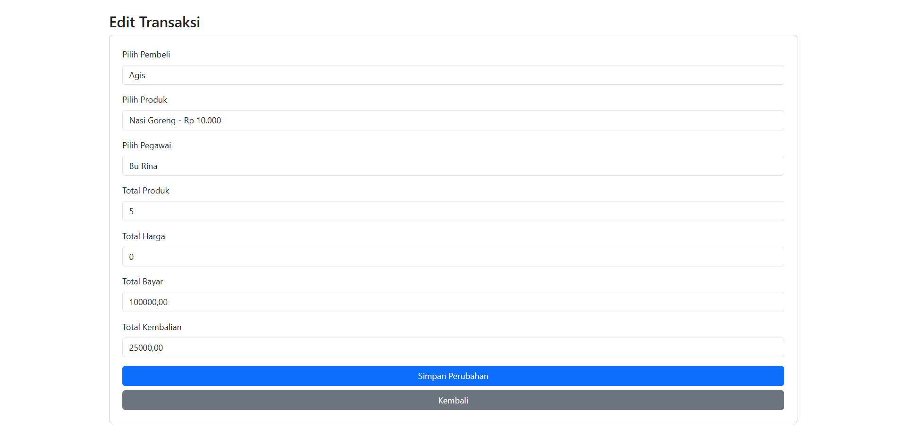
###### **Kode**
```php
<?php

// Koneksi ke database

include('koneksi.php');

// Ambil data transaksi berdasarkan ID

$id_transaksi = $_GET['id'] ?? '';

$transaksi_query = $conn->query("SELECT * FROM transaksi WHERE id_transaksi = '$id_transaksi'");

$transaksi = $transaksi_query->fetch_assoc();

  

// Ambil data produk, pembeli, dan pegawai

$produk_result = $conn->query("SELECT * FROM produk");

$pembeli_result = $conn->query("SELECT * FROM pembeli");

$pegawai_result = $conn->query("SELECT * FROM pegawai_kantin");

  

// Update transaksi

if ($_SERVER["REQUEST_METHOD"] == "POST") {

    $id_pembeli = $_POST['id_pembeli'];

    $id_produk = $_POST['id_produk'];

    $id_pegawai = $_POST['id_pegawai'];

    $total_produk = $_POST['total_produk'];

    $total_bayar = $_POST['total_bayar'];

    $waktu_beli = date('Y-m-d H:i:s');

  

    // Ambil harga produk dari database

    $total_query = $conn->query("SELECT harga_produk FROM produk WHERE id_produk = '$id_produk'");

    $total_result = $total_query->fetch_assoc();

    $harga_produk = $total_result['harga_produk'];

  

    // Hitung total harga

    $total_harga = $harga_produk * $total_produk;

  

    // Hitung kembalian

    $kembalian = $total_bayar - $total_harga;

  

    // Update transaksi di database

    $query = "UPDATE transaksi SET id_pembeli='$id_pembeli', id_produk='$id_produk', id_pegawai='$id_pegawai', total_produk='$total_produk', total_harga='$total_harga', total_bayar='$total_bayar', kembalian='$kembalian' WHERE id_transaksi='$id_transaksi'";

  

    if ($conn->query($query) === TRUE) {

        header("Location: transaksi.php");

        exit;

    } else {

        echo "Error: " . $conn->error;

    }

}

?>

<!DOCTYPE html>

<html lang="id">

<head>

    <meta charset="UTF-8">

    <title>Edit Transaksi</title>

    <link rel="stylesheet" href="https://cdn.jsdelivr.net/npm/bootstrap@5.3.0/dist/css/bootstrap.min.css">

    <script>

        function hitungTotal() {

            var harga_produk = parseInt(document.getElementById("id_produk").selectedOptions[0].dataset.harga);

            var total_produk = parseInt(document.getElementById("total_produk").value);

            var total_bayar = parseInt(document.getElementById("total_bayar").value);

  

            if (isNaN(harga_produk) || isNaN(total_produk)) {

                harga_produk = 0;

                total_produk = 0;

            }

  

            var total_harga = harga_produk * total_produk;

            document.getElementById("total_harga").value = total_harga;

  

            var kembalian = total_bayar - total_harga;

            document.getElementById("kembalian").value = kembalian;

        }

    </script>

</head>

<body>

<div class="container mt-4">

    <h3>Edit Transaksi</h3>

    <div class="card p-4">

        <form method="POST">

            <div class="mb-3">

                <label class="form-label">Pilih Pembeli</label>

                <select name="id_pembeli" class="form-control" required>

                    <?php while ($pembeli = $pembeli_result->fetch_assoc()) { ?>

                        <option value="<?= $pembeli['id_pembeli']; ?>" <?= ($transaksi['id_pembeli'] == $pembeli['id_pembeli']) ? 'selected' : ''; ?>>

                            <?= $pembeli['nama_pembeli']; ?>

                        </option>

                    <?php } ?>

                </select>

            </div>

            <div class="mb-3">

                <label class="form-label">Pilih Produk</label>

                <select name="id_produk" id="id_produk" class="form-control" required onchange="hitungTotal()">

                    <?php while ($produk = $produk_result->fetch_assoc()) { ?>

                        <option value="<?= $produk['id_produk']; ?>" data-harga="<?= $produk['harga_produk']; ?>" <?= ($transaksi['id_produk'] == $produk['id_produk']) ? 'selected' : ''; ?>>

                            <?= $produk['nama_produk']; ?> - Rp <?= number_format($produk['harga_produk'], 0, ',', '.'); ?>

                        </option>

                    <?php } ?>

                </select>

            </div>

            <div class="mb-3">

                <label class="form-label">Pilih Pegawai</label>

                <select name="id_pegawai" class="form-control" required>

                    <?php while ($pegawai = $pegawai_result->fetch_assoc()) { ?>

                        <option value="<?= $pegawai['id_pegawai']; ?>" <?= ($transaksi['id_pegawai'] == $pegawai['id_pegawai']) ? 'selected' : ''; ?>>

                            <?= $pegawai['nama_pegawai']; ?>

                        </option>

                    <?php } ?>

                </select>

            </div>

            <div class="mb-3">

                <label class="form-label">Total Produk</label>

                <input type="number" name="total_produk" id="total_produk" class="form-control" required min="1" value="<?= $transaksi['total_produk']; ?>" oninput="hitungTotal()">

            </div>

            <div class="mb-3">

                <label class="form-label">Total Harga</label>

                <input type="number" id="total_harga" class="form-control" value="<?= $transaksi['total_produk'] * ($transaksi_query->fetch_assoc()['total_harga'] ?? 0); ?>" readonly>

            </div>

            <div class="mb-3">

                <label class="form-label">Total Bayar</label>

                <input type="number" name="total_bayar" id="total_bayar" class="form-control" required value="<?= $transaksi['total_bayar']; ?>" oninput="hitungTotal()">

            </div>

            <div class="mb-3">

                <label class="form-label">Total Kembalian</label>

                <input type="number" id="kembalian" class="form-control" value="<?= $transaksi['kembalian']; ?>" readonly>

            </div>

            <button type="submit" class="btn btn-primary w-100 mb-2">Simpan Perubahan</button>

            <a href="transaksi.php" class="btn btn-secondary w-100">Kembali</a>

        </form>

    </div>

</div>

</body>

</html>
```
##### **b. Kode Program Front-End**
###### **1. Bagian `<head>`**

Kode berikut mengatur metadata dan memuat Bootstrap untuk tampilan lebih rapi. Selain itu, terdapat JavaScript untuk perhitungan otomatis.

```html
<head>
    <meta charset="UTF-8">
    <title>Edit Transaksi</title>
    <link rel="stylesheet" href="https://cdn.jsdelivr.net/npm/bootstrap@5.3.0/dist/css/bootstrap.min.css">
    
    <script>
        function hitungTotal() {
            var harga_produk = parseInt(document.getElementById("id_produk").selectedOptions[0].dataset.harga);
            var total_produk = parseInt(document.getElementById("total_produk").value);
            var total_bayar = parseInt(document.getElementById("total_bayar").value);

            if (isNaN(harga_produk) || isNaN(total_produk)) {
                harga_produk = 0;
                total_produk = 0;
            }

            var total_harga = harga_produk * total_produk;
            document.getElementById("total_harga").value = total_harga;

            var kembalian = total_bayar - total_harga;
            document.getElementById("kembalian").value = kembalian;
        }
    </script>
</head>
```

**Penjelasan:**

- **Bootstrap** digunakan agar tampilan lebih modern.
- **`hitungTotal()`**: Fungsi JavaScript untuk menghitung total harga berdasarkan produk yang dipilih dan jumlah produk yang dibeli.
- Jika pengguna memasukkan total pembayaran, sistem akan menghitung kembalian secara otomatis.

---

###### **2. Bagian `<body>` & Container**

```html
<body>
    <div class="container mt-4">
        <h3>Edit Transaksi</h3>
        <div class="card p-4">
            <form method="POST">
```

**Penjelasan:**

- `<div class="container mt-4">` → Membuat margin atas agar tampilan tidak menempel dengan atas halaman.
- `<div class="card p-4">` → Menjadikan form lebih estetis dengan desain kartu Bootstrap.
- `<form method="POST">` → Form akan mengirim data ke server saat pengguna menekan tombol submit.

---

###### **3. Dropdown Pilihan Pembeli**

```html
<div class="mb-3">
    <label class="form-label">Pilih Pembeli</label>
    <select name="id_pembeli" class="form-control" required>
        <!-- Opsi pembeli diambil dari database -->
    </select>
</div>
```

**Penjelasan:**

- `<label>` memberikan teks keterangan untuk dropdown.
- `<select>` digunakan untuk memilih pembeli yang sudah terdaftar.

---

######  **4. Dropdown Pilihan Produk**

```html
<div class="mb-3">
    <label class="form-label">Pilih Produk</label>
    <select name="id_produk" id="id_produk" class="form-control" required onchange="hitungTotal()">
        <!-- Opsi produk diambil dari database -->
    </select>
</div>
```

**Penjelasan:**

- Saat pengguna memilih produk, fungsi `hitungTotal()` akan dipanggil untuk menghitung harga total berdasarkan harga produk dan jumlah yang dipilih.

---

###### **5. Input Jumlah Produk**

```html
<div class="mb-3">
    <label class="form-label">Total Produk</label>
    <input type="number" name="total_produk" id="total_produk" class="form-control" required min="1" oninput="hitungTotal()">
</div>
```

**Penjelasan:**

- **`type="number"`** → Memastikan hanya angka yang bisa dimasukkan.
- **`min="1"`** → Minimal jumlah produk yang dapat dibeli adalah 1.
- **`oninput="hitungTotal()"`** → Setiap perubahan jumlah produk langsung memperbarui total harga.

---

###### **6. Total Harga (Readonly)**

```html
<div class="mb-3">
    <label class="form-label">Total Harga</label>
    <input type="number" id="total_harga" class="form-control" readonly>
</div>
```

**Penjelasan:**

- **`readonly`** → Pengguna tidak bisa mengedit total harga, karena dihitung otomatis dari harga produk dan jumlah.

---

###### **7. Total Bayar & Kembalian**

```html
<div class="mb-3">
    <label class="form-label">Total Bayar</label>
    <input type="number" name="total_bayar" id="total_bayar" class="form-control" required oninput="hitungTotal()">
</div>

<div class="mb-3">
    <label class="form-label">Total Kembalian</label>
    <input type="number" id="kembalian" class="form-control" readonly>
</div>
```

**Penjelasan:**

- Pengguna memasukkan nominal pembayaran di **Total Bayar**.
- **Total Kembalian** dihitung otomatis dari `total_bayar - total_harga`.

---

###### **8. Tombol Simpan & Kembali**

```html
<button type="submit" class="btn btn-primary w-100 mb-2">Simpan Perubahan</button>
<a href="transaksi.php" class="btn btn-secondary w-100">Kembali</a>
```

**Penjelasan:**

- **Tombol Simpan** (`btn-primary`) → Mengirim data ke server untuk diperbarui di database.
- **Tombol Kembali** (`btn-secondary`) → Mengarahkan kembali ke halaman transaksi tanpa menyimpan perubahan.

##### **c.  Kode Program Back-End**

###### **1. Mengambil Data Transaksi Berdasarkan ID**

Kode:

```php
// Ambil data transaksi berdasarkan ID
$id_transaksi = $_GET['id'] ?? '';
$transaksi_query = $conn->query("SELECT * FROM transaksi WHERE id_transaksi = '$id_transaksi'");
$transaksi = $transaksi_query->fetch_assoc();
```

Penjelasan:

- `$_GET['id'] ?? ''` mengambil nilai ID transaksi dari URL.
- `query("SELECT * FROM transaksi WHERE id_transaksi = '$id_transaksi'")` mengambil data transaksi berdasarkan ID yang diterima.
- `fetch_assoc()` mengonversi hasil query ke dalam bentuk array asosiatif.

---

###### **2. Mengambil Data Produk, Pembeli, dan Pegawai**

Kode:

```php
// Ambil data produk, pembeli, dan pegawai
$produk_result = $conn->query("SELECT * FROM produk");
$pembeli_result = $conn->query("SELECT * FROM pembeli");
$pegawai_result = $conn->query("SELECT * FROM pegawai_kantin");
```

Penjelasan:

- Query SQL digunakan untuk mengambil semua data dari tabel `produk`, `pembeli`, dan `pegawai_kantin` agar nantinya bisa digunakan dalam dropdown.

---

###### **3. Proses Update Transaksi**

Kode:

```php
// Update transaksi
if ($_SERVER["REQUEST_METHOD"] == "POST") {
    $id_pembeli = $_POST['id_pembeli'];
    $id_produk = $_POST['id_produk'];
    $id_pegawai = $_POST['id_pegawai'];
    $total_produk = $_POST['total_produk'];
    $total_bayar = $_POST['total_bayar'];
    $waktu_beli = date('Y-m-d H:i:s');
```

Penjelasan:

- Mengecek apakah form dikirim menggunakan metode `POST`.
- Mengambil data dari form melalui `$_POST`.

---

###### **4. Menghitung Total Harga & Kembalian**

Kode:

```php
    // Ambil harga produk dari database
    $total_query = $conn->query("SELECT harga_produk FROM produk WHERE id_produk = '$id_produk'");
    $total_result = $total_query->fetch_assoc();
    $harga_produk = $total_result['harga_produk'];

    // Hitung total harga
    $total_harga = $harga_produk * $total_produk;

    // Hitung kembalian
    $kembalian = $total_bayar - $total_harga;
```

Penjelasan:

- Query untuk mendapatkan harga produk dari database.
- Menghitung total harga (`harga_produk * total_produk`).
- Menghitung kembalian (`total_bayar - total_harga`).

---

###### **5. Menyimpan Perubahan ke Database**

Kode:

```php
    // Update transaksi di database
    $query = "UPDATE transaksi SET id_pembeli='$id_pembeli', id_produk='$id_produk', id_pegawai='$id_pegawai', total_produk='$total_produk', total_harga='$total_harga', total_bayar='$total_bayar', kembalian='$kembalian' WHERE id_transaksi='$id_transaksi'";

    if ($conn->query($query) === TRUE) {
        header("Location: transaksi.php");
        exit;
    } else {
        echo "Error: " . $conn->error;
    }
```

Penjelasan:

- Membuat query SQL `UPDATE` untuk memperbarui data transaksi berdasarkan ID.
- Jika berhasil, diarahkan ke halaman `transaksi.php`.
- Jika gagal, menampilkan pesan error.

---

###### **6. JavaScript untuk Perhitungan Otomatis**

Kode:

```js
function hitungTotal() {
    var harga_produk = parseInt(document.getElementById("id_produk").selectedOptions[0].dataset.harga);
    var total_produk = parseInt(document.getElementById("total_produk").value);
    var total_bayar = parseInt(document.getElementById("total_bayar").value);

    if (isNaN(harga_produk) || isNaN(total_produk)) {
        harga_produk = 0;
        total_produk = 0;
    }

    var total_harga = harga_produk * total_produk;
    document.getElementById("total_harga").value = total_harga;

    var kembalian = total_bayar - total_harga;
    document.getElementById("kembalian").value = kembalian;
}
```

Penjelasan:

- Mengambil harga produk dari elemen `select` dengan atribut `data-harga`.
- Mengalikan harga produk dengan jumlah produk untuk mendapatkan total harga.
- Menghitung kembalian dengan mengurangi total harga dari total bayar.
- Menampilkan hasil pada input `total_harga` dan `kembalian`.

##### **d. Analisis**

###### **1. Penjelasan Kode Program**

Program ini merupakan halaman untuk mengedit transaksi dalam sistem kantin berbasis web menggunakan PHP dan MySQL. Proses utama dalam kode ini mencakup pengambilan data transaksi berdasarkan ID, menampilkan data terkait seperti produk, pembeli, dan pegawai kantin dalam bentuk dropdown, serta memperbarui transaksi dengan input yang diberikan oleh pengguna.

**Alur Program:**

1. **Koneksi ke Database**
    
    - Program memulai dengan menyertakan file koneksi (`koneksi.php`) untuk menghubungkan ke database.
2. **Mengambil Data Transaksi**
    
    - Data transaksi diambil berdasarkan parameter `id` yang dikirim melalui URL (`$_GET['id']`).
    - Query dijalankan untuk mendapatkan informasi transaksi yang akan diedit.
3. **Mengambil Data Produk, Pembeli, dan Pegawai**
    
    - Program menjalankan beberapa query untuk mengambil daftar produk, pembeli, dan pegawai dari database, yang kemudian digunakan dalam dropdown form.
4. **Form Edit Transaksi**
    
    - Form ini menampilkan data transaksi yang bisa diedit oleh pengguna, seperti pemilihan pembeli, produk, pegawai, jumlah produk, total harga, total bayar, dan kembalian.
    - Form ini memiliki fitur perhitungan otomatis menggunakan JavaScript yang memperbarui total harga dan kembalian saat pengguna mengubah jumlah produk atau total bayar.
5. **Proses Update Transaksi**
    
    - Saat form dikirim (`POST` method), program mengambil nilai yang dimasukkan oleh pengguna dan menghitung ulang total harga serta kembalian.
    - Data transaksi kemudian diperbarui di database menggunakan query `UPDATE`.
    - Jika proses berhasil, pengguna akan diarahkan kembali ke halaman transaksi (`transaksi.php`).

###### **2. Database yang Digunakan**

Program ini menggunakan database MySQL yang memiliki beberapa tabel utama:

1. **Tabel `transaksi`** – Menyimpan informasi transaksi, termasuk ID pembeli, ID produk, ID pegawai, jumlah produk, total harga, total bayar, dan kembalian.
2. **Tabel `produk`** – Menyimpan informasi produk yang dijual di kantin, termasuk nama produk dan harga.
3. **Tabel `pembeli`** – Menyimpan data pembeli seperti nama pelanggan.
4. **Tabel `pegawai_kantin`** – Menyimpan informasi pegawai yang melayani transaksi di kantin.

###### **3. Peran Fitur dalam Mengelola Database**

- **Menampilkan Data:**  
    Program menampilkan data transaksi yang akan diedit serta daftar produk, pembeli, dan pegawai yang tersedia.
- **Validasi Input:**  
    JavaScript memastikan bahwa jumlah produk dan total bayar valid sebelum transaksi diperbarui.
- **Perhitungan Otomatis:**  
    Total harga dan kembalian dihitung otomatis untuk mengurangi kesalahan pengguna.
- **Update Data:**  
    Program memungkinkan pengguna untuk mengubah detail transaksi dan memperbaruinya ke database, memastikan data tetap akurat dan terkini.
- **Navigasi yang Mudah:**  
    Terdapat tombol kembali ke halaman utama transaksi, mempermudah pengguna dalam mengelola transaksi.

Secara keseluruhan, fitur-fitur ini memungkinkan sistem untuk memproses dan mengelola transaksi kantin dengan lebih efisien.
#### **2. Relasi**

##### **Tujuan Relasi**

Program ini bertujuan untuk mengelola transaksi kantin dengan memungkinkan pengguna mengedit informasi transaksi yang sudah ada. Relasi antar tabel dalam database digunakan untuk memastikan bahwa setiap transaksi memiliki keterkaitan yang jelas dengan entitas lainnya, seperti **pembeli**, **produk**, dan **pegawai kantin**. Relasi ini penting untuk menjaga konsistensi data serta memudahkan pengelolaan dan analisis transaksi.

##### **Analisis Relasi dalam Program**

Dalam program ini, terdapat beberapa entitas utama yang memiliki relasi dalam database:

1. **Relasi antara Transaksi dan Pembeli**
    
    - Setiap transaksi harus dikaitkan dengan satu pembeli.
    - Relasi ini ditunjukkan melalui **`id_pembeli`** pada tabel `transaksi`, yang berelasi dengan kolom **`id_pembeli`** pada tabel `pembeli`.
    - Hal ini memastikan bahwa setiap transaksi memiliki informasi tentang siapa yang melakukan pembelian.
2. **Relasi antara Transaksi dan Produk**
    
    - Setiap transaksi harus menyertakan produk yang dibeli.
    - Relasi ini terjadi melalui **`id_produk`** pada tabel `transaksi`, yang berhubungan dengan **`id_produk`** pada tabel `produk`.
    - Dengan relasi ini, sistem dapat mengambil harga produk untuk menghitung total harga berdasarkan jumlah produk yang dibeli.
3. **Relasi antara Transaksi dan Pegawai Kantin**
    
    - Transaksi perlu mencatat pegawai yang melayani pembelian.
    - Relasi ini terjadi melalui **`id_pegawai`** pada tabel `transaksi`, yang berelasi dengan **`id_pegawai`** di tabel `pegawai_kantin`.
    - Dengan relasi ini, sistem dapat mencatat pegawai yang bertanggung jawab dalam transaksi tersebut.
4. **Relasi antara Produk dan Harga Produk**
    
    - Harga produk tidak disimpan langsung dalam tabel transaksi, melainkan diambil dari tabel `produk` berdasarkan **`id_produk`** yang dipilih.
    - Dengan cara ini, jika harga produk berubah, sistem tetap dapat menampilkan harga terbaru tanpa harus mengubah data pada transaksi lama.

##### **Cara Kerja Relasi dalam Fitur Program**

1. **Mengambil Data Transaksi yang Akan Diedit**
    
    - Program mengambil **id transaksi** dari URL (`GET['id']`).
    - Berdasarkan **id transaksi**, program mengambil data transaksi dari tabel `transaksi`, termasuk id pembeli, id produk, id pegawai, total produk, total bayar, dan kembalian.
2. **Menampilkan Data Pembeli, Produk, dan Pegawai dalam Bentuk Dropdown**
    
    - Data pembeli, produk, dan pegawai diambil dari database dan ditampilkan dalam elemen `<select>`.
    - Pilihan yang sesuai dengan transaksi yang sedang diedit akan dipilih secara otomatis (`selected`).
3. **Menghitung Total Harga Secara Otomatis**
    
    - Saat pengguna memilih produk, program mengambil harga produk dari atribut `data-harga` dalam elemen `<option>`.
    - Jika pengguna mengubah jumlah produk yang dibeli, sistem akan menghitung ulang total harga (`total_produk * harga_produk`).
    - Jika pengguna mengisi jumlah pembayaran (`total_bayar`), sistem akan menghitung kembalian (`total_bayar - total_harga`).
4. **Mengupdate Data Transaksi**
    
    - Setelah pengguna mengisi form dan menekan tombol "Simpan Perubahan", sistem akan memperbarui data transaksi di database.
    - Query SQL `UPDATE` digunakan untuk mengganti nilai **id_pembeli, id_produk, id_pegawai, total_produk, total_harga, total_bayar, dan kembalian** berdasarkan `id_transaksi`.
    - Setelah proses berhasil, pengguna akan diarahkan kembali ke halaman transaksi.


## Detail_Transaksi

### **1. Rincian Fitur**


#### **a. Menampilkan Daftar Detail_Transaksi****

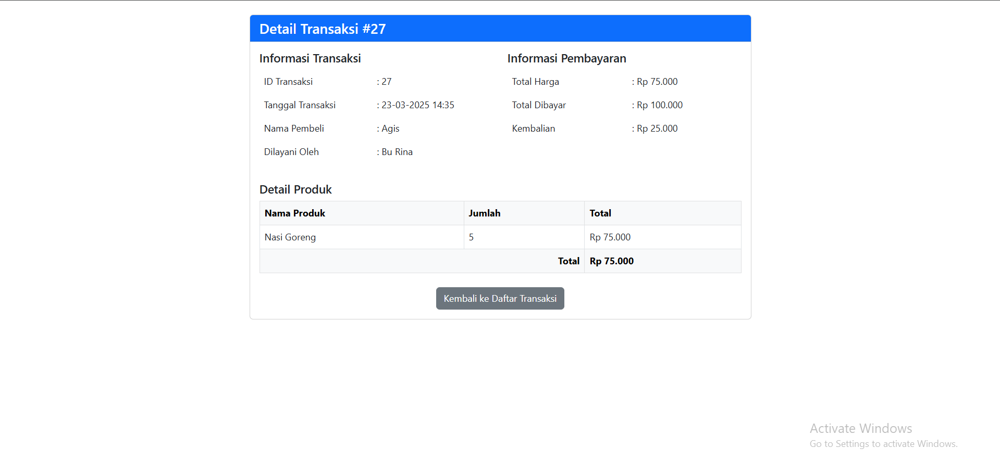

##### **Kode**
```php
<?php

// Koneksi ke database

$host = "localhost";

$user = "root";

$pass = "";

$db = "kantin_sekolah";

$conn = new mysqli($host, $user, $pass, $db);

  

if ($conn->connect_error) {

    die("Koneksi gagal: " . $conn->connect_error);

}

  

// Periksa apakah id transaksi ada

if (!isset($_GET['id']) || empty($_GET['id'])) {

    header("Location: transaksi.php");

    exit;

}

  

$id_transaksi = $_GET['id'];

  

// Query untuk mendapatkan detail transaksi

$query = "SELECT t.id_transaksi, t.waktu_beli, p.nama_pembeli, pg.nama_pegawai,

          pr.nama_produk, t.total_produk, t.total_harga, t.total_bayar, t.kembalian

          FROM transaksi t

          JOIN pembeli p ON t.id_pembeli = p.id_pembeli

          JOIN pegawai_kantin pg ON t.id_pegawai = pg.id_pegawai

          JOIN produk pr ON t.id_produk = pr.id_produk

          WHERE t.id_transaksi = '$id_transaksi'";

  

$result = $conn->query($query);

  

// Periksa apakah transaksi ditemukan

if ($result->num_rows == 0) {

    echo "Transaksi tidak ditemukan";

    exit;

}

  

$transaksi = $result->fetch_assoc();

?>

  

<!DOCTYPE html>

<html lang="id">

<head>

    <meta charset="UTF-8">

    <title>Detail Transaksi - Kantin Sekolah</title>

    <link rel="stylesheet" href="https://cdn.jsdelivr.net/npm/bootstrap@5.3.0/dist/css/bootstrap.min.css">

</head>

<body>

    <nav class="navbar navbar-expand-lg navbar-dark bg-dark">

        <div class="container">

            <a class="navbar-brand" href="#">Kantin Sekolah</a>

            <div class="collapse navbar-collapse">

                <ul class="navbar-nav ms-auto">

                    <li class="nav-item"><a class="nav-link" href="index.php">Home</a></li>

                    <li class="nav-item"><a class="nav-link" href="produk.php">Produk</a></li>

                    <li class="nav-item"><a class="nav-link" href="transaksi.php">Transaksi</a></li>

                </ul>

            </div>

        </div>

    </nav>

  

    <div class="container mt-4">

        <div class="row">

            <div class="col-md-8 mx-auto">

                <div class="card">

                    <div class="card-header bg-primary text-white">

                        <h4 class="mb-0">Detail Transaksi #<?= $transaksi['id_transaksi'] ?></h4>

                    </div>

                    <div class="card-body">

                        <div class="row mb-3">

                            <div class="col-md-6">

                                <h5>Informasi Transaksi</h5>

                                <table class="table table-borderless">

                                    <tr>

                                        <td>ID Transaksi</td>

                                        <td>: <?= $transaksi['id_transaksi'] ?></td>

                                    </tr>

                                    <tr>

                                        <td>Tanggal Transaksi</td>

                                        <td>: <?= date('d-m-Y H:i', strtotime($transaksi['waktu_beli'])) ?></td>

                                    </tr>

                                    <tr>

                                        <td>Nama Pembeli</td>

                                        <td>: <?= $transaksi['nama_pembeli'] ?></td>

                                    </tr>

                                    <tr>

                                        <td>Dilayani Oleh</td>

                                        <td>: <?= $transaksi['nama_pegawai'] ?></td>

                                    </tr>

                                </table>

                            </div>

                            <div class="col-md-6">

                                <h5>Informasi Pembayaran</h5>

                                <table class="table table-borderless">

                                    <tr>

                                        <td>Total Harga</td>

                                        <td>: Rp <?= number_format($transaksi['total_harga'], 0, ',', '.') ?></td>

                                    </tr>

                                    <tr>

                                        <td>Total Dibayar</td>

                                        <td>: Rp <?= number_format($transaksi['total_bayar'], 0, ',', '.') ?></td>

                                    </tr>

                                    <tr>

                                        <td>Kembalian</td>

                                        <td>: Rp <?= number_format($transaksi['kembalian'], 0, ',', '.') ?></td>

                                    </tr>

                                </table>

                            </div>

                        </div>

  

                        <h5>Detail Produk</h5>

                        <table class="table table-bordered">

                            <thead class="table-light">

                                <tr>

                                    <th>Nama Produk</th>

                                    <th>Jumlah</th>

                                    <th>Total</th>

                                </tr>

                            </thead>

                            <tbody>

                                <tr>

                                    <td><?= $transaksi['nama_produk'] ?></td>

                                    <td><?= $transaksi['total_produk'] ?></td>

                                    <td>Rp <?= number_format($transaksi['total_harga'], 0, ',', '.') ?></td>

                                </tr>

                            </tbody>

                            <tfoot class="table-light">

                                <tr>

                                    <th colspan="2" class="text-end">Total</th>

                                    <th>Rp <?= number_format($transaksi['total_harga'], 0, ',', '.') ?></th>

                                </tr>

                            </tfoot>

                        </table>

  

                        <div class="mt-4 text-center">

                            <a href="transaksi.php" class="btn btn-secondary">Kembali ke Daftar Transaksi</a>

                            <a href="cetak_struk.php?id=<?= $transaksi['id_transaksi'] ?>" class="btn btn-success ms-2">Cetak Struk</a>

                        </div>

                    </div>

                </div>

            </div>

        </div>

    </div>

  

    <script src="https://cdn.jsdelivr.net/npm/bootstrap@5.3.0/dist/js/bootstrap.bundle.min.js"></script>

</body>

</html>
```
#### **b. Kode Program Front-End**

##### **1. Struktur Dasar HTML**

```html
<!DOCTYPE html>
<html lang="id">
<head>
    <meta charset="UTF-8">
    <meta name="viewport" content="width=device-width, initial-scale=1">
    <title>Detail Transaksi - Kantin Sekolah</title>
    <link rel="stylesheet" href="https://cdn.jsdelivr.net/npm/bootstrap@5.3.0/dist/css/bootstrap.min.css">
</head>
<body>
```

**Penjelasan:**

- Menggunakan Bootstrap CDN untuk tampilan yang modern.
- `meta viewport` memastikan tampilan responsif di perangkat mobile.

---

##### **2. Navbar**

```html
<nav class="navbar navbar-expand-lg navbar-dark bg-dark">
    <div class="container">
        <a class="navbar-brand" href="#">Kantin Sekolah</a>
        <button class="navbar-toggler" type="button" data-bs-toggle="collapse" data-bs-target="#navbarNav">
            <span class="navbar-toggler-icon"></span>
        </button>
        <div class="collapse navbar-collapse" id="navbarNav">
            <ul class="navbar-nav ms-auto">
                <li class="nav-item"><a class="nav-link" href="index.php">Home</a></li>
                <li class="nav-item"><a class="nav-link" href="produk.php">Produk</a></li>
                <li class="nav-item"><a class="nav-link" href="transaksi.php">Transaksi</a></li>
            </ul>
        </div>
    </div>
</nav>
```

**Penjelasan:**

- Navbar responsif dengan tombol hamburger untuk mobile.
- Menu navigasi menuju halaman utama, daftar produk, dan transaksi.

---

##### **3. Kontainer Detail Transaksi**

```html
<div class="container mt-4">
    <div class="row">
        <div class="col-md-8 mx-auto">
            <div class="card shadow">
                <div class="card-header bg-primary text-white">
                    <h4 class="mb-0">Detail Transaksi #<?= $transaksi['id_transaksi'] ?></h4>
                </div>
                <div class="card-body">
```

**Penjelasan:**

- `container mt-4` memberikan jarak dari atas.
- `card shadow` menampilkan tampilan yang lebih menarik.
- `bg-primary text-white` untuk header kartu dengan warna biru.

---

##### **4. Informasi Transaksi**

```html
<div class="row mb-3">
    <div class="col-md-6">
        <h5>Informasi Transaksi</h5>
        <table class="table table-borderless">
            <tr><td>ID Transaksi</td><td>: <?= $transaksi['id_transaksi'] ?></td></tr>
            <tr><td>Tanggal Transaksi</td><td>: <?= date('d-m-Y H:i', strtotime($transaksi['waktu_beli'])) ?></td></tr>
            <tr><td>Nama Pembeli</td><td>: <?= $transaksi['nama_pembeli'] ?></td></tr>
            <tr><td>Dilayani Oleh</td><td>: <?= $transaksi['nama_pegawai'] ?></td></tr>
        </table>
    </div>
    <div class="col-md-6">
        <h5>Informasi Pembayaran</h5>
        <table class="table table-borderless">
            <tr><td>Total Harga</td><td>: Rp <?= number_format($transaksi['total_harga'], 0, ',', '.') ?></td></tr>
            <tr><td>Total Dibayar</td><td>: Rp <?= number_format($transaksi['total_bayar'], 0, ',', '.') ?></td></tr>
            <tr><td>Kembalian</td><td>: Rp <?= number_format($transaksi['kembalian'], 0, ',', '.') ?></td></tr>
        </table>
    </div>
</div>
```

**Penjelasan:**

- **Dibagi dua kolom (`col-md-6`)**: Satu untuk informasi transaksi, satu untuk informasi pembayaran.
- Menggunakan `table-borderless` agar tampilan lebih rapi tanpa garis tebal.

---

##### **5. Detail Produk**

```html
<h5>Detail Produk</h5>
<table class="table table-bordered">
    <thead class="table-light">
        <tr>
            <th>Nama Produk</th>
            <th>Jumlah</th>
            <th>Total</th>
        </tr>
    </thead>
    <tbody>
        <tr>
            <td><?= $transaksi['nama_produk'] ?></td>
            <td><?= $transaksi['total_produk'] ?></td>
            <td>Rp <?= number_format($transaksi['total_harga'], 0, ',', '.') ?></td>
        </tr>
    </tbody>
    <tfoot class="table-light">
        <tr>
            <th colspan="2" class="text-end">Total</th>
            <th>Rp <?= number_format($transaksi['total_harga'], 0, ',', '.') ?></th>
        </tr>
    </tfoot>
</table>
```

**Penjelasan:**

- Menampilkan daftar produk yang dibeli dalam tabel.
- `thead class="table-light"` membuat header lebih terang.
- `tfoot` digunakan untuk menampilkan total transaksi.

---

##### **6. Tombol Aksi**

```html
<div class="mt-4 text-center">
    <a href="transaksi.php" class="btn btn-secondary">Kembali ke Daftar Transaksi</a>
    <a href="cetak_struk.php?id=<?= $transaksi['id_transaksi'] ?>" class="btn btn-success ms-2">Cetak Struk</a>
</div>
```

**Penjelasan:**

- Tombol **kembali** ke daftar transaksi.
- Tombol **cetak struk** untuk mencetak bukti transaksi.

#### **c. Kode Program Backend**

##### **1. Periksa Apakah `id` Transaksi Ada**

```php
if (!isset($_GET['id']) || empty($_GET['id'])) {
    header("Location: transaksi.php");
    exit;
}
$id_transaksi = $_GET['id'];
```

**Penjelasan:**

- Mengecek apakah parameter `id` dikirim melalui URL (`GET`).
- Jika tidak ada, pengguna dialihkan ke `transaksi.php`.

---

##### **2. Query untuk Mengambil Data Transaksi**

```php
$query = "SELECT t.id_transaksi, t.waktu_beli, p.nama_pembeli, pg.nama_pegawai, 
          pr.nama_produk, t.total_produk, t.total_harga, t.total_bayar, t.kembalian 
          FROM transaksi t
          JOIN pembeli p ON t.id_pembeli = p.id_pembeli
          JOIN pegawai_kantin pg ON t.id_pegawai = pg.id_pegawai
          JOIN produk pr ON t.id_produk = pr.id_produk
          WHERE t.id_transaksi = '$id_transaksi'";

$result = $conn->query($query);
```

**Penjelasan:**

- Mengambil data transaksi berdasarkan `id_transaksi`.
- Bergabung (`JOIN`) dengan tabel `pembeli`, `pegawai_kantin`, dan `produk` untuk mendapatkan detail lengkap.

---

##### **3 Periksa Apakah Data Ditemukan**

```php
if ($result->num_rows == 0) {
    echo "Transaksi tidak ditemukan";
    exit;
}

$transaksi = $result->fetch_assoc();
```

**Penjelasan:**

- Jika data tidak ditemukan (`num_rows == 0`), tampilkan pesan error dan hentikan eksekusi.
- Jika ditemukan, ambil hasil dalam bentuk array asosiatif (`fetch_assoc()`).

---

##### **4. Tampilkan Data dalam HTML**

###### **Navbar**

```php
<nav class="navbar navbar-expand-lg navbar-dark bg-dark">
    <div class="container">
        <a class="navbar-brand" href="#">Kantin Sekolah</a>
        <div class="collapse navbar-collapse">
            <ul class="navbar-nav ms-auto">
                <li class="nav-item"><a class="nav-link" href="index.php">Home</a></li>
                <li class="nav-item"><a class="nav-link" href="produk.php">Produk</a></li>
                <li class="nav-item"><a class="nav-link" href="transaksi.php">Transaksi</a></li>
            </ul>
        </div>
    </div>
</nav>
```

**Penjelasan:**

- Menampilkan navigasi menggunakan Bootstrap.

---

###### **Menampilkan Detail Transaksi**

```php
<h5>Informasi Transaksi</h5>
<table class="table table-borderless">
    <tr>
        <td>ID Transaksi</td>
        <td>: <?= $transaksi['id_transaksi'] ?></td>
    </tr>
    <tr>
        <td>Tanggal Transaksi</td>
        <td>: <?= date('d-m-Y H:i', strtotime($transaksi['waktu_beli'])) ?></td>
    </tr>
    <tr>
        <td>Nama Pembeli</td>
        <td>: <?= $transaksi['nama_pembeli'] ?></td>
    </tr>
    <tr>
        <td>Dilayani Oleh</td>
        <td>: <?= $transaksi['nama_pegawai'] ?></td>
    </tr>
</table>
```

**Penjelasan:**

- Menampilkan informasi transaksi, termasuk ID, tanggal, nama pembeli, dan pegawai yang melayani.
- `date('d-m-Y H:i', strtotime($transaksi['waktu_beli']))` digunakan untuk mengubah format waktu.

---

###### **Menampilkan Informasi Pembayaran**

```php
<h5>Informasi Pembayaran</h5>
<table class="table table-borderless">
    <tr>
        <td>Total Harga</td>
        <td>: Rp <?= number_format($transaksi['total_harga'], 0, ',', '.') ?></td>
    </tr>
    <tr>
        <td>Total Dibayar</td>
        <td>: Rp <?= number_format($transaksi['total_bayar'], 0, ',', '.') ?></td>
    </tr>
    <tr>
        <td>Kembalian</td>
        <td>: Rp <?= number_format($transaksi['kembalian'], 0, ',', '.') ?></td>
    </tr>
</table>
```

**Penjelasan:**

- Menampilkan total harga, jumlah yang dibayar, dan kembalian.
- `number_format($transaksi['total_harga'], 0, ',', '.')` digunakan untuk memformat angka ke mata uang Rupiah.

---

###### **Menampilkan Detail Produk**

```php
<h5>Detail Produk</h5>
<table class="table table-bordered">
    <thead class="table-light">
        <tr>
            <th>Nama Produk</th>
            <th>Jumlah</th>
            <th>Total</th>
        </tr>
    </thead>
    <tbody>
        <tr>
            <td><?= $transaksi['nama_produk'] ?></td>
            <td><?= $transaksi['total_produk'] ?></td>
            <td>Rp <?= number_format($transaksi['total_harga'], 0, ',', '.') ?></td>
        </tr>
    </tbody>
    <tfoot class="table-light">
        <tr>
            <th colspan="2" class="text-end">Total</th>
            <th>Rp <?= number_format($transaksi['total_harga'], 0, ',', '.') ?></th>
        </tr>
    </tfoot>
</table>
```

**Penjelasan:**

- Menampilkan produk yang dibeli beserta jumlah dan total harga.

---

##### **5. Tombol Navigasi**

```php
<div class="mt-4 text-center">
    <a href="transaksi.php" class="btn btn-secondary">Kembali ke Daftar Transaksi</a>
    <a href="cetak_struk.php?id=<?= $transaksi['id_transaksi'] ?>" class="btn btn-success ms-2">Cetak Struk</a>
</div>
```

**Penjelasan:**

- Tombol kembali ke daftar transaksi dan cetak struk.
- `cetak_struk.php?id=<?= $transaksi['id_transaksi'] ?>` memungkinkan pencetakan struk berdasarkan transaksi yang dipilih.

#### **d. Analisis**

##### **1. Penjelasan Kode Program**

Program ini menampilkan detail transaksi berdasarkan ID transaksi yang diterima melalui URL (`$_GET['id']`). Jika tidak ada ID yang diberikan, pengguna akan dialihkan kembali ke halaman daftar transaksi (`transaksi.php`). Setelah mendapatkan ID transaksi, program mengambil data dari database dan menampilkan informasi transaksi serta daftar produk yang dibeli.

Data transaksi yang ditampilkan meliputi:

- **Informasi transaksi**: ID transaksi, waktu transaksi, nama pembeli, dan pegawai kantin yang melayani transaksi.
- **Informasi pembayaran**: Total harga, jumlah yang dibayarkan, dan kembalian.
- **Detail produk**: Daftar produk yang dibeli, jumlah produk, dan total harga per produk.

Untuk tampilan, program menggunakan Bootstrap agar tampilan lebih rapi dan responsif. Data transaksi dan produk ditampilkan dalam tabel yang jelas, dengan bagian terpisah untuk informasi transaksi dan pembayaran.

---

##### **2. Database yang Digunakan**

Program ini menggunakan MySQL sebagai database, dengan beberapa tabel utama yang digunakan dalam proses pengambilan data:

1. **Tabel `transaksi`**  
    Berisi data transaksi seperti ID transaksi, waktu transaksi (`waktu_beli`), total harga (`total_harga`), total dibayar (`total_bayar`), dan kembalian (`kembalian`).
    
2. **Tabel `pembeli`**  
    Menyimpan data pembeli, dengan ID pembeli (`id_pembeli`) yang dihubungkan ke transaksi.
    
3. **Tabel `pegawai_kantin`**  
    Menyimpan informasi pegawai kantin yang melayani transaksi, dihubungkan melalui `id_pegawai`.
    
4. **Tabel `produk`**  
    Berisi daftar produk yang tersedia di kantin. Hubungan dengan transaksi dilakukan melalui `id_produk`.
    

---

##### **3. Peran Fitur dalam Mengelola Database**

1. **Mengambil data transaksi**  
    Program melakukan query untuk mendapatkan informasi transaksi berdasarkan ID yang diberikan. Ini memungkinkan pengguna melihat detail transaksi tertentu.
    
2. **Menampilkan informasi pembayaran**  
    Dengan mengambil data total harga, jumlah dibayar, dan kembalian, program membantu memastikan transaksi tercatat dengan benar.
    
3. **Menampilkan daftar produk dalam transaksi**  
    Produk yang dibeli dalam transaksi ditampilkan dalam tabel, sehingga pengguna dapat melihat item yang telah dibeli dan jumlahnya.
    
4. **Navigasi dan pengelolaan transaksi**  
    Program menyediakan tombol kembali ke daftar transaksi, memudahkan pengguna dalam berpindah antara detail transaksi dan daftar transaksi.
    

Dengan fitur ini, program membantu pengelolaan transaksi kantin secara efisien, memastikan semua data tersimpan dengan baik di database, dan memberikan tampilan yang mudah dipahami oleh pengguna.
### **2. Relasi**

#### **a. Tabel yang Terelasi dalam Fitur Ini**

- **Tabel `transaksi`** berelasi dengan **tabel `pembeli`** melalui `id_pembeli`. Relasi ini digunakan untuk mendapatkan informasi siapa yang melakukan transaksi.
    
- **Tabel `transaksi`** berelasi dengan **tabel `pegawai_kantin`** melalui `id_pegawai`. Relasi ini digunakan untuk mengetahui pegawai kantin yang melayani transaksi.
    
- **Tabel `transaksi`** berelasi dengan **tabel `produk`** melalui `id_produk`. Relasi ini digunakan untuk mengetahui produk apa yang dibeli dalam transaksi.
#### **b. Tujuan Relasi**

- **Relasi `transaksi` dengan `pembeli`** → Mengetahui siapa pembeli dalam transaksi.
- **Relasi `transaksi` dengan `pegawai_kantin`** → Mengetahui siapa pegawai yang melayani transaksi.
- **Relasi `transaksi` dengan `produk`** → Mengetahui produk apa yang dibeli dalam transaksi.

#### **c. Analisis Query Relasi**

Query di atas menggunakan **INNER JOIN** untuk menggabungkan data dari beberapa tabel:

```sql
JOIN pembeli p ON t.id_pembeli = p.id_pembeli
JOIN pegawai_kantin pg ON t.id_pegawai = pg.id_pegawai
JOIN produk pr ON t.id_produk = pr.id_produk
```

- **INNER JOIN memastikan hanya transaksi dengan data lengkap** yang ditampilkan.
- Jika ada transaksi tanpa pembeli/pegawai/produk yang valid, maka tidak akan muncul.

#### **d. Cara Kerja Fitur terhadap Relasi**

1. Ketika pengguna mengakses halaman detail transaksi, **sistem mengambil `id_transaksi` dari URL (`GET`)**.
2. Sistem menjalankan **query JOIN untuk mendapatkan data lengkap transaksi**.
3. Data hasil query ditampilkan dalam tabel untuk memberikan informasi yang jelas kepada pengguna.

---
## Pembeli
### Tampilan Pembeli
#### **1.Menampilkan Pembeli**
##### **a. Tampilan Fitur**
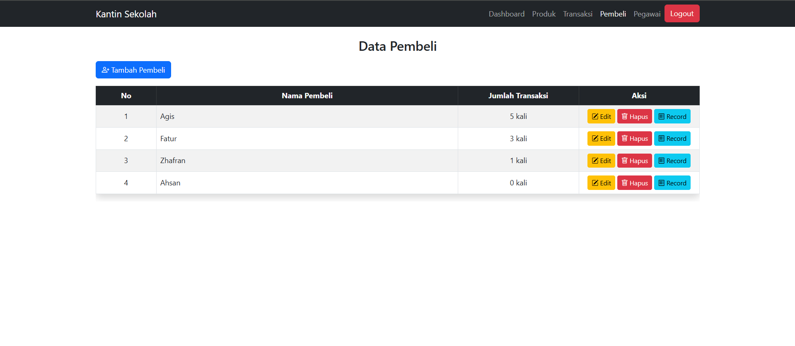
###### **Kode**
```php
<?php

// Koneksi ke database

session_start();

include('koneksi.php');

  

// Ambil Data Pembeli dan jumlah transaksi

$pembeli_result = $conn->query("SELECT p.*, COUNT(t.id_transaksi) as jumlah_transaksi

                                FROM pembeli p

                                LEFT JOIN transaksi t ON p.id_pembeli = t.id_pembeli

                                GROUP BY p.id_pembeli");

  

?>

<!DOCTYPE html>

<html lang="id">

<head>

    <meta charset="UTF-8">

    <title>Data Pembeli</title>

    <link rel="stylesheet" href="https://cdn.jsdelivr.net/npm/bootstrap@5.3.0/dist/css/bootstrap.min.css">

</head>

<body>

  

<nav class="navbar navbar-expand-lg navbar-dark bg-dark">

    <div class="container">

        <a class="navbar-brand" href="#">Kantin Sekolah</a>

        <button class="navbar-toggler" type="button" data-bs-toggle="collapse" data-bs-target="#navbarNav">

            <span class="navbar-toggler-icon"></span>

        </button>

        <div class="collapse navbar-collapse" id="navbarNav">

            <ul class="navbar-nav ms-auto">

                <li class="nav-item"><a class="nav-link" href="dashboard.php">Dashboard</a></li>

                <li class="nav-item"><a class="nav-link" href="produk.php">Produk</a></li>

                <li class="nav-item"><a class="nav-link" href="transaksi.php">Transaksi</a></li>

                <li class="nav-item"><a class="nav-link active" href="pembeli.php">Pembeli</a></li>

                <li class="nav-item"><a class="nav-link" href="pegawai.php">Pegawai</a></li>

                <li class="nav-item"><a class="btn btn-danger" href="login.php">Logout</a></li>

            </ul>

        </div>

    </div>

</nav>

  

<div class="container mt-4">

    <h3 class="mb-3 text-center">Data Pembeli</h3>

  

    <a href="tambah_pembeli.php" class="btn btn-primary mb-3">

        <i class="bi bi-person-plus"></i> Tambah Pembeli

    </a>

  

    <div class="table-responsive">

        <table class="table table-striped table-hover table-bordered rounded-3 shadow">

            <thead class="table-dark">

                <tr class="text-center">

                    <th style="width: 10%;">No</th>

                    <th style="width: 50%;">Nama Pembeli</th>

                    <th style="width: 20%;">Jumlah Transaksi</th>

                    <th style="width: 20%;">Aksi</th>

                </tr>

            </thead>

            <tbody>

                <?php $no = 1; while ($pembeli = $pembeli_result->fetch_assoc()) { ?>

                    <tr class="align-middle">

                        <td class="text-center"><?= $no++; ?></td>

                        <td><?= htmlspecialchars($pembeli['nama_pembeli']); ?></td>

                        <td class="text-center"><?= $pembeli['jumlah_transaksi']; ?> kali</td>

                        <td class="text-center">

                            <a href="edit_pembeli.php?id=<?= $pembeli['id_pembeli']; ?>" class="btn btn-warning btn-sm">

                                <i class="bi bi-pencil-square"></i> Edit

                            </a>

                            <a href="hapus_pembeli.php?id=<?= $pembeli['id_pembeli']; ?>" class="btn btn-danger btn-sm" onclick="return confirm('Yakin ingin menghapus pembeli ini?');">

                                <i class="bi bi-trash"></i> Hapus

                            </a>

                            <a href="record_transaksi.php?id=<?= $pembeli['id_pembeli']; ?>" class="btn btn-info btn-sm">

                                <i class="bi bi-receipt"></i> Record

                            </a>

                        </td>

                    </tr>

                <?php } ?>

            </tbody>

        </table>

    </div>

</div>

  

<!-- Bootstrap Icons -->

<link rel="stylesheet" href="https://cdn.jsdelivr.net/npm/bootstrap-icons/font/bootstrap-icons.css">

<script src="https://cdn.jsdelivr.net/npm/bootstrap@5.3.0/dist/js/bootstrap.bundle.min.js"></script>

</body>

</html>
```
##### **b. Kode Program Front-End**

###### **1. Bagian Frontend - Struktur Dasar HTML**

Kode berikut mendefinisikan struktur dasar dokumen HTML dan menyertakan Bootstrap.

```html
<!DOCTYPE html>
<html lang="id">
<head>
    <meta charset="UTF-8">
    <title>Data Pembeli</title>
    <link rel="stylesheet" href="https://cdn.jsdelivr.net/npm/bootstrap@5.3.0/dist/css/bootstrap.min.css">
</head>
<body>
```

**Penjelasan**:

- `<!DOCTYPE html>` → Menentukan jenis dokumen HTML.
- `<html lang="id">` → Menandakan bahwa bahasa yang digunakan adalah Bahasa Indonesia.
- `<meta charset="UTF-8">` → Menentukan encoding karakter agar bisa menampilkan karakter khusus.
- `<title>Data Pembeli</title>` → Judul halaman web.
- `<link rel="stylesheet" href="https://cdn.jsdelivr.net/npm/bootstrap@5.3.0/dist/css/bootstrap.min.css">` → Menggunakan Bootstrap CDN untuk styling.

---

###### **2. Navbar Navigasi**

Kode berikut adalah navbar Bootstrap yang berisi menu navigasi.

```html
<nav class="navbar navbar-expand-lg navbar-dark bg-dark">
    <div class="container">
        <a class="navbar-brand" href="#">Kantin Sekolah</a>
        <button class="navbar-toggler" type="button" data-bs-toggle="collapse" data-bs-target="#navbarNav">
            <span class="navbar-toggler-icon"></span>
        </button>
        <div class="collapse navbar-collapse" id="navbarNav">
            <ul class="navbar-nav ms-auto">
                <li class="nav-item"><a class="nav-link" href="dashboard.php">Dashboard</a></li>
                <li class="nav-item"><a class="nav-link" href="produk.php">Produk</a></li>
                <li class="nav-item"><a class="nav-link" href="transaksi.php">Transaksi</a></li>
                <li class="nav-item"><a class="nav-link active" href="pembeli.php">Pembeli</a></li>
                <li class="nav-item"><a class="nav-link" href="pegawai.php">Pegawai</a></li>
                <li class="nav-item"><a class="btn btn-danger" href="login.php">Logout</a></li>
            </ul>
        </div>
    </div>
</nav>
```

**Penjelasan**:

- `<nav class="navbar navbar-expand-lg navbar-dark bg-dark">` → Navbar dengan tampilan gelap menggunakan Bootstrap.
- `<div class="container">` → Membuat navbar berada di dalam container agar rapi.
- `<ul class="navbar-nav ms-auto">` → Menggunakan `ms-auto` agar menu berada di kanan.
- `<li class="nav-item"><a class="nav-link active" href="pembeli.php">Pembeli</a></li>` → Menampilkan menu aktif untuk halaman pembeli.
- `<a class="btn btn-danger" href="login.php">Logout</a>` → Tombol logout dengan warna merah.

---

###### **3. Bagian Konten - Menampilkan Data Pembeli**

Kode berikut menampilkan tabel daftar pembeli beserta jumlah transaksi.

```html
<div class="container mt-4">
    <h3 class="mb-3 text-center">Data Pembeli</h3>

    <a href="tambah_pembeli.php" class="btn btn-primary mb-3">
        <i class="bi bi-person-plus"></i> Tambah Pembeli
    </a>

    <div class="table-responsive">
        <table class="table table-striped table-hover table-bordered rounded-3 shadow">
            <thead class="table-dark">
                <tr class="text-center">
                    <th style="width: 10%;">No</th>
                    <th style="width: 50%;">Nama Pembeli</th>
                    <th style="width: 20%;">Jumlah Transaksi</th>
                    <th style="width: 20%;">Aksi</th>
                </tr>
            </thead>
            <tbody>
                <?php $no = 1; while ($pembeli = $pembeli_result->fetch_assoc()) { ?>
                    <tr class="align-middle">
                        <td class="text-center"><?= $no++; ?></td>
                        <td><?= htmlspecialchars($pembeli['nama_pembeli']); ?></td>
                        <td class="text-center"><?= $pembeli['jumlah_transaksi']; ?> kali</td>
                        <td class="text-center">
                            <a href="edit_pembeli.php?id=<?= $pembeli['id_pembeli']; ?>" class="btn btn-warning btn-sm">
                                <i class="bi bi-pencil-square"></i> Edit
                            </a>
                            <a href="hapus_pembeli.php?id=<?= $pembeli['id_pembeli']; ?>" class="btn btn-danger btn-sm" onclick="return confirm('Yakin ingin menghapus pembeli ini?');">
                                <i class="bi bi-trash"></i> Hapus
                            </a>
                            <a href="record_transaksi.php?id=<?= $pembeli['id_pembeli']; ?>" class="btn btn-info btn-sm">
                                <i class="bi bi-receipt"></i> Record
                            </a>
                        </td>
                    </tr>
                <?php } ?>
            </tbody>
        </table>
    </div>
</div>
```

**Penjelasan**:

- `<h3 class="mb-3 text-center">Data Pembeli</h3>` → Judul halaman.
- `<a href="tambah_pembeli.php" class="btn btn-primary mb-3">Tambah Pembeli</a>` → Tombol untuk menambah pembeli baru.
- `<table class="table table-striped table-hover table-bordered">` → Membuat tabel dengan styling Bootstrap.
- Looping PHP:
    
    ```php
    <?php $no = 1; while ($pembeli = $pembeli_result->fetch_assoc()) { ?>
    ```
    
    → Mengambil data pembeli satu per satu dan menampilkannya di tabel.

---

###### **4. Bootstrap Icons & Script**

```html
<!-- Bootstrap Icons -->
<link rel="stylesheet" href="https://cdn.jsdelivr.net/npm/bootstrap-icons/font/bootstrap-icons.css">
<script src="https://cdn.jsdelivr.net/npm/bootstrap@5.3.0/dist/js/bootstrap.bundle.min.js"></script>
```

**Penjelasan**:

- Menggunakan Bootstrap Icons (`bi bi-pencil-square`, `bi bi-trash`, `bi bi-receipt`).
- Memuat Bootstrap JavaScript agar navbar bisa berfungsi dengan baik.

##### **c. Kode Program Beck-End**

###### **1. Koneksi ke Database dan Pengambilan Data**

```php
// Koneksi ke database
session_start();
include('koneksi.php'); 

// Ambil Data Pembeli dan jumlah transaksi
$pembeli_result = $conn->query("SELECT p.*, COUNT(t.id_transaksi) as jumlah_transaksi 
                                FROM pembeli p 
                                LEFT JOIN transaksi t ON p.id_pembeli = t.id_pembeli 
                                GROUP BY p.id_pembeli");
```

**Penjelasan:**

- **`session_start();`** → Memulai sesi agar bisa menangani login pengguna.
- **`include('koneksi.php');`** → Memasukkan file `koneksi.php`, yang berisi koneksi ke database.
- **Query SQL**:
    - Mengambil semua data pembeli (`p.*`).
    - Menghitung jumlah transaksi (`COUNT(t.id_transaksi) AS jumlah_transaksi`).
    - Menggunakan `LEFT JOIN` agar pembeli tetap ditampilkan meskipun tidak memiliki transaksi.
    - Menggunakan `GROUP BY p.id_pembeli` untuk mengelompokkan hasil berdasarkan pembeli.

##### **d. Analisis**

###### **1. Penjelasan Kode Program**

Program ini merupakan halaman **Data Pembeli** dalam sistem kantin sekolah berbasis PHP dan MySQL. Program ini menampilkan daftar pembeli yang pernah melakukan transaksi di kantin, beserta jumlah transaksi yang telah mereka lakukan.

- **Koneksi ke Database**  
    Program ini terhubung ke database menggunakan `koneksi.php`, yang memastikan data dapat diakses dan dimanipulasi.
- **Menggunakan Session**  
    `session_start();` digunakan untuk memastikan bahwa pengguna memiliki akses yang sah ke halaman ini.
- **Mengambil Data Pembeli dan Jumlah Transaksi**  
    Query yang digunakan menggabungkan tabel `pembeli` dengan tabel `transaksi` menggunakan `LEFT JOIN`. Teknik ini memungkinkan program menghitung jumlah transaksi yang dilakukan oleh setiap pembeli.
- **Navigasi Halaman**  
    Halaman ini memiliki **navbar** dengan beberapa menu untuk navigasi ke berbagai fitur dalam sistem kantin seperti dashboard, produk, transaksi, pembeli, dan pegawai. Terdapat juga tombol **logout** untuk keluar dari sesi pengguna.
- **Tabel Data Pembeli**  
    Data pembeli ditampilkan dalam tabel menggunakan **Bootstrap**, yang mencakup nomor urut, nama pembeli, jumlah transaksi, serta beberapa tombol aksi seperti **Edit, Hapus, dan Record Transaksi**.
- **Fitur Konfirmasi Hapus**  
    Saat pengguna ingin menghapus pembeli, sistem akan menampilkan **konfirmasi JavaScript** sebelum data benar-benar dihapus dari database.

---

###### **2. Database yang Digunakan**

Program ini menggunakan **database MySQL** dengan minimal dua tabel utama yang terlibat dalam halaman ini, yaitu:

- **Tabel `pembeli`**  
    Berisi informasi pembeli yang pernah bertransaksi di kantin sekolah. Setiap pembeli memiliki **id_pembeli** sebagai primary key dan kolom **nama_pembeli** untuk menyimpan namanya.
- **Tabel `transaksi`**  
    Menyimpan data transaksi yang dilakukan oleh pembeli. Terdapat **id_transaksi** sebagai primary key dan **id_pembeli** sebagai foreign key yang merujuk ke tabel `pembeli`. Dengan demikian, setiap pembeli bisa memiliki banyak transaksi.

Query yang digunakan untuk mengambil data pembeli juga menghitung jumlah transaksi per pembeli dengan **COUNT(t.id_transaksi)**.

---

###### **3. Peran Fitur dalam Mengelola Database**

Berikut adalah beberapa fitur utama dan perannya dalam pengelolaan data pembeli di sistem kantin sekolah:

1. **Menampilkan Data Pembeli**
    - Fitur ini menampilkan daftar pembeli dari database beserta jumlah transaksi yang telah mereka lakukan.
2. **Menambahkan Pembeli Baru**
    - Terdapat tombol **Tambah Pembeli** yang mengarahkan pengguna ke halaman `tambah_pembeli.php`, yang digunakan untuk menambahkan pembeli ke database.
3. **Mengedit Informasi Pembeli**
    - Tombol **Edit** memungkinkan pengguna memperbarui informasi pembeli melalui `edit_pembeli.php`.
4. **Menghapus Data Pembeli**
    - Tombol **Hapus** akan menghapus data pembeli dari database, tetapi program meminta konfirmasi terlebih dahulu untuk menghindari kesalahan penghapusan data.
5. **Melihat Riwayat Transaksi Pembeli**
    - Tombol **Record** mengarahkan pengguna ke `record_transaksi.php`, yang memungkinkan melihat detail transaksi yang telah dilakukan oleh pembeli tertentu.

Dengan fitur-fitur ini, sistem dapat **mengelola data pembeli dengan lebih terstruktur, mencegah kehilangan data, serta memberikan akses mudah dalam memantau transaksi pembeli di kantin sekolah**.
#### **2. Realasi**

##### **1. Tujuan Relasi**

Relasi dalam program ini bertujuan untuk menghubungkan tabel **pembeli** dan **transaksi** dalam database, sehingga dapat diketahui jumlah transaksi yang telah dilakukan oleh setiap pembeli. Dengan adanya relasi ini, sistem dapat:

1. Menampilkan daftar pembeli beserta jumlah transaksi yang telah mereka lakukan.
2. Mempermudah pengolahan data transaksi berdasarkan pembeli.
3. Memberikan informasi yang lebih rinci mengenai aktivitas setiap pembeli dalam sistem kantin sekolah.

---

##### **2. Analisis Relasi dalam Program**

Relasi yang digunakan dalam program ini adalah **one-to-many (1:M)** antara tabel **pembeli** dan **transaksi**:

- **Tabel pembeli** menyimpan data individu pembeli dengan **id_pembeli** sebagai primary key.
- **Tabel transaksi** mencatat setiap transaksi yang dilakukan, dengan **id_pembeli** sebagai foreign key yang merujuk ke tabel pembeli.

Dengan relasi ini, satu pembeli dapat memiliki banyak transaksi, tetapi setiap transaksi hanya terkait dengan satu pembeli.

Query dalam program menggunakan **LEFT JOIN** antara tabel pembeli dan transaksi untuk menghitung jumlah transaksi per pembeli. Teknik ini memungkinkan sistem untuk tetap menampilkan pembeli meskipun belum pernah melakukan transaksi (jumlah transaksi = 0).

---

##### **3. Cara Kerja Relasi dalam Fitur Program**

1. **Menghubungkan Data Pembeli dan Transaksi**
    
    - Sistem mengambil data dari tabel **pembeli** dan melakukan join dengan tabel **transaksi** berdasarkan **id_pembeli**.
    - Dengan menggunakan fungsi `COUNT()`, sistem menghitung jumlah transaksi yang dilakukan oleh setiap pembeli.
2. **Menampilkan Data dalam Tabel**
    
    - Hasil query kemudian ditampilkan dalam bentuk tabel pada halaman **pembeli.php**.
    - Setiap pembeli ditampilkan bersama jumlah transaksi mereka.
    - Jika seorang pembeli belum pernah melakukan transaksi, jumlah transaksi akan ditampilkan sebagai "0 kali".
3. **Fitur CRUD pada Data Pembeli**
    
    - **Tambah Pembeli**: Pengguna dapat menambahkan data pembeli baru melalui halaman **tambah_pembeli.php**.
    - **Edit Pembeli**: Mengedit informasi pembeli menggunakan halaman **edit_pembeli.php**.
    - **Hapus Pembeli**: Menghapus data pembeli melalui **hapus_pembeli.php** dengan konfirmasi sebelum penghapusan.
    - **Melihat Riwayat Transaksi**: Setiap pembeli memiliki tombol "Record" yang mengarah ke halaman **record_transaksi.php**, di mana semua transaksi pembeli tersebut akan ditampilkan.

Dengan relasi yang diterapkan dalam program ini, data transaksi dan pembeli dapat dikelola dengan lebih efektif dan akurat, mendukung pengelolaan kantin sekolah secara lebih sistematis.
#### **3. Agragasi**
##### **1. Penjelasan Agregasi dalam Kode**

Pada kode di atas, terdapat proses agregasi data menggunakan **SQL Query** untuk mendapatkan jumlah transaksi yang dilakukan oleh setiap pembeli. Agregasi ini dilakukan dengan fungsi `COUNT()` dalam query berikut:

```sql
SELECT p.*, COUNT(t.id_transaksi) as jumlah_transaksi 
FROM pembeli p 
LEFT JOIN transaksi t ON p.id_pembeli = t.id_pembeli 
GROUP BY p.id_pembeli
```

##### **2. Tujuan Agregasi**

- Menghitung jumlah transaksi (`COUNT(t.id_transaksi)`) yang dilakukan oleh setiap pembeli.
- Mengelompokkan data berdasarkan `id_pembeli` (`GROUP BY p.id_pembeli`).
- Menampilkan informasi lengkap tentang pembeli (`p.*`), beserta jumlah transaksi yang pernah dilakukan.

##### **3. Analisis Query Agregasi**

1. **LEFT JOIN**
    
    - Query menghubungkan tabel **pembeli** (`p`) dengan tabel **transaksi** (`t`) menggunakan `id_pembeli`.
    - Menggunakan `LEFT JOIN` agar semua data dari **pembeli** tetap muncul, meskipun tidak memiliki transaksi.
2. **COUNT(t.id_transaksi)**
    
    - Menghitung jumlah transaksi yang dilakukan oleh setiap pembeli.
    - Jika pembeli tidak memiliki transaksi, hasilnya adalah `0`.
3. **GROUP BY p.id_pembeli**
    
    - Mengelompokkan hasil berdasarkan pembeli, sehingga setiap baris mewakili satu pembeli dengan jumlah transaksinya.

##### **4. Cara Kerja Fitur Terhadap Agregasi**

1. Query mengambil data dari database dan menghitung jumlah transaksi untuk setiap pembeli.
2. Data hasil query ditampilkan dalam **tabel HTML**, dengan jumlah transaksi ditampilkan di kolom "Jumlah Transaksi".
3. Jika pembeli belum pernah melakukan transaksi, kolom "Jumlah Transaksi" akan menampilkan `0 kali`.
4. Setiap pembeli memiliki opsi aksi berikut:
    - **Edit**: Mengedit data pembeli.
    - **Hapus**: Menghapus pembeli dengan konfirmasi.
    - **Record**: Melihat riwayat transaksi pembeli berdasarkan `id_pembeli`.

Fitur ini membantu dalam menganalisis aktivitas pembeli di kantin, termasuk seberapa sering mereka melakukan transaksi.

### Tambah Pembeli
#### **1. Rincian Fitur**
##### **a. Menampilkan Tambah Pembeli**
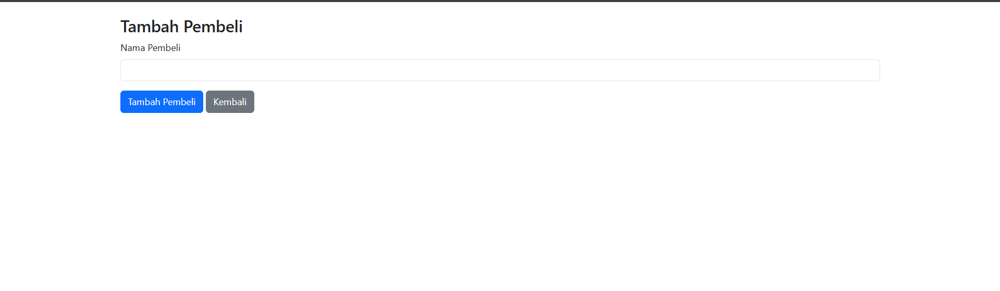
###### **Kode**
```php
<?php

// Koneksi ke database

include('koneksi.php');

// Proses Tambah Pembeli

if (isset($_POST['tambah'])) {

    $nama_pembeli = $_POST['nama_pembeli'];

  

    $query = "INSERT INTO pembeli (nama_pembeli) VALUES ('$nama_pembeli')";

    $conn->query($query);

    header("Location: pembeli.php");

    exit();

}

?>

<!DOCTYPE html>

<html lang="id">

<head>

    <meta charset="UTF-8">

    <title>Tambah Pembeli</title>

    <link rel="stylesheet" href="https://cdn.jsdelivr.net/npm/bootstrap@5.3.0/dist/css/bootstrap.min.css">

</head>

<body>

  

<div class="container mt-4">

    <h3>Tambah Pembeli</h3>

    <form method="POST">

        <div class="mb-3">

            <label class="form-label">Nama Pembeli</label>

            <input type="text" name="nama_pembeli" class="form-control" required>

        </div>

        <button type="submit" name="tambah" class="btn btn-primary">Tambah Pembeli</button>

        <a href="pembeli.php" class="btn btn-secondary">Kembali</a>

    </form>

</div>

  

</body>

</html>
```
##### **b. Kode Program Front-End**
###### **1. Struktur HTML**

```html
<!DOCTYPE html>
<html lang="id">
```

- **`<!DOCTYPE html>`** → Menentukan bahwa ini adalah dokumen HTML5.
- **`<html lang="id">`** → Menunjukkan bahwa bahasa utama halaman adalah Bahasa Indonesia.

---

###### **2. Bagian Head (Judul dan CSS)**

```html
<head>
    <meta charset="UTF-8">
    <title>Tambah Pembeli</title>
    <link rel="stylesheet" href="https://cdn.jsdelivr.net/npm/bootstrap@5.3.0/dist/css/bootstrap.min.css">
</head>
```

- **`<meta charset="UTF-8">`** → Memastikan karakter yang digunakan adalah UTF-8 untuk dukungan berbagai bahasa.
- **`<title>Tambah Pembeli</title>`** → Menentukan judul halaman di tab browser.
- **`<link rel="stylesheet" href="bootstrap.min.css">`** → Menggunakan Bootstrap 5 untuk styling tampilan.

---

###### **3. Body (Tampilan Formulir)**

```html
<body>
<div class="container mt-4">
    <h3>Tambah Pembeli</h3>
    <form method="POST">
```

- **`<div class="container mt-4">`** → Membuat kontainer dengan margin atas (`mt-4`).
- **`<h3>Tambah Pembeli</h3>`** → Judul halaman.
- **`<form method="POST">`** → Membuat formulir dengan metode `POST`.

---

###### **4. Input Nama Pembeli**

```html
        <div class="mb-3">
            <label class="form-label">Nama Pembeli</label>
            <input type="text" name="nama_pembeli" class="form-control" required>
        </div>
```

- **`<div class="mb-3">`** → Membungkus input dengan margin bawah (`mb-3`).
- **`<label class="form-label">Nama Pembeli</label>`** → Label untuk input.
- **`<input type="text" name="nama_pembeli" class="form-control" required>`**
    - `type="text"` → Input teks.
    - `name="nama_pembeli"` → Nama variabel yang dikirimkan ke server.
    - `class="form-control"` → Styling dari Bootstrap.
    - `required` → Wajib diisi sebelum formulir dikirim.

---

###### **5. Tombol Submit dan Kembali**

```html
        <button type="submit" name="tambah" class="btn btn-primary">Tambah Pembeli</button>
        <a href="pembeli.php" class="btn btn-secondary">Kembali</a>
    </form>
</div>
```

- **`<button type="submit" name="tambah" class="btn btn-primary">Tambah Pembeli</button>`**
    - Tombol submit dengan warna biru (`btn-primary`).
    - Mengirim data ke server saat ditekan.
- **`<a href="pembeli.php" class="btn btn-secondary">Kembali</a>`**
    - Tombol kembali dengan warna abu-abu (`btn-secondary`).
    - Mengarahkan pengguna kembali ke halaman daftar pembeli.

##### **c. Kode Program Back-End**
###### **1. Proses Tambah Pembeli**

```php
// Proses Tambah Pembeli
if (isset($_POST['tambah'])) {
    $nama_pembeli = $_POST['nama_pembeli'];

    $query = "INSERT INTO pembeli (nama_pembeli) VALUES ('$nama_pembeli')";
    $conn->query($query);
    header("Location: pembeli.php");
    exit();
}
```

- **`isset($_POST['tambah'])`** → Mengecek apakah tombol "Tambah Pembeli" ditekan.
- **`$nama_pembeli = $_POST['nama_pembeli'];`** → Mengambil data dari form.
- **Query `INSERT INTO pembeli (nama_pembeli) VALUES ('$nama_pembeli')`** → Menyimpan nama pembeli ke dalam tabel `pembeli`.
- **`header("Location: pembeli.php");`** → Mengarahkan pengguna kembali ke halaman `pembeli.php` setelah berhasil menambahkan data.

##### **d. Analisis**

###### **1. Penjelasan Kode Program**

Program ini dimulai dengan melakukan koneksi ke database melalui file eksternal `koneksi.php`. Selanjutnya, terdapat proses untuk menambahkan data pembeli ke dalam tabel database ketika pengguna mengisi formulir dan menekan tombol "Tambah Pembeli". Data yang dimasukkan akan dikirim melalui metode `POST`, kemudian dieksekusi menggunakan perintah `INSERT INTO` dalam MySQL. Setelah data berhasil disimpan, pengguna akan dialihkan kembali ke halaman daftar pembeli (`pembeli.php`).

Bagian tampilan menggunakan HTML dengan framework Bootstrap untuk memberikan gaya pada formulir input. Formulir ini memiliki satu kolom input untuk memasukkan nama pembeli, serta dua tombol: satu untuk menyimpan data dan satu lagi untuk kembali ke halaman sebelumnya.

###### **2. Database yang Digunakan**

Program ini menggunakan database MySQL dengan tabel `pembeli`. Tabel ini kemungkinan memiliki struktur dengan setidaknya dua kolom utama:

- `id_pembeli` (sebagai primary key dan auto-increment)
- `nama_pembeli` (menyimpan nama pembeli yang diinput pengguna)

Ketika pengguna menambahkan pembeli baru, hanya nama pembeli yang dimasukkan, sementara `id_pembeli` akan dibuat secara otomatis oleh sistem database.

###### **3. Peran Fitur dalam Mengelola Database**

Fitur utama dalam program ini adalah **menambahkan data pembeli** ke dalam tabel `pembeli`. Berikut perannya dalam manajemen database:

1. **Memasukkan Data Baru** – Pengguna dapat menambahkan entri pembeli baru dengan mengisi formulir dan menekan tombol tambah.
2. **Validasi Input** – Form input mewajibkan pengguna untuk mengisi nama pembeli sebelum mengirimkan data, mencegah penyimpanan data kosong di database.
3. **Navigasi dan Pengelolaan Data** – Setelah data ditambahkan, pengguna dapat kembali ke halaman utama `pembeli.php`, yang kemungkinan berisi daftar seluruh pembeli yang sudah terdaftar.

Program ini merupakan bagian dari sistem manajemen kantin sekolah yang sedang dikembangkan, membantu dalam pencatatan data pembeli secara lebih terstruktur dan terorganisir.
#### **2. Relasi**

###### **1. ujuan Relasi**

Relasi dalam program ini bertujuan untuk menghubungkan data pembeli dengan sistem kantin sekolah yang sedang dikembangkan. Dengan adanya tabel **pembeli**, sistem dapat mencatat siapa saja yang melakukan transaksi, sehingga memungkinkan pencatatan dan pelacakan data pembeli dalam transaksi pembelian makanan atau minuman di kantin.

###### **2. nalisis Relasi dalam Program**

Dalam program ini, tabel **pembeli** hanya memiliki satu atribut utama, yaitu **nama_pembeli**. Meskipun tidak terlihat dalam kode ini, tabel pembeli biasanya akan memiliki **id_pembeli** sebagai primary key yang nantinya dapat digunakan sebagai foreign key di tabel lain seperti **transaksi**. Dengan adanya hubungan ini, setiap transaksi yang dilakukan dapat dikaitkan dengan pembeli tertentu, sehingga memungkinkan analisis data seperti riwayat pembelian per pembeli.

Jika tabel **pembeli** memiliki **id_pembeli**, maka relasi potensial dalam sistem bisa meliputi:

- **Relasi dengan tabel transaksi:**
    - Satu pembeli bisa memiliki banyak transaksi (**One-to-Many Relationship**).
    - Dalam tabel **transaksi**, terdapat kolom **id_pembeli** yang menghubungkan transaksi dengan pembeli tertentu.
- **Relasi dengan tabel pengguna (jika ada sistem login):**
    - Jika pembeli merupakan pengguna terdaftar, bisa ada hubungan dengan tabel **user** melalui **id_user**, untuk mengidentifikasi pembeli yang sudah memiliki akun.

###### **3. Cara Kerja Relasi dalam Fitur Program**

1. **Input Data Pembeli:**
    
    - Pengguna memasukkan nama pembeli melalui form yang telah disediakan.
    - Setelah tombol "Tambah Pembeli" ditekan, data dikirim menggunakan metode **POST** ke server.
2. **Proses Penyimpanan Data:**
    
    - Program menangkap data yang dikirimkan dan menjalankan query **INSERT** ke dalam tabel **pembeli**.
    - Data **nama_pembeli** dimasukkan ke dalam tabel, dan jika tabel memiliki **id_pembeli**, maka MySQL akan secara otomatis menghasilkan nilai unik (Auto Increment).
3. **Penggunaan Data dalam Sistem:**
    
    - Data pembeli yang telah dimasukkan akan muncul di halaman daftar pembeli (**pembeli.php**).
    - Jika ada fitur transaksi, data pembeli ini bisa digunakan untuk mencatat transaksi yang dilakukan oleh pembeli tersebut.
### Edit Pembeli
#### **1. Rincian Fitur**
##### **a. Menampilkan Edit Pembeli**
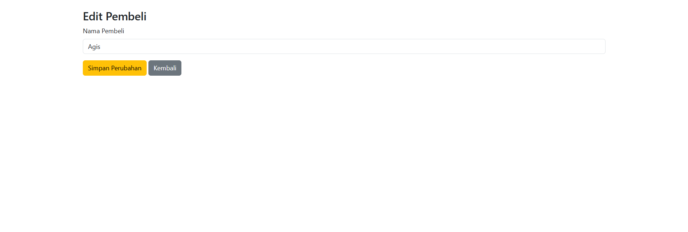
###### **Kode**
```php
<?php

// Koneksi ke database

include('koneksi.php');

// Ambil Data Pembeli Berdasarkan ID

$id_pembeli = $_GET['id'];

$pembeli = $conn->query("SELECT * FROM pembeli WHERE id_pembeli='$id_pembeli'")->fetch_assoc();

  

// Proses Edit Pembeli

if (isset($_POST['edit'])) {

    $nama_pembeli = $_POST['nama_pembeli'];

  

    $query = "UPDATE pembeli SET nama_pembeli='$nama_pembeli' WHERE id_pembeli='$id_pembeli'";

    $conn->query($query);

    header("Location: pembeli.php");

    exit();

}

?>

<!DOCTYPE html>

<html lang="id">

<head>

    <meta charset="UTF-8">

    <title>Edit Pembeli</title>

    <link rel="stylesheet" href="https://cdn.jsdelivr.net/npm/bootstrap@5.3.0/dist/css/bootstrap.min.css">

</head>

<body>

  

<div class="container mt-4">

    <h3>Edit Pembeli</h3>

    <form method="POST">

        <div class="mb-3">

            <label class="form-label">Nama Pembeli</label>

            <input type="text" name="nama_pembeli" class="form-control" value="<?= $pembeli['nama_pembeli']; ?>" required>

        </div>

        <button type="submit" name="edit" class="btn btn-warning">Simpan Perubahan</button>

        <a href="pembeli.php" class="btn btn-secondary">Kembali</a>

    </form>

</div>

  

</body>

</html>
```
##### **b. Kode Program Front-End**

###### **1. Struktur Dasar HTML**

```html
<!DOCTYPE html>
<html lang="id">
<head>
    <meta charset="UTF-8">
    <meta name="viewport" content="width=device-width, initial-scale=1">
    <title>Edit Pembeli</title>
    <link rel="stylesheet" href="https://cdn.jsdelivr.net/npm/bootstrap@5.3.0/dist/css/bootstrap.min.css">
</head>
```

**Penjelasan:**

- `<!DOCTYPE html>` → Menentukan bahwa ini adalah dokumen HTML5.
- `<html lang="id">` → Mengatur bahasa dokumen menjadi Bahasa Indonesia.
- `<meta charset="UTF-8">` → Menggunakan encoding UTF-8 agar mendukung berbagai karakter.
- `<meta name="viewport" content="width=device-width, initial-scale=1">` → Membantu tampilan responsif di perangkat mobile.
- `<title>Edit Pembeli</title>` → Menampilkan judul halaman di tab browser.
- `<link rel="stylesheet" href="https://cdn.jsdelivr.net/npm/bootstrap@5.3.0/dist/css/bootstrap.min.css">` → Menghubungkan Bootstrap 5.3 untuk mempercantik tampilan.

---

###### **2. Struktur Body dan Container**

```html
<body>
<div class="container mt-4">
    <h3 class="mb-4">Edit Pembeli</h3>
```

**Penjelasan:**

- `<body>` → Awal dari isi halaman web.
- `<div class="container mt-4">` →
    - `container` → Bootstrap class untuk memberikan padding dan responsivitas.
    - `mt-4` → Memberikan margin atas sebesar `4` untuk jarak dari elemen sebelumnya.
- `<h3 class="mb-4">Edit Pembeli</h3>` →
    - `h3` → Judul halaman dengan ukuran yang cukup besar.
    - `mb-4` → Memberikan margin bawah `4` agar tidak terlalu dekat dengan form.

---

###### **3. Form Input Nama Pembeli**

```html
    <form method="POST">
        <div class="mb-3">
            <label class="form-label">Nama Pembeli</label>
            <input type="text" name="nama_pembeli" class="form-control" value="<?= htmlspecialchars($pembeli['nama_pembeli']); ?>" required>
        </div>
```

**Penjelasan:**

- `<form method="POST">` →
    - Membuat form untuk mengirim data menggunakan metode **POST**.
- `<div class="mb-3">` →
    - `mb-3` memberi margin bawah agar tidak terlalu dekat dengan elemen di bawahnya.
- `<label class="form-label">Nama Pembeli</label>` →
    - Label untuk input, menggunakan class `form-label` dari Bootstrap.
- `<input type="text" name="nama_pembeli" class="form-control" value="<?= htmlspecialchars($pembeli['nama_pembeli']); ?>" required>` →
    - `type="text"` → Input hanya menerima teks.
    - `name="nama_pembeli"` → Nama yang digunakan untuk mengirim data ke server.
    - `class="form-control"` → Bootstrap class untuk mempercantik tampilan input.
    - `value="<?= htmlspecialchars($pembeli['nama_pembeli']); ?>"` →
        - Mengisi input dengan data yang ada di database.
        - `htmlspecialchars()` digunakan agar mencegah serangan **XSS (Cross-Site Scripting)**.
    - `required` → Memastikan input tidak boleh kosong sebelum dikirim.

---

###### **4. Tombol Submit dan Kembali**

```html
        <button type="submit" name="edit" class="btn btn-warning">Simpan Perubahan</button>
        <a href="pembeli.php" class="btn btn-secondary">Kembali</a>
    </form>
</div>
```

**Penjelasan:**

- `<button type="submit" name="edit" class="btn btn-warning">Simpan Perubahan</button>` →
    - Tombol untuk menyimpan perubahan.
    - `type="submit"` → Mengirimkan form saat diklik.
    - `name="edit"` → Menandakan bahwa form ini adalah untuk proses edit.
    - `class="btn btn-warning"` → Menggunakan gaya Bootstrap dengan warna kuning.
- `<a href="pembeli.php" class="btn btn-secondary">Kembali</a>` →
    - **Tombol kembali**, berfungsi sebagai link menuju halaman `pembeli.php`.
    - `btn-secondary` memberi warna abu-abu untuk membedakan dari tombol utama.

---

###### **5. Script Bootstrap**

```html
<script src="https://cdn.jsdelivr.net/npm/bootstrap@5.3.0/dist/js/bootstrap.bundle.min.js"></script>
</body>
</html>
```

**Penjelasan:**

- `<script>` → Menyertakan Bootstrap JavaScript agar fitur seperti modal, dropdown, dan lainnya bisa berfungsi dengan baik.
- `</body>` → Penutup elemen body.
- `</html>` → Penutup elemen HTML.

##### **c.  Kode Program Back-End**

###### **1. Mengambil Data Pembeli Berdasarkan ID**

```php
// Ambil Data Pembeli Berdasarkan ID
$id_pembeli = $_GET['id'];
$pembeli = $conn->query("SELECT * FROM pembeli WHERE id_pembeli='$id_pembeli'")->fetch_assoc();
```

**Penjelasan:**

- `$id_pembeli = $_GET['id'];`
    - Mengambil `id_pembeli` dari parameter URL menggunakan metode `GET`.
- `$conn->query("SELECT * FROM pembeli WHERE id_pembeli='$id_pembeli'")`
    - Mengambil data pembeli berdasarkan `id_pembeli` dari tabel `pembeli`.
- `fetch_assoc();`
    - Mengubah hasil query menjadi array asosiatif yang bisa diakses dengan `['nama_pembeli']`.


---

###### **2. Proses Edit Pembeli**

```php
// Proses Edit Pembeli
if (isset($_POST['edit'])) {
    $nama_pembeli = $_POST['nama_pembeli'];

    $query = "UPDATE pembeli SET nama_pembeli='$nama_pembeli' WHERE id_pembeli='$id_pembeli'";
    $conn->query($query);
    header("Location: pembeli.php");
    exit();
}
```

**Penjelasan:**

- `if (isset($_POST['edit'])) {`
    - Mengecek apakah tombol **Simpan Perubahan** ditekan.
- `$nama_pembeli = $_POST['nama_pembeli'];`
    - Mengambil data dari input form.
- `$query = "UPDATE pembeli SET nama_pembeli='$nama_pembeli' WHERE id_pembeli='$id_pembeli'";`
    - Query untuk **memperbarui nama pembeli** berdasarkan `id_pembeli`.
- `$conn->query($query);`
    - Menjalankan query ke database.
- `header("Location: pembeli.php"); exit();`
    - Setelah perubahan berhasil, halaman akan dialihkan ke `pembeli.php`.

##### **d. Analisis**

###### **1. Penjelasan Kode Program**

Program ini diawali dengan menghubungkan sistem ke database melalui file `koneksi.php`. Selanjutnya, program mengambil data pembeli berdasarkan `id_pembeli` yang dikirim melalui URL menggunakan metode `GET`. Setelah mendapatkan data dari tabel `pembeli`, program menampilkan formulir dengan nilai awal yang sudah diisi sesuai dengan data pembeli yang telah diambil.

Ketika pengguna mengedit nama pembeli dan mengklik tombol "Simpan Perubahan", program akan memperbarui data di database menggunakan perintah `UPDATE`. Setelah proses pembaruan selesai, pengguna akan diarahkan kembali ke halaman daftar pembeli (`pembeli.php`).

###### **2. Database yang Digunakan**

Program ini menggunakan database berbasis **MySQL**, dengan tabel **`pembeli`** yang kemungkinan memiliki struktur sebagai berikut:

- `id_pembeli` (Primary Key, Auto Increment)
- `nama_pembeli` (Nama dari pembeli)

Struktur ini menunjukkan bahwa tabel `pembeli` menyimpan informasi dasar tentang pembeli yang terdaftar dalam sistem.

###### **3. Peran Fitur dalam Mengelola Database**

1. **Mengambil Data Pembeli Berdasarkan ID**  
    Program ini mengambil data pembeli dari database berdasarkan `id_pembeli`, sehingga pengguna hanya dapat mengedit data pembeli yang sudah ada.
    
2. **Menampilkan Data ke dalam Formulir**  
    Data pembeli yang diperoleh dari database akan ditampilkan dalam formulir sebagai nilai awal. Hal ini memudahkan pengguna untuk melihat data sebelum melakukan perubahan.
    
3. **Memproses Perubahan Data**  
    Ketika pengguna mengedit nama pembeli dan mengirimkan formulir, sistem akan memperbarui data di database dengan perintah `UPDATE`.
    
4. **Mengalihkan Pengguna Setelah Perubahan**  
    Setelah perubahan berhasil disimpan, pengguna akan diarahkan kembali ke halaman `pembeli.php`, yang kemungkinan berisi daftar seluruh pembeli dalam sistem.
    

Dengan adanya fitur ini, sistem memungkinkan pengguna untuk mengelola data pembeli secara efektif, memastikan bahwa informasi tetap terkini dan akurat dalam database.
#### **2. Relasi**

##### 1. **Tujuan Relasi**

Relasi yang dibangun dalam program ini adalah untuk mengedit data pembeli berdasarkan ID yang diberikan. Program ini menghubungkan antara antarmuka pengguna (front-end) dengan database MySQL. Pengguna dapat memperbarui nama pembeli melalui form input, dan ketika form disubmit, data pembeli akan diperbarui pada database.

##### 2. **Analisis Relasi**

Relasi dalam program ini bisa dianalisis dari dua sisi:

- **Relasi Antara Halaman dan Database**: Ketika pengguna mengakses halaman edit, sistem mengambil data pembeli dari database menggunakan ID yang diberikan pada URL (melalui metode GET). ID ini digunakan untuk mencari data pembeli yang sesuai dalam tabel `pembeli`. Setelah data pembeli ditemukan, nama pembeli yang ada di database ditampilkan di form input untuk bisa diedit.
    
- **Relasi antara Form Input dan Database**: Ketika pengguna mengubah nama pembeli dan mengklik tombol "Simpan Perubahan", data yang telah diubah akan dikirim melalui metode POST dan disimpan kembali ke database. Dengan menggunakan query UPDATE, sistem mengupdate kolom `nama_pembeli` pada baris yang sesuai dengan `id_pembeli` yang diambil dari URL.
    

##### 3. **Cara Kerja Relasi dalam Fitur Program**

- **Pengambilan Data**: Program pertama-tama akan mengambil `id_pembeli` yang terdapat dalam URL menggunakan `$_GET['id']`. Kemudian, query SQL dijalankan untuk mencari data pembeli yang memiliki `id_pembeli` yang sesuai. Data pembeli ini akan ditampilkan di form input sehingga pengguna dapat mengeditnya.
    
- **Proses Edit**: Ketika pengguna mengubah nama pembeli dan menekan tombol "Simpan Perubahan", form akan mengirimkan data baru melalui metode POST. Program kemudian mengecek apakah tombol "edit" sudah ditekan. Jika sudah, query SQL jenis UPDATE dijalankan untuk mengganti nama pembeli dengan nilai yang baru. Setelah itu, pengguna akan diarahkan kembali ke halaman utama `pembeli.php` untuk melihat pembaruan data yang telah dilakukan.
    
- **Relasi Antarmuka Pengguna dan Database**: Secara keseluruhan, relasi antara antarmuka pengguna dan database dijaga dengan baik, memungkinkan pengguna untuk memperbarui data di database melalui interaksi yang sederhana dan langsung dengan form HTML. Program ini juga mengarah pada pemeliharaan data yang konsisten, karena setiap perubahan langsung diperbarui di database.
    

Dengan cara ini, program ini mendukung relasi yang efisien antara antarmuka pengguna dan database untuk memastikan data pembeli dapat dikelola dengan mudah.

## Pegawai
### Tampilan Pegawai

#### **1. Rincian Fitur:**

##### **a. Menampilkan Daftar Pegawai** 

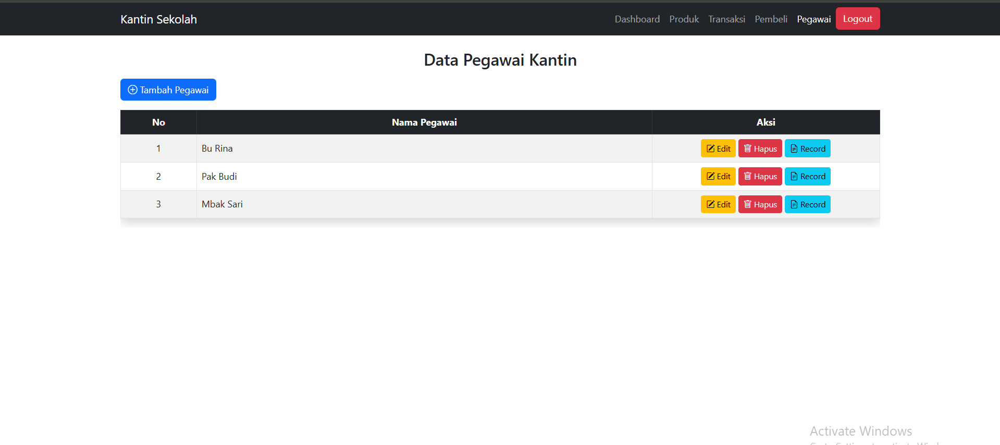

###### **Kode**
```php
<?php

// Koneksi ke database

$host = "localhost";

$user = "root";

$pass = "";

$db = "kantin_sekolah";

$conn = new mysqli($host, $user, $pass, $db);

  

if ($conn->connect_error) {

    die("Koneksi gagal: " . $conn->connect_error);

}

  

// Tambah Pegawai

if (isset($_POST['tambah'])) {

    $nama_pegawai = $_POST['nama_pegawai'];

  

    $query = "INSERT INTO pegawai_kantin (nama_pegawai) VALUES ('$nama_pegawai')";

    $conn->query($query);

    header("Location: pegawai.php");

    exit();

}

  

// Hapus Pegawai

if (isset($_GET['hapus'])) {

    $id_pegawai = $_GET['hapus'];

    $conn->query("DELETE FROM pegawai_kantin WHERE id_pegawai = '$id_pegawai'");

    header("Location: pegawai.php");

    exit();

}

  

// Ambil Data Pegawai

$pegawai_result = $conn->query("SELECT * FROM pegawai_kantin");

  

?>

<!DOCTYPE html>

<html lang="id">

<head>

    <meta charset="UTF-8">

    <title>Data Pegawai Kantin</title>

    <link rel="stylesheet" href="https://cdn.jsdelivr.net/npm/bootstrap@5.3.0/dist/css/bootstrap.min.css">

</head>

<body>

  

<nav class="navbar navbar-expand-lg navbar-dark bg-dark">

        <div class="container">

            <a class="navbar-brand" href="#">Kantin Sekolah</a>

            <button class="navbar-toggler" type="button" data-bs-toggle="collapse" data-bs-target="#navbarNav">

                <span class="navbar-toggler-icon"></span>

            </button>

            <div class="collapse navbar-collapse" id="navbarNav">

                <ul class="navbar-nav ms-auto">

                    <li class="nav-item"><a class="nav-link" href="dashboard.php">Dashboard</a></li>

                    <li class="nav-item"><a class="nav-link active" href="produk.php">Produk</a></li>

                    <li class="nav-item"><a class="nav-link" href="transaksi.php">Transaksi</a></li>

                    <li class="nav-item"><a class="nav-link" href="#">Pembeli</a></li>

                    <li class="nav-item"><a class="nav-link" href="pegawai.php">Pegawai</a></li>

                </ul>

            </div>

        </div>

    </nav>

  

<div class="container mt-4">

    <h3>Data Pegawai Kantin</h3>

    <button class="btn btn-primary mb-3" data-bs-toggle="modal" data-bs-target="#tambahModal">Tambah Pegawai</button>

    <table class="table table-bordered">

    <thead>

        <tr>

            <th>No</th>

            <th>Nama Pegawai</th>

            <th>Aksi</th>

        </tr>

    </thead>

    <tbody>

        <?php $no = 1; while ($pegawai = $pegawai_result->fetch_assoc()) { ?>

            <tr>

                <td><?= $no++; ?></td>

                <td><?= $pegawai['nama_pegawai']; ?></td>

                <td>

                    <a href="edit_pegawai_kantin.php?id=<?= $pegawai['id_pegawai']; ?>" class="btn btn-warning btn-sm">Edit</a>

                    <a href="pegawai.php?hapus=<?= $pegawai['id_pegawai']; ?>" class="btn btn-danger btn-sm" onclick="return confirm('Yakin ingin menghapus pegawai ini?');">Hapus</a>

                    <a href="record.php?id=<?= $pegawai['id_pegawai']; ?>" class="btn btn-info btn-sm">Record</a>

                </td>

            </tr>

        <?php } ?>

    </tbody>

</table>

  

</div>

  

<!-- Modal Tambah Pegawai -->

<div class="modal fade" id="tambahModal" tabindex="-1" aria-labelledby="tambahModalLabel" aria-hidden="true">

    <div class="modal-dialog">

        <div class="modal-content">

            <div class="modal-header">

                <h5 class="modal-title" id="tambahModalLabel">Tambah Pegawai</h5>

                <button type="button" class="btn-close" data-bs-dismiss="modal" aria-label="Close"></button>

            </div>

            <form method="POST">

                <div class="modal-body">

                    <div class="mb-3">

                        <label class="form-label">Nama Pegawai</label>

                        <input type="text" name="nama_pegawai" class="form-control" required>

                    </div>

                </div>

                <div class="modal-footer">

                    <button type="button" class="btn btn-secondary" data-bs-dismiss="modal">Batal</button>

                    <button type="submit" name="tambah" class="btn btn-primary">Tambah</button>

                </div>

            </form>

        </div>

    </div>

</div>

  

<script src="https://cdn.jsdelivr.net/npm/bootstrap@5.3.0/dist/js/bootstrap.bundle.min.js"></script>

</body>

</html>
```
##### **b. Kode Program Frontend:**

###### **1. Navbar**

```html
<nav class="navbar navbar-expand-lg navbar-dark bg-dark">
    <div class="container">
        <a class="navbar-brand" href="#">Kantin Sekolah</a>
        <button class="navbar-toggler" type="button" data-bs-toggle="collapse" data-bs-target="#navbarNav">
            <span class="navbar-toggler-icon"></span>
        </button>
        <div class="collapse navbar-collapse" id="navbarNav">
            <ul class="navbar-nav ms-auto">
                <li class="nav-item"><a class="nav-link" href="dashboard.php">Dashboard</a></li>
                <li class="nav-item"><a class="nav-link active" href="produk.php">Produk</a></li>
                <li class="nav-item"><a class="nav-link" href="transaksi.php">Transaksi</a></li>
                <li class="nav-item"><a class="nav-link" href="#">Pembeli</a></li>
                <li class="nav-item"><a class="nav-link" href="pegawai.php">Pegawai</a></li>
            </ul>
        </div>
    </div>
</nav>
```

 **Penjelasan:**

- Navbar dengan latar belakang **gelap** (`bg-dark`).
- Menu utama: **Dashboard, Produk, Transaksi, Pembeli, Pegawai**.
- Gunakan `ms-auto` untuk membuat menu sejajar ke kanan.

---

###### **2. Tampilan Data Pegawai**

```html
<div class="container mt-4">
    <h3>Data Pegawai Kantin</h3>
    <button class="btn btn-primary mb-3" data-bs-toggle="modal" data-bs-target="#tambahModal">Tambah Pegawai</button>
    <table class="table table-bordered">
        <thead>
            <tr>
                <th>No</th>
                <th>Nama Pegawai</th>
                <th>Aksi</th>
            </tr>
        </thead>
        <tbody>
            <tr>
                <td>1</td>
                <td>Contoh Pegawai</td>
                <td>
                    <a href="#" class="btn btn-warning btn-sm">Edit</a>
                    <a href="#" class="btn btn-danger btn-sm" onclick="return confirm('Yakin ingin menghapus pegawai ini?');">Hapus</a>
                    <a href="#" class="btn btn-info btn-sm">Record</a>
                </td>
            </tr>
        </tbody>
    </table>
</div>
```

 **Penjelasan:**

- **Tabel Bootstrap** dengan border (`table-bordered`).
- **Tombol aksi** untuk Edit, Hapus, dan Record.
- **Konfirmasi JavaScript** sebelum menghapus pegawai.

---

###### **3. Modal Tambah Pegawai**

```html
<!-- Modal Tambah Pegawai -->
<div class="modal fade" id="tambahModal" tabindex="-1" aria-labelledby="tambahModalLabel" aria-hidden="true">
    <div class="modal-dialog">
        <div class="modal-content">
            <div class="modal-header">
                <h5 class="modal-title" id="tambahModalLabel">Tambah Pegawai</h5>
                <button type="button" class="btn-close" data-bs-dismiss="modal" aria-label="Close"></button>
            </div>
            <form>
                <div class="modal-body">
                    <div class="mb-3">
                        <label class="form-label">Nama Pegawai</label>
                        <input type="text" class="form-control" required>
                    </div>
                </div>
                <div class="modal-footer">
                    <button type="button" class="btn btn-secondary" data-bs-dismiss="modal">Batal</button>
                    <button type="submit" class="btn btn-primary">Tambah</button>
                </div>
            </form>
        </div>
    </div>
</div>
```

 **Penjelasan:**

- **Modal Bootstrap** untuk input data pegawai.
- **Tombol "Tambah"** untuk menyimpan data.
- **Tombol "Batal"** untuk menutup modal.

##### **c. Kode Program Backend:**

1. **Menangani Tambah Pegawai**
    
    ```php
    if (isset($_POST['tambah'])) {
        $nama_pegawai = $_POST['nama_pegawai'];
        $query = "INSERT INTO pegawai_kantin (nama_pegawai) VALUES ('$nama_pegawai')";
        $conn->query($query);
        header("Location: pegawai.php");
        exit();
    }
    ```
    
    - Mengambil nilai input `nama_pegawai` dari form.
    - Menjalankan query `INSERT` untuk menambah pegawai baru.
    - Redirect ke `pegawai.php`.
2. **Menangani Hapus Pegawai**
    
    ```php
    if (isset($_GET['hapus'])) {
        $id_pegawai = $_GET['hapus'];
        $conn->query("DELETE FROM pegawai_kantin WHERE id_pegawai = '$id_pegawai'");
        header("Location: pegawai.php");
        exit();
    }
    ```
    
    - Menghapus pegawai berdasarkan `id_pegawai` yang dikirim melalui URL.
3. **Menampilkan Data Pegawai**
    
    ```php
    $pegawai_result = $conn->query("SELECT * FROM pegawai_kantin");
    ```
    
    - Mengambil semua data pegawai untuk ditampilkan dalam tabel.
4. **Tabel Data Pegawai**
    
    ```php
    <?php $no = 1; while ($pegawai = $pegawai_result->fetch_assoc()) { ?>
    ```
    
    - Looping melalui hasil query dan menampilkan data pegawai dalam tabel.
5. **Modal Tambah Pegawai**
    
    ```php
    <button class="btn btn-primary" data-bs-toggle="modal" data-bs-target="#tambahModal">Tambah Pegawai</button>
    ```
    
    - Menggunakan Bootstrap modal untuk form input pegawai baru.
6. **Konfirmasi Hapus**
    
    ```php
    <a href="pegawai.php?hapus=<?= $pegawai['id_pegawai']; ?>" class="btn btn-danger btn-sm" onclick="return confirm('Yakin ingin menghapus pegawai ini?');">Hapus</a>
    ```
    
    - Menggunakan `onclick="return confirm(...)"` agar pengguna perlu mengonfirmasi sebelum menghapus.

##### **d. Analisis**

##### **1. Penjelasan Kode Program**

Program ini merupakan sistem manajemen pegawai kantin berbasis PHP dan MySQL. Sistem ini memungkinkan pengguna untuk menambahkan, menampilkan, mengedit, dan menghapus data pegawai kantin. Program ini menggunakan **Bootstrap** untuk tampilan antarmuka dan beberapa fitur interaktif seperti modal.

**Proses utama dalam program ini:**

- **Koneksi ke Database:** Program memulai dengan menyertakan file `koneksi.php` untuk menghubungkan PHP dengan database MySQL.
- **Menambahkan Pegawai:** Jika tombol "Tambah Pegawai" ditekan, program akan menangkap data dari form modal dan menyimpannya ke dalam tabel `pegawai_kantin`.
- **Menghapus Pegawai:** Jika pengguna mengklik tombol hapus, pegawai yang dipilih akan dihapus berdasarkan `id_pegawai`.
- **Menampilkan Pegawai:** Program mengambil semua data pegawai dari tabel `pegawai_kantin` dan menampilkannya dalam bentuk tabel.
- **Navigasi:** Terdapat navbar dengan beberapa menu untuk berpindah halaman, seperti ke dashboard, produk, transaksi, pembeli, dan pegawai.

##### **2. Database yang Digunakan**

Database yang digunakan dalam program ini adalah MySQL. Tabel utama yang digunakan adalah **`pegawai_kantin`**, yang kemungkinan memiliki struktur berikut:

- `id_pegawai` (INT, PRIMARY KEY, AUTO_INCREMENT) – sebagai identitas unik setiap pegawai.
- `nama_pegawai` (VARCHAR) – menyimpan nama pegawai.

Dalam operasi program, data pegawai diambil dan dimanipulasi menggunakan **query SQL** seperti `SELECT`, `INSERT`, dan `DELETE`.

##### **3. Peran Fitur dalam Mengelola Database**

Fitur-fitur utama yang digunakan untuk mengelola database adalah:

1. **Penambahan Data Pegawai:**
    
    - Menggunakan form dalam modal untuk memasukkan data pegawai.
    - Data yang diinput akan dikirim melalui metode **POST** dan dimasukkan ke dalam database dengan query `INSERT`.
2. **Menampilkan Data Pegawai:**
    
    - Menggunakan query `SELECT * FROM pegawai_kantin` untuk mengambil semua data pegawai dari database.
    - Data yang diperoleh ditampilkan dalam tabel Bootstrap dengan nomor, nama pegawai, dan tombol aksi.
3. **Menghapus Data Pegawai:**
    
    - Menggunakan parameter `id_pegawai` dalam URL untuk menangkap pegawai yang akan dihapus.
    - Query `DELETE FROM pegawai_kantin WHERE id_pegawai = ?` digunakan untuk menghapus pegawai dari database.
4. **Navigasi dan Pengelolaan Pegawai:**
    
    - Terdapat menu navigasi untuk mengakses halaman terkait seperti **produk, transaksi, pembeli, dan pegawai**.
    - Tombol "Tambah Pegawai" menggunakan Bootstrap modal untuk mempermudah input data tanpa berpindah halaman.
5. **Konfirmasi Penghapusan:**
    
    - Setiap kali pengguna mengklik tombol hapus, program meminta konfirmasi dengan fungsi **JavaScript `confirm()`** untuk menghindari penghapusan data yang tidak disengaja.

#### **2. Relasi**

##### **a. Tabel yang Digunakan:**

- **pegawai_kantin** (id_pegawai, nama_pegawai)
- **transaksi_kantin** (id_transaksi, id_pegawai, id_pembeli, total_harga, tanggal)

##### **b. Relasi yang Digunakan:**

- **Relasi `pegawai_kantin` dengan `transaksi_kantin` menggunakan `id_pegawai` sebagai foreign key.**
- **Tujuan relasi:**
    - Menyimpan transaksi yang dilakukan oleh pegawai tertentu.
    - Memastikan data transaksi hanya berisi pegawai yang valid.
- **Analisis Query Relasi:**
    
    ```sql
    SELECT pegawai_kantin.nama_pegawai, COUNT(transaksi_kantin.id_transaksi) AS jumlah_transaksi 
    FROM pegawai_kantin
    LEFT JOIN transaksi_kantin ON pegawai_kantin.id_pegawai = transaksi_kantin.id_pegawai
    GROUP BY pegawai_kantin.id_pegawai;
    ```
    
    - **Query ini menghubungkan pegawai dan transaksi**.
    - **Menampilkan jumlah transaksi yang dilakukan oleh masing-masing pegawai**.
    - **Cara kerja fitur terhadap relasi:**
        - Saat pegawai dihapus, semua transaksi yang terkait dengannya akan kehilangan referensi.
        - Ketika pegawai ditampilkan, dapat ditampilkan juga jumlah transaksi yang mereka tangani.

##### **c. Tabel yang Terelasi dalam Halaman Ini**

- **pegawai_kantin** digunakan untuk menyimpan data pegawai kantin, termasuk `id_pegawai` dan `nama_pegawai`.
- **transaksi_kantin** memiliki relasi dengan `pegawai_kantin` melalui kolom `id_pegawai`. Relasi ini memungkinkan setiap transaksi dikaitkan dengan pegawai yang melakukan transaksi tersebut.

##### **d. Fitur yang Menggunakan Tabel Ini**

- **Manajemen Pegawai** menggunakan tabel `pegawai_kantin` untuk menampilkan, menambah, mengedit, dan menghapus pegawai.
- **Transaksi Pegawai** menggunakan tabel `transaksi_kantin` untuk mencatat transaksi yang dilakukan oleh masing-masing pegawai.

---
### Tambah Pegawai
#### **1. Rincian Fitur**
##### **a. Menampilkan Edit Pembeli**
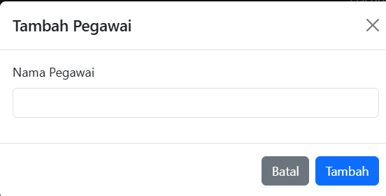
###### **Kode**
```php
<?php

// Koneksi ke database

include('koneksi.php');

// Tambah Pegawai

if ($_SERVER["REQUEST_METHOD"] == "POST") {

    $nama_pegawai = $_POST['nama_pegawai'];

  

    $query = "INSERT INTO pegawai_kantin (nama_pegawai) VALUES ('$nama_pegawai')";

    if ($conn->query($query) === TRUE) {

        header("Location: pegawai_kantin.php");

        exit();

    } else {

        echo "Error: " . $conn->error;

    }

}

?>

  

<!DOCTYPE html>

<html lang="id">

<head>

    <meta charset="UTF-8">

    <title>Tambah Pegawai Kantin</title>

    <link rel="stylesheet" href="https://cdn.jsdelivr.net/npm/bootstrap@5.3.0/dist/css/bootstrap.min.css">

</head>

<body>

  

<!-- Navbar -->

<nav class="navbar navbar-expand-lg navbar-dark bg-dark">

    <div class="container">

        <a class="navbar-brand" href="#">Kantin Sekolah</a>

        <button class="navbar-toggler" type="button" data-bs-toggle="collapse" data-bs-target="#navbarNav">

            <span class="navbar-toggler-icon"></span>

        </button>

        <div class="collapse navbar-collapse" id="navbarNav">

            <ul class="navbar-nav">

                <li class="nav-item">

                    <a class="nav-link" href="produk.php">Produk</a>

                </li>

                <li class="nav-item">

                    <a class="nav-link" href="transaksi.php">Transaksi</a>

                </li>

                <li class="nav-item">

                    <a class="nav-link active" href="pegawai_kantin.php">Pegawai</a>

                </li>

            </ul>

        </div>

    </div>

</nav>

  

<div class="container mt-4">

    <h3>Tambah Pegawai Kantin</h3>

    <div class="card p-4">

        <form method="POST">

            <div class="mb-3">

                <label class="form-label">Nama Pegawai</label>

                <input type="text" name="nama_pegawai" class="form-control" required>

            </div>

            <button type="submit" class="btn btn-success w-100">Tambah Pegawai</button>

            <a href="pegawai.php" class="btn btn-secondary w-100 mt-2">Kembali</a>

        </form>

    </div>

</div>

  

<script src="https://cdn.jsdelivr.net/npm/bootstrap@5.3.0/dist/js/bootstrap.bundle.min.js"></script>

</body>

</html>
```
##### **b. Kode Program Front-End**

###### **1. Struktur HTML (Frontend)**

```html
<!DOCTYPE html>
<html lang="id">
<head>
    <meta charset="UTF-8">
    <title>Tambah Pegawai Kantin</title>
    <link rel="stylesheet" href="https://cdn.jsdelivr.net/npm/bootstrap@5.3.0/dist/css/bootstrap.min.css">
</head>
```

**Penjelasan:**

- **`<html lang="id">`:** Menandakan bahwa halaman ini menggunakan bahasa Indonesia.
- **`<meta charset="UTF-8">`:** Menetapkan karakter encoding yang digunakan adalah UTF-8, yang mendukung karakter khusus seperti huruf dan simbol dari berbagai bahasa.
- **`<title>`:** Menentukan judul halaman, yang akan ditampilkan di tab browser.
- **`<link>` untuk Bootstrap:** Mengimpor file CSS dari Bootstrap yang akan digunakan untuk styling tampilan.

######  **2. Navbar**

```html
<nav class="navbar navbar-expand-lg navbar-dark bg-dark">
    <div class="container">
        <a class="navbar-brand" href="#">Kantin Sekolah</a>
        <button class="navbar-toggler" type="button" data-bs-toggle="collapse" data-bs-target="#navbarNav">
            <span class="navbar-toggler-icon"></span>
        </button>
        <div class="collapse navbar-collapse" id="navbarNav">
            <ul class="navbar-nav">
                <li class="nav-item">
                    <a class="nav-link" href="produk.php">Produk</a>
                </li>
                <li class="nav-item">
                    <a class="nav-link" href="transaksi.php">Transaksi</a>
                </li>
                <li class="nav-item">
                    <a class="nav-link active" href="pegawai_kantin.php">Pegawai</a>
                </li>
            </ul>
        </div>
    </div>
</nav>
```

**Penjelasan:**

- **Navbar menggunakan Bootstrap:** Digunakan untuk membuat bar navigasi yang responsif dan elegan. Menampilkan menu dengan tiga pilihan: `Produk`, `Transaksi`, dan `Pegawai`.
- **Toggler:** Tombol untuk navigasi yang responsif, muncul di tampilan mobile dan memungkinkan pengguna untuk membuka atau menutup menu.

###### **3. Formulir Input untuk Tambah Pegawai**

```html
<div class="container mt-4">
    <h3>Tambah Pegawai Kantin</h3>
    <div class="card p-4">
        <form method="POST">
            <div class="mb-3">
                <label class="form-label">Nama Pegawai</label>
                <input type="text" name="nama_pegawai" class="form-control" required>
            </div>
            <button type="submit" class="btn btn-success w-100">Tambah Pegawai</button>
            <a href="pegawai.php" class="btn btn-secondary w-100 mt-2">Kembali</a>
        </form>
    </div>
</div>
```

**Penjelasan:**

- **`<div class="container mt-4">`:** Membungkus konten dengan margin atas (mt-4) untuk memberikan ruang.
- **`<h3>Tambah Pegawai Kantin</h3>`:** Menampilkan judul halaman di atas formulir.
- **Formulir (`<form>`):** Formulir ini mengirim data dengan metode `POST` untuk menambah pegawai ke dalam database.
- **Input Field untuk Nama Pegawai:**
    - **`<input type="text" name="nama_pegawai">`:** Kolom input untuk nama pegawai, dengan atribut `required` untuk memastikan input tidak kosong.
- **Button Submit:**
    - **`<button type="submit" class="btn btn-success w-100">Tambah Pegawai</button>`:** Tombol untuk mengirimkan data formulir dengan kelas Bootstrap `btn-success` (tombol hijau) dan `w-100` (lebar penuh).
- **Tombol Kembali:**
    - **`<a href="pegawai.php" class="btn btn-secondary w-100 mt-2">Kembali</a>`:** Tombol yang mengarahkan pengguna ke halaman `pegawai.php`.

###### **4. Script Bootstrap**

```html
<script src="https://cdn.jsdelivr.net/npm/bootstrap@5.3.0/dist/js/bootstrap.bundle.min.js"></script>
```

**Penjelasan:**

- **Script Bootstrap:** Mengimpor file JavaScript Bootstrap yang diperlukan untuk menjalankan beberapa elemen dinamis seperti menu dropdown atau modal.

##### **c.  Kode Program Back-End**
###### **1. Logika Penanganan Formulir (Backend)**

```php
if ($_SERVER["REQUEST_METHOD"] == "POST") {
    $nama_pegawai = $_POST['nama_pegawai'];

    $query = "INSERT INTO pegawai_kantin (nama_pegawai) VALUES ('$nama_pegawai')";
    
    if ($conn->query($query) === TRUE) {
        header("Location: pegawai_kantin.php");
        exit();
    } else {
        echo "Error: " . $conn->error;
    }
}
```

**Penjelasan:**

- **Form Handling:** Bagian ini memeriksa apakah formulir telah disubmit dengan metode `POST`.
- **Proses Penyimpanan Data:** Data yang dimasukkan dalam formulir (nama pegawai) diambil menggunakan `$_POST['nama_pegawai']` dan dimasukkan ke dalam variabel `$nama_pegawai`.
- **Query SQL:** Query SQL dibuat untuk memasukkan data pegawai ke dalam tabel `pegawai_kantin` di database.
- **Eksekusi Query:** Jika query berhasil dijalankan, pengguna akan diarahkan ke halaman `pegawai_kantin.php`. Jika ada kesalahan, maka pesan error akan ditampilkan.

##### **d. Analisis**

###### **1. Penjelasan Kode Program**

Program ini dibagi menjadi dua bagian utama:

- **Bagian Backend (PHP & MySQL):**  
    Program memproses input pengguna melalui form HTML dan menyimpannya ke dalam database. Data pegawai kantin dikirim menggunakan metode **POST**, kemudian diproses dengan **query SQL INSERT** untuk menambahkan data baru ke tabel `pegawai_kantin`. Jika proses berhasil, pengguna akan diarahkan kembali ke halaman `pegawai_kantin.php`, sedangkan jika terjadi kesalahan, pesan error akan ditampilkan.
    
- **Bagian Frontend (HTML & Bootstrap):**  
    Tampilan antarmuka menggunakan Bootstrap untuk memberikan desain yang responsif. Program ini memiliki **navbar** dengan beberapa menu navigasi seperti "Produk," "Transaksi," dan "Pegawai." Formulir yang disediakan memungkinkan pengguna untuk memasukkan nama pegawai baru dan mengirimkan data melalui tombol "Tambah Pegawai." Selain itu, ada tombol "Kembali" yang memungkinkan pengguna kembali ke halaman sebelumnya.
    

###### **2. Database yang Digunakan**

Sistem ini menggunakan **database MySQL** yang terhubung melalui file `koneksi.php`. Tabel yang digunakan dalam program ini adalah `pegawai_kantin`, yang kemungkinan memiliki struktur sebagai berikut:

- `id_pegawai` (Primary Key, Auto Increment)
- `nama_pegawai` (VARCHAR, untuk menyimpan nama pegawai)

Ketika pengguna mengisi formulir dan mengklik tombol "Tambah Pegawai," data nama pegawai akan dimasukkan ke dalam tabel `pegawai_kantin`.

###### **3. Peran Fitur dalam Mengelola Database**

Fitur yang tersedia dalam program ini memiliki peran penting dalam pengelolaan database pegawai kantin:

- **Menambahkan Data Pegawai:**  
    Dengan adanya formulir input, pengguna dapat menambahkan pegawai baru ke dalam database.
- **Validasi Input:**  
    Input nama pegawai wajib diisi sebelum data dikirim ke database untuk mencegah data kosong masuk ke sistem.
- **Navigasi Antar Halaman:**  
    Navbar memungkinkan pengguna dengan mudah berpindah antar fitur seperti pengelolaan produk, transaksi, dan pegawai kantin.
- **Pengembalian ke Halaman Pegawai:**  
    Setelah data berhasil disimpan, pengguna langsung diarahkan kembali ke halaman daftar pegawai (`pegawai_kantin.php`) agar dapat melihat hasil perubahan.

Secara keseluruhan, program ini merupakan bagian dari sistem kantin sekolah yang membantu dalam mengelola pegawai dengan cara menyimpan data ke dalam database menggunakan PHP dan MySQL.
#### **2. Relasi**

##### **1. Tujuan Relasi dalam Program**

Relasi dalam program ini bertujuan untuk menghubungkan data pegawai kantin dengan sistem informasi kantin sekolah. Dengan adanya tabel `pegawai_kantin`, sistem dapat menyimpan informasi pegawai yang bekerja di kantin, yang nantinya bisa digunakan dalam berbagai proses, seperti manajemen transaksi atau pembagian tugas pegawai.

##### **2. Analisis Relasi dalam Program**

Dalam sistem ini, relasi utama terjadi antara tabel `pegawai_kantin` dan fitur manajemen pegawai kantin. Relasi tersebut bisa dijelaskan sebagai berikut:

- **Pegawai Kantin sebagai Entitas Mandiri**  
    Tabel `pegawai_kantin` berdiri sendiri dan menyimpan informasi pegawai, minimal berupa `id_pegawai` (biasanya sebagai primary key) dan `nama_pegawai`.
- **Relasi dengan Transaksi atau Tugas Pegawai (Kemungkinan Future Feature)**  
    Jika nantinya ada fitur yang mencatat transaksi yang dilakukan oleh pegawai atau tugas mereka di kantin, maka relasi bisa diperluas dengan menambahkan foreign key yang menghubungkan pegawai dengan tabel transaksi atau tugas.

##### **3. Cara Kerja Relasi dalam Fitur Program**

- **Menambahkan Data ke Tabel Pegawai Kantin**  
    Saat pengguna mengisi formulir dan mengklik tombol "Tambah Pegawai", sistem akan menyimpan data pegawai ke dalam tabel `pegawai_kantin` di database.
- **Navigasi dan Integrasi dengan Halaman Lain**  
    Program memiliki menu navigasi yang memungkinkan pengguna berpindah ke halaman produk, transaksi, dan pegawai. Ini menunjukkan bahwa data pegawai dapat memiliki hubungan dengan data lainnya dalam sistem kantin.
- **Penggunaan dalam Manajemen Pegawai**  
    Dengan adanya halaman `pegawai_kantin.php`, data pegawai yang sudah ditambahkan bisa dikelola (misalnya, ditampilkan, diedit, atau dihapus), yang menunjukkan bahwa tabel ini berfungsi sebagai pusat data pegawai dalam sistem kantin sekolah.

Secara keseluruhan, relasi dalam program ini masih sederhana, yaitu hanya memasukkan data pegawai ke dalam tabel `pegawai_kantin`, namun dapat dikembangkan lebih lanjut dengan menghubungkannya ke tabel lain, seperti transaksi atau tugas pegawai, untuk meningkatkan fungsionalitas sistem kantin sekolah.
### Edit Pegawai
#### **1. Rincian Fitur**

##### **a. Screenshot Fitur**

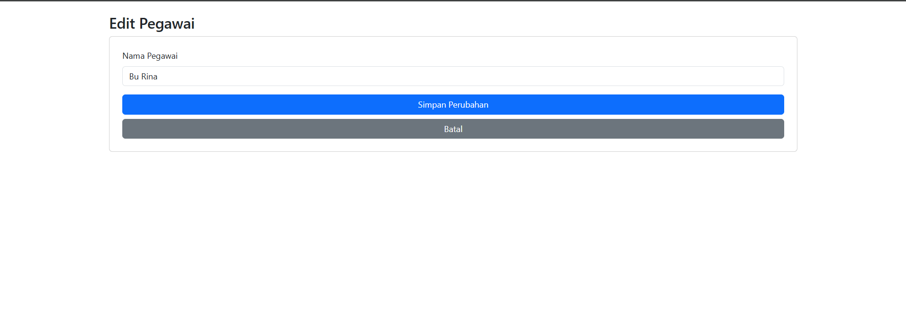
###### **Kode**
```php
<?php

// Koneksi ke database

$host = "localhost";

$user = "root";

$pass = "";

$db = "kantin_sekolah";

$conn = new mysqli($host, $user, $pass, $db);

  

if ($conn->connect_error) {

    die("Koneksi gagal: " . $conn->connect_error);

}

  

$id_pegawai = $_GET['id'];

$pegawai = $conn->query("SELECT * FROM pegawai_kantin WHERE id_pegawai = '$id_pegawai'")->fetch_assoc();

  

// Update Pegawai

if (isset($_POST['update'])) {

    $nama_pegawai = $_POST['nama_pegawai'];

  

    $query = "UPDATE pegawai_kantin SET nama_pegawai='$nama_pegawai' WHERE id_pegawai='$id_pegawai'";

    $conn->query($query);

    header("Location: pegawai_kantin.php");

    exit();

}

?>

  

<!DOCTYPE html>

<html lang="id">

<head>

    <meta charset="UTF-8">

    <title>Edit Pegawai</title>

    <link rel="stylesheet" href="https://cdn.jsdelivr.net/npm/bootstrap@5.3.0/dist/css/bootstrap.min.css">

</head>

<body>

<div class="container mt-4">

    <h3>Edit Pegawai</h3>

    <div class="card p-4">

        <form method="POST">

            <div class="mb-3">

                <label class="form-label">Nama Pegawai</label>

                <input type="text" name="nama_pegawai" class="form-control" required value="<?= $pegawai['nama_pegawai']; ?>">

            </div>

            <button type="submit" name="update" class="btn btn-primary w-100">Simpan Perubahan</button>

            <a href="pegawai.php" class="btn btn-secondary w-100 mt-2">Batal</a>

        </form>

    </div>

</div>

</body>

</html>
```
##### **b. Kode Program Front-End**

###### **1. Struktur Dasar HTML**

```html
<!DOCTYPE html>
<html lang="id">
<head>
    <meta charset="UTF-8">
    <meta name="viewport" content="width=device-width, initial-scale=1.0">
    <title>Edit Pegawai</title>
    <link rel="stylesheet" href="https://cdn.jsdelivr.net/npm/bootstrap@5.3.0/dist/css/bootstrap.min.css">
</head>
```

- **`<!DOCTYPE html>`** → Menentukan bahwa dokumen menggunakan HTML5.
- **`<html lang="id">`** → Menentukan bahasa halaman sebagai Bahasa Indonesia.
- **`<meta charset="UTF-8">`** → Memastikan karakter yang digunakan dalam halaman mendukung berbagai bahasa.
- **`<meta name="viewport" content="width=device-width, initial-scale=1.0">`** → Membuat tampilan responsif pada perangkat mobile.
- **`<title>Edit Pegawai</title>`** → Menentukan judul halaman yang muncul di tab browser.
- **`<link rel="stylesheet" href="https://cdn.jsdelivr.net/npm/bootstrap@5.3.0/dist/css/bootstrap.min.css">`** → Menggunakan Bootstrap 5.3 untuk styling yang lebih rapi dan modern.

---

###### **2. Tampilan Form Edit Pegawai**

```html
<body>
<div class="container mt-4">
    <h3>Edit Pegawai</h3>
    <div class="card p-4">
        <form method="POST">
            <div class="mb-3">
                <label class="form-label">Nama Pegawai</label>
                <input type="text" name="nama_pegawai" class="form-control" required>
            </div>
            <button type="submit" name="update" class="btn btn-primary w-100">Simpan Perubahan</button>
            <a href="pegawai_kantin.php" class="btn btn-secondary w-100 mt-2">Batal</a>
        </form>
    </div>
</div>
</body>
</html>
```

**Bagian Utama**

- **`<body>`** → Bagian utama dari tampilan halaman.
- **`<div class="container mt-4">`** → Membuat wadah dengan margin atas (`mt-4`) agar tidak terlalu menempel ke atas layar.
- **`<h3>Edit Pegawai</h3>`** → Judul utama halaman.

**Bagian Card (Form Input)**

- **`<div class="card p-4">`** → Menjadikan form tampak seperti kartu dengan padding 4 (`p-4`).
- **`<form method="POST">`** → Menentukan form dengan metode `POST`.

**Input Nama Pegawai**

```html
<div class="mb-3">
    <label class="form-label">Nama Pegawai</label>
    <input type="text" name="nama_pegawai" class="form-control" required>
</div>
```

- **`<div class="mb-3">`** → Menambahkan margin bawah (`mb-3`) agar tidak terlalu dekat dengan elemen lainnya.
- **`<label class="form-label">Nama Pegawai</label>`** → Label untuk input nama pegawai.
- **`<input type="text" name="nama_pegawai" class="form-control" required>`** → Input teks dengan kelas Bootstrap `form-control` agar tampilan lebih rapi.

**Tombol Simpan dan Batal**

```html
<button type="submit" name="update" class="btn btn-primary w-100">Simpan Perubahan</button>
<a href="pegawai_kantin.php" class="btn btn-secondary w-100 mt-2">Batal</a>
```

- **`<button type="submit" name="update" class="btn btn-primary w-100">Simpan Perubahan</button>`**  
    → Tombol utama dengan warna biru (`btn-primary`) dan lebar penuh (`w-100`).
- **`<a href="pegawai_kantin.php" class="btn btn-secondary w-100 mt-2">Batal</a>`**  
    → Tombol batal dengan warna abu-abu (`btn-secondary`), lebar penuh (`w-100`), dan `margin-top-2` (`mt-2`) agar memiliki sedikit jarak dengan tombol sebelumnya.

##### **c. Kode Program Back-End **

###### **1. Mengambil Data Pegawai Berdasarkan ID**

```php
$id_pegawai = $_GET['id'];
$pegawai = $conn->query("SELECT * FROM pegawai_kantin WHERE id_pegawai = '$id_pegawai'")->fetch_assoc();
```

**Penjelasan:**

- Mendapatkan `id_pegawai` dari parameter `GET` yang dikirim melalui URL.
- Melakukan query untuk mengambil data pegawai berdasarkan `id_pegawai`.
- Menggunakan `fetch_assoc()` untuk mengubah hasil query menjadi array asosiatif.

###### **2. Proses Update Data Pegawai**

```php
if (isset($_POST['update'])) {
    $nama_pegawai = $_POST['nama_pegawai'];

    $query = "UPDATE pegawai_kantin SET nama_pegawai='$nama_pegawai' WHERE id_pegawai='$id_pegawai'";
    $conn->query($query);
    header("Location: pegawai_kantin.php");
    exit();
}
```

**Penjelasan:**

- Mengecek apakah tombol `update` sudah diklik.
- Mengambil nilai dari form input `nama_pegawai`.
- Melakukan query `UPDATE` untuk memperbarui `nama_pegawai` berdasarkan `id_pegawai`.
- Setelah update, pengguna akan diarahkan kembali ke `pegawai_kantin.php`.

###### **3. Form Edit Pegawai**

```html
<div class="container mt-4">
    <h3>Edit Pegawai</h3>
    <div class="card p-4">
        <form method="POST">
            <div class="mb-3">
                <label class="form-label">Nama Pegawai</label>
                <input type="text" name="nama_pegawai" class="form-control" required value="<?= $pegawai['nama_pegawai']; ?>">
            </div>
            <button type="submit" name="update" class="btn btn-primary w-100">Simpan Perubahan</button>
            <a href="pegawai.php" class="btn btn-secondary w-100 mt-2">Batal</a>
        </form>
    </div>
</div>
```

**Penjelasan:**

- Form berisi input untuk mengedit nama pegawai.
- Nilai awal input diisi dengan data yang telah diambil dari database.
- Terdapat tombol `Simpan Perubahan` untuk mengupdate data dan `Batal` untuk kembali ke halaman sebelumnya.

##### **d. Analisis**

###### **1. Penjelasan Kode Program**

Program ini terdiri dari dua bagian utama: pemrosesan data di sisi server (PHP) dan tampilan antarmuka pengguna (HTML dengan Bootstrap untuk styling).

1. **Koneksi ke Database**  
    Program memulai dengan menghubungkan ke database menggunakan file `koneksi.php`, yang berisi konfigurasi koneksi ke database MySQL.
    
2. **Mengambil Data Pegawai**  
    Program mengambil nilai `id_pegawai` dari parameter URL menggunakan `$_GET['id']`, lalu melakukan kueri untuk mendapatkan data pegawai berdasarkan ID tersebut.
    
3. **Memproses Pembaruan Data Pegawai**  
    Jika pengguna mengklik tombol "Simpan Perubahan", program akan mengambil nilai baru dari input form, kemudian memperbarui data pegawai dengan kueri SQL `UPDATE`. Setelah pembaruan berhasil, pengguna akan diarahkan kembali ke halaman daftar pegawai (`pegawai_kantin.php`).
    
4. **Menampilkan Formulir Edit Pegawai**  
    Program menampilkan formulir berisi satu inputan untuk mengedit nama pegawai, dengan nilai awal yang diambil dari database. Terdapat dua tombol:
    
    - "Simpan Perubahan" untuk menyimpan data yang telah diperbarui.
    - "Batal" untuk kembali ke halaman daftar pegawai tanpa melakukan perubahan.

###### **2. Database yang Digunakan**

Program ini menggunakan database MySQL yang memiliki tabel bernama `pegawai_kantin`. Struktur tabel yang digunakan dalam program ini kemungkinan memiliki kolom berikut:

- `id_pegawai` (Primary Key) – sebagai identitas unik setiap pegawai.
- `nama_pegawai` – menyimpan nama pegawai.

###### **3. Peran Fitur dalam Mengelola Database**

1. **Menampilkan Data Pegawai yang Akan Diedit**  
    Program mengambil data pegawai berdasarkan ID dari URL dan menampilkannya dalam input form agar dapat diedit oleh pengguna.
    
2. **Memproses Perubahan Data Pegawai**  
    Jika pengguna mengedit nama pegawai dan menekan tombol "Simpan Perubahan", sistem akan memperbarui database dengan nilai baru.
    
3. **Memastikan Integritas Data**  
    Dengan menampilkan data yang sudah ada dan memperbaruinya hanya jika pengguna menekan tombol "Simpan Perubahan", program memastikan bahwa tidak ada data yang hilang atau tertimpa secara tidak sengaja.
    

Secara keseluruhan, program ini mempermudah pengelolaan data pegawai kantin dengan memberikan fitur untuk mengedit nama pegawai melalui tampilan antarmuka yang sederhana dan mudah digunakan.
#### **2. Relasi Tabel**
###### **1. Tujuan Relasi dalam Program**  
Relasi dalam program ini bertujuan untuk menghubungkan data pegawai kantin dalam basis data dengan halaman web yang memungkinkan pengguna untuk melihat dan mengedit data pegawai. Dengan adanya relasi antara tabel `pegawai_kantin` dan halaman edit pegawai, pengguna dapat mengambil data pegawai tertentu berdasarkan `id_pegawai` yang dikirim melalui URL dan mengubah informasi pegawai sesuai kebutuhan.

###### **2. Analisis Relasi dalam Program**  
Relasi dalam program ini menggunakan **relasi antara database dan halaman web** melalui koneksi MySQL. Relasi utama dalam program ini melibatkan tabel `pegawai_kantin`, yang berisi data pegawai kantin, dan halaman edit pegawai (`edit_pegawai.php`). Analisis relasi dalam program ini meliputi:

1. **Pengambilan Data Berdasarkan ID Pegawai**
    
    - Ketika halaman diakses, program menangkap `id_pegawai` dari URL (`$_GET['id']`).
    - ID ini digunakan untuk mencari data pegawai dalam tabel `pegawai_kantin`.
    - Jika pegawai ditemukan, data tersebut ditampilkan dalam form edit.
2. **Pembaruan Data Pegawai**
    
    - Ketika pengguna mengubah nama pegawai dan mengklik tombol "Simpan Perubahan," data yang diperbarui dikirim melalui `POST`.
    - Program kemudian memperbarui tabel `pegawai_kantin` dengan nilai baru menggunakan `UPDATE`.
    - Setelah pembaruan berhasil, pengguna diarahkan kembali ke halaman utama daftar pegawai (`pegawai_kantin.php`).
3. **Hubungan Antar Komponen**
    
    - **Halaman Web:** Berfungsi sebagai antarmuka pengguna untuk mengedit data pegawai.
    - **Database MySQL:** Menyimpan data pegawai kantin dan menyediakan informasi untuk ditampilkan dalam form edit.
    - **Koneksi Database (`koneksi.php`)**: Menghubungkan sistem dengan database untuk membaca dan memperbarui data.

###### **3. Cara Kerja Relasi dalam Fitur Program**

1. **Menampilkan Data Pegawai**
    
    - Ketika halaman dibuka, sistem membaca `id_pegawai` dari URL.
    - Program menjalankan query SQL `SELECT * FROM pegawai_kantin WHERE id_pegawai = 'id'` untuk mendapatkan data pegawai.
    - Data yang ditemukan ditampilkan dalam form sebagai nilai default.
2. **Memperbarui Data Pegawai**
    
    - Pengguna mengisi form dengan data baru dan menekan tombol "Simpan Perubahan".
    - Sistem mengirimkan data ke server menggunakan metode `POST`.
    - Program menjalankan query SQL `UPDATE pegawai_kantin SET nama_pegawai='...' WHERE id_pegawai='id'` untuk memperbarui data.
    - Setelah berhasil, pengguna diarahkan kembali ke halaman daftar pegawai.

Dengan demikian, relasi dalam program ini menghubungkan tabel `pegawai_kantin` dengan fitur edit melalui **pengambilan data berdasarkan ID** dan **pembaruan data dengan query SQL**.
### Record Pegawai

#### **1. Rincian FItur**
##### **a. Menampilan Record Pegawai**
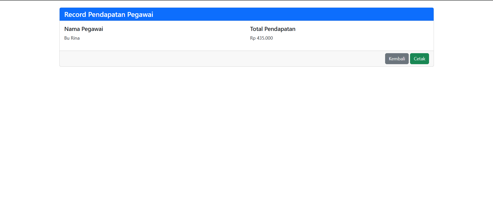
Fitur ini menampilkan total pendapatan seorang pegawai kantin berdasarkan transaksi yang dilakukan. 
###### **Kode**
```php
<?php

// Koneksi ke database

$host = "localhost";

$user = "root";

$pass = "";

$db = "kantin_sekolah";

$conn = new mysqli($host, $user, $pass, $db);

  

if ($conn->connect_error) {

    die("Koneksi gagal: " . $conn->connect_error);

}

  

// Ambil ID Pegawai

$id_pegawai = isset($_GET['id']) ? $_GET['id'] : 0;

  

// Ambil Data Pegawai

$pegawai_query = $conn->query("SELECT nama_pegawai FROM pegawai_kantin WHERE id_pegawai = '$id_pegawai'");

$pegawai = $pegawai_query->fetch_assoc();

  

// Ambil Total Pendapatan Pegawai dari Transaksi

$pendapatan_query = $conn->query("SELECT SUM(total_harga) AS total_pendapatan FROM transaksi WHERE id_pegawai = '$id_pegawai'");

$pendapatan = $pendapatan_query->fetch_assoc();

$total_pendapatan = $pendapatan['total_pendapatan'] ?? 0;

?>

  

<!DOCTYPE html>

<html lang="id">

<head>

    <meta charset="UTF-8">

    <title>Record Pendapatan Pegawai</title>

    <link rel="stylesheet" href="https://cdn.jsdelivr.net/npm/bootstrap@5.3.0/dist/css/bootstrap.min.css">

</head>

<body>

  

<div class="container mt-4">

    <div class="card">

        <div class="card-header bg-primary text-white">

            <h4 class="mb-0">Record Pendapatan Pegawai</h4>

        </div>

        <div class="card-body">

            <div class="row">

                <div class="col-md-6">

                    <h5>Nama Pegawai</h5>

                    <p><?= $pegawai['nama_pegawai']; ?></p>

                </div>

                <div class="col-md-6">

                    <h5>Total Pendapatan</h5>

                    <p>Rp <?= number_format($total_pendapatan, 0, ',', '.'); ?></p>

                </div>

            </div>

        </div>

        <div class="card-footer text-end">

            <a href="pegawai.php" class="btn btn-secondary">Kembali</a>

            <button onclick="window.print()" class="btn btn-success">Cetak</button>

        </div>

    </div>

</div>

  

<script src="https://cdn.jsdelivr.net/npm/bootstrap@5.3.0/dist/js/bootstrap.bundle.min.js"></script>

</body>

</html>
```

---


##### **b. Front-End (Tampilan Halaman)**

###### **1️. Struktur Dasar HTML**

```html
<!DOCTYPE html>
<html lang="id">
<head>
    <meta charset="UTF-8">
    <meta name="viewport" content="width=device-width, initial-scale=1.0">
    <title>Record Pendapatan Pegawai</title>
    <link rel="stylesheet" href="https://cdn.jsdelivr.net/npm/bootstrap@5.3.0/dist/css/bootstrap.min.css">
</head>
```

🔹 **Penjelasan:**

- **`<!DOCTYPE html>`** → Menandakan bahwa dokumen menggunakan HTML5.
- **`<html lang="id">`** → Menentukan bahwa bahasa utama halaman adalah **Bahasa Indonesia**.
- **`<meta charset="UTF-8">`** → Menggunakan **UTF-8** agar bisa menampilkan semua karakter, termasuk huruf dengan tanda baca.
- **`<meta name="viewport" content="width=device-width, initial-scale=1.0">`** → Membuat tampilan halaman responsif di **HP, tablet, dan komputer**.
- **Menggunakan Bootstrap 5** untuk tampilan yang lebih rapi dan modern.

---

###### **2️. Struktur Halaman & Tempat Menampilkan Data**

```html
<body>
<div class="container mt-4">
    <div class="card">
        <div class="card-header bg-primary text-white">
            <h4 class="mb-0">Record Pendapatan Pegawai</h4>
        </div>
        <div class="card-body">
            <div class="row">
                <div class="col-md-6">
                    <h5>Nama Pegawai</h5>
                    <p id="nama_pegawai">Memuat...</p>
                </div>
                <div class="col-md-6">
                    <h5>Total Pendapatan</h5>
                    <p id="total_pendapatan">Rp 0</p>
                </div>
            </div>
        </div>
```

🔹 **Penjelasan:**

- **`<div class="container mt-4">`** → Membuat layout dengan **Bootstrap Container**, ditambah margin atas (`mt-4`).
- **`<div class="card">`** → Menggunakan **Bootstrap Card** untuk tampilan lebih rapi.
- **`<div class="card-header bg-primary text-white">`** → Header kartu dengan warna **biru** dan **teks putih**.
- **`<div class="row">`** → Menggunakan grid **2 kolom** untuk menampilkan **nama pegawai & total pendapatan**.
- **`<p id="nama_pegawai">Memuat...</p>`** → **Tempat menampilkan nama pegawai**, yang nanti akan diisi dengan data dari backend.
- **`<p id="total_pendapatan">Rp 0</p>`** → **Tempat menampilkan total pendapatan**.

---

###### **3️. Tombol "Kembali" & "Cetak"**

```html
        <div class="card-footer text-end">
            <a href="pegawai.php" class="btn btn-secondary">Kembali</a>
            <button onclick="window.print()" class="btn btn-success">Cetak</button>
        </div>
    </div>
</div>
```

🔹 **Penjelasan:**

- **`<div class="card-footer text-end">`** → Footer kartu dengan **tombol di sisi kanan**.
- **Tombol "Kembali"** → Menggunakan tag `<a>` untuk kembali ke halaman `pegawai.php`.
- **Tombol "Cetak"** → Menggunakan JavaScript `window.print()` untuk mencetak halaman.

##### **c. Back-End (Logika PHP dan Database)**

###### **1. Mengambil ID Pegawai dari URL**

```php
$id_pegawai = isset($_GET['id']) && is_numeric($_GET['id']) ? (int)$_GET['id'] : 0;
```

**Penjelasan:**

- Memastikan `id` yang diterima melalui URL adalah angka (`is_numeric`).
- Jika tidak valid, defaultnya adalah `0`.

---

###### **2. Mengambil Data Pegawai dari Database (Prepared Statement)**

```php
$stmt = $conn->prepare("SELECT nama_pegawai FROM pegawai_kantin WHERE id_pegawai = ?");
$stmt->bind_param("i", $id_pegawai);
$stmt->execute();
$result = $stmt->get_result();
$pegawai = $result->fetch_assoc();
$stmt->close();
```

**Penjelasan:**

- Menggunakan **Prepared Statement** untuk mencegah SQL Injection.
- Mengambil `nama_pegawai` berdasarkan `id_pegawai`.
- Hasil query disimpan dalam array asosiatif (`fetch_assoc()`).
- **Keamanan lebih baik** dibandingkan dengan query langsung.

---

###### **3. Menghitung Total Pendapatan Pegawai**

```php
$stmt = $conn->prepare("SELECT SUM(total_harga) AS total_pendapatan FROM transaksi WHERE id_pegawai = ?");
$stmt->bind_param("i", $id_pegawai);
$stmt->execute();
$result = $stmt->get_result();
$pendapatan = $result->fetch_assoc();
$total_pendapatan = $pendapatan['total_pendapatan'] ?? 0;
$stmt->close();
```

**Penjelasan:**

- Menggunakan **SUM()** untuk menjumlahkan total transaksi berdasarkan `id_pegawai`.
- Jika tidak ada transaksi, nilai default menjadi `0`.
- **Keamanan lebih baik** karena menggunakan **Prepared Statement**.

##### **d. Analisis**

###### **1. Penjelasan Kode Program**

Program ini merupakan halaman web berbasis PHP yang digunakan untuk menampilkan total pendapatan seorang pegawai kantin berdasarkan transaksi yang telah dilakukan. Berikut adalah alur kerja program ini:

- Program memulai dengan menghubungkan ke database melalui file `koneksi.php`.
- Mengambil `id_pegawai` dari parameter URL (`$_GET['id']`), yang digunakan untuk menentukan pegawai mana yang akan ditampilkan datanya.
- Melakukan kueri ke tabel `pegawai_kantin` untuk mendapatkan `nama_pegawai` berdasarkan `id_pegawai` yang diterima.
- Melakukan kueri ke tabel `transaksi` untuk menghitung total pendapatan pegawai dengan menjumlahkan `total_harga` dari semua transaksi yang terkait dengan pegawai tersebut.
- Data yang diperoleh kemudian ditampilkan dalam tampilan Bootstrap menggunakan **card component** yang memisahkan informasi nama pegawai dan total pendapatan.
- Menyediakan tombol navigasi untuk kembali ke halaman daftar pegawai dan tombol cetak untuk mencetak laporan pendapatan pegawai.

---

###### **2. Database yang Digunakan**

Program ini menggunakan database MySQL dengan setidaknya dua tabel utama:

1. **`pegawai_kantin`**
    
    - Menyimpan data pegawai kantin.
    - Setidaknya memiliki kolom `id_pegawai` dan `nama_pegawai`.
2. **`transaksi`**
    
    - Menyimpan data transaksi yang dilakukan di kantin.
    - Memiliki kolom `id_pegawai` yang merujuk ke pegawai yang menangani transaksi.
    - Memiliki kolom `total_harga` yang merepresentasikan total pendapatan dari transaksi tersebut.

---

###### **3. Peran Fitur dalam Mengelola Database**

Program ini memiliki peran penting dalam manajemen data pegawai dan transaksi dalam sistem kantin, yaitu:

- **Menampilkan informasi pendapatan pegawai**  
    Dengan mengambil data dari database, program ini memungkinkan admin atau pegawai untuk melihat total pendapatan berdasarkan transaksi yang telah dicatat.
    
- **Menggunakan parameter dinamis untuk mengambil data pegawai**  
    `id_pegawai` yang diperoleh dari URL memungkinkan program menampilkan data spesifik dari pegawai tertentu tanpa harus membuat halaman terpisah untuk setiap pegawai.
    
- **Menghitung total pendapatan secara otomatis**  
    Dengan menggunakan fungsi `SUM(total_harga)`, sistem dapat langsung menghitung total pendapatan pegawai tanpa perlu perhitungan manual.
    
- **Menyediakan opsi pencetakan laporan**  
    Tombol "Cetak" memungkinkan admin untuk mencetak laporan pendapatan pegawai, yang dapat digunakan untuk dokumentasi atau keperluan lainnya.
    

Program ini membantu dalam pencatatan dan manajemen keuangan pegawai kantin secara sederhana namun efektif, serta mempermudah pengambilan keputusan terkait keuangan pegawai.
#### **2. Relasi**

##### **1. Tujuan Relasi dalam Program**

Program ini bertujuan untuk menampilkan total pendapatan seorang pegawai kantin berdasarkan transaksi yang telah mereka layani. Relasi antara tabel pegawai_kantin dan transaksi memungkinkan sistem untuk menghitung total pendapatan setiap pegawai dengan menghubungkan transaksi yang dilakukan oleh masing-masing pegawai.

##### **2. Analisis Relasi dalam Program**

Dalam program ini, terdapat dua tabel utama yang berelasi, yaitu:

- **pegawai_kantin** (berisi data pegawai, seperti `id_pegawai` dan `nama_pegawai`).
- **transaksi** (berisi data transaksi, termasuk `id_pegawai` dan `total_harga`).

Relasi antara tabel ini menggunakan kolom **id_pegawai** sebagai foreign key di tabel **transaksi**. Dengan relasi ini, setiap transaksi yang dilakukan oleh seorang pegawai dapat diidentifikasi berdasarkan **id_pegawai**.

**Proses relasi yang terjadi dalam program:**

- Program mengambil data pegawai berdasarkan **id_pegawai** yang diterima dari parameter URL.
- Kemudian, program mengambil dan menghitung total pendapatan pegawai dari tabel **transaksi** dengan menjumlahkan nilai **total_harga** untuk transaksi yang memiliki **id_pegawai** yang sama.
- Hasilnya ditampilkan dalam format yang rapi dengan Bootstrap, mencantumkan nama pegawai dan total pendapatannya.

##### **3. Cara Kerja Relasi dalam Fitur Program**

1. **Mengambil Data Pegawai**
    
    - Program menerima **id_pegawai** dari URL.
    - Dengan **id_pegawai**, program mencari data pegawai terkait dalam tabel **pegawai_kantin** dan menampilkan **nama_pegawai**.
2. **Menghitung Total Pendapatan Pegawai**
    
    - Program menggunakan **id_pegawai** untuk mencari semua transaksi yang dilakukan pegawai tersebut.
    - Dengan query SQL, program menjumlahkan semua nilai **total_harga** dari transaksi yang memiliki **id_pegawai** yang sesuai.
    - Jika tidak ada transaksi, maka total pendapatan ditampilkan sebagai 0.
3. **Menampilkan Data dan Fitur Cetak**
    
    - Data pegawai dan total pendapatan ditampilkan dalam format Bootstrap untuk tampilan yang lebih rapi.
    - Terdapat tombol **Cetak**, yang menggunakan fungsi **window.print()** untuk mencetak data pendapatan pegawai.
    - Tombol **Kembali** memungkinkan pengguna untuk kembali ke halaman daftar pegawai.

Secara keseluruhan, relasi antara tabel **pegawai_kantin** dan **transaksi** mempermudah proses perhitungan pendapatan pegawai dan penyajian data yang akurat dalam sistem.