# TABEL PEGAWAI
```mysql
SELECT * FROM pegawai;
```
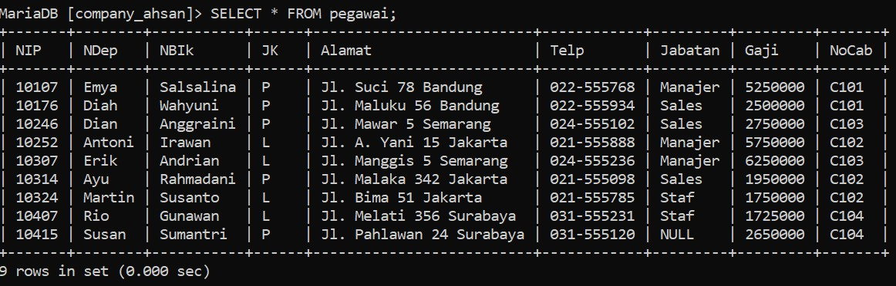
# STRUKTUR TABEL
```mysql
Desc pegawai;
```
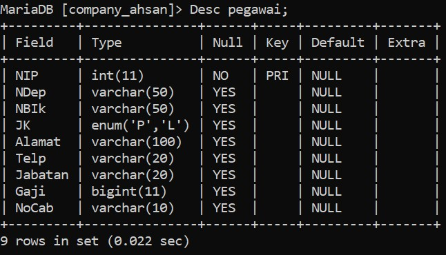
# no 1
## Query
```mysql
SELECT COUNT(NIP) AS JumlahPegawai, COUNT(Jabatan) AS JumlahJabatan
-> FROM pegawai;
```

## Hasil


## Analisis
- `SELECT` = Untuk memilih kolom apa saja yang ingin dipilih (untuk dihitung).
- `COUNT(NIP)` = Untuk menghitung jumlah barisan data yang mempunyai isi data dari kolom yang dipilih. 
	`NIP` adalah nama kolom yang dipilih untuk dihitung.
- `AS` = Untuk mengubah nama dari suatu kolom untuk sementara.
- `JumlahPegawai` = merupakan nama ubahan dari perintah `AS` yang digunakan merupakan nama sementara dari perintah `COUNT(NIP)`.
- `COUNT(Jabatan)` = untuk menghitung jumlah barisan data yang mempunyai isi data dari kolom yang dipilih `jabatan` adalah nama kolom yang dipilih untuk dihitung.
- `AS` : Untuk mengubah nama dari suatu kolom untuk sementara.
- `JumlahJabatan` = merupakan nama sementara dari perintah `COUNT(jabatan)`.
- `FROM pegawai` = merupakan dari tabel mana datanya yang digunakan `pegawai` adalah nama tabel yang datanya ingin digunakan.
- Hasilnya = karena ada 9 barisan data, yang ingin dihitung adalah kolom `NIP`, jumlah dari kolom `NIP` (isi datanya) ada 9, ditampilkan sebagai `JumlahPegawai`. Kolom `Jabatan` juga dihitung, akan tetapi ada satu data yang berisi `NULL`(kosong) oleh karena itu hanya ada 8 data ditampilkan sebagai `JumlahJabatan`.
# no 2
## Query
```mysql
SELECT COUNT(NIP) AS JumlahPegawai
-> FROM pegawai
-> WHERE NoCab = 'C102';
```

## Hasil
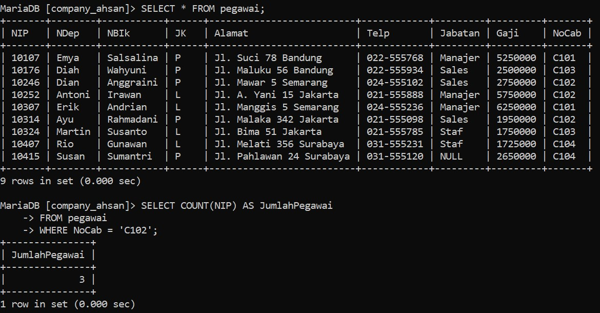

## Analisis
- `SELECT` = untuk memilih kolom mana saja yang ingin dipilih untuk dihitung.
- `COUNT(NIP)` = untuk menghitung jumlah barisan data  yang mempunyai data dari kolom yang dipilih.
	`Nip` adalah nama kolom yang dipilih untuk dihitung.
- `AS` = untuk mengubah nama dari suatu kolom sementara.
- `JumlahPegawai` = nama sementara yang dipilih untuk kolom `COUNT(NIP)`.
- `FROM pegawai` = dari tabel mana datanya akan digunakan.
	`Pegawai` adalah nama tabel yang dipilih untuk digunakan.
- `WHERE` = merupakan kondisi yang harus dipenuhi agar datanya dapat dihitung dengan query `COUNT(NIP)`.
- `(Nocab = 'C102')` = adalah kondisi dari where yang harus dipenuhi, jadi hanya barisan data yang memiliki `C102` di kolom `Nocab` yang bisa dihitung.
- Hasilnya = di 9 barisan data yang ada pada tabel pegawai, kita ingin menghitung jumlah barisan data yang memiliki nilai `C102` pada kolom `Nocab` nya dengan menggunakan `COUNT`. Jadi yang muncul adalah 3 barisan data. Kita juga ingin mengubah nama dari kolom hasil perintah `COUNT` secara sementara dengan perintah `AS` namanya adalah `JumlahPegawai`.
# no 3
## Query
```mysql
SELECT NoCab, COUNT(NIP) AS Jumlah_Pegawai
-> FROM pegawai
-> GROUP BY NoCab;
```

## Hasil
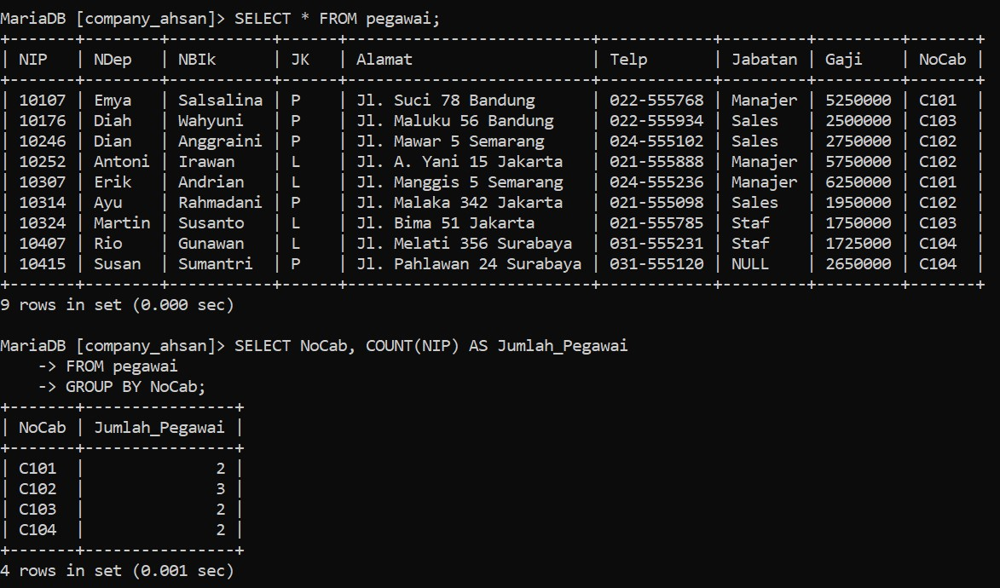

## Analisis
- `SELECT` = untuk memilih kolom mana saja yang ingin dihitung atau ditampilkan.
- `Nocab` = merupakan nama kolom yang ingin ditampilkan.
- `COUNT(NIP)` = untuk menghitung jumlah barisan data yang mempunyai isi data dari kolom yang dipilih.
	Nip adalah nama kolom yang ingin dipilih untuk dihitung.
- `AS` = untuk mengubah nama dari suatu kolom untuk sementara.
- `JumlahPegawai` = merupakan nama sementara dari kolom hasil `COUNT(NIP)`.
- `FROM pegawai` = dari tabel mana yang data kodomnya ingin digunakan.
	`Pegawai` adalah nama tabel yang dipilih untuk digunakan.
- `GROUP BY` = untuk mengelompokkan data berdasarkan nilai data yang telah ditentuka Pada kolom yang dipilih.
- `NoCab` = nama kolom Yang dipilih untuk datanya dikelompokkan.
- Hasilnya = Berdasarkan 9 barisan data, masing-masing nilai dalam kolom `NoCab` dikelompokkan berdasarkan nilainya sendiri. Jadi `NoCab` `C101` bersama `NoCab` yang nilai nya sama Yaitu `C101`. Jadi `NoCab` Yang memiliki `C101` ada 2, `C102` ada 3, `C103` ada 2, `C104` ada 2. Total semuanya 9, sesuai dengan jumlah barisan data yang ada. Adapun nama dari kolom hasil yaitu `Jumlah_Pegawai` dari Perintah `AS`.
# no 4
## Query
```mysql
SELECT NoCab, COUNT(NIP) AS Jumlah_Pegawai
-> FROM pegawai
-> GROUP BY NoCab HAVING COUNT(NIP) >= 3;
```

## Hasil


## Analisis
- `SELECT` = untuk memilih kolom mana saja yang ingin dihitung atau ditampilkan.
- `NoCab` = merupakan nama kolom yang ingin ditampilkan.
- `COUNT (NIP)` = untuk menghitung Jumlah barisan data yang mempunyai isi data dari kolom Yang dipilih.
	`NIP` adalah nama kolom Yang dipilih untuk dihitung.
- `AS` = untuk mengubah nama dari suatu kolom untuk sementara.
- `Jumlah_Pegawai` = nama sementara dati kolom hasil `COUNT (NIP)`.
- `From pegawai` = untuk memilih dari tabel mana yang data kolomnya ingin digunakan.
	`pegawai` adalah nama tabel yang dipilih untuk digunakan.
- `GROUP BY` = untuk menjelompokkan data berdasarkan nilai data Yang telah ditentukan Pada kolom Yang dipilih.
- `NoCab` = nama kolom Yang dipilih untuk dikelompokkan datanya.
- `HAVING` = untuk menentukan kondisi (yang harus dipenuhi) oleh suatu kelompok data agar bisa ditampilkan.
- `COUNT (NIP) >= 3` = merupakan kondisi yang harus dipenuhi oleh suatu kelompok data. Jadi hanya kelompok data yang hasil hitungannya lebih atau sama dengan 3.
- Hasilnya seperti sebelumnya, ada 9 barisan data dibagi sesuai `NoCab` nya masing-masing. Namun yang ingin ditampilkan adalah hasil hitungan yang lebih dari atau sama dengan 3. Yaitu `NoCab` `C102` yang ada 3. Yand lainn `C101` ada 2, `C103` ada 2, `C104` ada 2.
# no 5
## Query
```mysql
SELECT SUM(Gaji) AS Total_Gaji
-> FROM pegawai;
```

## Hasil
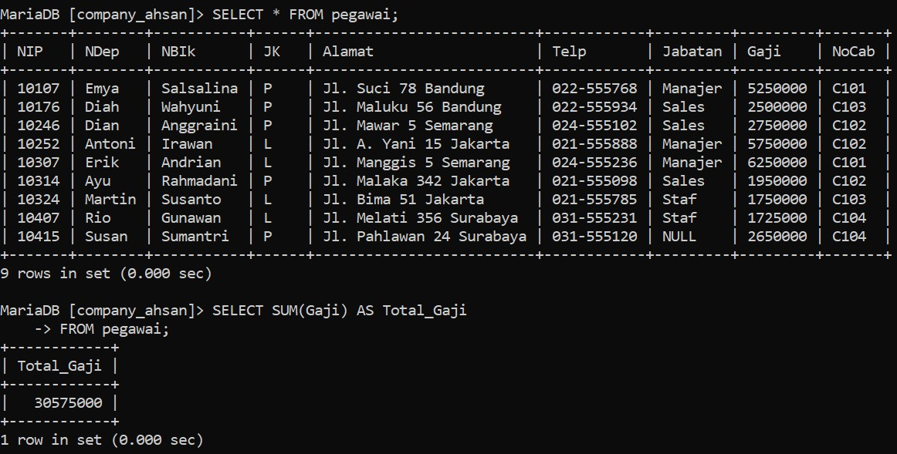

## Analisis
- `SELECT` = Untuk memilih kolom mana saja yang dipilih untuk dijumlahkan.
- `SUM(Gaji)` = Untuk menghitung jumlah data (khusus angka) pada kolom yang harus dipilh.
	`Gaji` merupakan nama kolom yang dipilih untuk dihitung jumlah isi datanya.
- `AS` = Untuk mengganti nama dari kolom hasil `SUM(Gaji)` untuk sementara.
- `Total_Gaji` = Merupakan nama sementara dari perintah `AS`.
- `FROM pegawai` = Untuk memilih dari table mana yang kolom datanya akan digunakan.
	`pegawai` adalah nama dari table yang dipilih.
- Hasilnya = Kolom `Gaji` yang isi datanya berupa angka-angka, semuanya dijumlahkan menjadi satu seperti ditotalkan (sama seperti matematika pada umumnya). Dan hasilnya adalah 30575000. Adapun nama kolom dari hasil jumlah tersebut diubah dari `SUM(Gaji)` menjadi `Total_Gaji`.
# no 6
## Query
```mysql
SELECT SUM(Gaji) AS Gaji_Manajer
-> FROM pegawai
-> WHERE Jabatan = 'Manajer';
```

## Hasil
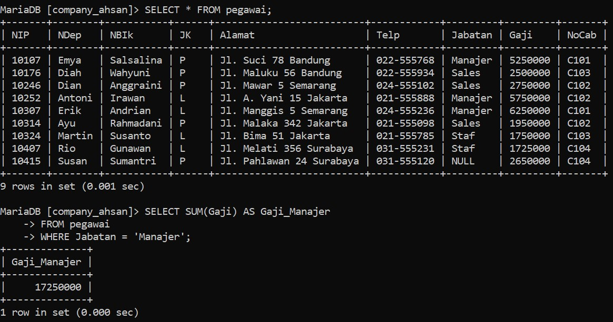

## Analisis
- `SELECT` = Untuk memiliki kolom mana saja yang dipilih untuk digunakan.
- `SUM` = Untuk menghitung jumlah isi data (khusus angka) pada kolom yang dipilih. gaji yang dipilih untuk dijumlahkan isi datanya.
- `AS` = Mengganti nama dari kolom hasil `SUM(Gaji)` secara sementara.
- `Gaji_Manajer`= Mengubah nama sementara dari perintah `AS`.
- `FROM pegawai` = Untuk memilih dari tabel mana yang kolom datanya akan digunakan.
	`pegawai` adalah nama dari tabel yang dipilih.
- `WHERE` = Kondisi yang harus dipenuhi oleh suatu kolom agar datanya bisa dijumlah.
- `Jabatan="Manajer"` = Merupakan kondisi dari `WHERE`. hanya barisan data yang kolom Gaji-nya bisa dijumlahkan.
- Hasilnya = Barisan data yang kolom jumlahnya berisi manager akan dijumlah kolom Gaji-nya menjadi 17.250.000. jadi hanya beberapa kolom saja yang dijumlah.
# no 7
## Query
```mysql
SELECT NoCab, SUM(Gaji) AS TotalGaji
-> FROM pegawai
-> GROUP BY NoCab;
```

## Hasil
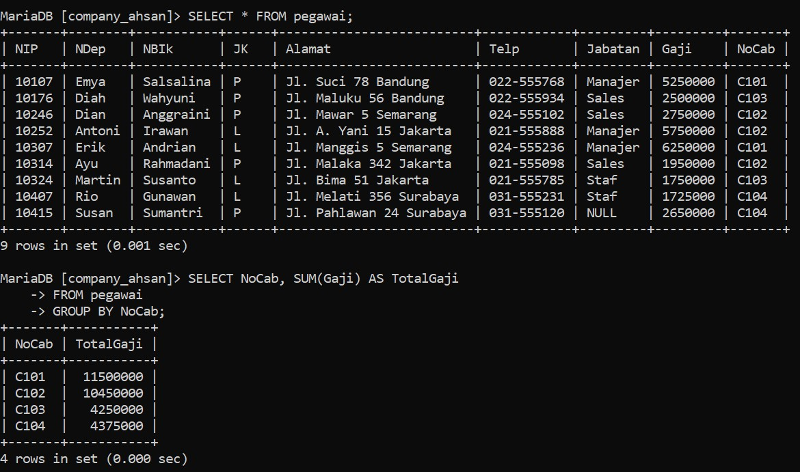

## Analisis
- `SELECT` = untuk memilih kolom mana saja yang dipilih untuk ditampilkan atau dijumlahkan.
- `SUM(Gaji)` = untuk menghitung jumlah data (khusus angka) pada kolom yang dipilih. 
	`Gaji` adalah nama kolom yang dipilih untuk dijumlahkan isi datanya.
- `AS` = untuk mengganti nama dari kolom hasil `SUM(Gaji)` untuk sementara.
- `TOTALGaji` = merupakan nama sementara dari perintah `AS`.
- `FROM pegawai`= untuk memilih dari tabel mana yang data kolomnya akan digunakan. 
	`pegawai` adalah nama tabel yang dipilh.
- `GROUP BY` = untuk mengelompokkan data berdasarkan nilai data yang telah ditentukan pada kolo yang dipilih.
- `NoCab`= nama kolom yang datanya dipilih untuk dikelompokkan.
- Hasilnya= jadi berdasarkan kolom `NoCab`, barisan data yang kolom `NoCab`-nya berisi `C102` maka kolom gaji dari barisan data itu digunakan bersama barisan data yang memiliki `NoCab` `C101` juga. maka kolom gaji dijumlahkan sesuai dengan kolom `NOCab` masing-masing, mulai dari `C101` memiliki 2 kolom gaji yang bisa dijumlahkan. sama dengan `C103` dan `C104`. adapun `C102` memiliki 3 kolom Gaji yang dapat dijumlahkan. `TotalGaji` merupakan hasil perintah dari `AS` untuk mengubah nama kolom hasil dari `SUM(Gaji)`.
# no 8
## Query
```mysql
SELECT NoCab, SUM(Gaji) AS Total_Gaji
-> FROM pegawai
-> GROUP BY NoCab HAVING SUM(Gaji) >= 8000000;
```

## Hasil
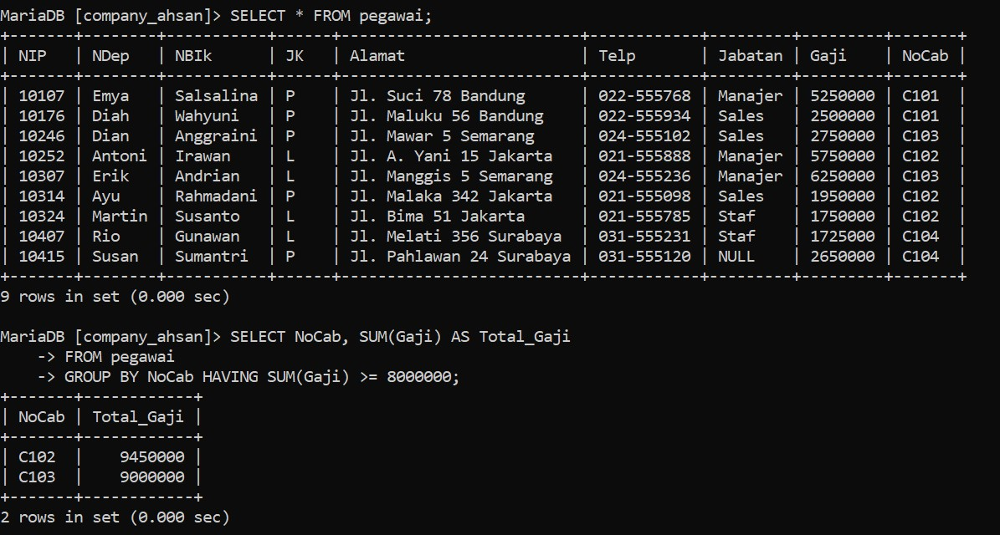

## Analisis
- `SELECT` = untuk memilih kolom mana saja yang dipilih untuk di tampilkan atau di jumlah.
- `NoCab` = nama kolom yang dipilih untuk ditampilkan.
- `SUM(Gaji)` = untuk menghitung jumlah data (Khusus Angka) pada kolom yang dipilih.
	`Gaji` adalah nama kolom yang dipilih untuk dijumlahkan isi datanya.
- `AS` = untuk mengganti nama dari `SUM(Gaji)` untuk sementara.
- `Total_Gaji` = adalah nama sementara dari perintah ``AS``.
- `From pegawai` = untuk memilih dari tabel mana yang data kolomnya akan di gunakan,
	`pegawai` Adalah Nama Tabel Yang akan di pilih.
- `GROUP BY` = untuk mengelompokkan data berdasarkan nilai data Yang telah ditentukan Pada kolom yang dipilih.
- `NoCab` = nama kolom Yang dipilih untuk datanya dikelompokkan.
- `Having` = kondisi yang harus dipenuhi oleh suatu kelompok data agar bisa ditampilkan.
- `Sum (Gaji) >= 800000 `= kondisi dari `HAVING`, Hasil dari Penjumlahan Gaji yang hanya bisa ditampilkan adalah Hasil yang lebih dari atau sama dengan 8000000.
- Hasilnya = Sama seperti sebelumnya, tetapi `NoCab` Yang memenuhi kondisi tersebut hanyalah `C102` dan `C103` karena hasil Jumlah kolom `Gaji` nya lebih dari atau sama dengan 8000000. Adapun hasil kolom `SUM(Gaji)` diganti Jadi `Total_Gaji`.
# no 9
## Query
```mysql
SELECT AVG(Gaji) AS Rata_rata
-> FROM pegawai;
```

## Hasil
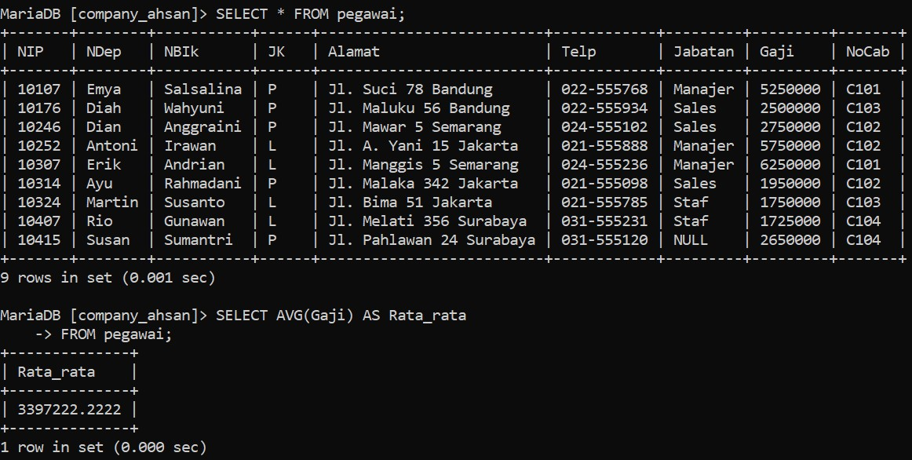

## Analisis
- `SELECT` = untuk memilih kolom mana data yang dipilih untuk ditampilkan.
- `AVG(Gaji)` = untuk menghitung rata-rata dari data yang ada Pada kolom Yang dipilih.
	`Gaji` adalah nama kolom Yang dipilih untuk dihitung rata-ratanya.
- `AS` = untuk mengganti nama dari kolom hasil `AVG(Gaji)` untuk sementara.
- `Rata-rata` =nama sementara dari Perintah `AS`.
- From pegawai = untuk memilih dari tabel mana Yang data kolomnya ingin digunakan
	`pegawai` = adalah nama dari tabel yang dipilih.
- Hasilnya = 3397222.2222 merupakan hasil rata-rata dari semua 9 barisan data Pada kolom `Gaji`. Adapun nama kolom hasil dari `AVG(Gaji)` Yaitu `Rata-rata`.
# no 10
## Query
```mysql
SELECT AVG(Gaji) AS RataGajiMgr
-> FROM pegawai
-> WHERE Jabatan = 'Manajer' ;
```

## Hasil
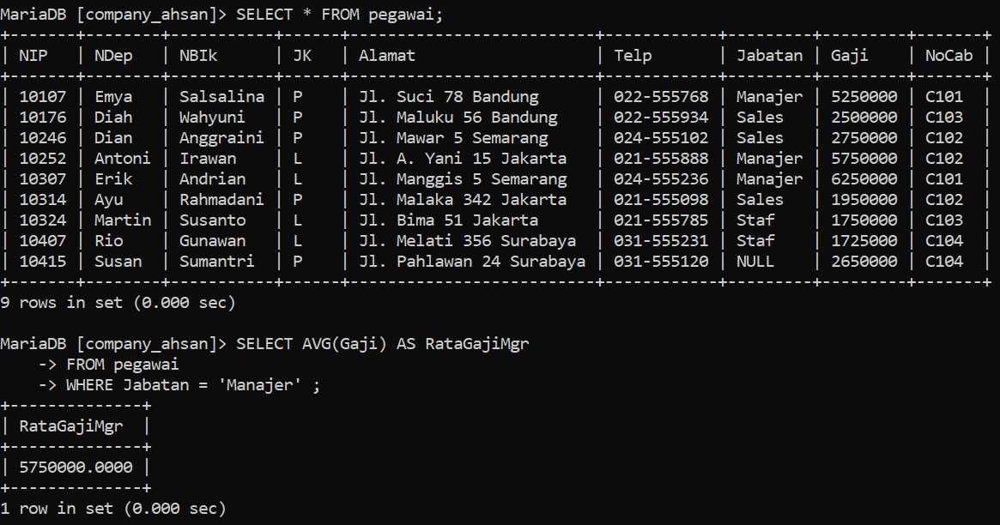

## Analisis
- `SELECT` = untuk memilih kolom mana saja yang dipilih untuk ditampilkan.
- `AVG(Gaji)` = untuk menghitung rata-rata dari data yang ada pada kolom Yang dipilih. 
	`Gaji` adalah nama kolom Yang dipilih untuk dihitung rata-ratanya.
- `AS` = untuk mengganti nama dari kolom hasil `AVG(Gaji)` untuk sementara.
- `GajiRataMgr` = nama sementara dari perintah `AS`.
- `FROM pegawai` = untuk memilih dari tabel mana Yang data kolomnya ingin 
	`pegawai` adalah nama dari tabel yang diingin digunakan.
- `WHERE` = Kondisi yang harus dipenuhi oleh suatu kolom agar datanya bisa dihitung rata-ratanya
- `Jabatan = 'Manajer'` = kondisi dari `WHERE`. Barisan data yang kolom Jabatannya `Manajer` akan dihitung rata-rata kolom `Gaji` nya.
- Hasilnya = 5750000.0000 merupakan hasil hitung rata-rata dari barisan data yang memiliki manajer di kolom Jabatan nya,dari situ kolom Gajinya di hitung.
# no 11
## Query
```mysql
SELECT NoCab, AVG(Gaji) AS RataGaji
-> FROM pegawai
-> GROUP BY NoCab;
```

## Hasil
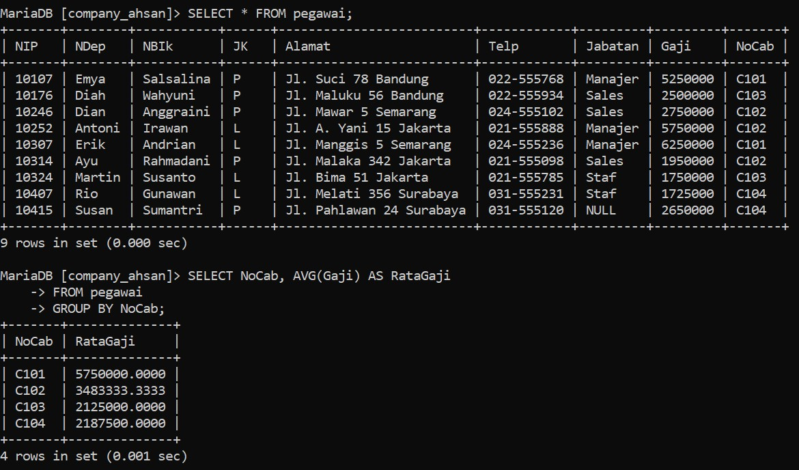

## Analisis
- `SELECT` = untuk memilih kolom mana saja yang dipilih untuk ditampilkan/dihitung.
- `NoCab` = kolom yang dipilih untuk ditampilkan.
- `AVG(Gaji)` = untuk menghitung rata-rata dari data yang ada pada kolom yang dipilih. 
	`Gaji` adalah nama kolom yang dipilih untuk dihitung rata-ratanya.
- `AS` = untuk mengganti nama dari kolom hasil `AVG(gaji)` untuk sementara.
- `RataGaji` = adalah nama sementara dari perintah `AS`.
- `FROM pegawai` = untuk memilih dari tabel mana yang data kolomnya ingin digunakan. 
	`pegawai` adalah nama dari tabel yang dipilih.
- `GROUP BY`=  untuk mengelompokkan data berdasarkan nilai data yang telah ditentukan pada kolom yang dipilih.
- `NoCab`=  nama kolom yang dipilih untuk datanya dikelompokkan.
- Hasilnya = hampir sama seperti no.7 masing-masing kolom `NoCab` dihitung rata-ratanya. Sesuai dengan isi `NoCab`,jadi yang `C101` dihitung dengan `C101` yang lainnya juga (yang sama) adapun `RataGaji` merupakan nama sementara dari kolom hasil `AVG(gaji)`.
# no 12
## Query
```mysql
SELECT NoCab, AVG(Gaji) AS RataGaji
-> FROM pegawai
-> GROUP BY NoCab HAVING NoCab = 'C101' OR NoCab = 'C102';
```

## Hasil
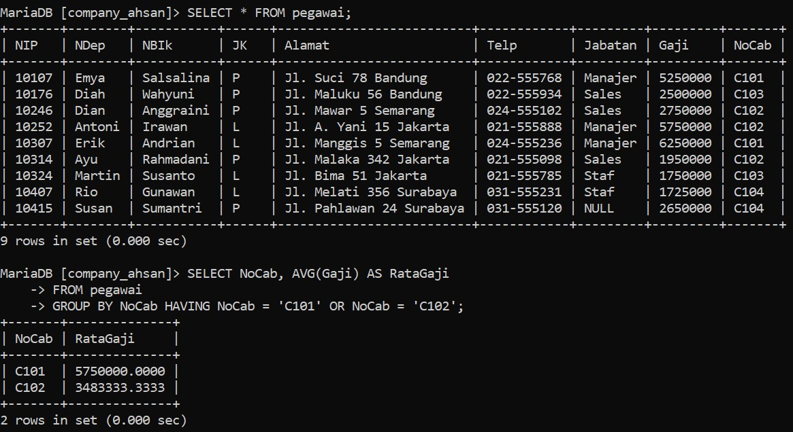

## Analisis
- `SELECT` = untuk memilih kolom mana saja yang dipilih untuk ditampilkan/dihitung.
- `nocab` = kolom yang dipilih untuk ditampilkan.
- `AVG(gaji)` = untuk menghitung rata-rata dari data yang ada pada kolom yang dipilih. 
	`gaji` adalah nama kolom yang dipilih untuk dihitung rata-ratanya.
- `AS` = untuk mengganti nama dari kolom hasil `AVG(gaji)` untuk sementara.
- `RataGaji` = adalah nama sementara dari perintah `AS`.
- `FROM pegawai` = untuk memilih dari tabel mana yang data kolomnya ingin digunakan. 
	`pegawai` adalah nama dari tabel yang dipilih.
- `GROUP BY` = untuk mengelompokkan data berdasarkan nilai data yang telah ditentukan pada kolom yang dipilih.
- `NoCab` = nama kolom yang dipilih untuk datanya dikelompokkan.
- `HAVING` = kondisi yang harus dipenuhi oleh suatu kelompok data.
- `NoCab = 'C101' OR NoCab = 'C102'` = merupakan kondisi dari `HAVING`. Jadi kolom `NoCab` yang memiliki `C101` atau `C102` yang hanya akan ditampilkan `OR` adalah kondisi yang hanya salah satu datanya yang harus dipenuhi.
# no 13
## Query
```Mysql
SELECT MAX(Gaji) AS GajiTerbesar, MIN(Gaji) AS GajiTerkecil FROM pegawai;
```

## Hasil
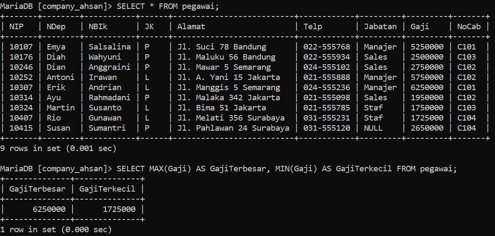


## Analisis
- `SELECT` = untuk memilih kolom mana saja yang dipilih untuk ditampilkan/dihitung.
- `MAX(gaji)` = untuk menampilkan nilai maksimum atau terbesar/tertinggi dari suatu data dalam kolom yang dipilih. 
	`Gaji` adalah nama kolom yang dipilih.
- `AS GajiTerbesar` = untuk mengganti nama dari kolom hasil `MAX(gaji)` menjadi nama sementaranya yaitu `GajiTerbesar`.
- `MIN(gaji)` = untuk menampilkan nilai minimum atau terkecil/terendah dari suatu data dalam kolom yang dipilih. gaji adalah nama kolom yang dipilih.
- `AS gajiterkecil` = untuk mengganti nama dari kolom hasil `MIN(gaji)` menjadi GajiTerkecil untuk sementara.
- `FROM pegawai` = untuk memilih dari tabel mana yang data kolomnya ingin digunakan. 
	`pegawai` adalah nama dari tabel yang dipilih.
- `hasilnya` = jadi dari 9 nilai yang ada di kolom `Gaji`,`Gaji` maksimumnya adalah `6250000` dan namanya diubah menjadi `GajiTerbesar`, bagi minimunnya adalah `1725000` dan namanya diubah menjadi `GajiTerkecil`.
# no 14
## Query
```mysql
SELECT MAX(Gaji) AS GajiTerbesar, MIN(Gaji) AS GajiTerkecil FROM pegawai WHERE Jabatan = 'Manajer';
```

## Hasil
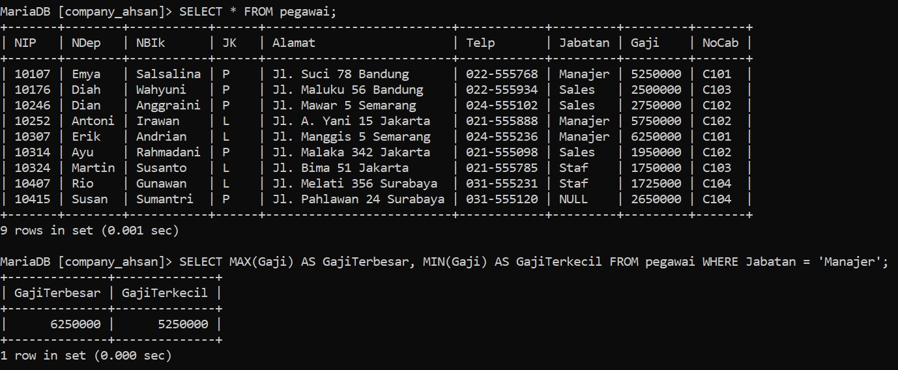


## Analisis
- `SELECT`= Untuk memilih kolom nama mana saja yang dipilih untuk ditampilkan .
- `MAX(Gaji)`= Untuk menampilkan nilai terbesar dari suatu data dalam kolom yang dipilih. 
	`Gaji`  adalah nama kolom yang dipilih.
- `AS GajiTerbesar`= Untuk Menganti nama dari kolom hasil `MAX(Gaji)` menjadi `GajiTerbesar` untuk sementara.
- `MIN(Gaji)`= Untuk menampilkan nilai terkecil dari suatu data dalam kolom yang dipilih. 
	`Gaji` adalah nama kolom yang dipilih.
- `AS GajiTerkecil`= Untuk Menganti nama dari kolom hasil `MIN(Gaji)` menjadi `GajiTerkecil` untuk sementara.
- `FROM pegawai`= Untuk memilih dari tabel mana yang data kolomnya ingin ditampilkan.
- `WHERE`= Kondisi yang harus dipenuhi oleh suatu kolom data agar bisa ditampilkan.
- `(Jabatan = "Manajer")`= Kondisi dari `WHERE` yang harus dipenuhi. Barisan data yang kolom jabatannya berisi manajer akan ditampilkan kolom Gajinya.
- Hasilnya = Jabatan Manajer yang memiliki nilai maksimum adalah 6250000 kolom hasil `MAX`nya diubah jadi `GajiTerbesar`.  
	Sedangkan nilai minimumnya adalah 5250000 kolom hasil `MIN`nya diubah jadi `GajiTerkecil`
# no 15
## Query
```mysql
SELECT NoCab, MAX(Gaji) AS GajiTerbesar, MIN(Gaji) AS GajiTerkecil FROM pegawai GROUP BY NoCAB;
```

## Hasil
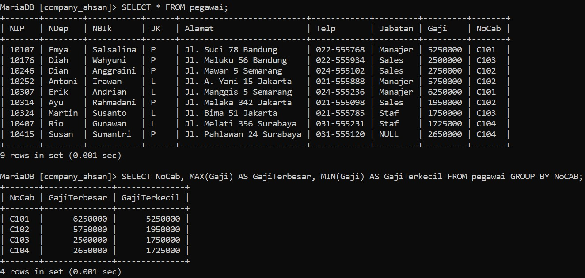

## Analisis
- `SELECT`= Untuk memilih kolom nama mana saja yang dipilih untuk ditampilkan.
- `NoCab`= Nama kolom yang ingin ditampilkan.
- `MAX(Gaji)`= Untuk menampilkan nilai terbesar dari suatu data dalam kolom yang dipilih. 
	`Gaji`  adalah nama kolom yang dipilih.
- `AS GajiTerbesar`= Untuk Menganti nama dari kolom hasil `MAX(Gaji)` menjadi `GajiTerbesar` untuk sementara.
- `MIN(Gaji)`= Untuk menampilkan nilai terkecil dari suatu data dalam kolom yang dipilih. 
	`Gaji` adalah nama kolom yang dipilih.
- `AS GajiTerkecil`= Untuk Menganti nama dari kolom hasil `MIN(Gaji)` menjadi `GajiTerkecil` untuk sementara.
- `FROM pegawai`= Untuk memilih dari tabel mana yang data kolomnya ingin ditampilkan.
- `GROUP BY`= Untuk mengelompokkan data berdasarkan nilai data yang telah ditentukan pada kolom yang dipilih.
- `NoCab`= Nama kolom yang ingin dikelompokkan.
- Hasilnya = Masing-masing `NoCab` dicari nilai maksimum dan minimumnya. Mulai dari `C101`,`C102`,`C103`,`C104` dan nama hasil kolomnya diubah menjadi `GajiTerbesar` dan `GajiTerkecil`.

# no 16
## Query
```mysql
SELECT NoCab, MAX(Gaji) AS GajiTerbesar, MIN(Gaji) AS GajiTerkecil FROM pegawai GROUP BY NoCab HAVING COUNT(NIP) >= 3;
```

## Hasil
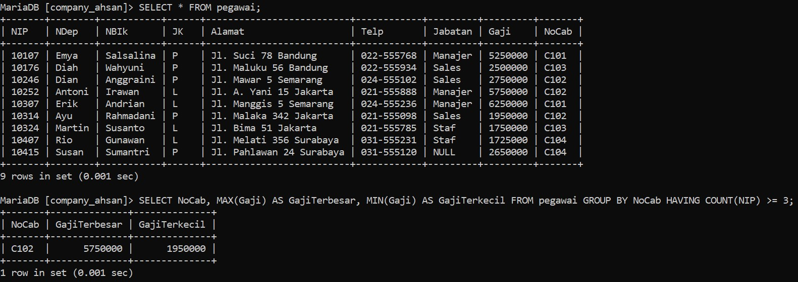

## Analisis
- `SELECT`= Untuk memilih kolom nama mana saja yang dipilih untuk ditampilkan.
- `NoCab`= Nama kolom yang ingin ditampilkan.
- `MAX(Gaji)`= Untuk menampilkan nilai terbesar dari suatu data dalam kolom yang dipilih. 
	`Gaji`  adalah nama kolom yang dipilih.
- `AS GajiTerbesar`= Untuk Menganti nama dari kolom hasil `MAX(Gaji)` menjadi `GajiTerbesar` untuk sementara.
- `MIN(Gaji)`= Untuk menampilkan nilai terkecil dari suatu data dalam kolom yang dipilih. 
	`Gaji` adalah nama kolom yang dipilih.
- `AS GajiTerkecil`= Untuk Menganti nama dari kolom hasil `MIN(Gaji)` menjadi `GajiTerkecil` untuk sementara.
- `FROM pegawai`= Untuk memilih dari tabel mana yang data kolomnya ingin ditampilkan.
- `GROUP BY`= Untuk mengelompokkan data berdasarkan nilai data yang telah ditentukan pada kolom yang dipilih.
- `NoCab`= Nama kolom yang ingin dikelompokkan.
- `HAVING`= Kondisi yang harus dipenuhi oleh suatu kelompok data.
- `(COUNT(NIP) >= 3`= Kondisi dari `HAVING` hanya hasil hitung kolom `NIP` yang lebih dari atau sama dengan 3 yang muncul.
- **Hasilnya** = Seperti no.4, yang mempunyai hasil hitung lebih dari atau sama dengan 3 adalah `NoCab C102`. Jadi hanya itu yang dicari nilai maksimum dan minimumnya pada kolom `Gaji`.
# no 17
## Query
```mysql
SELECT COUNT(NIP) AS JumlahPegawai, SUM(Gaji) AS TotalGaji, AVG(Gaji) AS RataGaji, MAX(Gaji) AS GajiMaks, MIN(Gaji) AS GajiMin
-> FROM pegawai;
```

## Hasil
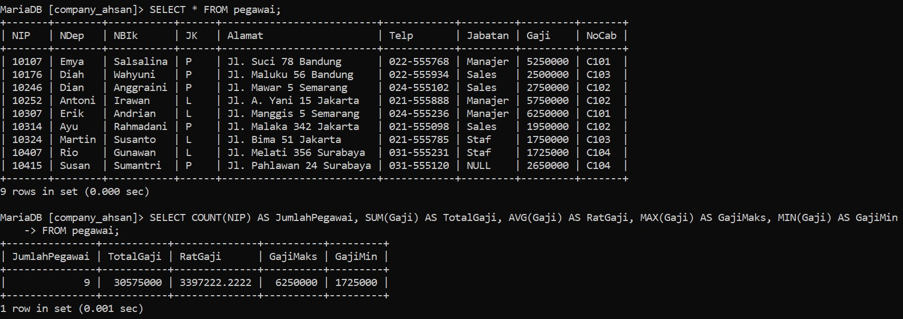

## Analisis
- `Select`= untuk memilih kolom mana saja yang dipilih untuk di tampilkan.
- `COUNT(NIP)` = untuk menghitung jumlah barisan data yang ada pada kolom yang dipilih.
- `AS JumlahPegawai` = untuk mengganti nama kolom hasil `COUNT(NIP)` menjadi Jumlah `Pegawai`.
- `SUM(Gaji)` = untuk Menjumlah data yang ada pada kolom yang dipilih. 
	`Gaji` adalah kolom yang dipilih.
- `AS TotalGaji`= untuk mengganti nama kolom hasil `sum(gaji)` menjadi total `Gaji`.
- `AVG(Gaji)`= untuk menghitung rata-ratanya suatu data dalam kolom yang dipilih. 
	`Gaji` adalah nama kolom yang dipilih untuk dihitung.
- `AS RataGaji`= untuk mengganti nama kolom hasil `AVG(Gaji)` menjadi `RataGaji`.
- `MAX(Gaji)`= untuk menampilkan nilai terbesar dari suatu data dalam kolom yang dipilih `Gaji` adalah nama kolom yang dipilih.
- `AS GajiMaks`= untuk menampilkan nama dari kolom hasil `MAX(Gaji)` menjadi `GajiMaks` untuk sementara.
- `MIN(Gaji)`= untuk menampilkan nilai terkecil dari suatu kolom yang dipilih `Gaji` nama kolom yang dipilih.
- `AS GajiMin`= untuk mengganti nama dari kolom hasil `min(gaji)` menjadi `GajiMin` untuk sementara.
- `From Pegawai`= untuk memilih tabel mana yang dipilih untuk ditampilkan 
	`pegawai` adalah nama tabel yang dipilih.
- Hasil = Dihitung berapa `NIP`, dijumlahkan semua data pada kolom `Gaji`, Dihitung Rata-Rata dari kolom `Gaji`, Ditampilkan Nilai terbesar pada kolom `Gaji`, dan nilai terkecil dalam kolom `Gaji`.

# no 18
## Query
```mysql
SELECT COUNT(NIP) AS JumlahPegawai, SUM(Gaji) AS TotalGaji,
-> AVG(Gaji) AS RataGaji, MAX(Gaji) AS GajiMaks, MIN(Gaji) AS GajiMin
-> FROM pegawai
-> WHERE Jabatan = 'Staf' OR Jabatan = 'Sales'
-> GROUP BY NoCab HAVING SUM(Gaji) <= 2600000;
```

## Hasil
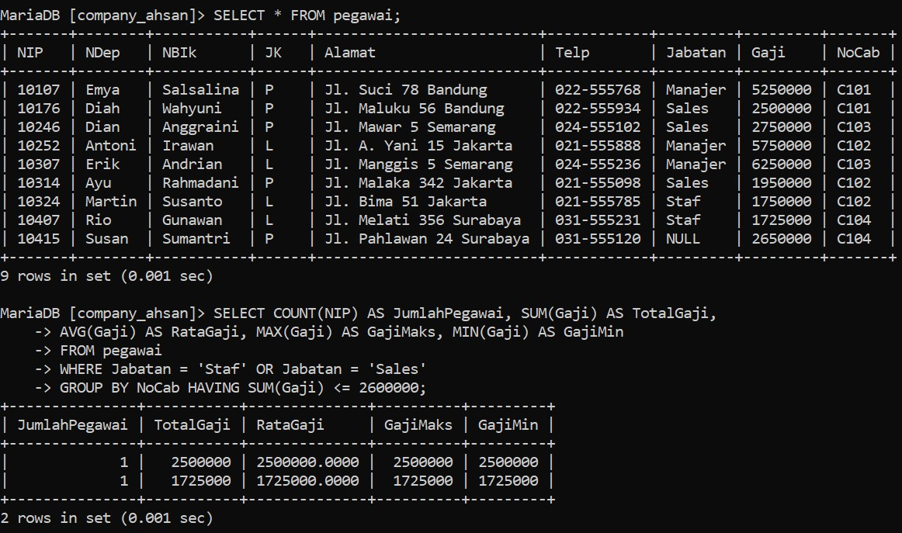

## Analisis
- `Select`= untuk memilih kolom mana saja yang ingin digunakan.
- `COUNT(NIP)`= untuk menghitung barisan data yang ada pada kolom yang dipilih.
- `AS JumlahPegawai`= untuk mengganti nama dari kolom hasil `COUNT(NIP)` menjadi jumlah `pegawai` untuk sementara
- `SUM(Gaji) `= untuk Menjumlah data yang ada pada kolom yang dipilih. 
	`Gaji` adalah nama kolom yang dipilih
- `AS TotalGaji`= untuk mengganti nama dari kolom hasil `Sum(Gaji)` menjadi `totalGaji` untuk sementara.
- `AVG(Gaji) `= untuk menghitung Rata-Rata dari kolom yang di pilih. 
	`Gaji` adalah nama kolom yang di pilih.
-  `AS Rata_gaji`=  untuk  mengganti nama dari kolom `AVG(Gaji)` menjadi `ratagaji` untuk sementara.  
- `MAX(Gaji)`=  untuk menampilkan nilai terbesar dari suatu data dalam kolom yang dipilih.
	`Gaji` adalah nama kolom yang dipilih.
- `AS Gajimaks`= untuk mengganti nama dari kolom `Max(Gaji)`menjadi `Gajimaks` sementara.
- `MIN(Gaji)`= untuk menampilkan nilai minimum dari suatu data dalam kolom yang dipilih. 
	`Gaji` adalah nama kolom yang dipilih.
- `AS Gajimin`= untuk mengganti nama dari kolom `Min(Gaji)` menjadi `Gajimin` untuk sementara
- `From pegawai`= untuk memilih dari tabel mana yang datanya ingin digunakan. 
	`Pegawai` adalah nama tabel yang dipilih.
- `Where`= kondisi yang harus dipenuhi oleh suatu kolom
- `jabatan = staf OR jabatan = sales`= Kondisi dari `where`.
	jadi hanya jabatan staf atau jabatan sales,  hanya salah satunya saja yang harus dipenuhi agar bisa tampil. OR (hanya salah satu kondisi yang harus dipenuhi)
- `GRUP BY`= untuk mengelompokkan data sesuai dengan kolom yang ingin di pilih
- `Nocab`= nama kolom yang di pilih untuk dikelompokkan
- `HAVING`= kondisi yang harus dipenuhi oleh suatu kelompok data agar bisa di tampilkan
- `SUM(Gaji) <= 2.600.000`= kondisi dari `Having`, hanya data yang hasil jumlah gajinya
	kurang dari atau sama dengan `2600000` yang bisa tampil
- Hasilnya = ada 2 barisan data yang memenuhi kondisi `<= 2600000` Adapun kondisi where yang juga dipenuhi oleh barisan data tersebut. Masing-masing namanya diubah sesuai Perintah `AS`.