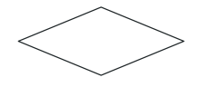

# 1. Mengapa ERD penting dalam perancagan basis data
karena bertujuan untuk membantu dalam merancang relasi antar tabel dalam membuat database
# 2. Di dalam perancangan ERD, apa saja elemen dan simbol yang mesti ada?

## Entitas

### Deskripsi
Entitas adalah objek atau konsep yang memiliki informasi untuk disimpan.
## Relasi

### Deskripsi
Relasi menggambarkan hubungan antara dua atau lebih entitas.
## Garis

### Deskripsi
Garis penghubung menghubungkan entitas dengan atribut atau entitas dengan relasi. Garis ini bisa diberi label untuk memperjelas hubungan antara elemen-elemen di dalam ERD.
## Atribut

### Deskripsi
Mendeskripsikan karakter entitas. Atribut yang berperan sebagai “key” diberi garis bawah.

# 3. Apa yang dimaksud entitas dan apa saja contoh entitas yang ada di sekitar kalian?

## Pengertian
Entitas adalah objek, individu, tempat, atau konsep yang memiliki data penting dan nyata untuk disimpan dalam sistem.

## Contoh
- **Entitas**: Laptop
- **Atribut**: Nama Produk, Harga, Nomor Seri, Kategori Produk.
# 4. Apa itu relasi dalam ERD dan seperti apa contohnya?

## Pengertian
Relasi dalam _Entity-Relationship Diagram_ (ERD) adalah hubungan yang menggambarkan keterkaitan antara dua atau lebih entitas.

## Contoh
Relasi "Memesan" antara _Customer_ dan _Order_

**Deskripsi**: Relasi ini menunjukkan bahwa seorang _Customer_ dapat melakukan satu atau lebih _Order_. Dalam relasi ini, _Customer_ berperan sebagai pihak yang memesan, sementara _Order_ adalah pesanan yang dibuat.
# 5. Setiap entitas dapat berhubung satu sama lain dalam bentuk kardinalitas apa-apa saja kardinalitas dalam ERD?

## One to One (1-1)
Setiap entitas pada himpunan entitas A dapat berelasi dengan paling banyak satu entitas pada himpunan entitas B, demikian juga sebaliknya.

## One to Many (1-N)
Setiap entitas pada himpunan entitas A dapat berelasi dengan banyak entitas pada himpunan entitas B, tetapi tidak sebaliknya

## Many to Many (N-N)
Setiap entitas pada himpunan entitas A dapat berelasi dengan banyak entitas pada himpunan entitas B, demikian juga sebaliknya.