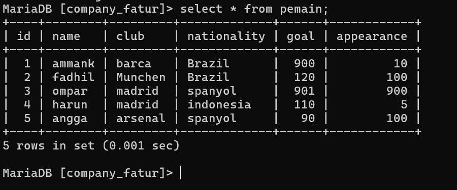
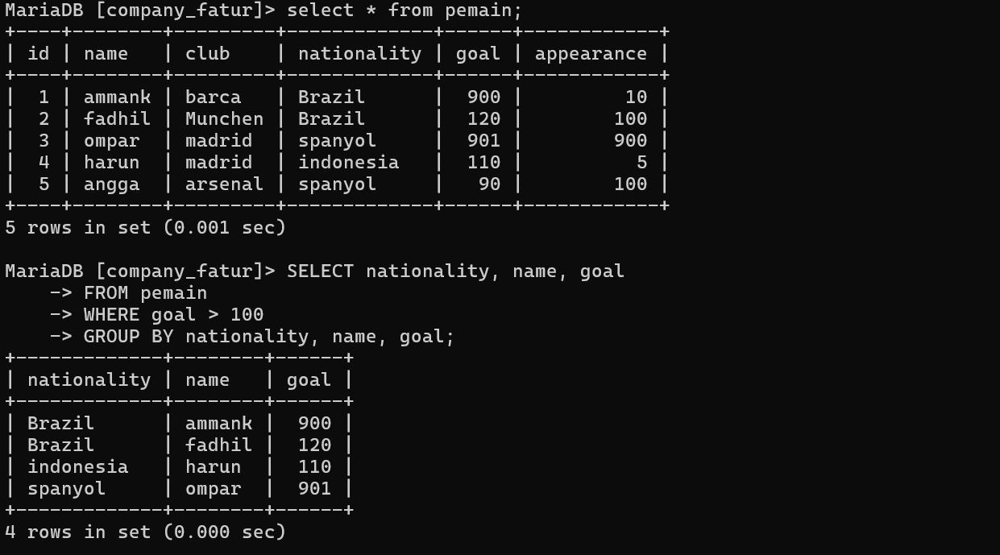
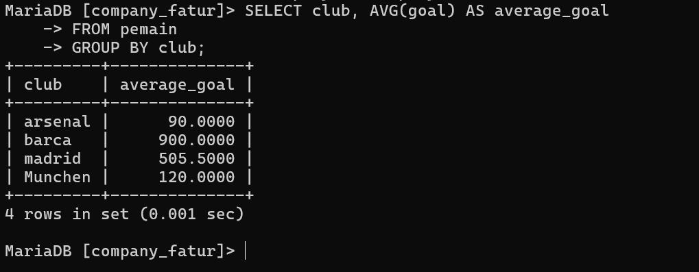
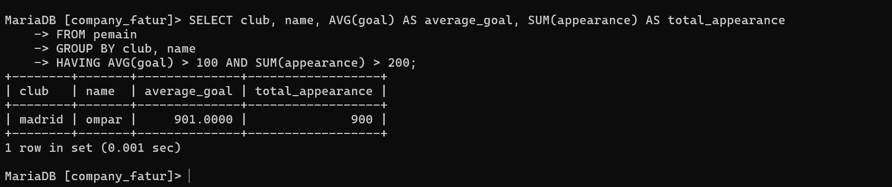

# 1
## 1.AVG(gaji) > 10.000
### jawaban

**B.Having**
### alasannya

Karena, **HAVING** digunakan untuk memfilter data **setelah** dikelompokkan


## 2.gaji > 10.000
### jawaban

**A.WHERE**
### alasannya

Karena, **WHERE** digunakan untuk memfilter data **sebelum** dikelompokkan.

# 2

## Tabel Pemain



## Soal
### 1.pemain dengan goal > 100 dan kelompokkan berdasarkan kebangsaannya

#### **Query**

```php
SELECT nationality, name, goal
FROM pemain
WHERE goal > 100
GROUP BY nationality, name, goal;
```

#### **Hasil**




### 2. Rata-ratakan goal pemain dan kelompokkan berdasarkan klubnya

#### **Query**

```php
SELECT club, AVG(goal) AS average_goal
FROM pemain
GROUP BY club;
```

#### **Hasil**




### 3. Pemain dengan goal rata-rata > 100 dan total tampil > 200, kelompokkan berdasarkan klubnya

#### **Query**

```php
SELECT club, name, AVG(goal) AS average_goal, SUM(appearance) AS total_appearance
FROM pemain
GROUP BY club, name
HAVING AVG(goal) > 100 AND SUM(appearance) > 200;
```

#### **Hasil**


