# koneksi database 

## Contoh Query
```sql
<?php

$koneksi = mysqli_connect('localhost', 'root', '', 'basis_data');

if ($koneksi) {

    echo "<br> koneksi aman <br>";

} else {

    echo "error, tidak bisa koneksi ke database";

}
```

## Hasil

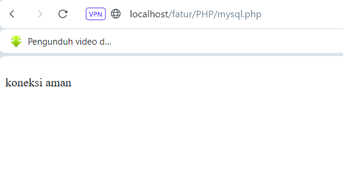
## Analisis

- `localhost` Alamat server database, biasanya `localhost` untuk server lokal.
- `root`: Username untuk mengakses database, dalam hal ini menggunakan `root` yang merupakan username default MySQL.
- `''` Password untuk username `root`, dalam hal ini kosong.
- `basis_data` Nama database yang ingin dihubungkan.
- `if ($koneksi) {` Baris ini memeriksa apakah koneksi ke database berhasil. Jika `$koneksi` memiliki nilai yang dianggap benar, maka koneksi berhasil.
-  `echo "<br>koneksi aman <br>";`  jika koneksi berhasil (kondisi if terpenuhi), baris ini akan menampilkan pesan `koneksi aman` di browser, menandakan bahwa koneksi ke database sukses.
- `else {` else ini akan dijalankan jika koneksi ke database gagal, yaitu jika `$koneksi` bernilai false.
- `echo "error, tidak bisa koneksi ke database";` Jika koneksi gagal, baris ini akan menampilkan pesan "error, tidak bisa koneksi ke database" di browser.
## Kesimpulan

Kode ini berfungsi untuk koneksi ke database MySQL dengan menggunakan fungsi `mysqli_connect()`. Jika koneksi berhasil, akan menampilkan pesan "koneksi aman". Jika koneksi gagal,akan menampilkan pesan "error, tidak bisa koneksi ke database".

# tampilkan data
## Contoh Query
```SQL
<!DOCTYPE html>

<html lang="en">

<head>

    <meta charset="UTF-8">

    <meta name="viewport" content="width=device-width, initial-scale=1.0">

    <title>index tabel</title>

</head>

<body>

    <h2>Data Siswa Berprestasi</h2>

    <a href="tambah.php">+Tambah Data Baru</a><br><br>

    <table border="5">

    <tr>

        <th>id_siswa</th>

        <th>gambar</th>

        <th>nama</th>

        <th>email</th>

        <th>jenis_kelamin</th>

        <th>alamat</th>

    </tr>

    <?php

    include "koneksi.php";

    $i = 1;

    $query = mysqli_query($koneksi, "SELECT * FROM siswa");

    while ($data = mysqli_fetch_array($query)) {

    ?>

    <tr>

        <td><?php echo $i; ?></td>

        <td><?php echo $data['nama']; ?></td>

        <td><?php echo $data['email']; ?></td>

        <td><?php echo $data['jenis_kelamin']; ?></td>

        <td><?php echo $data['alamat']; ?></td>


        <td>

            <a href="ubah.php?id=<?= $data['id_siswa']; ?>">Ubah</a> |

            <a href="hapus.php?id=<?= $data['id_siswa']; ?>">Hapus</a> |

        </td>

    </tr>

    <?php

    $i++;

    }

    ?>

    </table>

</body>

</html>
```


## Hasil

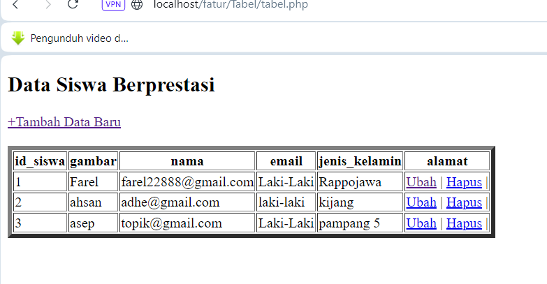
## Analisis

- `<h2>Data Siswa Berprestasi</h2> <a href="tambah.php">+Tambah Data Baru</a><br><br>`  Bagian ini menampilkan judul halaman "Data Siswa Berprestasi" dan sebuah tautan untuk menambahkan data baru (tambah.php).
- `<table border="5">` Bagian ini akan membuat tabel dengan border 5 dan baris header dengan kolom: id_siswa, gambar, nama, email, jenis_kelamin, dan alamat.
- `include "koneksi.php";` Menyertakan file koneksi.php yang berisi detail koneksi database.
- `$i = 1;` inisialisasi variabel penghitung untuk nomor baris.
- `$query = mysqli_query($koneksi, "SELECT * FROM siswa");` Melakukan query ke database untuk mengambil semua data dari tabel siswa.
- ` while ($data = mysqli_fetch_array($query)) {` Memulai loop untuk mengambil setiap baris hasil query dan menyimpannya dalam variabel `$data`.
- `<td><?php echo $i; ?></td>` Setiap iterasi dari loop while mencetak baris tabel `(<tr>)` dengan data siswa. Kolom berikutnya menampilkan data dari database (gambar, nama, email, jenis_kelamin, alamat).
- `<a href="ubah.php?id=<?= $data['id_siswa']; ?>">Ubah</a>` Kolom ini  berisi halaman untuk mengubah (ubah.php) dan menghapus (hapus.php) data siswa berdasarkan id_siswa.
## Kesimpulan

Kesimpulannya,memungkinkan kita untuk mengelola sebuah data,menambah data,menghapus data,dan mengubah data.


# tambahkan data 
## Contoh Query
```SQL
<!DOCTYPE html>

<html lang="en">

<head>

    <title>Document</title>

</head>

<body>

    <h2>Tambah Data</h2>

    <?php  

    include "koneksi.php";  

    if (isset($_POST['simpan'])) {

        $nama = $_POST['nama'];

        $email = $_POST['email'];

        $jenis_kelamin = $_POST['jenis_kelamin'];

        $alamat = $_POST['alamat'];

            return false;

        }

  
        // * true / false

        $query = mysqli_query($koneksi, "INSERT into siswa(nama,email,jenis_kelamin,alamat,gambar)

  

        values ('$nama','$email','$jenis_kelamin','$alamat', '$gambar')");

  

        if ($query == true) {

            echo "<script>

            alert('Tambah data Berhasil')

            window.location.href='table.php'

            </script>";

        } else {

            echo '<script>alert("Tambah data gagal")</script>';

        }

    }


    ?>

    <form method="post" enctype="multipart/form-data">

        <table>

            <tr>

                <td>Nama</td>

                <td><input type="text" name="nama"></td>

            </tr>

            <tr>

                <td>Email</td>

                <td><input type="text" name="email"></td>

            </tr>

            <tr>

                <td>Jenis Kelamin</td>

                <td>>

                    <select name="jenis_kelamin">

                        <option>Laki-laki</option>

                        <option>Perempuan</option>

                    </select>

                </td>

            </tr>

            <tr>

                <td>Alamat</td>

                <td><input type="text" name="alamat"></td>

            </tr>

            <tr>

                <td>Gambar</td>

                <td><input type="file" name="gambar"></td>

            </tr>

            <tr>

                <td></td>

                <td>

                    <button name="simpan" type="submit">Simpan</button>

                    <button type="reset">Reset</button>

                    <a href="table.php">Kembali</a>

                </td>

            </tr>

        </table>

    </form>

</body>

</html>
```

## Hasil

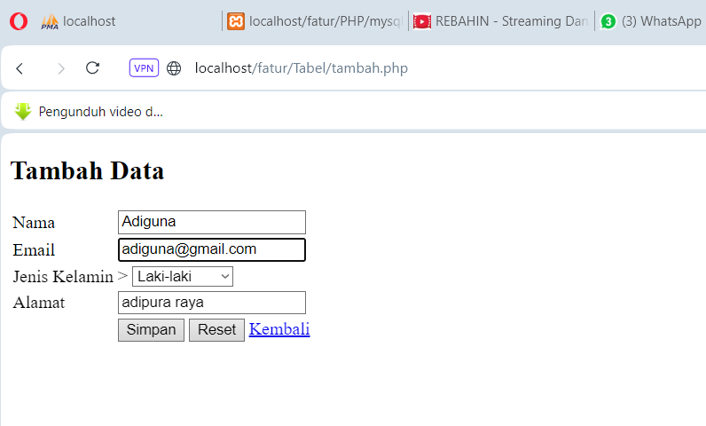


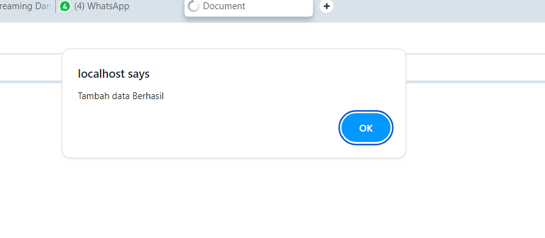

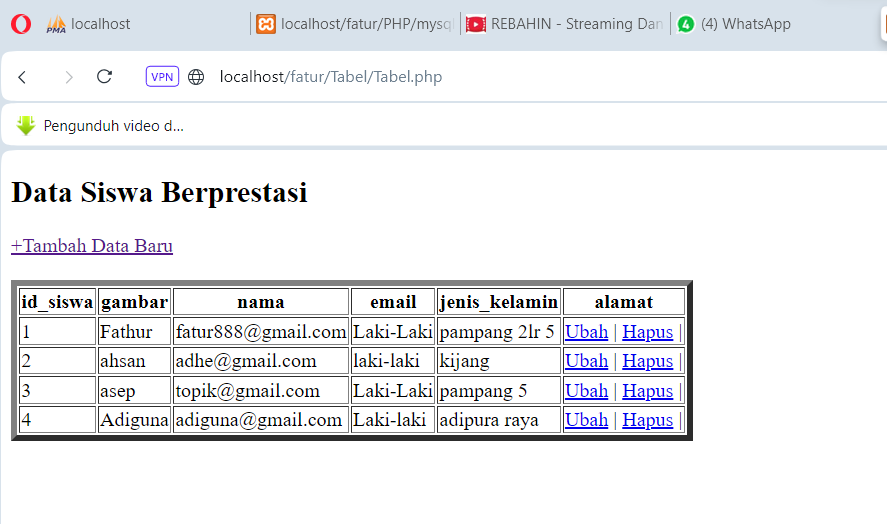

## Analisis
- `include "koneksi.php";` menyertakan file koneksi.php untuk menghubungkan ke database.
- ` if (isset($_POST['simpan'])) { ... }` Memeriksa apakah tombol "Simpan" telah dipilih.
- `$nama = $_POST['nama']; ...:` Mengambil data dari form yang dikirimkan melalui metode POST.
- `mysqli_query($koneksi, "INSERT into siswa ...):` Menjalankan query untuk memasukkan data baru ke tabel siswa.
- ` if ($query == true) { ... } else { ... }:` Memeriksa apakah query berhasil dijalankan dan memberikan umpan balik kepada pengguna melalui alert.
- `method="post" enctype="multipart/form-data"`Mengatur metode pengiriman form sebagai POST dan memungkinkan pengunggahan file.
- `<table>` Menyusun form dalam bentuk tabel untuk tampilan yang rapi.
- `<tr> <td>Nama</td> <td><input type="text" name="nama"></td> </tr> Setiap baris tabel (<tr>) terdiri dari dua kolom (<td>), satu untuk label dan satu untuk input.
- Tombol Simpan untuk mengirim form, Reset untuk mengatur ulang form, dan tautan Kembali untuk kembali ke halaman tabel (table.php).


## Kesimpulan

kesimpulannya,memungkinkan pengguna untuk menambahkan data siswa baru ke database. Pengguna dapat memasukkan nama, email, jenis kelamin, dan alamat.

# ubah data 
## Contoh Query
```SQL
<!DOCTYPE html>

<html lang="en">

<head>

    <title>Ubah Data</title>

</head>

<body>

    <h2>Ubah Data</h2>

    <?php

    include "koneksi.php"; // Ubah nama file koneksi.php sesuai dengan kebutuhan Anda

  

    // Menerima parameter id siswa dari URL

    $id_siswa = $_GET['id'];

  

    if(isset($_POST['S'])) {

        // Ambil data dari form

        $nama         = $_POST['nama'];

        $email        = $_POST['email'];

        $jenis_kelamin= $_POST['jenis_kelamin'];

        $alamat       = $_POST['alamat'];

        // Query untuk update data siswa

        $query = mysqli_query($koneksi, "UPDATE siswa SET nama='$nama', email='$email', jenis_kelamin='$jenis_kelamin', alamat='$alamat' WHERE id_siswa=$id_siswa");

        // Cek apakah query berhasil dijalankan

        if($query) {

            echo "<script>

            alert('Ubah data Berhasil')

            window.location.href='table.php'

            </script>";

        } else {

            echo '<script>alert("Ubah data gagal")</script>';

        }

    }

  

    // Query untuk mendapatkan data siswa berdasarkan id

    $query = mysqli_query($koneksi, "SELECT * FROM siswa WHERE id_siswa=$id_siswa");

    $data = mysqli_fetch_array($query);

    ?>

  

    <form method="post">

        <table>

            <tr>

                <td>Nama</td>

                <td><input type="text" name="nama" value="<?php echo $data['nama']; ?>"></td>

            </tr>

            <tr>

                <td>Email</td>

                <td><input type="email" name="email" value="<?php echo $data['email']; ?>"></td>

            </tr>

            <tr>

                <td>Jenis Kelamin</td>

                <td>

                    <select name="jenis_kelamin">

                        <option value="Laki-Laki" <?php if($data['jenis_kelamin'] == "Laki-Laki") echo 'selected'; ?>>Laki-Laki</option>

                        <option value="Perempuan" <?php if($data['jenis_kelamin'] == "Perempuan") echo 'selected'; ?>>Perempuan</option>

                    </select>

                </td>

            </tr>

            <tr>

                <td>Alamat</td>

                <td><input type="text" name="alamat" value="<?php echo $data['alamat']; ?>"></td>

            </tr>

            <tr>

                <td></td>

                <td>

                    <button type="submit" name="S">Simpan</button>

                    <button type="reset">Reset</button>

                    <a href="index.php">Kembali</a>

                </td>

            </tr>

        </table>

    </form>

</body>

</html>
```

## Hasil
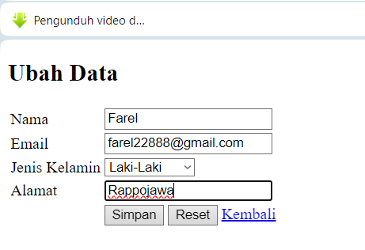
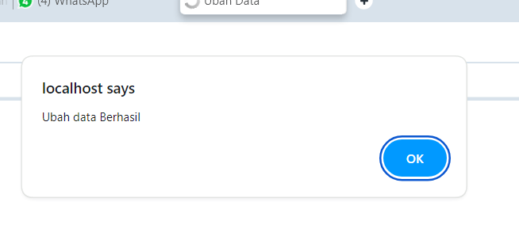

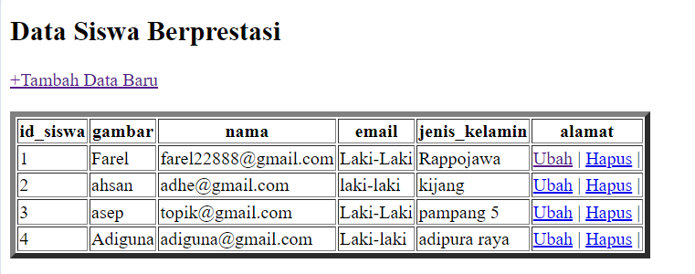

## Analisis
- `include "koneksi.php";` Menyertakan file koneksi.php untuk menghubungkan ke database MySQL.
- `$id_siswa = $_GET['id'];` Mengambil nilai id_siswa dari parameter URL dan menyimpannya dalam variabel` $id_siswa`.
- `if(isset($_POST['S'])) { ... }` Memeriksa apakah tombol "Simpan" telah dipilih.
  Mengambil data yang diisi di form (nama, email, jenis_kelamin, alamat).
  Menjalankan query SQL untuk memperbarui data siswa berdasarkan id_siswa.
  Memberikan umpan balik kepada pengguna melalui alert JavaScript dan mengarahkan kembali ke halaman table.php jika berhasil, atau menampilkan pesan kesalahan jika gagal.
- `$query = mysqli_query($koneksi, "SELECT * FROM siswa WHERE id_siswa=$id_siswa");
  `$data = mysqli_fetch_array($query);`
  `?>` Menjalankan query SQL untuk mengambil data siswa berdasarkan id_siswa.
  Menyimpan hasil query dalam variabel $data untuk diisi ke dalam form. 
- ` method="post"` Mengatur metode pengiriman form sebagai POST.
- ` <table>` Menyusun form dalam bentuk tabel. 
-  ``<td><input type="text" name="nama" value="<?php echo $data['nama']; ?>"></td>`` Setiap baris tabel `<tr>` terdiri dari dua kolom `<td>`, satu untuk label dan satu untuk input. Nilai default input diisi dengan data yang diambil dari database.
- ` <option value="Laki-Laki" <?php if($data['jenis_kelamin'] == "Laki-Laki") echo 'selected'; ?>>Laki-Laki</option>`: Mengatur pilihan yang sesuai dengan nilai data dari database sebagai "selected".
-  Tombol Simpan untuk mengirim form, Reset untuk mengatur ulang form, dan tautan Kembali untuk kembali ke halaman `index.php`.
## Kesimpulan
Kesimpulannya,memungkinkan pengguna untuk mengubah data siswa yang ada dalam database.
# hapus data
## Contoh Query
```SQL
<?php

include('koneksi.php');
  

if(isset($_GET['id'])){

    $id = $_GET['id'];

    $query = mysqli_query($koneksi, "DELETE FROM siswa WHERE id_siswa = $id");

   if($query) {

            echo "<script>

            alert('Hapus data Berhasil')

            window.location.href='table.php'

            </script>";

        }else {

            echo '<script>alert("Hapus data gagal")</script>';

        }

}

?>
```

## Hasil

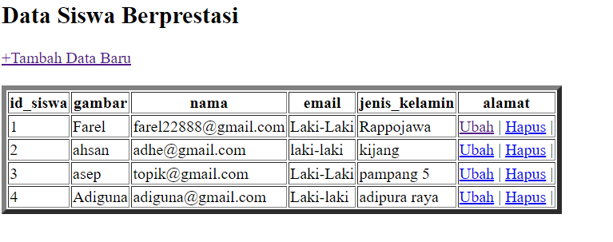
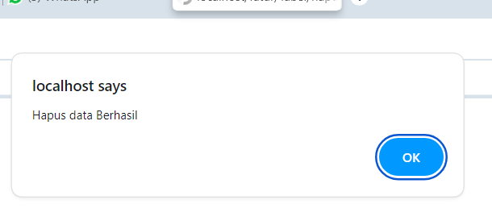

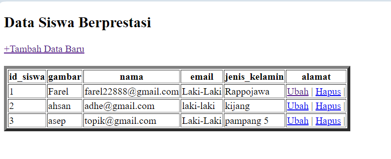

## Analisis
- `include('koneksi.php');` Baris ini untuk menghubungkan ke database MySQL. Ini memastikan bahwa kita dapat menggunakan koneksi $koneksi yang didefinisikan di koneksi.php.
- `if(isset($_GET['id'])){` Memeriksa apakah parameter id tersedia di URL melalui metode GET. Jika parameter id ada, maka kode di dalam blok ini akan dijalankan.
- `$id = $_GET['id'];
  `$query = mysqli_query($koneksi, "DELETE FROM siswa WHERE id_siswa = $id");`
 ` $id = $_GET['id'];:` Mengambil nilai id dari parameter URL dan menyimpannya dalam    `variabel $ id`. `mysqli_query($koneksi, "DELETE FROM siswa WHERE id_siswa = $id");:`     Menjalankan query SQL untuk menghapus baris dari tabel siswa di mana kolom `id_siswa` sama dengan nilai `$id`.
 - `if($query) {` Memeriksa apakah query berhasil dijalankan.
 - Jika true, menampilkan pesan "Hapus data Berhasil" dalam bentuk alert dan mengarahkan kembali ke halaman `table.php`. Jika false, menampilkan pesan "Hapus data gagal".

## Kesimpulan
kesimpulannya,Kode ini bertujuan untuk menghapus data siswa dari tabel siswa dalam database MySQL berdasarkan id yang diberikan.
# session/login
## Session
### Program
```PHP
<?php
session_start();

// $username = "Fathur";

// $alamat = "Pampang 2 lr 5";


// $_SESSION['username'] = $username;

// $_SESSION['alamat'] = $alamat;


if (isset ($_POST ['submit'])) {

   // var_dump($_POST);

   $username = $_POST['username'];

   $password = $_POST['password'];

  

   $koneksi = mysqli_connect('localhost', 'root', '', 'basis_data') or die('error koneksi');

    $result = mysqli_query($koneksi, "SELECT * FROM user WHERE username = '$username' AND password = '$password'");

  

    $data = mysqli_fetch_assoc($result);

    //var_dump($data);

  

    if (isset ($data)) {

        $_SESSION['username'] = $data['username'];

        $_SESSION['nama'] = $data['nama'];

        $_SESSION['status'] = 'login';

        header('location:user.php');

  

    } else {

        echo "Username dan Password Salah";

    }

  

}

?>

  
  

<!DOCTYPE html>

<html>

<head>

    <title>Login session</title>

</head>

<body>

    <form method="post">

        <label>username</label>

        <input type="text" name="username">

        <br><br>

        <label for="">password</label>

        <input type="password" name="password">

        <br>

        <button type="submit" name="submit">login</button>

    </form>

</body>

</html>
```
### Hasil
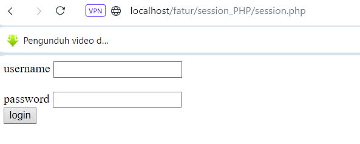
### Analisis
- ` if (isset($_POST['submit'])) { ... }` Memeriksa apakah tombol "login" pada form telah ditekan.
- `$username = $_POST['username']; dan $password = $_POST['password']` Mengambil data username dan password dari form yang dikirimkan melalui metode POST.
- `mysqli_connect('localhost', 'root', '', 'basis_data')` Membuat koneksi ke database MySQL.
- `or die('error koneksi');` Menghentikan eksekusi dan menampilkan pesan kesalahan jika koneksi gagal.
- `mysqli_query($koneksi, "SELECT * FROM user WHERE username = '$username' AND password = '$password'");`:Menjalankan query SQL untuk memeriksa apakah ada pengguna dengan username dan password yang sesuai di tabel user.
- `$data = mysqli_fetch_assoc($result)` Mengambil hasil query sebagai array asosiatif.
- if (isset($data)) { ... }: Memeriksa apakah data pengguna ditemukan.
- `$_SESSION['username'] = $data['username'];` Mengatur variabel sesi username.
- `$_SESSION['nama'] = $data['nama'];`Mengatur variabel sesi nama.
- `$_SESSION['status'] = 'login';` Mengatur status sesi sebagai 'login'.
- `header('location:user.php');` Mengarahkan pengguna ke halaman user.php.
- `else { ... }` Jika data pengguna tidak ditemukan, menampilkan pesan "Username dan Password Salah".
- `form method="post">` Formulir HTML dengan metode POST.
- `<label>username</label>` Label untuk input username.
- `type="text" name="username">`:Input teks untuk username.
- `<label for="">password</label>` Label untuk input password.
- `type="password" name="password">` Input password.
- `type="submit" name="submit">login</button>` Tombol untuk mengirim form dengan nama "submit".

### Kesimpulan
Kesimpulannya,halaman login yang memungkinkan pengguna untuk masuk dengan mengirimkan username dan password.
## User
### Program
```PHP
<?php

session_start();

  

if ($_SESSION['status'] == 'login' && $_SESSION['username'] == 'Admin') {

    header("Location: admin.php");

}

if ($_SESSION['status'] != 'login') {

    header('Location: session.php');

}

  

?>

<!DOCTYPE html>

<html lang="en">

<head>

    <title>Document</title>

</head>

<body>

    <h1>Halaman User</h1>
    
    <h1>Halo, <?= $_SESSION['nama'] ?></h1>

    <a href="logout.php">Logout</a>

</body>
</html>
```
### Hasil
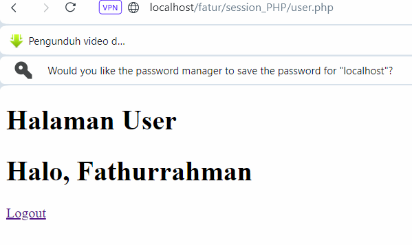
### Analisis
- `if ($_SESSION['status'] == 'login' && $_SESSION['username'] == 'Admin') { ... }` Memeriksa apakah status sesi adalah 'login' dan username adalah 'Admin'. Jika kedua kondisi ini benar, pengguna diarahkan ke halaman admin.php.
- `if ($_SESSION['status'] != 'login') { ... }`Memeriksa apakah status bukan ''login''. Jika kondisi ini benar, pengguna diarahkan ke halaman session.php.
- `<h1>Halaman User</h1>`: Heading utama yang menampilkan teks "Halaman User".
- `<h1>Halo, <?= $_SESSION['nama'] ?></h1>`: Heading yang menampilkan sapaan kepada pengguna, diisi dengan nilai `$_SESSION['nama'].
- `<a href="logout.php">Logout</a>` Tautan untuk logout, mengarah ke logout.php.

### Kesimpulan
Kesimpulannya,halaman yang mengelola akses pengguna berdasarkan status sesi dan username. Jika pengguna yang login adalah 'Admin', mereka akan diarahkan ke halaman admin.php. Jika pengguna tidak login, mereka akan diarahkan ke halaman session.php.

## Admin
### Program
```PHP
<?php

session_start();

  

if ($_SESSION['status'] == 'login' && $_SESSION['username'] != 'Admin') {

    header("Location: user.php");

}

  

if ($_SESSION['status'] != 'login') {

    header('Location: session.php');

}

  

?>

<!DOCTYPE html>

<html lang="en">

  

<head>

    <title>Document</title>

</head>

  

<body>

    <h1>Halaman Admin</h1>

  

    <h1>Halo, <?= $_SESSION['nama'] ?></h1>

    <a href="logout.php">Logout</a>

  

</body>

  

</html>
```
### Hasil
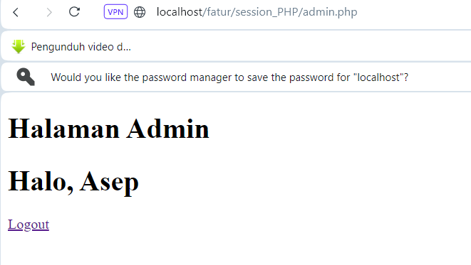
### Analisis
- ` if ($_SESSION['status'] == 'login' && $_SESSION['username'] != 'Admin') { ... }` Memeriksa apakah status sesi adalah 'login' dan username bukan 'Admin'. Jika kondisi ini benar, pengguna diarahkan ke halaman user.php.
- `if ($_SESSION['status'] != 'login') { ... }` Memeriksa apakah status sesi bukan 'login'. Jika kondisi ini benar, pengguna diarahkan ke halaman session.php.
  Dua kondisi ini memastikan bahwa hanya pengguna yang login sebagai 'Admin' yang dapat mengakses halaman ini.
- `<h1>Halaman Admin</h1>`Heading utama yang menampilkan teks "Halaman Admin".
- `<h1>Halo, <?= $_SESSION['nama'] ?></h1>: `Heading yang menampilkan teks kepada pengguna, diisi dengan nilai `$_SESSION['nama']`.
- ` <a href="logout.php">Logout</a>` Tautan untuk logout, mengarah ke logout.php.

### Kesimpulan

Kesimpulannya,menghasilkan halaman yang mengelola akses pengguna berdasarkan status sesi dan username. Jika pengguna login tetapi bukan 'Admin', mereka akan diarahkan ke halaman user.php. Jika pengguna tidak login, mereka akan diarahkan ke halaman session.php.
## LogOut
### Program
```PHP
<?php

session_start();

session_destroy();

session_unset();

header('Location: session.php');
```
### Hasil

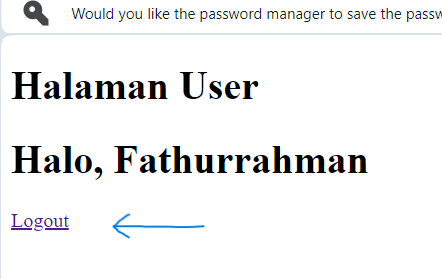


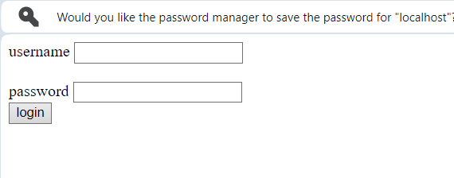

### Analisis
- `session_start();` Fungsi session_start() digunakan untuk memulai atau melanjutkan sesi yang ada pada server.
- `session_destroy();` Fungsi session_destroy() digunakan untuk menghapus semua data yang terkait dengan sesi yang sedang berjalan.
- ` session_unset();` Fungsi session_unset() digunakan untuk menghapus semua variabel sesi yang ada. 
- `header('Location: session.php');` Fungsi header() dengan parameter `Location: session.php` digunakan untuk mengarahkan pengguna ke halaman session.php. Setelah semua operasi sesi selesai, pengguna akan dialihkan ke halaman tersebut.

### Kesimpulan
Kesimpulannya, kode ini digunakan untuk mengakhiri sesi pengguna, membersihkan semua data sesi yang ada, dan mengarahkan pengguna kembali ke halaman session.php.

## cek_user_admin
### Program
```PHP
<?php

if ($_SESSION['status'] == 'login' && $_SESSION['username'] != 'Admin') {

    header("Location: user.php");

} else if ($_SESSION['status'] == 'login' && $_SESSION['username'] == 'Admin') {

    header("Location: admin.php");

}else{

    header("Location: session.php");

}
```
### Hasil
#### User


#### Admin


### Analisis
- `$_SESSION['status'] == 'login`' Ini memeriksa apakah status sesi adalah 'login'.
- `$_SESSION['username'] != 'Admin'` Ini memeriksa apakah username dalam sesi tidak sama dengan 'Admin'.jika kedua kondisi terpenuhi (pengguna login dan bukan admin), pengguna akan diarahkan ke halaman user.php menggunakan header("Location: user.php").
- `else if ($_SESSION['status'] == 'login' && $_SESSION['username'] == 'Admin') {`
  Jika kondisi pada if sebelumnya tidak terpenuhi, baris ini menggunakan else if untuk memeriksa kondisi baru:
- `$_SESSION['status'] == 'login'`: Memeriksa apakah status sesi adalah 'login'.
- `$_SESSION['username'] == 'Admin'` Memeriksa apakah username dalam sesi adalah 'Admin'. Jika kedua kondisi ini terpenuhi (pengguna login dan username adalah 'Admin'), pengguna akan diarahkan ke halaman admin.php menggunakan header("Location: admin.php");.


### Kesimpulan
Kesimpulannya,Bagian ini akan mengecek apakah kode yang kita masukkan cocok untuk masuk ke halaman user & admin dan jika salah akan tampil password & username salah.


# upload dan download
## Upload

### Program
```SQL
    function upload(): string
    {
        $nameImage = $_FILES['gambar']['name'];
        $directoryFile = $_FILES['gambar']['tmp_name'];
        $errorImage = intval($_FILES['gambar']['error']);
        $sizeFile = $_FILES['gambar']['size'];

        // cek apakah gambar ada
        if ($errorImage === 4) {
            echo "<script>alert('Anda Belum Upload Gambar')</script>";
            return false;
        }

        // mengambil ekstensi file
        $validType = ['svg', 'jpg', 'png', 'jpeg', 'webp'];
        $extensionFile = explode(".", $nameImage);
        $extensionValid = strtolower(end($extensionFile));

        // cek apakah yang diupload gambar atau bukan
        if (!in_array($extensionValid, $validType)) {
            echo "<script>alert('yang anda Upload bukan gambar')</script>";
            return false;
        }

        // cek size file
        if ($sizeFile > 3_000_000) {
            echo "<script>alert('Ukuran File Terlalu Besar!!(Maks 3MB)')</script>";
            return false;
        }

        // upload file
        $nameImage = uniqid() . "." . $extensionValid;
        move_uploaded_file($directoryFile, "img/{$nameImage}");
        // mengembalikan namafile yg sudah divalidasi
       return $nameImage;
    }
       
```
### Hasil
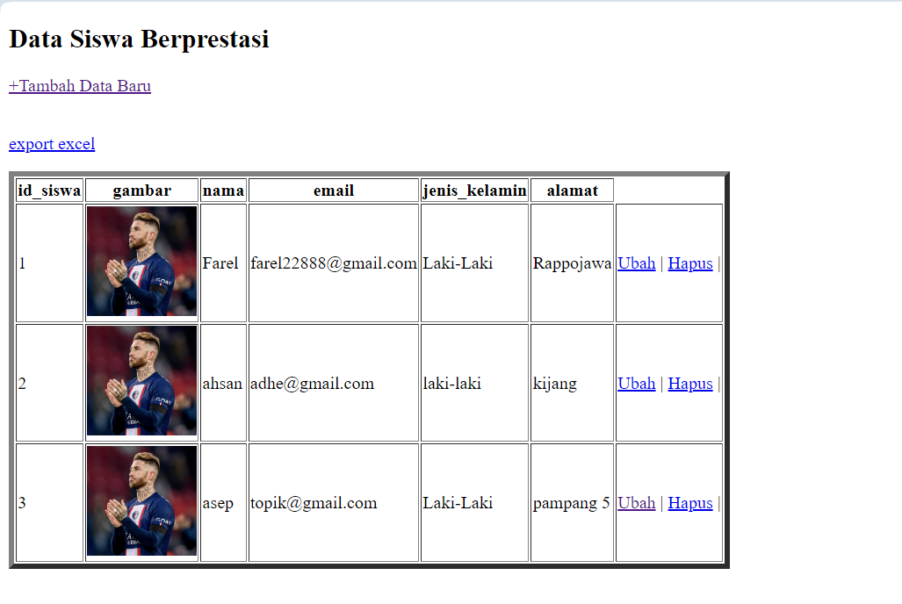

### Analisis

- `function upload(): string` Fungsi upload() dideklarasikan dengan tipe pengembalian string, yang berarti fungsi ini diharapkan mengembalikan nilai string.
- `$nameImage = $_FILES['gambar']['name'];`
  `$directoryFile = $_FILES['gambar']['tmp_name'];`
  `$errorImage = intval($_FILES['gambar']['error']);`
  `$sizeFile = $_FILES['gambar']['size'];`
  Informasi tentang file yang diunggah diambil dari array superglobal $_FILES. Ini mencakup nama file (name), lokasi sementara file di server (tmp_name), kode kesalahan (error), dan ukuran file (size).
- `if ($errorImage === 4) {`
    `echo "<script>alert('Anda Belum Upload Gambar')</script>";`
    `return false;}`
  Jika nilai error adalah 4, itu berarti tidak ada file yang diunggah. Fungsi ini menampilkan pesan peringatan dan mengembalikan false.
- `$validType = ['svg', 'jpg', 'png', 'jpeg', 'webp'];`
  `$extensionFile = explode(".", $nameImage);`
  `$extensionValid = strtolower(end($extensionFile));`
  Ekstensi file diambil dengan memecah nama file berdasarkan tanda titik (.) dan mengambil elemen terakhir (yang merupakan ekstensi). Ekstensi file kemudian diubah menjadi huruf kecil untuk pemeriksaan yang mudah.
- `if (!in_array($extensionValid, $validType)) {`
    `echo "<script>alert('yang anda Upload bukan gambar')</script>";`
    `return false;}`
- `if ($sizeFile > 3_000_000) {`
    `echo "<script>alert('Ukuran File Terlalu Besar!!(Maks 3MB)')</script>";`
    `return false;}`
  Ukuran file diperiksa untuk memastikan tidak melebihi 3 MB. Jika ukuran file lebih besar dari 3 MB, fungsi ini menampilkan pesan peringatan dan mengembalikan false.
- `$nameImage = uniqid() . "." . $extensionValid;`
  `move_uploaded_file($directoryFile, "img/{$nameImage}");`
  Nama file diubah menjadi unik menggunakan fungsi uniqid(), yang menghasilkan ID unik berbasis waktu. File kemudian dipindahkan dari lokasi sementara ke direktori tujuan (img/) dengan nama file yang baru.
- ` return $nameImage;`
  Fungsi mengembalikan nama file yang telah divalidasi dan diunggah.
### Kesimpulan
Kesimpulannya,Fungsi ini membantu dalam memastikan bahwa hanya file gambar dengan ukuran yang sesuai yang dapat diunggah, serta memberikan penanganan kesalahan yang sesuai jika terdapat masalah selama proses pengunggahan.
## Download

### Program
```SQL
<?php

include "koneksi.php";

$query = mysqli_query($koneksi, 'SELECT * FROM siswa');
  

$data = [];

$data[] = ["ID", "nama","email", "Jenis Kelamin", "Alamat"];

while ($row = mysqli_fetch_assoc($query)) {

    $data[] = [

        $row['id_siswa'],

        $row['nama'],

        $row['email'],

        $row['jenis_kelamin'],

        $row['alamat']

    ];

}

  

$namafile = "excel_data.xls";

header("Content-Type: application/vnd.ms-excel");

header("Content-Disposition: attachment;filename=\"$namafile\"");

header("Cache-Control: max-age=0");

  

$output = fopen("php://output", "w");

  

foreach ($data as $row) {

    fputcsv($output, $row, "\t");

}

  

fclose($output);

exit;
```
### Hasil

### Analisis
- `include "koneksi.php";`  Ini adalah perintah untuk mengambil dan menyertakan file koneksi.php.
- `$query = mysqli_query($koneksi, 'SELECT * FROM siswa');`
  Perintah ini menjalankan query SQL `SELECT * FROM siswa` menggunakan fungsi mysqli_query. Variabel $koneksi diasumsikan telah didefinisikan sebelumnya dalam file koneksi.php dan berfungsi untuk menyambungkan ke database.
- `$data = [];`
  Ini adalah deklarasi awal array kosong $data yang akan digunakan untuk menyimpan hasil query dari database dalam bentuk array.
- `while ($row = mysqli_fetch_assoc($query)) {
    `$data[] = [`
        `$row['id_siswa'],
        `$row['nama'],`
        `$row['email'],`
        `$row['jenis_kelamin'],`
        `$row['alamat']
Dalam loop while ini, setiap baris hasil dari query ($row) diambil menggunakan mysqli_fetch_assoc dan kemudian setiap baris data dimasukkan ke dalam array $data. Setiap elemen array ini mewakili satu baris data dari tabel siswa yang diambil dari database.
- Setelah loop selesai, array $data akan terisi dengan seluruh data dari tabel siswa, termasuk header kolom dan semua baris data.
- `$namafile = "excel_data.xls";`
  `header("Content-Type: application/vnd.ms-excel");`
  `header("Content-Disposition: attachment;filename=\"$namafile\"");`
  `header("Cache-Control: max-age=0");`
  Bagian ini menyiapkan header HTTP untuk menghasilkan file Excel (excel_data.xls). Content-Type ditetapkan sebagai application/vnd.ms-excel untuk menandakan bahwa konten yang akan dikirimkan adalah file Excel. Content-Disposition ditetapkan sebagai attachment dengan nama file yang disertakan (excel_data.xls), sehingga browser akan mengunduh file ini sebagai lampiran.

- `$output = fopen("php://output", "w");`
  `foreach ($data as $row) {`
    `fputcsv($output, $row, "\t");`
  `}
  `fclose($output);`
  fopen("php://output", "w") membuka output sebagai file yang dapat ditulis.
  Loop foreach mengambil setiap baris dari array $data dan menggunakan fputcsv untuk menulis baris tersebut ke output.
- ` exit;` Ini menghentikan eksekusi skrip PHP setelah file Excel dibuat dan dikirimkan ke browser.


### Kesimpulan
Kode ini mengambil data dari tabel siswa dalam basis data, menyimpannya dalam array, dan kemudian mengekspornya ke file Excel dengan nama excel_data.xls.