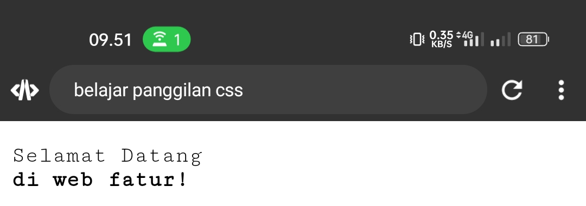
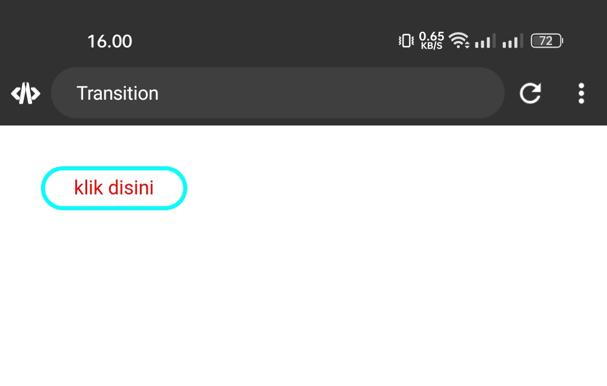

# Anatomi CSS


# Percobaan 1
## Kode program

```css
    p {
      color: red
}
```
## Hasil


## Penjelasan
Deklarasi gaya CSS { `color: red;`} menetapkan properti color ke nilai "`red`", sehingga teks dalam elemen paragraf akan ditampilkan dengan warna merah.
# Percobaan 2
## Kode CSS
```css
button{width: 150px; height: 50px; 
   font-size: 100px;
   Background-color:red;
   color:blue;}
```

## Font size 
```css
font-size: 100px;
```

## Hasil


button { font-size: `100px`; } adalah aturan CSS yang menentukan gaya untuk semua elemen <`button`> dalam dokumen HTML
**Button**: Ini adalah selector yang menargetkan semua elemen <`button`> dalam dokumen HTML.
font-size :`100px`; :Ini adalah deklarasi gaya yang terkait dengan selector tersebut. Di sini, kita menetapkan properti font-size dengan nilai `100px`, yang berarti teks di dalam elemen <`button`> akan ditampilkan dengan ukuran font sebesar `100px`.

# Selector 
## Selector ID
Selector ID: Untuk memilih elemen dengan ID tertentu, gunakan tanda pagar (#) diikuti dengan nama ID sebagai selector.

```css
#judul {
     Font-size:30px;
}
```

Akan mengatur size font dari judulnya.
## Selector class
Selector Class: Untuk memilih elemen dengan class tertentu, gunakan titik (.) diikuti dengan nama class sebagai selector.

```css
.teks1{
    Color:blue;
}
```

Mengatur warna dari teks 1 berwarna biru (blue).
## Selector elemen
Selector Elemen: Untuk memilih semua elemen dengan tag tertentu, gunakan nama tag sebagai selector.

```css
p{
    Color:Aqua;
}
```

Ini akan menerapkan gaya pada semua elemen `<p>` dalam dokumen HTML.

# Materi text

## Text align

### Center
#### Contoh
```css
p { text-align: center;
     }
```

#### Hasil

#### Analisis 
Membuat teksnya pindah ketengah (Center)
### Right

#### Contoh 

```css
Teks-align:right;
```

#### Hasil


#### analisis
Untuk memindahkan teks ke bagian kanan
### Left
#### Contoh

```css
Teks-align:left;
```

#### Hasil


#### analisis

Untuk memindahkan teks ke bagian kiri.
### justify
meratakan teks kanan kiri.
## Text-decoration
### penjelasan
Teks decoration di CSS adalah properti yang digunakan untuk menghias atau mengubah penampilan teks
### underline
#### contoh

```css
Text-decoration: underline ;
```

#### before


#### after


#### analisis

Underline berguna untuk memberikan garis pada bawah teks

### overline
#### contoh
```css
Teks-decoration:overline;
```

#### Before

#### after

#### Analisis

`Overline` berguna Memberikan garis pada atas teks.
### none

#### Contoh
```css
Teks-decoration:none;
```

#### hasil


#### analisis

`None` Akan mengembalikan teks seperti di awal.
## Text-indent
### Penjelasan
`Text-indent` digunakan untuk mengatur jarak indentasi (jarak dari tepi kiri) pada awal paragraf atau blok teks. Properti ini biasanya digunakan untuk membuat tampilan yang terstruktur dan membedakan paragraf atau bagian teks tertentu.
### Contoh
```css
p {
    text-indent:50px;
}
```
### Hasil

### Kesimpulan 
Kesimpulannya untuk mengatur jarak pada awal teks/paragraf.

## Text-transform
### Penjelasan 
Teks transform di CSS adalah properti yang digunakan untuk mengubah tampilan teks.seperti `uppercase`, `capitalize`, `lowercase`.
### uppercase
#### Contoh
``` CSS
Text-transform:uppercase;
```

#### Hasil

#### kesimpulan 
Memberikan pada seluruh teks huruf kapital.
### capitalize
#### contoh
```css
Text-transform: capitalize;
```
#### hasil

#### Kesimpulan 
Akan memberikan pada seluruh awalan teks huruf kapital.
### lowercase
#### contoh
```css
Teks-transform:lowercase;
```
#### hasil

#### kesimpulan 
Semua teksnya bukan menggunakan huruf kapital.
## line-height
### penjelasan
`line-height` adalah properti yang digunakan untuk mengendalikan ketinggian garis dalam sebuah elemen teks atau elemen yang berisi teks.
### Contoh
```css
p {
    line-height:50px;
}
```
### Hasil

### Kesimpulan 
`line-height` adalah properti dalam CSS yang digunakan untuk mengatur ketinggian garis antara dua baris teks dalam sebuah elemen. 

# Background
## background-size
### penjelasan
`Background size` adalah properti CSS yang digunakan untuk mengontrol ukuran gambar latar belakang (background image) pada elemen HTML. Properti ini memungkinkan Anda untuk menyesuaikan skala atau dimensi gambar latar belakang agar sesuai dengan kebutuhan.
### contoh

```css
p {
      background-image: url('/logo.png');
      height: 100vh;
      background-size: 100px ;
    }
```

### hasil


### kesimpulan 
Untuk mengatur besar kecilnya sebuah image.
## background-image
### penjelasan
`Background image` adalah gambar yang digunakan sebagai latar belakang (background) elemen HTML atau elemen CSS. Dengan menggunakan background image, Anda dapat menambahkan elemen visual atau pola ke latar belakang halaman web atau elemen tertentu di dalamnya.

Dalam CSS, Anda dapat menggunakan properti `background-image` untuk menentukan gambar yang akan digunakan sebagai background.
### contoh

```css
p {
      background-image: url('/logo.png');
      height: 100vh;
      
    }
```
### hasil


### kesimpulan 
Properti background-image dalam CSS digunakan untuk menentukan gambar yang akan digunakan sebagai latar belakang sebuah elemen HTML.
## background-repeat
### penjelasan
gambar `('/logo.png')` sebagai latar belakang dengan tinggi sebesar `100%` dari tinggi viewport `(100vh)`. Properti `background-size` mengatur ukuran gambar latar belakang menjadi `100` piksel lebar dan `100` piksel tinggi. Sedangkan properti `background-repeat` disetel ke `no-repeat`, yang berarti gambar latar belakang tidak akan diulang, melainkan akan ditampilkan hanya sekali tanpa pengulangan.

### contoh
```html
<!DOCTYPE html>
<html>
  <head>
    <title>belajar materi background css</title>
    <style>
    p {
      background-image: url('/logo.png');
      height: 100vh;
      background-size: 100px 100px;
      background-repeat: no-repeat;
    }
    </style>
  </head>
  <body>
    <p>ini background image, background size, dan background-repeat</p>
  </body>
</html>
```
### hasil


### Kesimpulan 
Background repeat adalah sebuah properti dalam CSS yang mengontrol apakah gambar latar belakang akan diulang atau tidak ketika ukurannya lebih kecil dari elemen yang menampilkannya. 
## background-attachmen
### penjelasan
background-attachment adalah properti dalam CSS yang mengontrol apakah gambar latar belakang akan tetap terlihat saat pengguna menggulir halaman atau akan tetap berada di posisi yang ditetapkan. 

`scroll`: Gambar latar belakang akan bergulir bersama halaman.
`fixed`: Gambar latar belakang akan tetap diam relatif terhadap viewport saat pengguna menggulir halaman.
`local`: Gambar latar belakang akan bergulir bersama konten elemen yang mengandungnya.
### contoh
```html
<html>
  <head>
    <title>belajar materi background css</title>
    <style>
    p {
      background-image: url('/sc.jpg');
      height: 100vh;
      background-size: 100px 100px;
      background-repeat: no-repeat;
      background-attachment: scroll;
    }
    </style>
  </head>
  <body>
    <p>ini background image, background size, background-repeat, dan background attachment</p>
    <p>smk 7 makassar</p>
  </body>
</html>
```
### hasil


### Kesimpulan 
Kesimpulannya, background-attachment adalah properti CSS yang mengontrol perilaku gambar latar belakang terhadap guliran halaman.
## background-position
### penjelasan

`background-position` adalah properti dalam CSS yang menentukan posisi awal dari gambar latar belakang.kita dapat menentukan posisi gambar latar belakang secara relatif terhadap sudut kiri atas `(0% 0%)`, relatif terhadap sudut kanan atas (`100% 0%`), relatif terhadap sudut kiri bawah `(0% 100%)`, relatif terhadap sudut kanan bawah `(100% 100%)`, atau posisi lainnya dalam nilai piksel atau persentase. Misalnya, `background-position`: `center` akan menempatkan gambar latar belakang di tengah-tengah elemen, sedangkan `background-position`: `50% 50%` juga akan menempatkannya di tengah.
### contoh
```html
<!DOCTYPE html>
<html>
  <head>
    <title>belajar materi background css</title>
    <style>
    p {
      background-image: url('/sc.jpg');
      height: 100vh;
      background-size: 100px 100px;
      background-repeat: no-repeat;
      background-attachment: scroll;
      background-position: top;
    }
    </style>
  </head>
  <body>
    <p>ini background image, background size, background-repeat, background attachment,dan background position</p>
  </body>
</html>

```
### hasil

### Kesimpulan 
Jadi, `background-position` yang menentukan posisi awal dari gambar latar belakang.ini digunakan  untuk mengatur posisi gambar latar belakang secara relatif dengan menggunakan nilai persentase atau piksel, atau menggunakan seperti `center`atau `bottom right` untuk menentukan posisi relatif terhadap elemen.

# Font
## Font-size

### penjelasan  
Untuk mengatur ukuran dari teks 
### contoh
```css
font-size: 50px ;
```

### Hasil


#### Analisis
Font size ini digunakan untuk mengatur ukuran teks yang diinginkan.

### Kesimpulan
Font-sizs berguna Mengatur ukuran teks.
## font-style
### penjelasan
Mengatur jenis teks yang diinginkan.

### italic
#### Contoh
```css
font-style:italic;
```

#### Hasil


#### kesimpulan 

`Font-style` akan memberikan model pada teks.contohnya seperti `italic` yang Teksnya agak sedikit miring.

### normal 

`Font-style normal` akan mengembalikan teks yang tadinya italic Menjadi normal.

## font-weight
### penjelasan

`font-weight` adalah properti dalam CSS yang digunakan untuk mengatur ketebalan atau keberatan font teks. 

Nilai yang umum digunakan untuk `font-weight` adalah sebagai berikut:

- `normal`: Nilai default. Menggunakan ketebalan normal dari font yang ditentukan.
- `bold`: Menggunakan ketebalan tebal dari font yang ditentukan.
### Contoh
```css
p {
    font-weight:bold;
}
```

### Hasil


### kesimpulan 
Kesimpulannya, `font-weight` adalah properti dalam CSS yang digunakan untuk mengatur ketebalan atau keberatan font teks.
## font-family

### penjelasan 
`font-family` adalah properti dalam CSS yang digunakan untuk mengatur jenis font yang akan digunakan untuk menampilkan teks pada sebuah elemen. Seperti `arial` jika kita masukkan arial maka teksnya menjadi arial.
### Contoh
```css
p {
    font-family:courier;
}
```

### Hasil



### kesimpulan 
Kesimpulannya, `font-family` adalah properti dalam CSS yang digunakan untuk mengatur jenis font yang akan digunakan untuk menampilkan teks.

# box model
## width-height
#### penjelasan
Jadi width dan height ini akan mengatur tinggi dan lebarnya dari Bordernya.
#### Contoh
```css
button {
      width: 100px;
      height: 50px;
   }
```
#### hasil

#### Kesimpulan 

Kesimpulannya untuk tingginya (`height`) adalah 50px,dan lebarnya (`width`) adalah 100px
## Border
### Border-width
#### penjelasan
Untuk mengatur lebar Border dari button nya
#### contoh
```css
button {
        border-width:5px;
   }
```
#### hasil

#### Kesimpulan 
Mengatur lebar dari Bordernya 
### Border-radius
#### penjelasan
`Border radius` adalah properti CSS yang digunakan untuk mengatur sudut lengkung pada sudut-sudut elemen yang memiliki batas (border).
#### Contoh
```css
button {
        Border-radius:10px 10px 10px;
   }
```
#### hasil


#### Kesimpulan 
Memberikan lengkungan pada Bordernya.
### Border-style
#### penjelasan

`Border style` adalah properti CSS yang digunakan untuk mengatur gaya garis batas (border) pada elemen HTML. P

Nilai yang dapat digunakan dalam properti `border-style` adalah sebagai berikut:

- `none`: Tidak ada garis batas yang ditampilkan.
- `solid`: Garis batas berupa garis lurus dan terus-menerus.
- `dashed`: Garis batas berupa garis putus-putus.
#### Contoh
```css
button {
        Border-style:dashed;
   }
```
#### hasil

#### Kesimpulan
Kesimpulannya menggunakan `border-style dashed` akan memberikan garis putus" pada bagian Border button.
### Border color
#### penjelasan
`Border color` adalah properti CSS yang digunakan untuk mengatur warna garis batas (border) pada elemen HTML.
#### Contoh
```css
button {
        Border-color:aqua;
   }
```
#### hasil


#### Kesimpulan 
Memberikan warna pada Bordernya seperti warna Aqua.
## Padding
### Padding-left 
#### penjelasan
`Padding-left` ini akan membuat bagian kosong di kiri.
#### contoh
```css
button {
      width: 200px ;
      height: 100px;
      padding-left: 170px;
   }
```
#### hasil


#### Kesimpulan 
Membuat bagian kosong dari button yang ada sebelah kiri
### Padding-right
#### penjelasan
`Padding-right` ini akan membuat bagian kosong di kanan.
#### contoh
```css
button {
      width: 200px ;
      height: 100px;
      padding-right: 170px;
   }
```
#### hasil

#### Kesimpulan 
Membuat bagian kosong dari button yang ada sebelah kanan. 
### Padding-bottom 
#### penjelasan
`Padding-bottom` ini akan membuat bagian kosong di bawah.
#### contoh
```css
button {
      width: 200px ;
      height: 100px;
      Padding-bottom: 170px;
   }
```
#### hasil

#### Kesimpulan 
Membuat bagian kosong dari button yang ada pada bagian bawah.
### Padding-top
#### penjelasan
`Padding-top` ini akan membuat bagian kosong pada bagian atas.
#### contoh
```css
button {
      width: 200px ;
      height: 100px;
      Padding-top: 170px;
   }
```
#### hasil

#### Kesimpulan 
Membuat bagian kosong dari button yang ada pada bagian atas.
## Margin
### Margin-left
#### penjelasan
`Margin-left` digunakan untuk memberikan jarak pada button di bagian kiri.
#### Contoh
```css
button {
margin-left: 50px;
   }
```
#### hasil


#### Kesimpulan 
Memberikan jarak button di bagian kiri.
### Margin-top 
#### penjelasan
Margin-top berguna untuk memberikan jarak pada button di bagian atas.
#### Contoh
```css
button {
margin-top: 50px;
   }
```
#### hasil


#### Kesimpulan 
Memberikan jarak button di bagian atasnya.
### Margin-right
#### penjelasan
`Margin-right` berguna untuk memberikan jarak antara tepi kanan Button dan jarak pada button lainnya.
#### Contoh
```css
button {
Margin-right: 50px;
   }
```
#### hasil


#### Kesimpulan 
Kesimpulannya `margin-right` adalah properti CSS yang digunakan untuk mengatur jarak antara tepi kanan suatu elemen dengan elemen lainnya.
### Margin-bottom
#### penjelasan
`margin-bottom` adalah properti CSS yang digunakan untuk mengatur jarak (`margin`) di bagian bawah (`Bottom`) elemen.
#### Contoh
```css
button {
Margin-bottom: 50px;
   }
```
#### hasil

#### Kesimpulan 
Memberikan jarak button dengan button yang ada dibawahnya.

## Tantangan 
### Kode HTML 
```html
<!DOCKTYPE html>
<html>
  <head>
    <title></title>
    <link rel="stylesheet" href="Style.css"
  </head>
  <body>
    <span>
    <p>Selamat Datang<br><b>di Web Fathur!</b></p>
    </span>
    <button>Klik disini!</button>
  </body>
</html>
```
### Kode CSS
```css
body {
    background-color: aqua;
}
img {
    border-radius: 100% 100%;
    border-width:10px ;
    border-style: solid;
    border-color: white;
    margin-left: 220px;
}
p {
    font-family: courier;
    font-size: 25px;
    color: black;
    margin-left: ;
    margin-top: -150px;
}
button {
    width: 100px;
    height: 50px;
    background-color: aqua;
    color: red;
    border-color: red;
    margin-top: ;
    margin-left: 70px;
}
```

### Hasil


# Pseudo Classes

##  Hover
- `button:hover`: adalah pseudo-class selector yang menargetkan tombol (button) ketika pengguna mengarahkan kursor ke atasnya (hover) atau diklik. 
- `background-color: red;`: Properti ini menetapkan warna latar belakang tombol menjadi merah ketika tombol sedang di-hover.
- `color: white;`: Properti ini menetapkan warna teks pada tombol menjadi putih ketika tombol di-hover.
- `height: 100px;`: Properti yang digunakan untuk membuat  tinggi (height) tombol menjadi 100 piksel ketika tombol di-hover.
- `width: 100px;`: Properti yang digunakan untuk membuat lebar (width) tombol menjadi 100 piksel ketika tombol di-hover.

### Kode program 

```css
<!DOCTYPE html>
<html>
  <head>
    <title>Hover</title>
    
    <style>
    button {
  height: 100px;
  width: 100px;
}

button:hover {
  transform: scale(.8);
  transition: all 1s ease-in;
  height: 140px;
  width: 200px;
  background-color: aqua;
  font-size: 40px;
}
    </style>
  </head>
  <body>
<button>Klik disini</button>
  </body>
    </html>
```

### Hasil
#### Before 


#### After


### Kesimpulan 

Button hover di CSS digunakan untuk memberikan interaksi visual saat pengguna mengarahkan kursor ke atas sebuah tombol. Ini dapat dilakukan dengan mengubah properti CSS seperti warna latar belakang, warna teks, atau efek transisi lainnya.
## Active
`button:active`: adalah pseudo-class selector yang menargetkan tombol (`button`) ketika tombol tersebut sedang dalam keadaan "active", atau tombol sedang ditekan. 
`color: yellow;`: Properti memberikan warna kuning pada teks ketika tombol sedang active atau tombol sedang ditekan. 

### Kode program
```HTML
<!DOCTYPE html>
<html>
  <head>
    <title>Hover</title>
    <style>
    button {
  height: 50px;
  width: 100px;
  
}
button:active {
  transform: scale(.5);
  transition: all 1s ease-in;
  height: 140px;
  width: 200px;
  background-color: aqua;
  font-size: 20px;
}
    </style>
  </head>
  <body>
<button>klikk</button>
  </body>
    </html>
```

### Hasil


### Kesimpulan 

Button active di CSS digunakan untuk menentukan tampilan tombol saat tombol tersebut sedang dalam keadaan aktif, yaitu saat tombol ditekan

## Visited
### Hasil

# Transition 
## Transition-delay
### Penjelasan 
`transition-delay` adalah properti dalam CSS yang menentukan waktu penundaan sebelum transisi dimulai setelah perubahan pada elemen tersebut. Ini dapat digunakan untuk mengatur waktu tunggu sebelum efek transisi dimulai, memberikan kontrol yang lebih besar terhadap animasi elemen.Misalnya, transition-delay: `0.5s` akan menunda transisi selama setengah detik sebelum dimulai.
### Contoh
```html
<!DOCKTYPE html> 
<html>
  <head>
    <title>Transition</title>
    <style>
      button {
        color: red;
        border-color: red;
        border-width: 3px;
        background-color: white;
        font-family: Arial;
        margin-top: 20px;
        margin-left: 20px;
        width: 100px;
        height: 30px;
        border-radius: 100px 100px;
        transition-delay: 0.5s;
      }
      button:hover {
        background-color: yellow;
      }
    </style>
  </head>
  <body>
    <button>klik disini</button>
  </body>
</html>
```
### Hasil
#### before

#### after

### Kesimpulan 
Jadi, `transition-delay` adalah properti CSS yang menentukan waktu penundaan sebelum transisi dimulai setelah perubahan pada elemen tersebut.
## Transition-duration
### Penjelasan 
`Transition-duration` adalah properti dalam CSS yang digunakan untuk mengubah sebuah nilai dari properti CSS dari satu keadaan ke keadaan lainnya. Misalnya, jika memiliki transisi untuk mengubah warna latar belakang elemen dari putih ke kuning, kita dapat menentukan berapa lama perubahan warna tersebut.
### Contoh
```html
<!DOCKTYPE html> 
<html>
  <head>
    <title>Transition</title>
    <style>
      button {
        color: red;
        border-color: red;
        border-width: 3px;
        background-color: white;
        font-family: Arial;
        margin-top: 20px;
        margin-left: 20px;
        width: 100px;
        height: 30px;
        border-radius: 100px 100px;
        transition-duration: 0.5s;
      }
      button:hover {
        background-color: aqua;
      }
    </style>
  </head>
  <body>
    <button>klik disini</button>
  </body>
</html>
```
### Hasil
#### Before


#### After


### Kesimpulan 
`Transition-duration` adalah properti dalam CSS yang mengontrol durasi waktu dari transisi antara dua keadaan yang berbeda.
## Transition-Property
### Penjelasan 
`transition-property` adalah properti CSS yang menentukan mana yang akan mengalami perubahan transisi saat nilai mereka berubah. Ini digunakan bersama dengan properti CSS transition untuk memberikan efek transisi yang halus. Misalnya, dengan menetapkan transition-property ke `background-color`, perubahan warna latar belakang akan mengalami transisi yang halus.
### Contoh
```html
<!DOCKTYPE html> 
<html>
  <head>
    <title>Transition</title>
    <style>
      button {
        color: red;
        border-color: red;
        border-width: 3px;
        background-color: white;
        font-family: Arial;
        margin-top: 20px;
        margin-left: 20px;
        width: 100px;
        height: 30px;
        border-radius: 100px 100px;
        transition-property: background-color, width;
      }
      button:hover {
        background-color: black;
      }
    </style>
  </head>
  <body>
    <button>klik disini</button>
  </body>
</html>
```
### Hasil

#### before


#### After


### Kesimpulan 
`Transition-Property` digunakan untuk menentukan properti mana yang akan mengalami efek transisi saat nilai mereka berubah. membuat perubahan halus dalam tampilan elemen saat nilai properti berubah, seperti warna, ukuran, atau posisi.
## Transition-Timing-function
### Penjelasan 
`Transition-Timing-Function` adalah properti CSS yang menentukan bagaimana perubahan nilai properti CSS diterapkan selama transisi. Ini mengontrol kecepatan perubahan nilai properti dari awal hingga akhir transisi, menghasilkan efek yang berbeda seperti percepatan atau perlambatan. Misalnya,`ease-in` dimulai dengan kecepatan yang lambat dan bertambah cepat seiring berjalannya waktu.
### Contoh
```html
<!DOCKTYPE html> 
<html>
  <head>
    <title>Transition</title>
    <style>
      button {
        color: red;
        border: 3px solid aqua;
        background-color: white;
        font-family: Arial;
        margin-top: 20px;
        margin-left: 20px;
        width: 100px;
        height: 30px;
        border-radius: 100px 100px;
        transition-property: width;
        transition-duration: 1s;
        transition-timing-function: ease-in;
      }
      button:hover {
        background-color: yellow;
      }
    </style>
  </head>
  <body>
    <button>klik disini</button>
  </body>
</html>
```
### Hasil
#### Before 

#### After


### Kesimpulan 
## Studi Kasus
### Deskripsi 
1.`background-color`: `purple`;: Ini mengatur warna latar belakang halaman menjadi ungu.

2.`p{font-family`: `TIMES NEW ROMAN`; font-size: `25px`; margin-top: `30px`;}: Ini mengatur gaya teks untuk elemen paragraf, dengan menggunakan font `Times New Roman`, ukuran font `25px`, dan memberikan margin atas sebesar `30px`.

3.`img{margin-left:230px`; margin-bottom: `100px`; border: `5px` solid white; border-radius: `50%` `50%`; height: `20vh`; width: `20vh`; position: fixed;}: Ini mengatur gaya untuk elemen gambar, dengan memberikan margin kiri sebesar `230px`, margin bawah sebesar `100px`, menambahkan border putih sebesar `5px` dengan radius sudut melengkung sebesar `50%`, menetapkan tinggi dan lebar gambar menjadi `20%` dari tinggi viewport, dan memposisikan gambar secara tetap di layar.

4.`button{height`: `50px`; width: `100px`; background-color: `aqua`; border: `solid`; margin-left: `50px`;}: Ini mengatur gaya untuk elemen tombol, dengan menetapkan tinggi `50px`, lebar `100px`, warna latar belakang aqua, border solid, dan memberikan margin kiri sebesar `50px`.

5.`button:hover`{background-color:`red`; transition:`all in 1.5 ease-in-out`; transform:`scaleX(1.5)` ;}: Ini mengatur gaya saat tombol dihover, dengan mengubah warna latar belakang menjadi merah, menambahkan transisi untuk semua properti dalam 1.5 detik dengan efek `ease-in-out`, dan melakukan scaling horizontal sebesar 1.5 kali.
### Kode
```css
<!Doctype html>
<html>
<title> belajar css</title>
<head>
<style>
body{

background-color: purple;}
p{font-family: Times New Roman;
font-size: 25px;
margin-top: 30px;
}
img{
margin-left:230px;
margin-bottom: 100px;
border: 5px solid white;
border-radius: 50% 50%;
height: 20vh;
width: 20vh;
position: fixed;
}
button{height: 50px;width: 100px;
  background-color: aqua;
  border: solid ;
margin-left: 50px;
}
button:hover{background-color:red;
  transition:all in 1.5 ease-in-out;
  transform:scaleX(1.5) ;
}
  </style>
</head>
<body>
  <span>
    
 <p>Selamat Datang <br>Di <b>Web Fatur</b></p> </span>
 <span>
  </span>
  <button>Klik Disini</button> 
</body>
</html>
```

### Hasil
#### Before 


#### After

# Transfrom
## Transform-Scale
### Penjelasan 
`Transform-scale` adalah properti CSS yang digunakan untuk mengubah ukuran elemen HTML secara proporsional. Properti ini digunakan untuk memperbesar atau memperkecil ukuran elemen tanpa mengubah posisi atau layoutnya.
### contoh
```html
<!DOCKTYPE html>
<html>
  <head>
    <title>latihan 2</title>
    <style>
      button {
        color: red;
        border-color: red;
        border-width: 3px;
        background-color: white;
        font-family: Arial;
        margin-top: 50px;
        margin-left: 50px;
        width: 100px;
        height: 30px;
        padding-left: 10px;
        padding-right: 10px;
        padding-top: 3px;
        padding-bottom: 3px;
        border-radius: 100px 100px;
        
      }

      button:active {
        transform: scale(0.75);
      }
    </style>
  </head>
  <body>
    <button>klik !</button>
  </body>
</html>
```

### Hasil


### Kesimpulan 
Kesimpulannya, `transform-scale` merupakan alat yang sangat berguna dalam desain web untuk mengontrol ukuran elemen dengan mudah dan fleksibel.
## Transform-ScaleX
### Penjelasan 
`Transform-scaleX` adalah salah satu fungsi transformasi CSS yang digunakan untuk mengubah skala elemen hanya sepanjang X (horizontal). Dengan menggunakan `transform-scaleX`, kita dapat memperbesar atau memperkecil elemen hanya dalam arah horizontal tanpa mempengaruhi dimensi vertikalnya. 
### contoh
```html
<!DOCKTYPE html>
<html>
  <head>
    <title>latihan 2</title>
    <style>
      button {
        color: red;
        border-color: red;
        border-width: 3px;
        background-color: white;
        font-family: Arial;
        margin-top: 50px;
        margin-left: 50px;
        width: 100px;
        height: 30px;
        padding-left: 10px;
        padding-right: 10px;
        padding-top: 3px;
        padding-bottom: 3px;
        border-radius: 100px 100px;
        
      }

      button:active {
        transform: scaleX(0.5);
      }
    </style>
  </head>
  <body>
    <button>klik !</button>
  </body>
</html>
```

### Hasil


### Kesimpulan 
Jadi,dengan menggunakan `transform-scaleX`, Anda dapat memperbesar atau memperkecil elemen dalam arah horizontal sesuai dengan nilai yang ditentukan.
## Transform-Rotate
### Penjelasan 
`Transform-rotate` adalah untuk memanipulasi tampilan elemen HTML dengan memutarinya. Properti `transform-rotate` ini menerima nilai dalam satuan derajat (biasanya dari 0 hingga 360), yang menentukan seberapa jauh elemen akan diputar.
### contoh
```html
<!DOCKTYPE html>
<html>
  <head>
    <title>latihan 2</title>
    <style>
      button {
        color: red;
        border-color: red;
        border-width: 3px;
        background-color: white;
        font-family: Arial;
        margin-top: 50px;
        margin-left: 50px;
        width: 100px;
        height: 30px;
        padding-left: 10px;
        padding-right: 10px;
        padding-top: 3px;
        padding-bottom: 3px;
        border-radius: 100px 100px;
        
      }

      button:active {
        transform: rotate(45deg)
      }
    </style>
  </head>
  <body>
    <button>klik !</button>
  </body>
</html>
```

### Hasil

### Kesimpulan 
`Transform-rotate` adalah properti CSS yang memungkinkan pengguna untuk memutar elemen HTML di sekitar sumbu tertentu, dengan nilai dalam satuan derajat.
## Transform-Skew
### Penjelasan 
`Transform-skew` adalah properti CSS yang digunakan untuk memiringkan elemen HTML seperti horizontal atau vertikal, atau keduanya sekaligus. Dengan menggunakan nilai dalam satuan derajat atau persen, kita dapat memberikan elemen HTML efek miring.
### contoh
```html
<!DOCKTYPE html>
<html>
  <head>
    <title>latihan 2</title>
    <style>
      button {
        color: red;
        border-color: red;
        border-width: 3px;
        background-color: white;
        font-family: Arial;
        margin-top: 50px;
        margin-left: 50px;
        width: 100px;
        height: 30px;
        padding-left: 10px;
        padding-right: 10px;
        padding-top: 3px;
        padding-bottom: 3px;
        border-radius: 100px 100px;
        
      }

      button:active {
        transform: skew(20deg , 5deg)
      }
    </style>
  </head>
  <body>
    <button>klik !</button>
  </body>
</html>
```

### Hasil

### Kesimpulan 

`Transform-skew` sering digunakan untuk menciptakan efek visual seperti sudut miring, perspektif, atau animasi yang menarik dalam desain web. Ini merupakan alat yang berguna untuk meningkatkan tampilan dan interaktivitas halaman web.
## Transform-SkewX
### Penjelasan 

`Transform-skewX` adalah properti CSS yang memungkinkan Anda untuk memiringkan elemen HTML berbentuk horizontal. Dengan menggunakan `transform-skewX`, kita dapat memberikan elemen HTML efek miring secara horizontal.

Properti ini memiliki nilai yang diukur dalam satuan derajat, yang menentukan seberapa jauh elemen akan dimiringkan sepanjang miring secara horizontal.
### contoh
```html
<!DOCKTYPE html>
<html>
  <head>
    <title>latihan 2</title>
    <style>
      button {
        color: red;
        border-color: red;
        border-width: 3px;
        background-color: white;
        font-family: Arial;
        margin-top: 50px;
        margin-left: 50px;
        width: 100px;
        height: 30px;
        padding-left: 10px;
        padding-right: 10px;
        padding-top: 3px;
        padding-bottom: 3px;
        border-radius: 100px 100px;
        
      }

      button:active {
        transform: skewX(-25deg)
      }
    </style>
  </head>
  <body>
    <button>klik !</button>
  </body>
</html>
```

### Hasil


### Kesimpulan 
`Transform-skewX` sering digunakan untuk menciptakan efek visual seperti sudut miring atau perspektif dalam desain web. Ini memungkinkan kita untuk menambahkan elemen desain yang dinamis dan menarik bagi penggunanya.
## Transform-Translate
### Penjelasan 
`Transform-translate` adalah properti CSS yang memungkinkan kita untuk memindahkan elemen HTML dari posisi aslinya. Dengan menggunakan `transform-translate`, kita dapat menggeser elemen HTML secara horizontal, vertikal, atau keduanya.
### contoh
```html
<!DOCKTYPE html>
<html>
  <head>
    <title>latihan 2</title>
    <style>
      button {
        color: red;
        border-color: red;
        border-width: 3px;
        background-color: white;
        font-family: Arial;
        margin-top: 50px;
        margin-left: 50px;
        width: 100px;
        height: 30px;
        padding-left: 10px;
        padding-right: 10px;
        padding-top: 3px;
        padding-bottom: 3px;
        border-radius: 100px 100px;
        
      }

      button:active {
        transform: translate(5px , 12px);
      }
    </style>
  </head>
  <body>
    <button>klik !</button>
  </body>
</html>
```

### Hasil


### Kesimpulan 
Jadi,Transform-Translate itu digunakan untuk memindahkan elemen HTML dari posisi aslinya secara vertikal, horizontal,maupun keduanya.
## Transform-Matrix
### Penjelasan 
`Transform-matrix` adalah properti CSS yang memberikan kontrol penuh atas transformasi elemen HTML.Dengan menggunakan `transform-matrix`, Kita dapat menerapkan transformasi kompleks seperti rotasi, skala, dan pergeseran secara bersamaan dengan menggunakan satu properti.
### contoh
```html
<!DOCKTYPE html>
<html>
  <head>
    <title>latihan 2</title>
    <style>
      button {
        color: red;
        border-color: red;
        border-width: 3px;
        background-color: white;
        font-family: Arial;
        margin-top: 50px;
        margin-left: 50px;
        width: 100px;
        height: 30px;
        padding-left: 10px;
        padding-right: 10px;
        padding-top: 3px;
        padding-bottom: 3px;
        border-radius: 100px 100px;
        
      }

      button:active {
        transform: matrix(0.7, -0.5, 0.5, 0.4, 0.5, 0.7);
      }
    </style>
  </head>
  <body>
    <button>klik !</button>
  </body>
</html>
```

### Hasil


### Kesimpulan 
`Transform-matrix` adalah properti CSS yang memungkinkan kita untuk mengontrol transformasi elemen HTML.
# Flexbox
## display flex
### Penjelasan 
`display: flex` adalah properti CSS yang digunakan untuk mengatur tata letak elemen-elemen HTML secara fleksibel dalam satu baris atau satu kolom.Dengan menggunakan `display: flex`, kita dapat dengan mudah mengatur elemen-elemen dalam kontainer, menentukan ukuran, posisi, dan tata letaknya secara fleksibel.
### Contoh
```html
<!DOCKTYPE html>
<html>
  <head>
    <title>flexbox</title>
    <style>
      h4 {
        display: flex;
        background-color: Aqua;
      }
    </style>
  </head>
  <body>
    <h4>menggunakan display flex</h4>
  </body>
</html>
```
### Hasil


### Kesimpulan 
`display: flex` adalah properti CSS yang memungkinkan pengaturan tata letak elemen-elemen HTML secara fleksibel dalam satu baris atau satu kolom dalam sebuah kontainer. 
## flex-direction
### Penjelasan 
`flex-direction` adalah properti CSS yang digunakan untuk mengatur arah tata letak fleksibel dari elemen-elemen dalam kontainer flex. Dengan `flex-direction`, kita dapat menentukan apakah elemen-elemen akan ditata dari kiri ke kanan atau dari atas ke bawah dalam kontainer flex.
### Contoh
```html
<!DOCKTYPE html>
<html>
  <head>
    <title>flexbox</title>
    <style>
      .item {
        display: flex;
        flex-direction: column;
        background-color: aqua;
      }
    </style>
  </head>
  <body>
    <div class="item">
      <p>i'm</p>
      <p>Fatur</p>
    </div>
  </body>
</html>
```
### Hasil


### Kesimpulan 
`flex-direction` adalah properti CSS yang digunakan untuk mengatur arah tata letak fleksibel dari elemen-elemen dalam kontainer flex.
## align items
### Penjelasan 
`align-items` adalah properti CSS yang digunakan dalam Flexbox untuk mengatur cara flex items (elemen-elemen di dalam container flex). Properti ini memungkinkan kita untuk mengontrol penempatan vertikal flex items di dalam container flex.
### Contoh
```html
<!DOCKTYPE html>
<html>
  <head>
    <title>flexbox</title>
    <style>
      .item {
        display: flex;
        flex-direction: column;
        background-color: aqua;
        align-items: center;
      }
    </style>
  </head>
  <body>
    <div class="item">
      <p>i'm</p>
      <p>Fatur</p>
    </div>
  </body>
</html>
```
### Hasil

### Kesimpulan 
`align-items` adalah properti CSS dalam Flexbox yang mengatur penempatan vertikal flex items di dalam container flex.
## justify-content
### Penjelasan 
`justify-content` adalah properti CSS dalam Flexbox yang mengatur cara flex items (elemen-elemen di dalam container flex) dari container. Properti ini memungkinkan Anda untuk mengontrol penempatan horizontal flex items di dalam container flex, seperti mengatur mereka menjadi rata tengah, di bagian awal, di bagian akhir, atau merata secara seimbang.
### Contoh
```html
<!DOCKTYPE html>
<html>
  <head>
    <title>flexbox</title>
    <style>
      .container {
        display: flex;
        flex-direction: column;
        background-color: aqua;
        height: 250px;
        width: 500px;
        justify-content: center;
      }
      .item-1 {
        display: flex;
        background-color: red;
        width:100px;
        height: 100px;
        
      }
    </style>
  </head>
  <body>
    <div class="container">
      <div class="item-1"></div>
    </div>
  </body>
</html>
```
### Hasil


### Kesimpulan 
`justify-content` adalah properti CSS dalam Flexbox yang mengatur penempatan horizontal flex items di dalam container flex.
## Studi Kasus 
### Deskripsi 
1.`main-container` dan .J memiliki background-color yang sama yaitu `purple`, yang menunjukkan konsistensi desain antara bagian-bagian yang berbeda dalam hal warna latar belakang.

2.`box-item-1` dan `.box-item-2` memiliki font-size `50px`, warna teks putih, dan margin-top `10px`, yang menunjukkan bahwa keduanya memiliki tampilan yang serupa.

3.`.J` memiliki properti-properti tambahan seperti `margin`, `padding`, warna teks oranye, dan `border-color` oranye. Ini mungkin untuk menyoroti atau membedakan elemen tersebut dari elemen-elemen lainnya di halaman.

4.`img` memiliki lebar dan tinggi `250px`, border-radius `100%`, dan margin yang besar sehingga gambar tersebut akan muncul besar di tengah halaman.

### Kode program 
``` CSS
<!DOCTYPE html>
<html>
<head>
    <title>Tantangan flexbox</title>
</head>
<style>
  body{
  background-color:purple;
}
.main-container {
    background-color: purple;
}
.box-item-1{
    font-size: 50px;
    color: white;
    margin-top:10px;
    }
.box-item-2{
   font-size: 50px;
    color: white;
    margin-top:10px;
}

.J {
    background-color: purple;
    margin-left:200px;
    padding-left:29px;
    padding-top:20px;
    padding-bottom:35px;
    padding-right:29px;
    color: orangered;
    border-color:orangered;
    margin-top: 50px; 
    margin-right:60px;
    margin-bottom:90px;
    width: 130px;
    
   
}
 
  
img{
    width: 250px;
    height: 250px;
    border-radius: 100%;
    border-color: white;
    margin-left: 350px;
    margin-top: -400px;
    position: fixed;
    
    
}
</style>
<body class="main-container">
    <div class="hero-container">
    <div class="box-container">
    <h1 class="item box-item-1">
    Selamat Datang
    </h1>
    
    <h1 class="item box-item-2">
    di <b>Web Jordan</b>
    </h1>
    <div class="item box-item-3">
    <button class="J">Klik disini</button>
    </div>
    </div>
    
    <div class="box-container">
    <div class="item-box">
    
    </div>
        </div>
    </div>
</body>
</html>
```
### Hasil


# Position
## Position relative
### Penjelasan 
`position: relative;` adalah properti CSS yang digunakan untuk mengatur posisi suatu elemen relatif terhadap posisi awalnya. Saat kita menggunakan `position: relative;`, kita dapat menggeser elemen tersebut menggunakan properti seperti `top`, `right`, `bottom`, dan `left`.
### Contoh
```html
<!DOCKTYPE html>
<html>
  <head>
    <title>tentang position</title>
    <style>
      .container {
        display: flex;
        flex-direction: row;
        background-color: blue;
        height: 200px;
        width: 350px;
      }
      .item-1 {
        display: flex;
        background-color: aqua;
        width:80px;
        height: 80px;
        position:relative;
        top: 70px;
      }
      .item-2 {
        display: flex;
        background-color: yellow;
        width:80px;
        height: 80px;
      }
    </style>
  </head>
  <body>
    <div class="container">
      <div class="item-1"><p>1</p></div>
      <div class="item-2"><p>2</p></div>
      
    </div>
  </body>
</html>
```
### Hasil
#### before

#### after

### Kesimpulan 
`position: relative;` adalah properti CSS yang memungkinkan Anda menggeser posisi suatu elemen relatif terhadap posisi awalnya (normal).
## Position absolute 
### Penjelasan 
`position: absolute`; adalah properti CSS yang mengatur posisi suatu elemen relatif terhadap elemen yang diberikan, bukan terhadap posisi elemen tersebut. Ketika elemen memiliki position: `absolute`;, ia akan diposisikan berdasarkan elemen yang memiliki posisi relatif terdekat atau elemen induk yang memiliki posisi non-static (seperti position: `relative`;, position: `absolute`;, atau position: `fixed`;).
### Contoh
```html
<!DOCKTYPE html>
<html>
  <head>
    <title>tentang position</title>
    <style>
      .container {
        display: flex;
        flex-direction: row;
        background-color: blue;
        height: 200px;
        width: 350px;
      }
      .item-1 {
        display: flex;
        background-color: aqua;
        width:80px;
        height: 80px;
        position:absolute;
        top: 70px;
      }
      .item-2 {
        display: flex;
        background-color: yellow;
        width:80px;
        height: 80px;
      }
    </style>
  </head>
  <body>
    <div class="container">
      <div class="item-1"><p>1</p></div>
      <div class="item-2"><p>2</p></div>
      
    </div>
  </body>
</html>
```
### Hasil
#### before

#### after

### Kesimpulan 
`position: absolute`; adalah properti CSS yang mengatur posisi suatu elemen relatif terhadap elemen yang diberikan, bukan terhadap posisi elemen tersebut 
## Position fixed
### Penjelasan 
`position: fixed`; adalah properti CSS yang mengatur posisi suatu elemen relatif terhadap viewport browser, yang berarti elemen tersebut akan tetap berada di posisi yang sama saat Anda menggulir halaman.
### Contoh
```html
<!DOCKTYPE html>
<html>
  <head>
    <title>tentang position</title>
    <style>

      .img1 {
        display: flex;
        background-color: aqua;
        width:100px;
        height: 100px;
        position:fixed;
        top: 70px;
      }
      
      .img2 {
        display: flex;
        background-color: yellow;
        width:100%;
        height: 200vh;
      }
    </style>
  </head>
  <body>


    </div>
  </body>
</html>
```
### Hasil
#### before


#### after

### Kesimpulan 
Jadi, `Position:fixed`; dia akan tetap tinggal ditempat yang sama walaupun kita menggulir ke halaman bawah.

## Studi Kasus
### Deskripsi 

1.Background Color: Warna latar belakang untuk halaman secara keseluruhan diatur menjadi biru.

2.Container Styling:
display: `flex`; flex-direction: `column`;: Mengatur container agar menggunakan model flexbox dengan tata letak kolom.
background-color: white;: Latar belakang kontainer diatur menjadi putih.
height: `458px`; width: `300px`;: Menetapkan tinggi dan lebar kontainer.
border-radius: `10px`;: Memberi tepian kontainer sudut melengkung.
margin-top: `150px`; margin-left: `720px`;: Memberi jarak dari atas dan kiri, sehingga kontainer berada di posisi tertentu di halaman.

3.Item1 Styling:
background-color: `red`;: Memberi latar belakang merah untuk elemen pertama dalam kontainer.
height: `250px`; width: `300px`;: Menetapkan tinggi dan lebar elemen pertama.
border-radius: `10px 10px 0px 0px;`: Memberi tepian sudut melengkung di bagian atas elemen pertama.

4.Item2 Styling:
background-color: `whitesmoke`;: Memberi latar belakang abu-abu untuk elemen kedua dalam kontainer.
height: `175px`; width: `300px`;: Menetapkan tinggi dan lebar elemen kedua.
justify-content: center; align-items: center;: Menengahkan konten di dalam elemen kedua secara horizontal dan vertikal.

5.Text Styling:
Berbagai gaya font dan ukuran font diberikan untuk teks di dalam kontainer.

6.Item3 Styling:
display: flex; flex-direction: `row`;: Mengatur item ketiga menjadi model flexbox dengan tata letak baris.
background-color: `gainsboro`;: Memberi latar belakang abu-abu muda untuk elemen ketiga dalam kontainer.
border-radius: `0px 0px 5px 5px;`: Memberi tepian sudut melengkung di bagian bawah elemen ketiga.

7.Button Styling:
Tombol diberikan ukuran dan posisi tertentu, serta gaya dasar tanpa latar belakang (transparan) dan tanpa border.

8.Image Styling:
Gambar diatur agar memiliki ukuran penuh dan sudut melengkung.
### Kode
```css
<!DOCTYPE html>
<html lang="en">
<head>
    <meta charset="UTF-8">
    <meta http-equiv="X-UA-Compatible" content="IE=edge">
    <meta name="viewport" content="width=device-width, initial-scale=1.0">
    <title>Tantangan Position</title>
    <style>
        body{
            background-color: blue;
        }
        .container {
            display: flex;
            flex-direction: column;
            background-color: white;
            height: 458px;
            width: 300px;
            border-radius: 10px;
            margin-top: 150px;
            margin-left: 720px;
        }
        .item1{
            background-color: red;
            height: 250px;
            width: 300px;
            border-radius: 10px 10px 0px 0px;
        }
        img {
            width:100%;
            height:100%;
            border-radius: 5px 5px 0px 0px;
        }
        .item2{
            background-color: whitesmoke;
            height: 175px;
            width: 300px;
            justify-content: center;
            align-items: center;
            
        }
        .text1 {
            font-size: small;
            font-family: Arial, Helvetica, sans-serif;
            margin-left: 20px;
        }
        .text2 {
            font-size: 20px;
            font-family: Arial, Helvetica, sans-serif;
            margin-left: 20px;
        }
        .text3 {
            margin-left: 20px;
            font-family: Arial, Helvetica, sans-serif;
            font-size: medium;
            margin-bottom: 30px;
        }   
        .item3 {
            display: flex;
            flex-direction: row;
            padding: 2px;
            background-color: gainsboro;
            border-radius: 0px 0px 5px 5px;
            width: 296px;
            justify-content: space-between;
            font-weight: bold;
        }
        .text4 {
            margin-left: 20px;
            font-family: Arial, Helvetica, sans-serif;
        }
        button {
            width: 62px;
            height: 55px;
            background-color: transparent;
            border: none;
            border-radius: 100px 100px 100px 100px;
            position: fixed;
            background-repeat: no-repeat;
            top: 350px;
            right: 520px;
        }
        .like img {
            border-radius: 100% ;
            margin-right: auto;
            
        }
        .item3 img {
            height: 30px;
            width: 30px;
            border-radius: 100% 100% ;
            align-items: center;
            justify-items: center;
            margin-right: 25px;
            margin-top: 10px;
        }
    </style>
</head>
<body>
    <div class="container">
        <div class="item1">
            
        </div>
        <div class="item2">
            <p class="text1">Thursday,July 16, 2015</p>
            <h4 class="text2">The standard chunk of Lorem Ipsum</h4>
            <p class="text3">Sed posuere consectectur est at lobortis.Anean eu leo quam.</p>
        </div>
        <div class="item3">
            <p class="text4">Read more</p>
            
        </div>
          <div class="like">
              <button>
              
            </button>
        </div>
    </div>
</body>
</html>
```
### Hasil

