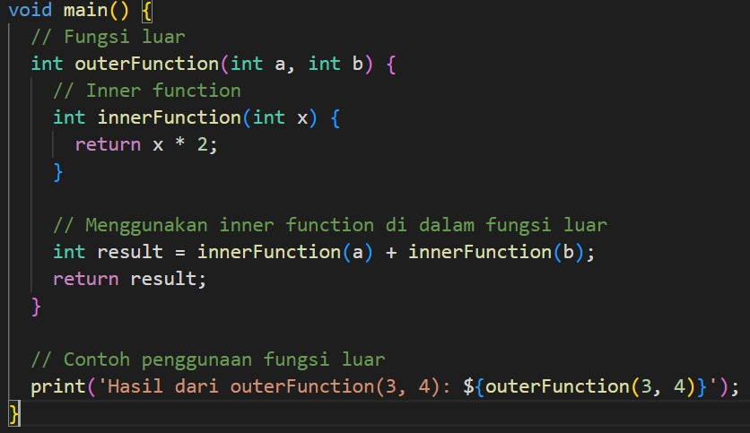
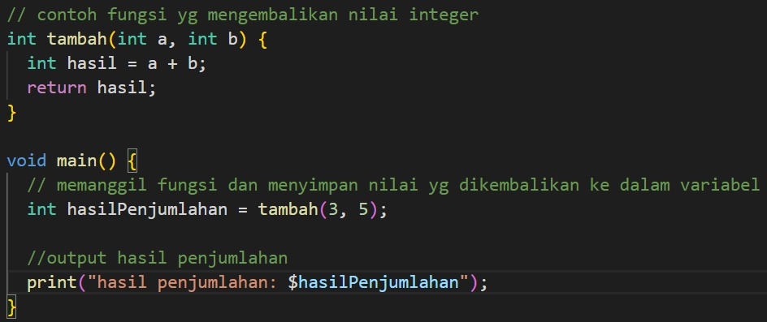
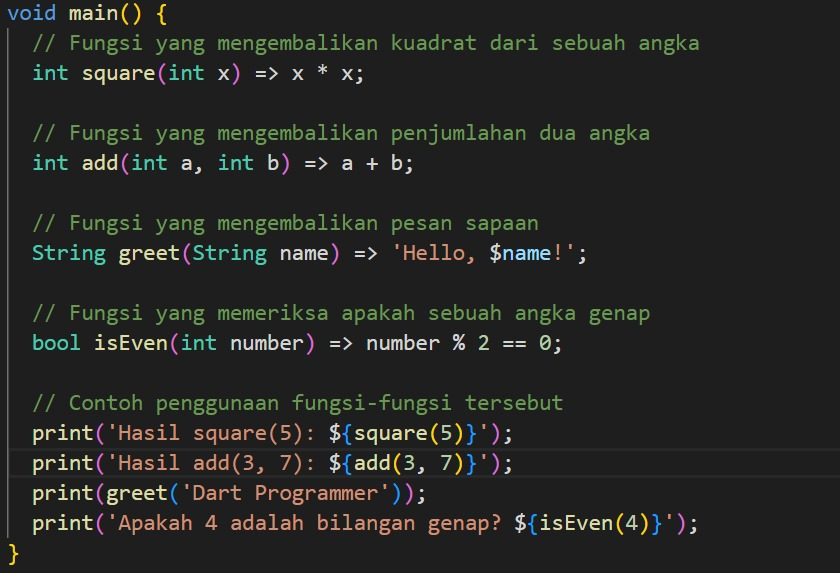

# Function return value
## penjelasan

**Return value** adalah nilai yang dikembalikan oleh sebuah fungsi setelah fungsi tersebut selesai menjalankan kodenya. Nilai ini bisa berupa berbagai jenis data, seperti angka, string, objek, atau bahkan tipe data yang lebih kompleks tergantung pada bahasa pemrograman yang digunakan.
### program

- **outerFunction** adalah fungsi utama yang menerima dua parameter a dan b.

- Di dalam **outerFunction**, terdapat definisi fungsi **innerFunction** yang menerima satu parameter x dan mengembalikan nilai x * 2.

- **outerFunction** menggunakan **innerFunction** untuk menghitung hasil a * 2 dan b * 2, kemudian menjumlahkan kedua hasil tersebut.

- `print('Hasil dari outerFunction(3, 4): ${outerFunction(3, 4)}');` Program akan mencoba memanggil **outerFunction** dengan argumen 3 dan 4, serta mencetak hasilnya.

Fungsi `tambah` menghitung dan mengembalikan penjumlahan dari dua angka, sementara fungsi `main` memanggil `tambah`, menyimpan hasilnya, dan mencetak hasil tersebut.

# Function short expression

## penjelasan

Dart, fungsi dengan ekspresi pendek (short expression) memungkinkan Anda untuk mendefinisikan fungsi dengan cara yang lebih ringkas dan jelas, terutama untuk fungsi yang memiliki tubuh (body) sederhana. Ini dilakukan dengan menggunakan simbol `=>`, yang dikenal sebagai "arrow syntax" atau "fat arrow".

### program

program mendefinisikan beberapa fungsi sederhana dengan ekspresi pendek untuk melakukan berbagai operasi. Fungsi-fungsi ini dipanggil dalam fungsi `main` dan hasilnya dicetak ke konsol.

# Inner function

## penjelasan

Inner function, atau fungsi dalam, adalah fungsi yang didefinisikan di dalam tubuh fungsi lain. Di Dart, inner function hanya dapat diakses di dalam fungsi luar tempat ia didefinisikan.
### program

hasil dari `outerFunction(3, 4)` adalah `14`, karena `innerFunction` menggandakan setiap argumen (`3 * 2` dan `4 * 2`), lalu menjumlahkan hasilnya (`6 + 8`).
